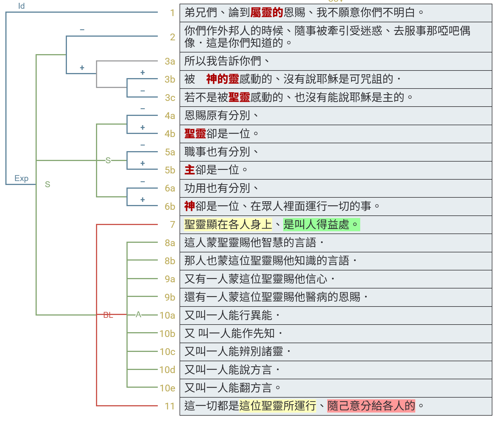

經文：林前12:1-11  
題目：興起發光 (二)  
日期：2025-01-19  
教會：台北衛理堂  

## 句法圖析 (Syntax Diagram)

- 12:1 <RUBY><ruby><ruby>Περὶ<rt>關於</rt></ruby><rt>περί</rt></ruby><rt>PREP</rt></RUBY> <RUBY><ruby><ruby>δὲ<rt>-</rt></ruby><rt>δέ</rt></ruby><rt>CONJ</rt></RUBY> <RUBY><ruby><ruby>τῶν<rt>-</rt></ruby><rt>ὀ</rt></ruby><rt>T-GPN</rt></RUBY> <RUBY><ruby><ruby>πνευματικῶν<rt>屬靈的</rt></ruby><rt>πνευματικός</rt></ruby><rt>A-GPN</rt></RUBY> <mark class='punctuation'>,</mark> <RUBY><ruby><ruby>ἀδελφοί<rt>弟兄們</rt></ruby><rt>ἀδελφός</rt></ruby><rt>N-VPM</rt></RUBY> <mark class='punctuation'>,</mark> <RUBY><ruby><ruby>οὐ<rt>不</rt></ruby><rt>οὐ</rt></ruby><rt>PRT-N</rt></RUBY> <RUBY><ruby><ruby><mark class='verb'>θέλω</mark><rt>願意</rt></ruby><rt>θέλω</rt></ruby><rt>V-PAI-1S</rt></RUBY> <RUBY><ruby><ruby>ὑμᾶς<rt>你們</rt></ruby><rt>σύ</rt></ruby><rt>P-2AP</rt></RUBY> <RUBY><ruby><ruby><mark class='inf'>ἀγνοεῖν</mark><rt>不明白</rt></ruby><rt>ἀγνοέω</rt></ruby><rt>V-PAN</rt></RUBY> <mark class='punctuation'>.</mark> 
- 12:2 <RUBY><ruby><ruby><mark class='verb'>Οἴδατε</mark><rt>知道</rt></ruby><rt>εἴδω</rt></ruby><rt>V-RAI-2P</rt></RUBY> 
	- <RUBY><ruby><ruby>ὅτι<rt>-</rt></ruby><rt>ὅτι</rt></ruby><rt>CONJ</rt></RUBY> 
		- <RUBY><ruby><ruby>ὅτε<rt>時候</rt></ruby><rt>ὅτε</rt></ruby><rt>CONJ</rt></RUBY> <RUBY><ruby><ruby>ἔθνη<rt>外邦人</rt></ruby><rt>ἔθνος</rt></ruby><rt>N-NPN</rt></RUBY> 
	- <RUBY><ruby><ruby><mark class='verb'>ἦτε</mark><rt>是/在/有</rt></ruby><rt>εἰμί</rt></ruby><rt>V-IAI-2P</rt></RUBY> <RUBY><ruby><ruby>πρὸς<rt>到</rt></ruby><rt>πρός</rt></ruby><rt>PREP</rt></RUBY> <RUBY><ruby><ruby>τὰ<rt>-</rt></ruby><rt>ὀ</rt></ruby><rt>T-APN</rt></RUBY> <RUBY><ruby><ruby>εἴδωλα<rt>偶像</rt></ruby><rt>εἴδωλον</rt></ruby><rt>N-APN</rt></RUBY> <RUBY><ruby><ruby>τὰ<rt>-</rt></ruby><rt>ὀ</rt></ruby><rt>T-APN</rt></RUBY> <RUBY><ruby><ruby>ἄφωνα<rt>不能說話的</rt></ruby><rt>ἄφωνος</rt></ruby><rt>A-APN</rt></RUBY> {<RUBY><ruby><ruby>ὡς<rt>怎樣</rt></ruby><rt>ὡς</rt></ruby><rt>CONJ</rt></RUBY> <RUBY><ruby><ruby>ἂν<rt>-</rt></ruby><rt>ἄν</rt></ruby><rt>PRT</rt></RUBY> <RUBY><ruby><ruby><mark class='verb'>ἤγεσθε</mark><rt>受...轄制</rt></ruby><rt>ἄγω</rt></ruby><rt>V-IPI-2P</rt></RUBY>} <RUBY><ruby><ruby><mark class='ptc'>ἀπαγόμενοι</mark><rt>引入</rt></ruby><rt>ἀπάγω</rt></ruby><rt>V-PPP-NPM</rt></RUBY> <mark class='punctuation'>.</mark> 
- 12:3 <RUBY><ruby><ruby>διὸ<rt>所以</rt></ruby><rt>διό</rt></ruby><rt>CONJ</rt></RUBY> <RUBY><ruby><ruby><mark class='verb'>γνωρίζω</mark><rt>告訴</rt></ruby><rt>γνωρίζω</rt></ruby><rt>V-PAI-1S</rt></RUBY> <RUBY><ruby><ruby>ὑμῖν<rt>給你們</rt></ruby><rt>σύ</rt></ruby><rt>P-2DP</rt></RUBY> 
	- <RUBY><ruby><ruby>ὅτι<rt>-</rt></ruby><rt>ὅτι</rt></ruby><rt>CONJ</rt></RUBY> 
		- <RUBY><ruby><ruby>οὐδεὶς<rt>沒有</rt></ruby><rt>οὐδείς</rt></ruby><rt>A-NSM</rt></RUBY> <RUBY><ruby><ruby>ἐν<rt>被</rt></ruby><rt>ἐν</rt></ruby><rt>PREP</rt></RUBY> <RUBY><ruby><ruby>Πνεύματι<rt>靈</rt></ruby><rt>πνεῦμα</rt></ruby><rt>N-DSN</rt></RUBY> <RUBY><ruby><ruby>Θεοῦ<rt>神</rt></ruby><rt>θεός</rt></ruby><rt>N-GSM</rt></RUBY> <RUBY><ruby><ruby><mark class='ptc'>λαλῶν</mark><rt>說話</rt></ruby><rt>λαλέω</rt></ruby><rt>V-PAP-NSM</rt></RUBY> <RUBY><ruby><ruby><mark class='verb'>λέγει</mark><rt>說</rt></ruby><rt>λέγω</rt></ruby><rt>V-PAI-3S</rt></RUBY> 
			- <mark class='punctuation'>·</mark> <RUBY><ruby><ruby>Αναθεμα<rt>詛咒</rt></ruby><rt>ἀνάθεμα</rt></ruby><rt>N-NSN</rt></RUBY> <RUBY><ruby><ruby>ΙΗΣΟΥΣ<rt>耶穌</rt></ruby><rt>Ἰησοῦς</rt></ruby><rt>N-NSM</rt></RUBY> <mark class='punctuation'>,</mark> 
		- <RUBY><ruby><ruby>καὶ<rt>-</rt></ruby><rt>καί</rt></ruby><rt>CONJ</rt></RUBY> <RUBY><ruby><ruby>οὐδεὶς<rt>沒有</rt></ruby><rt>οὐδείς</rt></ruby><rt>A-NSM</rt></RUBY> <RUBY><ruby><ruby><mark class='verb'>δύναται</mark><rt>能</rt></ruby><rt>δύναμαι</rt></ruby><rt>V-PMI-3S</rt></RUBY> <RUBY><ruby><ruby><mark class='inf'>εἰπεῖν</mark><rt>說</rt></ruby><rt>εἶπον</rt></ruby><rt>V-AAN</rt></RUBY> <mark class='punctuation'>·</mark> 
			- <RUBY><ruby><ruby>Κυριος<rt>主</rt></ruby><rt>κύριος</rt></ruby><rt>N-NSM</rt></RUBY> <RUBY><ruby><ruby>ΙΗΣΟΥΣ<rt>耶穌</rt></ruby><rt>Ἰησοῦς</rt></ruby><rt>N-NSM</rt></RUBY> <mark class='punctuation'>,</mark> 
			- <RUBY><ruby><ruby>εἰ<rt>如果</rt></ruby><rt>εἰ</rt></ruby><rt>CONJ</rt></RUBY> <RUBY><ruby><ruby>μὴ<rt>不</rt></ruby><rt>μή</rt></ruby><rt>PRT-N</rt></RUBY> <RUBY><ruby><ruby>ἐν<rt>被</rt></ruby><rt>ἐν</rt></ruby><rt>PREP</rt></RUBY> <RUBY><ruby><ruby>Πνεύματι<rt>靈</rt></ruby><rt>πνεῦμα</rt></ruby><rt>N-DSN</rt></RUBY> <RUBY><ruby><ruby>Ἁγίῳ<rt>聖</rt></ruby><rt>ἅγιος</rt></ruby><rt>A-DSN</rt></RUBY> <mark class='punctuation'>.</mark> <mark class='paragraph'></mark> 
- ⋯⋯⋯⋯⋯⋯⋯
- 12:4 <RUBY><ruby><ruby>Διαιρέσεις<rt>許多種</rt></ruby><rt>διαίρεσις</rt></ruby><rt>N-NPF</rt></RUBY> <RUBY><ruby><ruby>δὲ<rt>-</rt></ruby><rt>δέ</rt></ruby><rt>CONJ</rt></RUBY> <RUBY><ruby><ruby>χαρισμάτων<rt>恩賜</rt></ruby><rt>χάρισμα</rt></ruby><rt>N-GPN</rt></RUBY> <RUBY><ruby><ruby><mark class='verb'>εἰσίν</mark><rt>是/在/有</rt></ruby><rt>εἰμί</rt></ruby><rt>V-PAI-3P</rt></RUBY> <mark class='punctuation'>,</mark> 
- <RUBY><ruby><ruby>τὸ<rt>-</rt></ruby><rt>ὀ</rt></ruby><rt>T-NSN</rt></RUBY> <RUBY><ruby><ruby>δὲ<rt>-</rt></ruby><rt>δέ</rt></ruby><rt>CONJ</rt></RUBY> <RUBY><ruby><ruby>αὐτὸ<rt>同一</rt></ruby><rt>αὐτός</rt></ruby><rt>P-NSN</rt></RUBY> <RUBY><ruby><ruby>Πνεῦμα<rt>聖靈</rt></ruby><rt>πνεῦμα</rt></ruby><rt>N-NSN</rt></RUBY> <mark class='punctuation'>·</mark> 
- 12:5 <RUBY><ruby><ruby>καὶ<rt>-</rt></ruby><rt>καί</rt></ruby><rt>CONJ</rt></RUBY> <RUBY><ruby><ruby>διαιρέσεις<rt>許多種</rt></ruby><rt>διαίρεσις</rt></ruby><rt>N-NPF</rt></RUBY> <RUBY><ruby><ruby>διακονιῶν<rt>事奉</rt></ruby><rt>διακονία</rt></ruby><rt>N-GPF</rt></RUBY> <RUBY><ruby><ruby><mark class='verb'>εἰσιν</mark><rt>是/在/有</rt></ruby><rt>εἰμί</rt></ruby><rt>V-PAI-3P</rt></RUBY> <mark class='punctuation'>,</mark> 
- <RUBY><ruby><ruby>καὶ<rt>-</rt></ruby><rt>καί</rt></ruby><rt>CONJ</rt></RUBY> <RUBY><ruby><ruby>ὁ<rt>-</rt></ruby><rt>ὀ</rt></ruby><rt>T-NSM</rt></RUBY> <RUBY><ruby><ruby>αὐτὸς<rt>同一</rt></ruby><rt>αὐτός</rt></ruby><rt>P-NSM</rt></RUBY> <RUBY><ruby><ruby>Κύριος<rt>主</rt></ruby><rt>κύριος</rt></ruby><rt>N-NSM</rt></RUBY> <mark class='punctuation'>·</mark> 
- 12:6 <RUBY><ruby><ruby>καὶ<rt>-</rt></ruby><rt>καί</rt></ruby><rt>CONJ</rt></RUBY> <RUBY><ruby><ruby>διαιρέσεις<rt>許多種</rt></ruby><rt>διαίρεσις</rt></ruby><rt>N-NPF</rt></RUBY> <RUBY><ruby><ruby>ἐνεργημάτων<rt>工作</rt></ruby><rt>ἐνέργημα</rt></ruby><rt>N-GPN</rt></RUBY> <RUBY><ruby><ruby><mark class='verb'>εἰσίν</mark><rt>是/在/有</rt></ruby><rt>εἰμί</rt></ruby><rt>V-PAI-3P</rt></RUBY> <mark class='punctuation'>,</mark> 
- <RUBY><ruby><ruby>ὁ<rt>-</rt></ruby><rt>ὀ</rt></ruby><rt>T-NSM</rt></RUBY> <RUBY><ruby><ruby>δὲ<rt>-</rt></ruby><rt>δέ</rt></ruby><rt>CONJ</rt></RUBY> <RUBY><ruby><ruby>αὐτὸς<rt>同一</rt></ruby><rt>αὐτός</rt></ruby><rt>P-NSM</rt></RUBY> <RUBY><ruby><ruby>Θεός<rt>神</rt></ruby><rt>θεός</rt></ruby><rt>N-NSM</rt></RUBY> <RUBY><ruby><ruby>ὁ<rt>-</rt></ruby><rt>ὀ</rt></ruby><rt>T-NSM</rt></RUBY> <RUBY><ruby><ruby><mark class='ptc'>ἐνεργῶν</mark><rt>運行</rt></ruby><rt>ἐνεργέω</rt></ruby><rt>V-PAP-NSM</rt></RUBY> <RUBY><ruby><ruby>τὰ<rt>-</rt></ruby><rt>ὀ</rt></ruby><rt>T-APN</rt></RUBY> <RUBY><ruby><ruby>πάντα<rt>萬事</rt></ruby><rt>πᾶς</rt></ruby><rt>A-APN</rt></RUBY> <RUBY><ruby><ruby>ἐν<rt>在...裡面</rt></ruby><rt>ἐν</rt></ruby><rt>PREP</rt></RUBY> <RUBY><ruby><ruby>πᾶσιν<rt>萬事</rt></ruby><rt>πᾶς</rt></ruby><rt>A-DPM</rt></RUBY> <mark class='punctuation'>.</mark> 
- ⋯⋯⋯⋯⋯⋯⋯
- 12:7 <RUBY><ruby><ruby>Ἑκάστῳ<rt>各人</rt></ruby><rt>ἕκαστος</rt></ruby><rt>A-DSM</rt></RUBY> <RUBY><ruby><ruby>δὲ<rt>-</rt></ruby><rt>δέ</rt></ruby><rt>CONJ</rt></RUBY> <RUBY><ruby><ruby><mark class='verb'>δίδοται</mark><rt>稟受</rt></ruby><rt>δίδωμι</rt></ruby><rt>V-PPI-3S</rt></RUBY> <RUBY><ruby><ruby>ἡ<rt>-</rt></ruby><rt>ὀ</rt></ruby><rt>T-NSF</rt></RUBY> <RUBY><ruby><ruby>φανέρωσις<rt>表顯</rt></ruby><rt>φανέρωσις</rt></ruby><rt>N-NSF</rt></RUBY> <RUBY><ruby><ruby>τοῦ<rt>-</rt></ruby><rt>ὀ</rt></ruby><rt>T-GSN</rt></RUBY> <RUBY><ruby><ruby>Πνεύματος<rt>聖靈</rt></ruby><rt>πνεῦμα</rt></ruby><rt>N-GSN</rt></RUBY> <RUBY><ruby><ruby>πρὸς<rt>是</rt></ruby><rt>πρός</rt></ruby><rt>PREP</rt></RUBY> <RUBY><ruby><ruby>τὸ<rt>-</rt></ruby><rt>ὀ</rt></ruby><rt>T-ASN</rt></RUBY> <RUBY><ruby><ruby><mark class='ptc'>συμφέρον</mark><rt>益處</rt></ruby><rt>συμφέρω</rt></ruby><rt>V-PAP-ASN</rt></RUBY> <mark class='punctuation'>.</mark> 
	- 12:8 <RUBY><ruby><ruby>ᾧ<rt>人</rt></ruby><rt>ὅς</rt></ruby><rt>R-DSM</rt></RUBY> <RUBY><ruby><ruby>μὲν<rt>-</rt></ruby><rt>μέν</rt></ruby><rt>PRT</rt></RUBY> <RUBY><ruby><ruby>γὰρ<rt>因為</rt></ruby><rt>γάρ</rt></ruby><rt>CONJ</rt></RUBY> <RUBY><ruby><ruby>διὰ<rt>藉著</rt></ruby><rt>διά</rt></ruby><rt>PREP</rt></RUBY> <RUBY><ruby><ruby>τοῦ<rt>-</rt></ruby><rt>ὀ</rt></ruby><rt>T-GSN</rt></RUBY> <RUBY><ruby><ruby>Πνεύματος<rt>聖靈</rt></ruby><rt>πνεῦμα</rt></ruby><rt>N-GSN</rt></RUBY> <RUBY><ruby><ruby><mark class='verb'>δίδοται</mark><rt>稟受</rt></ruby><rt>δίδωμι</rt></ruby><rt>V-PPI-3S</rt></RUBY> <RUBY><ruby><ruby>λόγος<rt>言語</rt></ruby><rt>λόγος</rt></ruby><rt>N-NSM</rt></RUBY> <RUBY><ruby><ruby>σοφίας<rt>智慧</rt></ruby><rt>σοφία</rt></ruby><rt>N-GSF</rt></RUBY> <mark class='punctuation'>,</mark> 
	- <RUBY><ruby><ruby>ἄλλῳ<rt>另一</rt></ruby><rt>ἄλλος</rt></ruby><rt>A-DSM</rt></RUBY> <RUBY><ruby><ruby>δὲ<rt>-</rt></ruby><rt>δέ</rt></ruby><rt>CONJ</rt></RUBY> <RUBY><ruby><ruby>λόγος<rt>言語</rt></ruby><rt>λόγος</rt></ruby><rt>N-NSM</rt></RUBY> <RUBY><ruby><ruby>γνώσεως<rt>知識</rt></ruby><rt>γνῶσις</rt></ruby><rt>N-GSF</rt></RUBY> <RUBY><ruby><ruby>κατὰ<rt>靠著</rt></ruby><rt>κατά</rt></ruby><rt>PREP</rt></RUBY> <RUBY><ruby><ruby>τὸ<rt>-</rt></ruby><rt>ὀ</rt></ruby><rt>T-ASN</rt></RUBY> <RUBY><ruby><ruby>αὐτὸ<rt>同一</rt></ruby><rt>αὐτός</rt></ruby><rt>P-ASN</rt></RUBY> <RUBY><ruby><ruby>Πνεῦμα<rt>聖靈</rt></ruby><rt>πνεῦμα</rt></ruby><rt>N-ASN</rt></RUBY> <mark class='punctuation'>,</mark> 
	- 12:9 <RUBY><ruby><ruby>ἑτέρῳ<rt>另</rt></ruby><rt>ἕτερος</rt></ruby><rt>A-DSM</rt></RUBY> <RUBY><ruby><ruby>πίστις<rt>信心</rt></ruby><rt>πίστις</rt></ruby><rt>N-NSF</rt></RUBY> <RUBY><ruby><ruby>ἐν<rt>本著</rt></ruby><rt>ἐν</rt></ruby><rt>PREP</rt></RUBY> <RUBY><ruby><ruby>τῷ<rt>-</rt></ruby><rt>ὀ</rt></ruby><rt>T-DSN</rt></RUBY> <RUBY><ruby><ruby>αὐτῷ<rt>同一</rt></ruby><rt>αὐτός</rt></ruby><rt>P-DSN</rt></RUBY> <RUBY><ruby><ruby>Πνεύματι<rt>聖靈</rt></ruby><rt>πνεῦμα</rt></ruby><rt>N-DSN</rt></RUBY> <mark class='punctuation'>,</mark> 
	- <RUBY><ruby><ruby>ἄλλῳ<rt>另一</rt></ruby><rt>ἄλλος</rt></ruby><rt>A-DSM</rt></RUBY> <RUBY><ruby><ruby>δὲ<rt>-</rt></ruby><rt>δέ</rt></ruby><rt>CONJ</rt></RUBY> <RUBY><ruby><ruby>χαρίσματα<rt>恩賜</rt></ruby><rt>χάρισμα</rt></ruby><rt>N-NPN</rt></RUBY> <RUBY><ruby><ruby>ἰαμάτων<rt>醫病</rt></ruby><rt>ἴαμα</rt></ruby><rt>N-GPN</rt></RUBY> <RUBY><ruby><ruby>ἐν<rt>本著</rt></ruby><rt>ἐν</rt></ruby><rt>PREP</rt></RUBY> <RUBY><ruby><ruby>τῷ<rt>-</rt></ruby><rt>ὀ</rt></ruby><rt>T-DSN</rt></RUBY> <RUBY><ruby><ruby>ἑνὶ<rt>獨一</rt></ruby><rt>εἷς</rt></ruby><rt>A-DSN</rt></RUBY> <RUBY><ruby><ruby>Πνεύματι<rt>聖靈</rt></ruby><rt>πνεῦμα</rt></ruby><rt>N-DSN</rt></RUBY> <mark class='punctuation'>,</mark> 
	- 12:10 <RUBY><ruby><ruby>ἄλλῳ<rt>另</rt></ruby><rt>ἄλλος</rt></ruby><rt>A-DSM</rt></RUBY> <RUBY><ruby><ruby>δὲ<rt>-</rt></ruby><rt>δέ</rt></ruby><rt>CONJ</rt></RUBY> <RUBY><ruby><ruby>ἐνεργήματα<rt>行</rt></ruby><rt>ἐνέργημα</rt></ruby><rt>N-NPN</rt></RUBY> <RUBY><ruby><ruby>δυνάμεων<rt>異能</rt></ruby><rt>δύναμις</rt></ruby><rt>N-GPF</rt></RUBY> <mark class='punctuation'>,</mark> 
	- <RUBY><ruby><ruby>ἄλλῳ<rt>另</rt></ruby><rt>ἄλλος</rt></ruby><rt>A-DSM</rt></RUBY> <RUBY><ruby><ruby>δὲ<rt>-</rt></ruby><rt>δέ</rt></ruby><rt>CONJ</rt></RUBY> <RUBY><ruby><ruby>προφητεία<rt>傳講上帝信息</rt></ruby><rt>προφητεία</rt></ruby><rt>N-NSF</rt></RUBY> <mark class='punctuation'>,</mark> 
	- <RUBY><ruby><ruby>ἄλλῳ<rt>另</rt></ruby><rt>ἄλλος</rt></ruby><rt>A-DSM</rt></RUBY> <RUBY><ruby><ruby>δὲ<rt>-</rt></ruby><rt>δέ</rt></ruby><rt>CONJ</rt></RUBY> <RUBY><ruby><ruby>διακρίσεις<rt>辨別</rt></ruby><rt>διάκρισις</rt></ruby><rt>N-NPF</rt></RUBY> <RUBY><ruby><ruby>πνευμάτων<rt>靈</rt></ruby><rt>πνεῦμα</rt></ruby><rt>N-GPN</rt></RUBY> <mark class='punctuation'>,</mark> 
	- <RUBY><ruby><ruby>ἑτέρῳ<rt>另</rt></ruby><rt>ἕτερος</rt></ruby><rt>A-DSM</rt></RUBY> <RUBY><ruby><ruby>γένη<rt>各種</rt></ruby><rt>γένος</rt></ruby><rt>N-NPN</rt></RUBY> <RUBY><ruby><ruby>γλωσσῶν<rt>方言</rt></ruby><rt>γλῶσσα</rt></ruby><rt>N-GPF</rt></RUBY> <mark class='punctuation'>,</mark> 
	- <RUBY><ruby><ruby>ἄλλῳ<rt>另</rt></ruby><rt>ἄλλος</rt></ruby><rt>A-DSM</rt></RUBY> <RUBY><ruby><ruby>δὲ<rt>-</rt></ruby><rt>δέ</rt></ruby><rt>CONJ</rt></RUBY> <RUBY><ruby><ruby>ἑρμηνεία<rt>翻譯</rt></ruby><rt>ἑρμηνεία</rt></ruby><rt>N-NSF</rt></RUBY> <RUBY><ruby><ruby>γλωσσῶν<rt>方言</rt></ruby><rt>γλῶσσα</rt></ruby><rt>N-GPF</rt></RUBY> <mark class='punctuation'>·</mark> 
- ⋯⋯⋯⋯⋯⋯⋯
- 12:11 <RUBY><ruby><ruby>πάντα<rt>一切</rt></ruby><rt>πᾶς</rt></ruby><rt>A-APN</rt></RUBY> <RUBY><ruby><ruby>δὲ<rt>-</rt></ruby><rt>δέ</rt></ruby><rt>CONJ</rt></RUBY> <RUBY><ruby><ruby>ταῦτα<rt>這些</rt></ruby><rt>οὗτος</rt></ruby><rt>D-APN</rt></RUBY> <RUBY><ruby><ruby><mark class='verb'>ἐνεργεῖ</mark><rt>運行</rt></ruby><rt>ἐνεργέω</rt></ruby><rt>V-PAI-3S</rt></RUBY> <RUBY><ruby><ruby>τὸ<rt>-</rt></ruby><rt>ὀ</rt></ruby><rt>T-NSN</rt></RUBY> <RUBY><ruby><ruby>ἓν<rt>惟一</rt></ruby><rt>εἷς</rt></ruby><rt>A-NSN</rt></RUBY> <RUBY><ruby><ruby>καὶ<rt>-</rt></ruby><rt>καί</rt></ruby><rt>CONJ</rt></RUBY> <RUBY><ruby><ruby>τὸ<rt>-</rt></ruby><rt>ὀ</rt></ruby><rt>T-NSN</rt></RUBY> <RUBY><ruby><ruby>αὐτὸ<rt>同一</rt></ruby><rt>αὐτός</rt></ruby><rt>P-NSN</rt></RUBY> <RUBY><ruby><ruby>Πνεῦμα<rt>聖靈</rt></ruby><rt>πνεῦμα</rt></ruby><rt>N-NSN</rt></RUBY> {<RUBY><ruby><ruby><mark class='ptc'>διαιροῦν</mark><rt>分給</rt></ruby><rt>διαιρέω</rt></ruby><rt>V-PAP-NSN</rt></RUBY> <RUBY><ruby><ruby>ἰδίᾳ<rt>個別</rt></ruby><rt>ἴδιος</rt></ruby><rt>A-DSF</rt></RUBY> <RUBY><ruby><ruby>ἑκάστῳ<rt>各人</rt></ruby><rt>ἕκαστος</rt></ruby><rt>A-DSM</rt></RUBY>}
	- <RUBY><ruby><ruby>καθὼς<rt>按照</rt></ruby><rt>καθώς</rt></ruby><rt>CONJ</rt></RUBY> <RUBY><ruby><ruby><mark class='verb'>βούλεται</mark><rt>旨意</rt></ruby><rt>βούλομαι</rt></ruby><rt>V-PMI-3S</rt></RUBY> <mark class='punctuation'>.</mark> <mark class='paragraph'></mark> 
## 語意圖析 (Semantic Diagram)

## 解經 (Exegesis)
😀😢🤔😮❓❌⭕❗🎀🎗️✳️

- 弟兄們，論到屬靈的恩賜，我不願意你們不明白。 你們作外邦人的時候，隨事被牽引，受迷惑，去服事那啞巴偶像，這是你們知道的。 所以我告訴你們，被神的靈感動的，沒有說耶穌是可咒詛的；若不是被聖靈感動的，也沒有能說耶穌是主的。 恩賜原有分別，聖靈卻是一位。 職事也有分別，主卻是一位。 功用也有分別，神卻是一位，在眾人裡面運行一切的事。 聖靈顯在各人身上，是叫人得益處。 這人蒙聖靈賜他智慧的言語，那人也蒙這位聖靈賜他知識的言語， 又有一人蒙這位聖靈賜他信心，還有一人蒙這位聖靈賜他醫病的恩賜， 又叫一人能行異能，又叫一人能作先知，又叫一人能辨別諸靈，又叫一人能說方言，又叫一人能繙方言。 這一切都是這位聖靈所運行、隨己意分給各人的。 
- 
## 大綱 (Outline)
😀😢🤔😮❓❌⭕❗🎀🎗️✳
- (0) 開場：興起發光
- (1) 
- (2) 

## 小抄 (memo)

---

[講道筆記↵](README.md)

