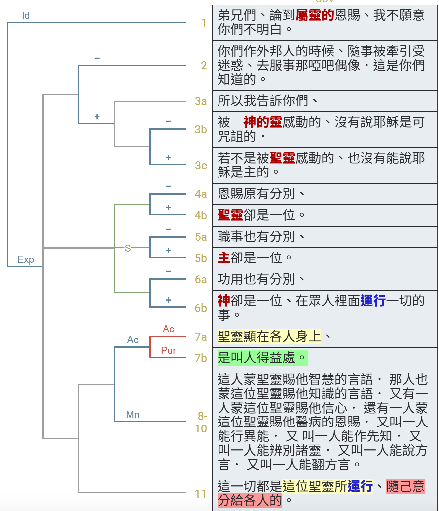

經文：林前12:1-11   
題目：興起發光 (二)   
日期：2025-01-19   
教會：台北衛理堂   

## 語意圖析 (Semantic Diagram)

## 解經 (Exegesis)
😀😢🤔😮❓❌⭕❗🎀🎗️✳️

- 弟兄們，論到屬靈的恩賜，我不願意你們不明白。 你們作外邦人的時候，隨事被牽引，受迷惑，去服事那啞巴偶像，這是你們知道的。 所以我告訴你們，被神的靈感動的，沒有說耶穌是可咒詛的；若不是被聖靈感動的，也沒有能說耶穌是主的。 恩賜原有分別，聖靈卻是一位。 職事也有分別，主卻是一位。 功用也有分別，神卻是一位，在眾人裡面運行一切的事。 聖靈顯在各人身上，是叫人得益處。 這人蒙聖靈賜他智慧的言語，那人也蒙這位聖靈賜他知識的言語， 又有一人蒙這位聖靈賜他信心，還有一人蒙這位聖靈賜他醫病的恩賜， 又叫一人能行異能，又叫一人能作先知，又叫一人能辨別諸靈，又叫一人能說方言，又叫一人能繙方言。 這一切都是這位聖靈所運行、隨己意分給各人的。 
- 
## 大綱 (Outline)
😀😢🤔😮❓❌⭕❗🎀🎗️✳️

## 小抄 (memo)

---

[講道筆記↵](README.md)

