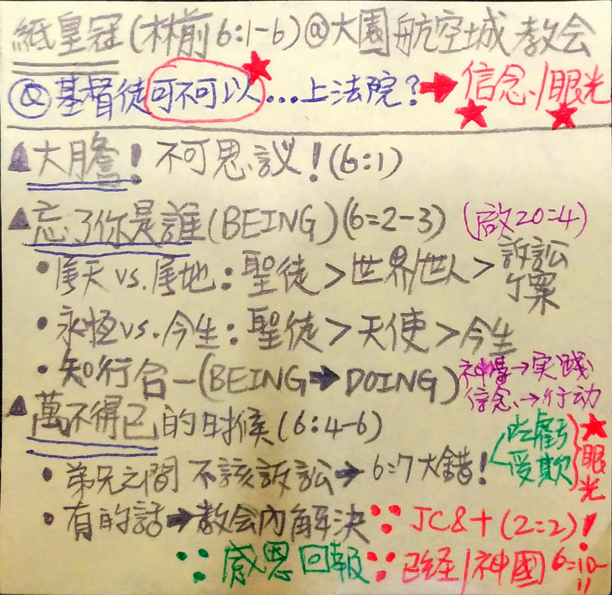
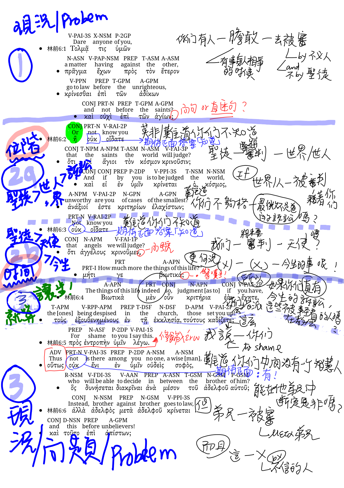

經文：林前 6:1–8  
題目：紙皇冠  
日期：2021-01-10  
教會：大園航空城教會  
tags： #證道  #解經  

## 圖析 (Syntax Diagram)

-  1a (<RUBY><ruby><ruby>Τολμᾷ<rt>Dare</rt></ruby><rt>τολμάω</rt></ruby><rt>V-PAI-3S</rt></RUBY>)P (<RUBY><ruby><ruby>τις<rt>anyone</rt></ruby><rt>τις</rt></ruby><rt>X-NSM</rt></RUBY> <RUBY><ruby><ruby>ὑμῶν<rt>of you‚</rt></ruby><rt>σύ</rt></ruby><rt>P-2GP</rt></RUBY>)S 
	- 1b [<RUBY><ruby><ruby>πρᾶγμα<rt>a matter</rt></ruby><rt>πρᾶγμα</rt></ruby><rt>N-ASN</rt></RUBY> <RUBY><ruby><ruby>ἔχων<rt>having</rt></ruby><rt>ἔχω</rt></ruby><rt>V-PAP-NSM</rt></RUBY> <RUBY><ruby><ruby>πρὸς<rt>against</rt></ruby><rt>πρός</rt></ruby><rt>PREP</rt></RUBY> <RUBY><ruby><ruby>τὸν<rt>the</rt></ruby><rt>ὁ</rt></ruby><rt>T-ASM</rt></RUBY> <RUBY><ruby><ruby>ἕτερον<rt>other‚</rt></ruby><rt>ἕτερος</rt></ruby><rt>A-ASM</rt></RUBY>]A 
	- 1c [<RUBY><ruby><ruby>κρίνεσθαι<rt>go to law</rt></ruby><rt>κρίνω</rt></ruby><rt>V-PPN</rt></RUBY> <RUBY><ruby><ruby>ἐπὶ<rt>before</rt></ruby><rt>ἐπί</rt></ruby><rt>PREP</rt></RUBY> <RUBY><ruby><ruby>τῶν<rt>the</rt></ruby><rt>ὁ</rt></ruby><rt>T-GPM</rt></RUBY> <RUBY><ruby><ruby>ἀδίκων<rt>unrighteous‚</rt></ruby><rt>ἄδικος</rt></ruby><rt>A-GPM</rt></RUBY> 
		-  <RUBY><ruby><ruby>καὶ<rt>and</rt></ruby><rt>καί</rt></ruby><rt>CONJ</rt></RUBY> <RUBY><ruby><ruby>οὐχὶ<rt>not</rt></ruby><rt>οὐχί</rt></ruby><rt>PRT-N</rt></RUBY> <RUBY><ruby><ruby>ἐπὶ<rt>before</rt></ruby><rt>ἐπί</rt></ruby><rt>PREP</rt></RUBY> <RUBY><ruby><ruby>τῶν<rt>the</rt></ruby><rt>ὁ</rt></ruby><rt>T-GPM</rt></RUBY> <RUBY><ruby><ruby>ἁγίων;<rt>saints?</rt></ruby><rt>ἅγιος</rt></ruby><rt>A-GPM</rt></RUBY>]C
-  2a <RUBY><ruby><ruby>ἢ<rt>Or</rt></ruby><rt>ἤ</rt></ruby><rt>CONJ</rt></RUBY> <RUBY><ruby><ruby>οὐκ<rt>not</rt></ruby><rt>οὐ</rt></ruby><rt>PRT-N</rt></RUBY> <RUBY><ruby><ruby>οἴδατε<rt>know you</rt></ruby><rt>εἴδω</rt></ruby><rt>V-RAI-2P</rt></RUBY> 
	- 2b <RUBY><ruby><ruby>ὅτι<rt>that</rt></ruby><rt>ὅτι</rt></ruby><rt>CONJ</rt></RUBY> (<RUBY><ruby><ruby>οἱ<rt>the</rt></ruby><rt>ὁ</rt></ruby><rt>T-NPM</rt></RUBY> <RUBY><ruby><ruby>ἅγιοι<rt>saints</rt></ruby><rt>ἅγιος</rt></ruby><rt>A-NPM</rt></RUBY>)S (<RUBY><ruby><ruby>τὸν<rt>the</rt></ruby><rt>ὁ</rt></ruby><rt>T-ASM</rt></RUBY> <RUBY><ruby><ruby>κόσμον<rt>world</rt></ruby><rt>κόσμος</rt></ruby><rt>N-ASM</rt></RUBY>)C (<RUBY><ruby><ruby>κρινοῦσιν;<rt>will judge?</rt></ruby><rt>κρίνω</rt></ruby><rt>V-FAI-3P</rt></RUBY>)P 
		- 2c <RUBY><ruby><ruby>καὶ<rt>And</rt></ruby><rt>καί</rt></ruby><rt>CONJ</rt></RUBY> <RUBY><ruby><ruby>εἰ<rt>if</rt></ruby><rt>εἰ</rt></ruby><rt>CONJ</rt></RUBY> (<RUBY><ruby><ruby>ἐν<rt>by</rt></ruby><rt>ἐν</rt></ruby><rt>PREP</rt></RUBY> <RUBY><ruby><ruby>ὑμῖν<rt>you</rt></ruby><rt>σύ</rt></ruby><rt>P-2DP</rt></RUBY>)A (<RUBY><ruby><ruby>κρίνεται<rt>is to be judged</rt></ruby><rt>κρίνω</rt></ruby><rt>V-PPI-3S</rt></RUBY>)P (<RUBY><ruby><ruby>ὁ<rt>the</rt></ruby><rt>ὁ</rt></ruby><rt>T-NSM</rt></RUBY> <RUBY><ruby><ruby>κόσμος‚<rt>world‚</rt></ruby><rt>κόσμος</rt></ruby><rt>N-NSM</rt></RUBY>)S 
	- 2d (<RUBY><ruby><ruby>ἀνάξιοί<rt>unworthy</rt></ruby><rt>ἀνάξιος</rt></ruby><rt>A-NPM</rt></RUBY>)C. (<RUBY><ruby><ruby>ἐστε<rt>are you</rt></ruby><rt>εἰμί</rt></ruby><rt>V-PAI-2P</rt></RUBY>)P (<RUBY><ruby><ruby>κριτηρίων<rt>of cases</rt></ruby><rt>κριτήριον</rt></ruby><rt>N-GPN</rt></RUBY> <RUBY><ruby><ruby>ἐλαχίστων;<rt>of the smallest?</rt></ruby><rt>ἐλάχιστος</rt></ruby><rt>A-GPN</rt></RUBY>).C 
-  3a <RUBY><ruby><ruby>οὐκ<rt>Not</rt></ruby><rt>οὐ</rt></ruby><rt>PRT-N</rt></RUBY> <RUBY><ruby><ruby>οἴδατε<rt>know you</rt></ruby><rt>εἴδω</rt></ruby><rt>V-RAI-2P</rt></RUBY> 
	- 3b <RUBY><ruby><ruby>ὅτι<rt>that</rt></ruby><rt>ὅτι</rt></ruby><rt>CONJ</rt></RUBY> (<RUBY><ruby><ruby>ἀγγέλους<rt>angels</rt></ruby><rt>ἄγγελος</rt></ruby><rt>N-APM</rt></RUBY>)C (<RUBY><ruby><ruby>κρινοῦμεν‚<rt>we will judge?</rt></ruby><rt>κρίνω</rt></ruby><rt>V-FAI-1P</rt></RUBY>)P 
		- 3c <RUBY><ruby><ruby>μήτι<rt></rt></ruby><rt>μήτι</rt></ruby><rt>PRT-I</rt></RUBY> <RUBY><ruby><ruby>γε<rt>How much more</rt></ruby><rt>γέ</rt></ruby><rt>PRT</rt></RUBY> (<RUBY><ruby><ruby>βιωτικά;<rt>the things of this life?</rt></ruby><rt>βιωτικός</rt></ruby><rt>A-APN</rt></RUBY>)C 
- 4a 
	- (<RUBY><ruby><ruby>Βιωτικὰ<rt>The things of this life</rt></ruby><rt>βιωτικός</rt></ruby><rt>A-APN</rt></RUBY>)C. <RUBY><ruby><ruby>μὲν<rt>indeed</rt></ruby><rt>μέν</rt></ruby><rt>PRT</rt></RUBY> <RUBY><ruby><ruby>οὖν<rt>so‚</rt></ruby><rt>οὖν</rt></ruby><rt>CONJ</rt></RUBY> (<RUBY><ruby><ruby>κριτήρια<rt>judgment [as to]</rt></ruby><rt>κριτήριον</rt></ruby><rt>N-APN</rt></RUBY>).C <RUBY><ruby><ruby>ἐὰν<rt>if</rt></ruby><rt>ἐάν</rt></ruby><rt>CONJ</rt></RUBY> (<RUBY><ruby><ruby>ἔχητε‚<rt>you have‚</rt></ruby><rt>ἔχω</rt></ruby><rt>V-PAS-2P</rt></RUBY>)P 
- 4b (<RUBY><ruby><ruby>τοὺς<rt>the [ones]</rt></ruby><rt>ὁ</rt></ruby><rt>T-APM</rt></RUBY> <RUBY><ruby><ruby>ἐξουθενημένους<rt>being despised</rt></ruby><rt>ἐξουθενέω</rt></ruby><rt>V-RPP-APM</rt></RUBY> <RUBY><ruby><ruby>ἐν<rt>in</rt></ruby><rt>ἐν</rt></ruby><rt>PREP</rt></RUBY> <RUBY><ruby><ruby>τῇ<rt>the</rt></ruby><rt>ὁ</rt></ruby><rt>T-DSF</rt></RUBY> <RUBY><ruby><ruby>ἐκκλησίᾳ‚<rt>church‚</rt></ruby><rt>ἐκκλησία</rt></ruby><rt>N-DSF</rt></RUBY> <RUBY><ruby><ruby>τούτους<rt>those</rt></ruby><rt>οὗτος</rt></ruby><rt>D-APM</rt></RUBY>)C (<RUBY><ruby><ruby>καθίζετε;<rt>set you up!</rt></ruby><rt>καθίζω</rt></ruby><rt>V-PAI-2P</rt></RUBY>)P 
- 5a (<RUBY><ruby><ruby>πρὸς<rt>For</rt></ruby><rt>πρός</rt></ruby><rt>PREP</rt></RUBY> <RUBY><ruby><ruby>ἐντροπὴν<rt>shame</rt></ruby><rt>ἐντροπή</rt></ruby><rt>N-ASF</rt></RUBY>)A (<RUBY><ruby><ruby>ὑμῖν<rt>to you</rt></ruby><rt>σύ</rt></ruby><rt>P-2DP</rt></RUBY>)C (<RUBY><ruby><ruby>λέγω.<rt>I say this.</rt></ruby><rt>λέγω</rt></ruby><rt>V-PAI-1S</rt></RUBY>)P (<RUBY><ruby><ruby>οὕτως<rt>Thus</rt></ruby><rt>οὕτω, οὕτως</rt></ruby><rt>ADV</rt></RUBY>)A 
- 5b <RUBY><ruby><ruby>οὐκ<rt>not</rt></ruby><rt>οὐ</rt></ruby><rt>PRT-N</rt></RUBY> (<RUBY><ruby><ruby>ἔνι<rt>is there</rt></ruby><rt>ἔνι</rt></ruby><rt>V-PAI-3S</rt></RUBY>)P (<RUBY><ruby><ruby>ἐν<rt>among</rt></ruby><rt>ἐν</rt></ruby><rt>PREP</rt></RUBY> <RUBY><ruby><ruby>ὑμῖν<rt>you</rt></ruby><rt>σύ</rt></ruby><rt>P-2DP</rt></RUBY>)A (<RUBY><ruby><ruby>οὐδεὶς<rt>no one‚</rt></ruby><rt>οὐδείς</rt></ruby><rt>A-NSM</rt></RUBY> <RUBY><ruby><ruby>σοφὸς‚<rt>a wise [man]‚</rt></ruby><rt>σοφός</rt></ruby><rt>A-NSM</rt></RUBY>)S^ 
	- 5c (<RUBY><ruby><ruby>ὃς<rt>who</rt></ruby><rt>ὅς, ἥ</rt></ruby><rt>R-NSM</rt></RUBY>)S^ (<RUBY><ruby><ruby>δυνήσεται<rt>will be able</rt></ruby><rt>δύναμαι</rt></ruby><rt>V-FDI-3S</rt></RUBY>)P 
		- 5d [<RUBY><ruby><ruby>διακρῖναι<rt>to decide</rt></ruby><rt>διακρίνω</rt></ruby><rt>V-AAN</rt></RUBY> <RUBY><ruby><ruby>ἀνὰ<rt>in</rt></ruby><rt>ἀνά</rt></ruby><rt>PREP</rt></RUBY> <RUBY><ruby><ruby>μέσον<rt>between</rt></ruby><rt>μέσος</rt></ruby><rt>A-ASN</rt></RUBY> <RUBY><ruby><ruby>τοῦ<rt>the</rt></ruby><rt>ὁ</rt></ruby><rt>T-GSM</rt></RUBY> <RUBY><ruby><ruby>ἀδελφοῦ<rt>brother</rt></ruby><rt>ἀδελφός</rt></ruby><rt>N-GSM</rt></RUBY> <RUBY><ruby><ruby>αὐτοῦ;<rt>of him?</rt></ruby><rt>αὐτός</rt></ruby><rt>P-GSM</rt></RUBY>]C 
- 6a <RUBY><ruby><ruby>ἀλλὰ<rt>Instead‚</rt></ruby><rt>ἀλλά</rt></ruby><rt>CONJ</rt></RUBY> (<RUBY><ruby><ruby>ἀδελφὸς<rt>brother</rt></ruby><rt>ἀδελφός</rt></ruby><rt>N-NSM</rt></RUBY>)S (<RUBY><ruby><ruby>μετὰ<rt>against</rt></ruby><rt>μετά</rt></ruby><rt>PREP</rt></RUBY> <RUBY><ruby><ruby>ἀδελφοῦ<rt>brother</rt></ruby><rt>ἀδελφός</rt></ruby><rt>N-GSM</rt></RUBY>)A (<RUBY><ruby><ruby>κρίνεται<rt>goes to law‚</rt></ruby><rt>κρίνω</rt></ruby><rt>V-PPI-3S</rt></RUBY>)P 
- 6b <RUBY><ruby><ruby>καὶ<rt>and</rt></ruby><rt>καί</rt></ruby><rt>CONJ</rt></RUBY> (<RUBY><ruby><ruby>τοῦτο<rt>this</rt></ruby><rt>οὗτος</rt></ruby><rt>D-NSN</rt></RUBY>)S (<RUBY><ruby><ruby>ἐπὶ<rt>before</rt></ruby><rt>ἐπί</rt></ruby><rt>PREP</rt></RUBY> <RUBY><ruby><ruby>ἀπίστων;<rt>unbelievers!</rt></ruby><rt>ἄπιστος</rt></ruby><rt>A-GPM</rt></RUBY>)A 

## 解經 (Exegesis)

- 1Co 6:1
	- 6:1a 主要子句；6:1b 分詞內嵌子句，當狀語； 6:1b 不定詞內嵌子句，當補語
	- 6:1a Τολμᾷ 膽敢，動詞前置 = 強調 ⇒ 好大的膽子！
	- 6:1c ἐπὶ  空間 + 所有格 = before, in the presence of，引申含意： on the basis of (BDAG)。
	- 6:1c ἀδίκων 不義的人 = 教會所輕看的人 (1Co 6:4) = 不信主的人 (1Co 6:6) 
		- 因為他們沒有信仰，沒有*屬天的智慧*，沒有*神國的法則*。 
			- 1Co 2:6  然而，在完全的人中，我們也講**智慧**。但不是這世上的智慧
			- 1Co 6:9–10   你們豈不知不義的人不能承受**神的國**麼？... 都不能承受**神的國**。
			- 這裡的重點還不在於非信徒的倫理道德比較差──但 1Co 6:9–10 的確跟倫理道德有關。
	- 6:1c οὐχὶ = οὐκ ＋強調
	- 6:1c ἁγίων; NA28 用問號，但也可能是句號 (or 驚嘆號)，因為 1Co 6:1 在指出現況 & 問題。
- 1Co 6:2
	- 6:2a 主要子句；6:2b 從屬子句，當 οἴδατε 的補語
	- 6:2cd 是條件句，也是 οἴδατε 的補語
	- 6:2b κόσμος = 世界 or 世人
	- 6:2c εἰ + κρίνεται = 第一類條件句，假設條件成立，然後該如何。
	- 6:2d κριτηρίων = legal cases 法律案件
	- 邏輯：聖徒 ＞ 世人 = 人間活物 ＞ 法律案件 = 最小的
		- Rev 20:4  我又看見幾個寶座，也有坐在上面的，*並有審判的權柄賜給他*們。我又看見那些因為給耶穌作見證，並為神之道被斬者的靈魂，和那沒有拜過獸與獸像，也沒有在額上和手上受過他印記之人的靈魂，他們都復活了，*與基督一同作王*一千年。
- 1Co 6:3
	- 6:3ab 與 6:2ab 平行結構
	- 6:3c μήτι 疑問句，比 μή 語氣更強，期待否定答案，省略 6:3b 的 κρινοῦμεν
	- 6:3c 難道我們不要審判今生的事？ ⇒ 期待答案：不，我們要審判今生的事。
	- 邏輯：我們 = 聖徒 ＞ 天使 = 靈界活物  ⇒ 存到永恆 (永生 or 永死、硫磺火湖)
		- 來 1:14 天使豈不都是服役的靈、奉差遣為那將要承受救恩的人效力麼？
		- 來 2:16 他並不救拔天使，乃是救拔亞伯拉罕的後裔。
		- Rev 20:10  那迷惑他們的魔鬼被扔在硫磺的火湖裡，就是獸和假先知所在的地方。他們必晝夜受痛苦，直到永永遠遠。
- 1Co 6:4 
	- 6:4ab 條件句，ἐὰν + ἔχητε 假設語氣 = 第三類條件句，純粹是為了假設性的探討 for hypothetical consideration。反觀 1Co 6:2 的第一類條件句就多了份篤定：假設條件成立，然後接下來就該如何如何。
		- 這是萬不得已的情況：假設你們有訴訟的時候。==從 1Co 6:7 就可以知道，信徒之間根本就不應該有訴訟！==
			- 1Co 6:7 你們彼此告狀，這已經是你們的大錯了。為甚麼不情願受欺呢？為甚麼不情願吃虧呢？
		- 情願受欺、情願吃虧 ⇒ ==因為有永恆的眼光，知道地上這一切都不能存到永恆，但弟兄之間的愛卻能存到永恆！==
	- 6:4b 教會所輕看的人 (1Co 6:4) = ἀδίκων 不義的人 (1Co 6:1) = 不信主的人 (1Co 6:6)
		- τοὺς ἐξουθενημένους ἐν τῇ ἐκκλησίᾳ  被教會輕看的人 ≠ τὰ ἐξουθενημένα  被人輕視的 (1Co 1:28)，因為 1Co 1:28 講的是「被世人輕視，卻被神揀選」
	- 6:4b καθίζετε 的標點符號有三種可能解讀：
		- a) 問號，表示質疑：難道你們還委任 (appoint) 被教會輕看的人嗎？
		- b) 句號，表示諷刺、驚訝：你們竟然委任 (appoint) 給教會輕看的人！
		- c) 句號，表示命令、建議、嘲弄：你們只要安排 (set you up!) 個在教會被輕視的人就綽綽有餘了。 (受 1Co 1:28 ἐξουθενέω 影響)  
		- a)、b) 比較可能。
- 1Co 6:5
	- 6:5ab 對等子句；6:5cd 關係從屬子句，補充說明 6:5b 的主語；6:5d 不定詞內嵌子句，當作 6:5c 的補語
	- 6:5a πρὸς ἐντροπὴν = 保羅說話的目的，叫你們知道羞愧！
	- 6:5a οὕτως = thus，修飾 6:5a 的 λέγω 比較合理，NA28 的標點怪怪的
	- 6:5b οὐκ 疑問句，期待肯定的答案：有，我們中間有智慧人，能夠審判。
	- 6:5b σοφὸς 指的是屬天的智慧、神國的法則
		- 1Co 2:6 然而，在完全的人中，我們也講**智慧**。但不是這世上的智慧
		- 1Co 6:9–10 你們豈不知不義的人不能承受**神的國**麼？... 都不能承受**神的國**。
- 1Co 6:6 
	- 6:6a κρίνεται 可能被動，也可能有 middle 含意：親身去找人審判，還帶著 μετὰ 弟兄
	- 6:6b τοῦτο = 上面這件事情，省略動詞 = 竟然發生在不信主的人面前 or 按照不信主之人的基礎來審判！

## 重述 (Paraphrase)

- 6:1abc 你們中間有人，遇到跟別人相爭的時候，竟敢寧可去找不義的人審判，也不找聖徒審判。  
- 6:2a莫非你們不知道，
	- 6:2b 聖徒將來要審判世界嗎？
	- 6:2c 如果整個世界都要藉著你們來受審判，
	- 6:2d 難道你們還不夠資格來審判最微不足道的訴訟嗎？
- 6:3a 還是你們不知道，
	- 6:3b 我們將來要審判天使嗎？
	- 6:3c 那麼更何況是今生的事呢？
- 6:4a 所以，就算你們有今生的訴訟，
	- 6:4b 你們會託付給這些在教會被輕看的人審判嗎？
- 6:5a 唉，我這麼說你們，是要你們知道自己有多丟臉。
- 6:5bcd 難道你們中間，連一個有智慧、能在他弟兄中間分辨是非的人都沒有嗎？
- 6:6a 但你們竟然──弟兄帶著弟兄去找人審判，
- 6:6b 而且還是找不信主的人！

## 大綱 (Outline)

- 1> 大膽！──不可思議的現況 (1Co 6:1)
	- 你們膽大包天，竟敢！
	- 保羅覺得不可思議的事情，竟然真的發生了！
- 2> 忘了你是誰！──不要忘了聖徒的身分和地位 (BEING)，知行就該合一 (1Co 6:2–3)
	- 神學知識影響信念 (BEING)，信念帶出行動 (DOING)！
	- 2a> ==屬天、屬地的對比==：聖徒 ＞ 天使 ＞ 世界、世人 ＞ 訴訟
		- 聖徒要審判世人 (1Co 6:2)
		- 聖徒要審判天使 (1Co 6:3)
		- 訴訟 = 最小的事
	- 2b> ==永恆、今生的對比==：永恆 ＞ 今生
- 3> 萬不得已的處置 (1Co 6:4–6)
	- 信徒之間**根本就不該有訴訟 (1Co 6:7)**，因為：
		- 有屬天、永恆的眼光 (1Co 6:2–3)
		- **耶穌基督並祂釘十字架 (1Co 2:2)，聖徒已經洗淨、成聖、稱義 (1Co 6:11)，將來要承受神的國 (1Co 6:10)**
	- 假設有訴訟的話，應該在教會內解決 (1Co 6:4–5)
	- 但現實的情況是：你們太誇張了！ (1Co 6:6)

## 小抄 (memo)

## 手稿 (Manuscript) 

---

[講道筆記↵](README.md)
