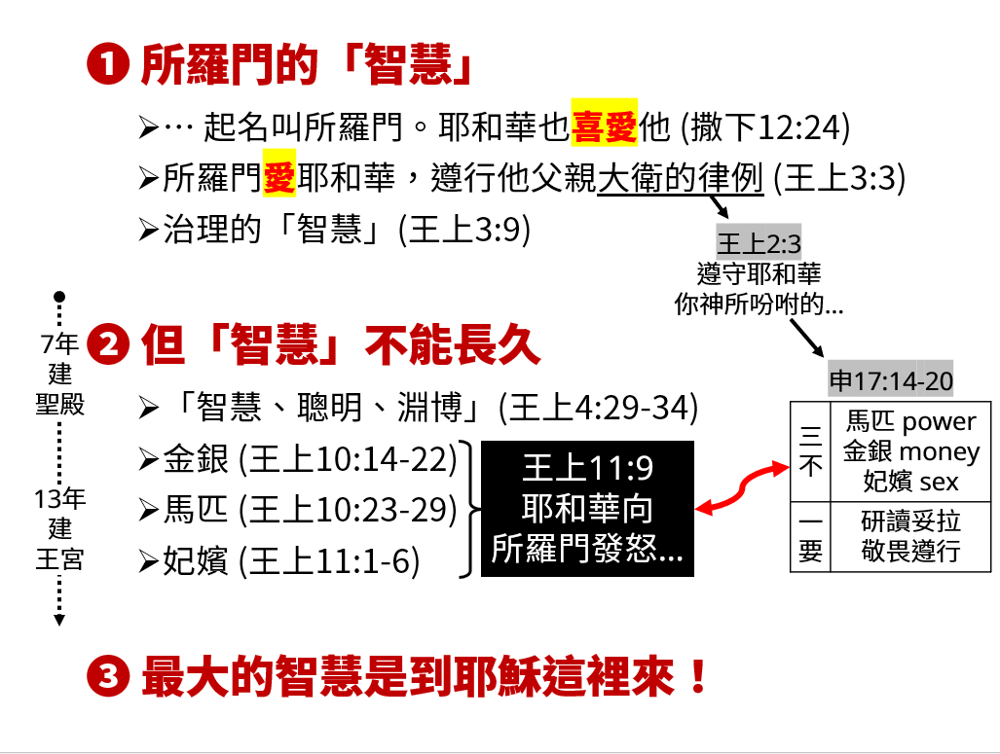

經課一：列王記上 3:3-14  
福音書：約翰福音6:51-58(新約135頁)  
題目：最大的智慧 (一)  
日期：2024-08-18  
教會：台北衛理堂  

## 解經 (Exegesis)

- 詩篇111:10 敬畏耶和華是智慧的==開端==；凡遵行他命令的是聰明人。
	- 開端 = 起點，不是終點！
- 以弗所書5:15-20 你們要謹慎行事，不要像愚昧人，當像智慧人。要愛惜光陰，因為現今的世代邪惡。不要作糊塗人，要明白主的旨意如何。不要醉酒，酒能使人放蕩；乃要被聖靈充滿。當用詩章、頌詞、靈歌、彼此對說，口唱心和的讚美主。凡事要奉我們主耶穌基督的名常常感謝父神。

## 大綱 (Outline)
️

---

[講道筆記↵](README.md)