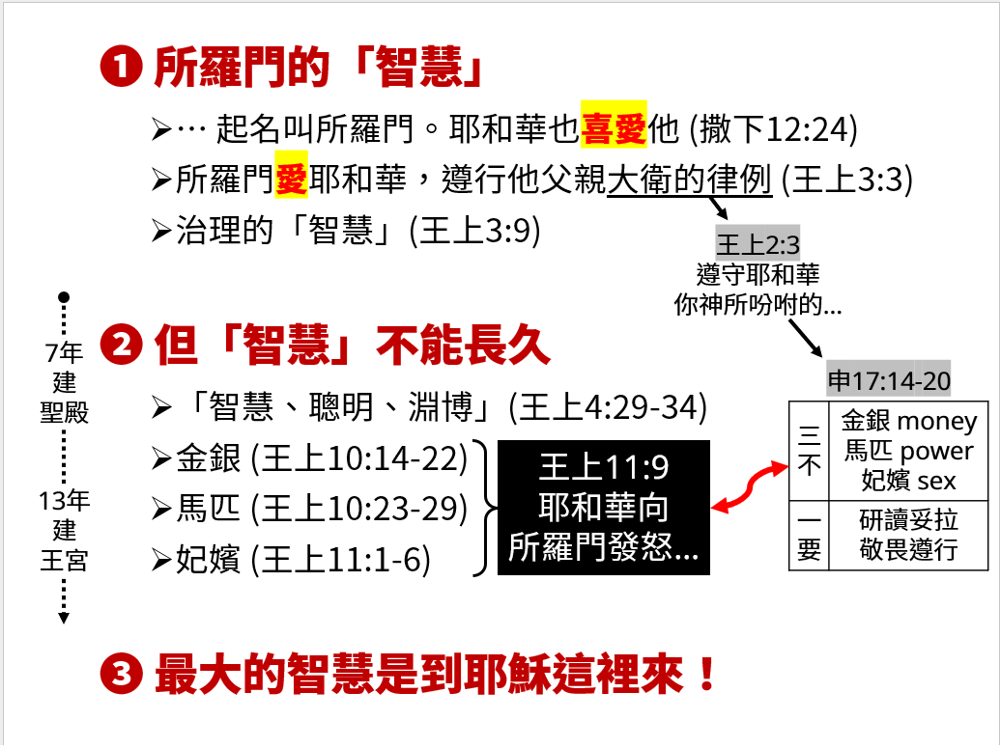

經課一：列王記上 3:3-14  
福音書：約翰福音6:51-58(新約135頁)  
題目：最大的智慧 (一)  
日期：2024-08-18  
教會：台北衛理堂  

## 大綱 (Outline)
- 謝謝經課集的啟迪 😀 把兩段經文串在一起，開啟新的亮光！
- 成人主日學 vs. 兒童主日學
- ==(1) 所羅門的「智慧」==
	- (1a) 神先愛人
		- … 起名叫所羅門。耶和華也喜愛他 (撒下12:24)
	- (1b) 人的回應
		- 所羅門愛耶和華，遵行他父親大衛的律例 (王上3:3)——什麼律例？
			- 王上2:2-3 我現在要走世人必走的路。所以，你當剛強，作大丈夫，遵守耶和華─你　神所吩咐的，照著摩西律法上所寫的行主的道，謹守他的律例、誡命、典章、法度。這樣，你無論做甚麼事，不拘往何處去，盡都亨通。
		- 主的道，謹守他的律例、誡命、典章、法度——是什麼？
			- 申17:14-20 到了耶和華─你　神所賜你的地，得了那地居住的時候，若說：我要立王治理我，像四圍的國一樣。你總要立耶和華─你　神所揀選的人為王。必從你弟兄中立一人；不可立你弟兄以外的人為王。只是王不可為自己加添馬匹，也不可使百姓回埃及去，為要加添他的馬匹，因耶和華曾吩咐你們說：不可再回那條路去。他也不可為自己多立妃嬪，恐怕他的心偏邪；也不可為自己多積金銀。他登了國位，就要將祭司利未人面前的這律法書，為自己抄錄一本，存在他那裡，要平生誦讀，好學習敬畏耶和華─他的　神，謹守遵行這律法書上的一切言語和這些律例，免得他向弟兄心高氣傲，偏左偏右，離了這誡命。這樣，他和他的子孫便可在以色列中，在國位上年長日久。
			- **三不：馬匹 (power)、妃嬪 (sex)、金銀 (money)**
			- **一要：研讀妥拉，敬畏遵行**
	- (1c) 治理的「智慧」(王上3:9)
		- 所以求你賜我智慧，可以判斷你的民，能辨別是非。不然，誰能判斷這眾多的民呢？
		- 是功能性的智慧，是角色的智慧，是解決問題的智慧——是今生的智慧！
		- 不是聖經上所說：*敬畏耶和華是智慧的開端；認識至聖者便是聰明。*(箴9:10)
			- 敬畏 = 心態，只是開端，不是目的——目的是：認識耶和華！
				- 敬畏，也可能敬而遠之 😢
- ==(2) 但「智慧」不能長久==
	- (2a) 人是會變的 😢——人是會老的 😢 —— 人的罪性 😢
		- 「智慧、聰明、淵博」(王上4:29-34)
		- 金銀 (王上10:14-22)
		- 馬匹 (王上10:23-29)
		- 妃嬪 (王上11:1-6)
		- 王上11:9 耶和華向所羅門發怒，因為他的心偏離向他兩次顯現的耶和華─以色列的　神。
	- (2b) 7年建聖殿、13 年建王宮——為什麼？
		- 因為聖殿只住耶和華，王宮還有 1000 個老婆擺不平 😢
	- 50年前我們都是小鮮肉！
	- 何昔日之芳草兮，今直為此蕭艾？！豈其有他故兮，莫好脩之害也。
- ==(3) 最大的智慧是到耶穌這裡來！==

## 投影片 (Slide)
️

---

[講道筆記↵](README.md)