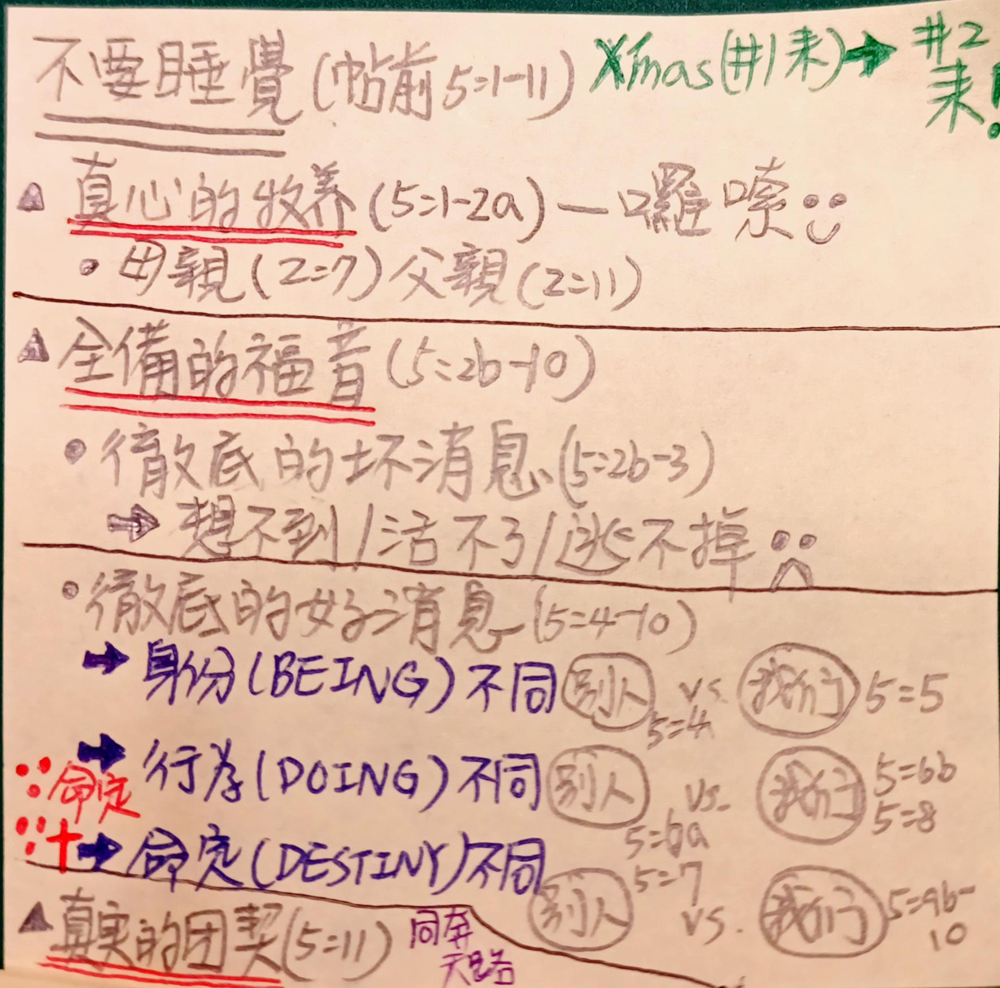

經文：帖前 5:1-11   
題目：不要睡覺   
日期：2022-12-18   
教會：竹圍信友堂

## 圖析 (Syntax Diagram)

- ═════════════ (1) 真心的牧養 (5:1-2a)：父母心腸
- <rt>5:1</rt> ( ‹<RUBY><ruby><ruby>Περὶ<rt>περί</rt></ruby><rt>Concerning</rt></ruby><rt>PREP</rt></RUBY> <RUBY><ruby><ruby>δὲ<rt>δέ</rt></ruby><rt>now</rt></ruby><rt>CONJ</rt></RUBY> <RUBY><ruby><ruby>τῶν<rt>ὁ</rt></ruby><rt>the</rt></ruby><rt>T-GPM</rt></RUBY> <RUBY><ruby><ruby>χρόνων<rt>χρόνος</rt></ruby><rt>times</rt></ruby><rt>N-GPM</rt></RUBY> <RUBY><ruby><ruby>καὶ<rt>καί</rt></ruby><rt>and</rt></ruby><rt>CONJ</rt></RUBY> <RUBY><ruby><ruby>τῶν<rt>ὁ</rt></ruby><rt>the</rt></ruby><rt>T-GPM</rt></RUBY> <RUBY><ruby><ruby>καιρῶν,<rt>καιρός</rt></ruby><rt>seasons</rt></ruby><rt>N-GPM</rt></RUBY> › a )⦇ <RUBY><ruby><ruby>ἀδελφοί,<rt>ἀδελφός</rt></ruby><rt>brothers</rt></ruby><rt>N-VPM</rt></RUBY> <RUBY><ruby><ruby>οὐ<rt>οὐ</rt></ruby><rt>no</rt></ruby><rt>PRT-N</rt></RUBY> (<RUBY><ruby><ruby>χρείαν<rt>χρεία</rt></ruby><rt>need</rt></ruby><rt>N-ASF</rt></RUBY>)C <RUBY><ruby><ruby><strong>ἔχετε</strong><rt>ἔχω</rt></ruby><rt>you have</rt></ruby><rt>V-PAI-2P</rt></RUBY> ⦈(<RUBY><ruby><ruby>ὑμῖν<rt>σύ</rt></ruby><rt>to you</rt></ruby><rt>P-2DP</rt></RUBY> <RUBY><ruby><ruby><em>γράφεσθαι,</em><rt>γράφω</rt></ruby><rt>to be written</rt></ruby><rt>V-PPN</rt></RUBY>)+C
- <rt>5:2a</rt> (<RUBY><ruby><ruby>αὐτοὶ<rt>αὐτός</rt></ruby><rt>Yourselves</rt></ruby><rt>P-NPM</rt></RUBY>)S <RUBY><ruby><ruby>γὰρ<rt>γάρ</rt></ruby><rt>for</rt></ruby><rt>CONJ</rt></RUBY> (<RUBY><ruby><ruby>ἀκριβῶς<rt>ἀκριβῶς</rt></ruby><rt>fully</rt></ruby><rt>ADV</rt></RUBY>)A <RUBY><ruby><ruby><strong>οἴδατε</strong><rt>εἴδω</rt></ruby><rt>you know</rt></ruby><rt>V-RAI-2P</rt></RUBY>
- ═════════════ (2) 全備的福音 (5:2b-10)：壞消息 & 好消息
	- ———————— (2a) 徹底的壞消息 (5:2b-3)
	- <rt>5:2b</rt> <RUBY><ruby><ruby>ὅτι<rt>ὅτι</rt></ruby><rt>that</rt></ruby><rt>CONJ</rt></RUBY> (<RUBY><ruby><ruby>ἡμέρα<rt>ἡμέρα</rt></ruby><rt>[the] day</rt></ruby><rt>N-NSF</rt></RUBY> <RUBY><ruby><ruby>Κυρίου<rt>κύριος</rt></ruby><rt>of [the] Lord</rt></ruby><rt>N-GSM</rt></RUBY>)S (<RUBY><ruby><ruby>ὡς<rt>ὡς</rt></ruby><rt>as</rt></ruby><rt>CONJ</rt></RUBY> <RUBY><ruby><ruby>κλέπτης<rt>κλέπτης</rt></ruby><rt>a thief</rt></ruby><rt>N-NSM</rt></RUBY> ‹<RUBY><ruby><ruby>ἐν<rt>ἐν</rt></ruby><rt>by</rt></ruby><rt>PREP</rt></RUBY> <RUBY><ruby><ruby>νυκτὶ<rt>νύξ</rt></ruby><rt>night</rt></ruby><rt>N-DSF</rt></RUBY> › )A (<RUBY><ruby><ruby>οὕτως<rt>οὕτω, οὕτως</rt></ruby><rt>in this manner</rt></ruby><rt>ADV</rt></RUBY>)A <RUBY><ruby><ruby><strong>ἔρχεται.</strong><rt>ἔρχομαι</rt></ruby><rt>comes</rt></ruby><rt>V-PNI-3S</rt></RUBY> 
		- <rt>5:3a</rt> { <RUBY><ruby><ruby>ὅταν<rt>ὅταν</rt></ruby><rt>For when</rt></ruby><rt>CONJ</rt></RUBY> <RUBY><ruby><ruby><strong>λέγωσιν·</strong><rt>λέγω</rt></ruby><rt>they might say</rt></ruby><rt>V-PAS-3P</rt></RUBY> (<RUBY><ruby><ruby>Εἰρήνη<rt>εἰρήνη</rt></ruby><rt>Peace</rt></ruby><rt>N-NSF</rt></RUBY> <RUBY><ruby><ruby>καὶ<rt>καί</rt></ruby><rt>and</rt></ruby><rt>CONJ</rt></RUBY> <RUBY><ruby><ruby>ἀσφάλεια,<rt>ἀσφάλεια</rt></ruby><rt>security</rt></ruby><rt>N-NSF</rt></RUBY>)C }A°¹⮧
	- <rt>5:3b</rt> (<RUBY><ruby><ruby>τότε<rt>τότε</rt></ruby><rt>then</rt></ruby><rt>ADV</rt></RUBY>)A (<RUBY><ruby><ruby>αἰφνίδιος<rt>αἰφνίδιος</rt></ruby><rt>suddenly</rt></ruby><rt>A-NSM</rt></RUBY>)A (<RUBY><ruby><ruby>αὐτοῖς<rt>αὐτός</rt></ruby><rt>upon them</rt></ruby><rt>P-DPM</rt></RUBY>)A <RUBY><ruby><ruby><mark><strong>ἐφίσταται°¹</strong></mark><rt>ἐφίστημι</rt></ruby><rt>comes</rt></ruby><rt>V-PMI-3S</rt></RUBY> (<RUBY><ruby><ruby>ὄλεθρος<rt>ὄλεθρος</rt></ruby><rt>destruction</rt></ruby><rt>N-NSM</rt></RUBY>)S
		- <rt>5:3c</rt> { <RUBY><ruby><ruby>ὥσπερ<rt>ὥσπερ</rt></ruby><rt>as</rt></ruby><rt>CONJ</rt></RUBY> (<RUBY><ruby><ruby>ἡ<rt>ὁ</rt></ruby><rt>the</rt></ruby><rt>T-NSF</rt></RUBY> <RUBY><ruby><ruby>ὠδὶν<rt>ὠδίν</rt></ruby><rt>labor pains</rt></ruby><rt>N-NSF</rt></RUBY>)S ...**ἐστίν**...(<RUBY><ruby><ruby>τῇ<rt>ὁ</rt></ruby><rt>to her</rt></ruby><rt>T-DSF</rt></RUBY> ‹<RUBY><ruby><ruby>ἐν<rt>ἐν</rt></ruby><rt>in</rt></ruby><rt>PREP</rt></RUBY> <RUBY><ruby><ruby>γαστρὶ<rt>γαστήρ</rt></ruby><rt>womb</rt></ruby><rt>N-DSF</rt></RUBY> ›a <RUBY><ruby><ruby><em>ἐχούσῃ,</em><rt>ἔχω</rt></ruby><rt>having</rt></ruby><rt>V-PAP-DSF</rt></RUBY>)C }A°¹⮥
	- <rt>5:3d</rt> <RUBY><ruby><ruby>καὶ<rt>καί</rt></ruby><rt>and</rt></ruby><rt>CONJ</rt></RUBY> <RUBY><ruby><ruby>οὐ<rt>οὐ</rt></ruby><rt>no</rt></ruby><rt>PRT-N</rt></RUBY> <RUBY><ruby><ruby>μὴ<rt>μή</rt></ruby><rt>not</rt></ruby><rt>PRT-N</rt></RUBY> <RUBY><ruby><ruby><strong>ἐκφύγωσιν.</strong><rt>ἐκφεύγω</rt></ruby><rt>shall they escape</rt></ruby><rt>V-AAS-3P</rt></RUBY> 
	- ———————— (2b) 徹底的好消息 (5:4-10)
	- ⋯⋯⋯⋯⋯⋯⋯ 身分 (BEING) 不同 (5:4-5)——三明治 #1 層
	- <rt>5:4a</rt> (<RUBY><ruby><ruby>Ὑμεῖς<rt>σύ</rt></ruby><rt>You</rt></ruby><rt>P-2NP</rt></RUBY>)S <RUBY><ruby><ruby>δέ,<rt>δέ</rt></ruby><rt>however</rt></ruby><rt>CONJ</rt></RUBY> <RUBY><ruby><ruby>ἀδελφοί,<rt>ἀδελφός</rt></ruby><rt>brothers</rt></ruby><rt>N-VPM</rt></RUBY> <RUBY><ruby><ruby>οὐκ<rt>οὐ</rt></ruby><rt>not</rt></ruby><rt>PRT-N</rt></RUBY> <RUBY><ruby><ruby><strong>ἐστὲ</strong><rt>εἰμί</rt></ruby><rt>are</rt></ruby><rt>V-PAI-2P</rt></RUBY> (<RUBY><ruby><ruby>ἐν<rt>ἐν</rt></ruby><rt>in</rt></ruby><rt>PREP</rt></RUBY> <RUBY><ruby><ruby>σκότει,<rt>σκότος</rt></ruby><rt>darkness</rt></ruby><rt>N-DSN</rt></RUBY>)A
		- <rt>5:4b</rt> <RUBY><ruby><ruby>ἵνα<rt>ἵνα</rt></ruby><rt>that</rt></ruby><rt>CONJ</rt></RUBY> (<RUBY><ruby><ruby>ἡ<rt>ὁ</rt></ruby><rt>the</rt></ruby><rt>T-NSF</rt></RUBY> <RUBY><ruby><ruby>ἡμέρα<rt>ἡμέρα</rt></ruby><rt>day</rt></ruby><rt>N-NSF</rt></RUBY>)S (<RUBY><ruby><ruby>ὑμᾶς<rt>σύ</rt></ruby><rt>you</rt></ruby><rt>P-2AP</rt></RUBY>)C (<RUBY><ruby><ruby>ὡς<rt>ὡς</rt></ruby><rt>like</rt></ruby><rt>CONJ</rt></RUBY> <RUBY><ruby><ruby>κλέπτης<rt>κλέπτης</rt></ruby><rt>a thief</rt></ruby><rt>N-NSM</rt></RUBY>)A <RUBY><ruby><ruby><strong>καταλάβῃ·</strong><rt>καταλαμβάνω</rt></ruby><rt>should overtake</rt></ruby><rt>V-AAS-3S</rt></RUBY> 
	- <rt>5:5a</rt> (<RUBY><ruby><ruby>πάντες<rt>πᾶς</rt></ruby><rt>All</rt></ruby><rt>A-NPM</rt></RUBY>)⦇<RUBY><ruby><ruby>γὰρ<rt>γάρ</rt></ruby><rt>for</rt></ruby><rt>CONJ</rt></RUBY> ⦈(<RUBY><ruby><ruby>ὑμεῖς<rt>σύ</rt></ruby><rt>you</rt></ruby><rt>P-2NP</rt></RUBY>)S (<RUBY><ruby><ruby>υἱοὶ<rt>υἱός</rt></ruby><rt>sons</rt></ruby><rt>N-NPM</rt></RUBY> <RUBY><ruby><ruby>φωτός<rt>φῶς</rt></ruby><rt>of light</rt></ruby><rt>N-GSN</rt></RUBY>)C <RUBY><ruby><ruby><strong>ἐστε</strong><rt>εἰμί</rt></ruby><rt>are</rt></ruby><rt>V-PAI-2P</rt></RUBY> <RUBY><ruby><ruby>καὶ<rt>καί</rt></ruby><rt>and</rt></ruby><rt>CONJ</rt></RUBY> (<RUBY><ruby><ruby>υἱοὶ<rt>υἱός</rt></ruby><rt>sons</rt></ruby><rt>N-NPM</rt></RUBY> <RUBY><ruby><ruby>ἡμέρας.<rt>ἡμέρα</rt></ruby><rt>of day</rt></ruby><rt>N-GSF</rt></RUBY>)C 
	- <rt>5:5b</rt> <RUBY><ruby><ruby>Οὐκ<rt>οὐ</rt></ruby><rt>Not</rt></ruby><rt>PRT-N</rt></RUBY> <RUBY><ruby><ruby><strong>ἐσμὲν</strong><rt>εἰμί</rt></ruby><rt>we are</rt></ruby><rt>V-PAI-1P</rt></RUBY> (<RUBY><ruby><ruby>νυκτὸς<rt>νύξ</rt></ruby><rt>of night</rt></ruby><rt>N-GSF</rt></RUBY>)C <RUBY><ruby><ruby>οὐδὲ<rt>οὐδέ</rt></ruby><rt>nor</rt></ruby><rt>CONJ-N</rt></RUBY> (<RUBY><ruby><ruby>σκότους·<rt>σκότος</rt></ruby><rt>of darkness</rt></ruby><rt>N-GSN</rt></RUBY>)C
	- ⋯⋯⋯⋯⋯⋯⋯ **所以(ἄρα οὖν)** 行為 (DOING) 不同 (5:6-8)——三明治 #2 層
	- <rt>5:6a</rt> <RUBY><ruby><ruby>ἄρα<rt>ἄρα</rt></ruby><rt>So</rt></ruby><rt>CONJ</rt></RUBY> <RUBY><ruby><ruby>οὖν<rt>οὖν</rt></ruby><rt>then</rt></ruby><rt>CONJ</rt></RUBY> <RUBY><ruby><ruby>μὴ<rt>μή</rt></ruby><rt>not</rt></ruby><rt>PRT-N</rt></RUBY> <RUBY><ruby><ruby><strong>καθεύδωμεν</strong><rt>καθεύδω</rt></ruby><rt>we should sleep</rt></ruby><rt>V-PAS-1P</rt></RUBY> (<RUBY><ruby><ruby>ὡς<rt>ὡς</rt></ruby><rt>as</rt></ruby><rt>CONJ</rt></RUBY> <RUBY><ruby><ruby>οἱ<rt>ὁ</rt></ruby><rt>the</rt></ruby><rt>T-NPM</rt></RUBY> <RUBY><ruby><ruby>λοιποί<rt>λοιπός</rt></ruby><rt>others</rt></ruby><rt>A-NPM</rt></RUBY>)A
	- <rt>5:6b</rt> <RUBY><ruby><ruby>ἀλλὰ<rt>ἀλλά</rt></ruby><rt>but</rt></ruby><rt>CONJ</rt></RUBY> <RUBY><ruby><ruby><strong>γρηγορῶμεν</strong><rt>γρηγορέω</rt></ruby><rt>we should watch</rt></ruby><rt>V-PAS-1P</rt></RUBY>
	- <rt>5:6c</rt> <RUBY><ruby><ruby>καὶ<rt>καί</rt></ruby><rt>and</rt></ruby><rt>CONJ</rt></RUBY> <RUBY><ruby><ruby><strong>νήφωμεν.</strong><rt>νήφω</rt></ruby><rt>we should be sober</rt></ruby><rt>V-PAS-1P</rt></RUBY> 
	- ⋯⋯⋯⋯⋯⋯⋯ 
	- <rt>5:7a</rt> (<RUBY><ruby><ruby>οἱ<rt>ὁ</rt></ruby><rt>Those</rt></ruby><rt>T-NPM</rt></RUBY>)⦇ <RUBY><ruby><ruby>γὰρ<rt>γάρ</rt></ruby><rt>for</rt></ruby><rt>CONJ</rt></RUBY> ⦈(<RUBY><ruby><ruby><em>καθεύδοντες</em><rt>καθεύδω</rt></ruby><rt>sleeping</rt></ruby><rt>V-PAP-NPM</rt></RUBY>)S (<RUBY><ruby><ruby>νυκτὸς<rt>νύξ</rt></ruby><rt>by night</rt></ruby><rt>N-GSF</rt></RUBY>)A <RUBY><ruby><ruby><strong>καθεύδουσιν</strong><rt>καθεύδω</rt></ruby><rt>sleep</rt></ruby><rt>V-PAI-3P</rt></RUBY>
	- <rt>5:7b</rt> <RUBY><ruby><ruby>καὶ<rt>καί</rt></ruby><rt>and</rt></ruby><rt>CONJ</rt></RUBY> (<RUBY><ruby><ruby>οἱ<rt>ὁ</rt></ruby><rt>those</rt></ruby><rt>T-NPM</rt></RUBY> <RUBY><ruby><ruby><em>μεθυσκόμενοι</em><rt>μεθύσκω</rt></ruby><rt>becoming drunk</rt></ruby><rt>V-PPP-NPM</rt></RUBY>)S (<RUBY><ruby><ruby>νυκτὸς<rt>νύξ</rt></ruby><rt>by night</rt></ruby><rt>N-GSF</rt></RUBY>)A <RUBY><ruby><ruby><strong>μεθύουσιν·</strong><rt>μεθύω</rt></ruby><rt>get drunk</rt></ruby><rt>V-PAI-3P</rt></RUBY> 
	- <rt>5:8a</rt> (<RUBY><ruby><ruby>ἡμεῖς<rt>ἐγώ</rt></ruby><rt>We</rt></ruby><rt>P-1NP</rt></RUBY>)S <RUBY><ruby><ruby>δὲ<rt>δέ</rt></ruby><rt>however</rt></ruby><rt>CONJ</rt></RUBY> { (<RUBY><ruby><ruby>ἡμέρας<rt>ἡμέρα</rt></ruby><rt>of [the] day</rt></ruby><rt>N-GSF</rt></RUBY>)a <RUBY><ruby><ruby><em>ὄντες</em><rt>εἰμί</rt></ruby><rt>being</rt></ruby><rt>V-PAP-NPM</rt></RUBY> }A <RUBY><ruby><ruby><mark><strong>νήφωμεν°²</strong></mark><rt>νήφω</rt></ruby><rt>should be sober</rt></ruby><rt>V-PAS-1P</rt></RUBY> 
		- <rt>5:8b</rt> { <RUBY><ruby><ruby><em>ἐνδυσάμενοι</em><rt>ἐνδύω</rt></ruby><rt>having put on</rt></ruby><rt>V-AMP-NPM</rt></RUBY> (<RUBY><ruby><ruby>θώρακα<rt>θώραξ</rt></ruby><rt>[the] breastplate</rt></ruby><rt>N-ASM</rt></RUBY> ‹ <RUBY><ruby><ruby>πίστεως<rt>πίστις</rt></ruby><rt>of faith</rt></ruby><rt>N-GSF</rt></RUBY> <RUBY><ruby><ruby>καὶ<rt>καί</rt></ruby><rt>and</rt></ruby><rt>CONJ</rt></RUBY> <RUBY><ruby><ruby>ἀγάπης<rt>ἀγάπη</rt></ruby><rt>love</rt></ruby><rt>N-GSF</rt></RUBY> › )c <RUBY><ruby><ruby>καὶ<rt>καί</rt></ruby><rt>and</rt></ruby><rt>CONJ</rt></RUBY> ( ‹<RUBY><ruby><ruby>περικεφαλαίαν<rt>περικεφαλαία</rt></ruby><rt>[the] helmet</rt></ruby><rt>N-ASF</rt></RUBY> › +‹<RUBY><ruby><ruby>ἐλπίδα<rt>ἐλπίς</rt></ruby><rt>[the] hope</rt></ruby><rt>N-ASF</rt></RUBY> <RUBY><ruby><ruby>σωτηρίας·<rt>σωτηρία</rt></ruby><rt>of salvation</rt></ruby><rt>N-GSF</rt></RUBY> › )c }A°²⮥
	- ⋯⋯⋯⋯⋯⋯⋯ **因為 (ὅτι)** 命定 (**ἔθετο** DESTINY) 不同 (5:9-10)——三明治 #3 層
		- <rt>5:9a</rt> <RUBY><ruby><ruby>ὅτι<rt>ὅτι</rt></ruby><rt>because</rt></ruby><rt>CONJ</rt></RUBY> <RUBY><ruby><ruby>οὐκ<rt>οὐ</rt></ruby><rt>not</rt></ruby><rt>PRT-N</rt></RUBY> <RUBY><ruby><ruby><strong>ἔθετο</strong><rt>τίθημι</rt></ruby><rt>has destined</rt></ruby><rt>V-AMI-3S</rt></RUBY> (<RUBY><ruby><ruby>ἡμᾶς<rt>ἐγώ</rt></ruby><rt>us</rt></ruby><rt>P-1AP</rt></RUBY>)S (<RUBY><ruby><ruby>ὁ<rt>ὁ</rt></ruby><rt>-</rt></ruby><rt>T-NSM</rt></RUBY> <RUBY><ruby><ruby>Θεὸς<rt>θεός</rt></ruby><rt>God</rt></ruby><rt>N-NSM</rt></RUBY>)S (<RUBY><ruby><ruby>εἰς<rt>εἰς</rt></ruby><rt>for</rt></ruby><rt>PREP</rt></RUBY> <RUBY><ruby><ruby>ὀργὴν<rt>ὀργή</rt></ruby><rt>wrath</rt></ruby><rt>N-ASF</rt></RUBY>)A
		- <rt>5:9b</rt> <RUBY><ruby><ruby>ἀλλὰ<rt>ἀλλά</rt></ruby><rt>but</rt></ruby><rt>CONJ</rt></RUBY> (<RUBY><ruby><ruby>εἰς<rt>εἰς</rt></ruby><rt>for</rt></ruby><rt>PREP</rt></RUBY> <RUBY><ruby><ruby>περιποίησιν<rt>περιποίησις</rt></ruby><rt>obtaining</rt></ruby><rt>N-ASF</rt></RUBY> <RUBY><ruby><ruby>σωτηρίας<rt>σωτηρία</rt></ruby><rt>salvation</rt></ruby><rt>N-GSF</rt></RUBY>)A (<RUBY><ruby><ruby>διὰ<rt>διά</rt></ruby><rt>through</rt></ruby><rt>PREP</rt></RUBY> ‹<RUBY><ruby><ruby>τοῦ<rt>ὁ</rt></ruby><rt>the</rt></ruby><rt>T-GSM</rt></RUBY> <RUBY><ruby><ruby>Κυρίου<rt>κύριος</rt></ruby><rt>Lord</rt></ruby><rt>N-GSM</rt></RUBY> <RUBY><ruby><ruby>ἡμῶν<rt>ἐγώ</rt></ruby><rt>of us</rt></ruby><rt>P-1GP</rt></RUBY> <RUBY><ruby><ruby>Ἰησοῦ<rt>Ἰησοῦς</rt></ruby><rt>Jesus</rt></ruby><rt>N-GSM-P</rt></RUBY> <RUBY><ruby><ruby>Χριστοῦ<rt>Χριστός</rt></ruby><rt>Christ</rt></ruby><rt>N-GSM-T</rt></RUBY> › ‹<rt>5:10a</rt><RUBY><ruby><ruby>τοῦ<rt>ὁ</rt></ruby><rt>the [One]</rt></ruby><rt>T-GSM</rt></RUBY> <RUBY><ruby><ruby><em>ἀποθανόντος</em><rt>ἀποθνήσκω</rt></ruby><rt>having died</rt></ruby><rt>V-AAP-GSM</rt></RUBY> <RUBY><ruby><ruby>περὶ<rt>περί</rt></ruby><rt>for</rt></ruby><rt>PREP</rt></RUBY> <RUBY><ruby><ruby>ἡμῶν,<rt>ἐγώ</rt></ruby><rt>us</rt></ruby><rt>P-1GP</rt></RUBY> › )A
			- <rt>5:10b</rt> <RUBY><ruby><ruby>ἵνα<rt>ἵνα</rt></ruby><rt>so that</rt></ruby><rt>CONJ</rt></RUBY> 
				- <rt>5:10c</rt> {<RUBY><ruby><ruby>εἴτε<rt>εἴτε</rt></ruby><rt>whether</rt></ruby><rt>CONJ</rt></RUBY> <RUBY><ruby><ruby><strong>γρηγορῶμεν</strong><rt>γρηγορέω</rt></ruby><rt>we might watch</rt></ruby><rt>V-PAS-1P</rt></RUBY> }A°³⮧
				- <rt>5:10d</rt> { <RUBY><ruby><ruby>εἴτε<rt>εἴτε</rt></ruby><rt>or</rt></ruby><rt>CONJ</rt></RUBY> <RUBY><ruby><ruby><strong>καθεύδωμεν</strong><rt>καθεύδω</rt></ruby><rt>we might sleep</rt></ruby><rt>V-PAS-1P</rt></RUBY> }A°³⮧
			- <rt>5:10e</rt> (<RUBY><ruby><ruby>ἅμα<rt>ἅμα</rt></ruby><rt>together</rt></ruby><rt>ADV</rt></RUBY>)A (<RUBY><ruby><ruby>σὺν<rt>σύν</rt></ruby><rt>with</rt></ruby><rt>PREP</rt></RUBY> <RUBY><ruby><ruby>αὐτῷ<rt>αὐτός</rt></ruby><rt>Him</rt></ruby><rt>P-DSM</rt></RUBY>)A <RUBY><ruby><ruby><mark><strong>ζήσωμεν.°³</strong></mark><rt>ζάω</rt></ruby><rt>we may live</rt></ruby><rt>V-AAS-1P</rt></RUBY> 
- ═════════════ (3) 真實的團契 (5:11)：你我的選擇
- <rt>5:11a</rt> <RUBY><ruby><ruby>Διὸ<rt>διό</rt></ruby><rt>Therefore</rt></ruby><rt>CONJ</rt></RUBY> <RUBY><ruby><ruby><strong>παρακαλεῖτε</strong><rt>παρακαλέω !</rt></ruby><rt>encourage</rt></ruby><rt>V-PAM-2P</rt></RUBY> (<RUBY><ruby><ruby>ἀλλήλους<rt>ἀλλήλων</rt></ruby><rt>one another</rt></ruby><rt>C-APM</rt></RUBY>)C
- <rt>5:11b</rt> <RUBY><ruby><ruby>καὶ<rt>καί</rt></ruby><rt>and</rt></ruby><rt>CONJ</rt></RUBY> <RUBY><ruby><ruby><strong>οἰκοδομεῖτε !</strong><rt>οἰκοδομέω</rt></ruby><rt>build up</rt></ruby><rt>V-PAM-2P</rt></RUBY> (<RUBY><ruby><ruby>εἷς<rt>εἷς</rt></ruby><rt>one</rt></ruby><rt>A-NSM</rt></RUBY>)S (<RUBY><ruby><ruby>τὸν<rt>ὁ</rt></ruby><rt>-</rt></ruby><rt>T-ASM</rt></RUBY> <RUBY><ruby><ruby>ἕνα,<rt>εἷς</rt></ruby><rt>another</rt></ruby><rt>A-ASM</rt></RUBY>)C
	- <rt>5:11c</rt> <RUBY><ruby><ruby>καθὼς<rt>καθώς</rt></ruby><rt>just as</rt></ruby><rt>CONJ</rt></RUBY> (<RUBY><ruby><ruby>καὶ<rt>καί</rt></ruby><rt>also</rt></ruby><rt>CONJ</rt></RUBY>)A <RUBY><ruby><ruby><strong>ποιεῖτε.¶</strong><rt>ποιέω</rt></ruby><rt>you are doing</rt></ruby><rt>V-PAI-2P</rt></RUBY>

## 解經 (Exegesis)

- (0) 開場
	- 下禮拜聖誕節，要講耶穌 1st coming；今天，要講耶穌 2nd coming ⇒ 倘若沒有 2nd coming，那麼 1st coming 就跟孔子誕辰紀念日沒有兩樣，甚至還更荒謬
	- 論語：未知生，焉知死 ⇒ 聖經：未知死，焉知生 ⇒ 未知永生，焉知今生
	- 永生 = 舞台劇演出；那麼今生 = 彩排
- (1) 引言 (5:1-2a)
	- 其實不需要我說——但我還是要說！ ⇐ 父母心腸
		- 1Th 2:7 只在你們中間存心溫柔，如同母親乳養自己的孩子。
		- 1Th 2:11 勸勉你們，安慰你們，囑咐你們各人，好像父親待自己的兒女一樣，
		- 是在引用：Act 1:7 父憑着自己的權柄所定的時候、日期 (χρόνους ἢ καιροὺς 複數) 
	- 因為你們自己 (αὐτοὶ) 知道的 ἀκριβῶς (很詳細、很仔細、很清楚)
		- 好牧者的特色：囉嗦——好牧師多半囉嗦；但囉嗦未必是好牧師 🤔
- (2) 內容 (5:2b-10)
	- (2a) 徹底的壞消息 (5:2b-3)
		- 主的日子 = 2nd coming = 白色大寶座 (Rev 20:11-15) ⇒ 進入新天新地 (Rev 22) 的日子
			- 耶和華的日子、那日 (以賽亞、以西結、約珥、阿摩司、撒迦利亞、瑪拉基)
		- 無法預料😢：當年沒辦法剖腹產——知道要生，但不知何時
			- Mat 24:43 家主若知道幾更天有賊來，就必警醒，不容人挖透房屋；
			- Rev 16:15 看哪，我來像賊一樣。那警醒、看守衣服、免得赤身而行、叫人見他羞恥的有福了！
		- 完全毀滅 (5:3b ὄλεθρος)😢：眼見 (平安穩妥) 不能為憑
			- 2Pe 3:10 但主的日子要像賊來到一樣。那日，天必大有響聲廢去，有形質的都要被烈火銷化，地和其上的物都要燒盡了。 
		- 不能逃脫😢：天下之大，無處可逃，移民月球也沒用
	- (2b) 徹底的好消息 (5:4-10)
		- 身分 (BEING) 不同 (5:4-5) 😀——三明治 #1 層
			- 別人：在黑暗裡 (5:4a)，屬於黑夜幽暗 (5:5b) ⇐ 屬靈黑暗
				- 2Co 4:4 此等不信之人被這世界的神弄瞎了心眼
			- 我們：在光明裡 (5:4a)，是光明白晝之子  (5:5a)
				- Col 1:13 他救了我們脫離黑暗的權勢，把我們遷到他愛子的國裏； 
				- Eph 5:8 從前你們是暗昧的，但如今在主裏面是光明的，行事為人就當像光明的子女。 
		- **所以 (ἄρα οὖν)** 行為 (DOING) 不同 (5:6-8)——三明治 #2 層
			- 別人：睡覺 (5:6a 屬靈沉睡)
			- 我們：警醒謹守 (5:6bc)
				- 警醒——不只是「醒」、而且要「警」—— watchful 機警, to be in constant readiness 隨時都預備好 ⇒ 預備好主人要的！
				- 謹守 ——sober 清醒，脫離一切心靈層面的 drunkenness (無度、情慾、輕率、混亂)
				- Rom 13:11-12 再者，你們曉得，現今就是該趁早睡醒的時候；因為我們得救，現今比初信的時候更近了。 黑夜已深，白晝將近。我們就當脫去暗昧的行為，帶上光明的兵器。 
			- 別人：吃喝等死 (5:7)
				-  1Co 15:32 若死人不復活， 我們就吃吃喝喝吧！ 因為明天要死了。 
			- 我們：穿戴信望愛 (5:8)——吃喝等永生
				- 1Th 1:3 因信心所做的工夫，因愛心所受的勞苦，因盼望我們主耶穌基督所存的忍耐
				- 1Co 15:58 你們務要堅固，不可搖動，常常竭力多做主工；因為知道，你們的勞苦在主裏面不是徒然的。
		- **因為 (ὅτι)** 命定 (DESTINY) 不同 (5:9-10) 😀——三明治 #3 層
			- 別人：落入上帝的震怒 (5:9a)
				- Heb 10:30-31 「伸冤在我，我必報應」... 落在永生上帝的手裏，真是可怕的！ 
			- 我們：藉著基督而得救😀 (5:9b-10a) ⇒ 與主同活進入永生 😀(5:10b-e)！
				- 是<mark>上帝的命定 (ἔθετο)</mark>，不是我們的美 (麗、善、德)
				- 是藉著<mark>**為我們死的基督 (十字架)**</mark>，不是藉著我們的努力 (信望愛、不睡覺、警醒謹守 etc.)！
				- 或醒、或睡 = 或「活著還存留的人」、或「在基督裡死了的人」(1Th 4:13-18)
- (3) 所以要互相勸勉 (5:11) ⇐ 你我的選擇
	- 到底什麼是團契？
		- 不只是校友會、同鄉會 (吃吃喝喝、交朋友、聊天吐苦水、急難救助)
		- 更是「同奔天路的基督身體」，互相餵養、彼此勸勉、對準標竿、進入永生
		- 團契要吃喝；但吃喝不會讓人變成團契🤔

## 大綱 (Outline)

- (0) 開場：聖誕節 (1st coming) ⇒ 2nd coming；沒有 2nd，1st 也枉然
- (1) 真心的牧養 (5:1-2a)：父母心腸
- (2) 全備的福音 (5:2b-10)：壞消息 & 好消息
	- (2a) 徹底的壞消息 (5:2b-3)
		- 想不到😢活不了😢逃不掉😢
	- (2b) 徹底的好消息 (5:4-10)
		- 身分 (BEING) 不同 (5:4-5)——三明治 #1 層
			- 別人 (5:4) vs. 我們 (5:5)
		- **所以**行為 (DOING) 不同 (5:6-8)——三明治 #2 層
			- 別人 (5:6a) vs. 我們 (5:6b)
			- 別人 (5:7ab) vs. 我們 (5:8ab)
		- **因為**命定 (DESTINY) 不同 (5:9-10)：得救 ⇒ 與主同活 (永生)——三明治 #3 層
			- 別人 (5:9a) vs. 我們 (5:9b-10e)
			- 是<mark>上帝的命定</mark>，不是我們的美 (麗、善、德)
			- 藉著<mark>十字架</mark>，不是藉著行為 (信望愛、不睡覺、警醒謹守)
			- 或醒、或睡 = 或「活著還存留的人」、或「在基督裡死了的人」(4:13-18)
- (3) 真實的團契 (5:11)：你我的選擇

## 小抄 (memo)

---

[講道筆記↵](README.md)

