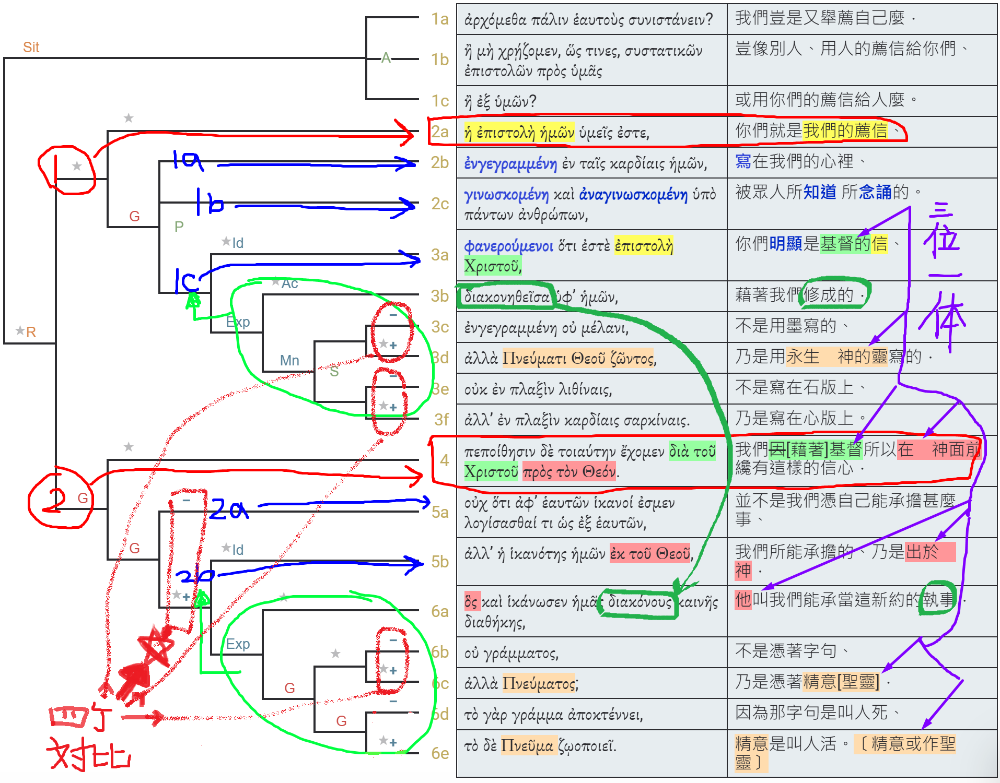

經文：哥林多後書 3:1-6   
題目：蒙福之人   
日期：2023-09-03   
教會：大直真理堂   

## 句法圖析 (Syntax Diagram)

- 3:1a (<RUBY><ruby><ruby><strong><strong>Ἀρχόμεθα</strong></strong><rt>ἄρχω</rt></ruby><rt>Are we beginning</rt></ruby><rt>V-PMI-1P</rt></RUBY>)P (<RUBY><ruby><ruby>πάλιν<rt>πάλιν</rt></ruby><rt>again</rt></ruby><rt>ADV</rt></RUBY>)A {(<RUBY><ruby><ruby>ἑαυτοὺς<rt>ἑαυτοῦ</rt></ruby><rt>ourselves</rt></ruby><rt>F-1APM</rt></RUBY>)c (<RUBY><ruby><ruby><em>συνιστάνειν <mark class="pm">;</mark></em><rt>συνίστημι, συνιστάω</rt></ruby><rt>to commend?</rt></ruby><rt>V-PAN</rt></RUBY>)p}C
- 3:1b <RUBY><ruby><ruby>ἢ<rt>ἤ</rt></ruby><rt>Or</rt></ruby><rt>CONJ</rt></RUBY> <RUBY><ruby><ruby>μὴ<rt>μή</rt></ruby><rt>not</rt></ruby><rt>PRT</rt></RUBY> (<RUBY><ruby><ruby><strong><strong>χρῄζομεν</strong></strong><rt>χρῄζω</rt></ruby><rt>we need</rt></ruby><rt>V-PAI-1P</rt></RUBY>)P (<RUBY><ruby><ruby>ὥς<rt>ὡς</rt></ruby><rt>like</rt></ruby><rt>CONJ</rt></RUBY> <RUBY><ruby><ruby>τινες<rt>τις</rt></ruby><rt>some</rt></ruby><rt>X-NPM</rt></RUBY>)A (<RUBY><ruby><ruby>συστατικῶν<rt>συστατικός</rt></ruby><rt>commendatory</rt></ruby><rt>A-GPF</rt></RUBY> <RUBY><ruby><ruby>ἐπιστολῶν<rt>ἐπιστολή</rt></ruby><rt>letters</rt></ruby><rt>N-GPF</rt></RUBY>)C (<RUBY><ruby><ruby>πρὸς<rt>πρός</rt></ruby><rt>to</rt></ruby><rt>PREP</rt></RUBY> <RUBY><ruby><ruby>ὑμᾶς<rt>σύ</rt></ruby><rt>you</rt></ruby><rt>P-2AP</rt></RUBY>)A
- 3:1c <RUBY><ruby><ruby>ἢ<rt>ἤ</rt></ruby><rt>or</rt></ruby><rt>CONJ</rt></RUBY> (<RUBY><ruby><ruby>ἐξ<rt>ἐκ</rt></ruby><rt>from</rt></ruby><rt>PREP</rt></RUBY> <RUBY><ruby><ruby>ὑμῶν <mark class="pm">;</mark><rt>σύ</rt></ruby><rt>you?</rt></ruby><rt>P-2GP</rt></RUBY>)A 
- ————————
- 3:2a (<RUBY><ruby><ruby>ἡ<rt>ὁ</rt></ruby><rt>The</rt></ruby><rt>T-NSF</rt></RUBY> <RUBY><ruby><ruby>ἐπιστολὴ<rt>ἐπιστολή</rt></ruby><rt>letter</rt></ruby><rt>N-NSF</rt></RUBY> <RUBY><ruby><ruby>ἡμῶν<rt>ἐγώ</rt></ruby><rt>of us</rt></ruby><rt>P-1GP</rt></RUBY>)C (<RUBY><ruby><ruby>ὑμεῖς<rt>σύ</rt></ruby><rt>you</rt></ruby><rt>P-2NP</rt></RUBY>)S (<RUBY><ruby><ruby><strong>ἐστε <mark class="pm">,</mark></strong><rt>εἰμί</rt></ruby><rt>are</rt></ruby><rt>V-PAI-2P</rt></RUBY>)P 
	- 3:2b {(<RUBY><ruby><ruby><em><em>ἐνγεγραμμένη</em></em><rt>ἐγγράφω</rt></ruby><rt>having been inscribed</rt></ruby><rt>V-RPP-NSF</rt></RUBY>)p (<RUBY><ruby><ruby>ἐν<rt>ἐν</rt></ruby><rt>in</rt></ruby><rt>PREP</rt></RUBY> <RUBY><ruby><ruby>ταῖς<rt>ὁ</rt></ruby><rt>the</rt></ruby><rt>T-DPF</rt></RUBY> <RUBY><ruby><ruby>καρδίαις<rt>καρδία</rt></ruby><rt>hearts</rt></ruby><rt>N-DPF</rt></RUBY> <RUBY><ruby><ruby>ἡμῶν <mark class="pm">,</mark><rt>ἐγώ</rt></ruby><rt>of us</rt></ruby><rt>P-1GP</rt></RUBY>)a}A°¹⮥
	- 3:2c {(<RUBY><ruby><ruby><em><em>γινωσκομένη</em></em><rt>γινώσκω</rt></ruby><rt>being known</rt></ruby><rt>V-PPP-NSF</rt></RUBY>)p <RUBY><ruby><ruby>καὶ<rt>καί</rt></ruby><rt>and</rt></ruby><rt>CONJ</rt></RUBY> (<RUBY><ruby><ruby><em><em>ἀναγινωσκομένη</em></em><rt>ἀναγινώσκω</rt></ruby><rt>being read</rt></ruby><rt>V-PPP-NSF</rt></RUBY>)p (<RUBY><ruby><ruby>ὑπὸ<rt>ὑπό</rt></ruby><rt>by</rt></ruby><rt>PREP</rt></RUBY> <RUBY><ruby><ruby>πάντων<rt>πᾶς</rt></ruby><rt>all</rt></ruby><rt>A-GPM</rt></RUBY> <RUBY><ruby><ruby>ἀνθρώπων <mark class="pm">,</mark><rt>ἄνθρωπος</rt></ruby><rt>men</rt></ruby><rt>N-GPM</rt></RUBY>)a}A°¹⮥ 
	- 3:3a (<RUBY><ruby><ruby><em><em>φανερούμενοι</em></em><rt>φανερόω</rt></ruby><rt>being revealed</rt></ruby><rt>V-PPP-NPM</rt></RUBY>)p
		- 3:3b <RUBY><ruby><ruby>ὅτι<rt>ὅτι</rt></ruby><rt>that</rt></ruby><rt>CONJ</rt></RUBY> (<RUBY><ruby><ruby><strong><strong>ἐστὲ</strong></strong><rt>εἰμί</rt></ruby><rt>you are</rt></ruby><rt>V-PAI-2P</rt></RUBY>)P (<mark><RUBY><ruby><ruby>ἐπιστολὴ<rt>ἐπιστολή</rt></ruby><rt>a letter</rt></ruby><rt>N-NSF</rt></RUBY>°²</mark> <RUBY><ruby><ruby>Χριστοῦ<rt>Χριστός</rt></ruby><rt>of Christ</rt></ruby><rt>N-GSM</rt></RUBY>)C 
			- 3:3c {(<RUBY><ruby><ruby><em><em>διακονηθεῖσα</em></em><rt>διακονέω</rt></ruby><rt>having been ministered to</rt></ruby><rt>V-APP-NSF</rt></RUBY>)p (<RUBY><ruby><ruby>ὑφ᾽<rt>ὑπό</rt></ruby><rt>by</rt></ruby><rt>PREP</rt></RUBY> <RUBY><ruby><ruby>ἡμῶν <mark class="pm">,</mark><rt>ἐγώ</rt></ruby><rt>us</rt></ruby><rt>P-1GP</rt></RUBY>)a}°²⮥
			- 3:3d {(<mark><RUBY><ruby><ruby><em><em>ἐνγεγραμμένη</em></em><rt>ἐγγράφω</rt></ruby><rt>having been inscribed</rt></ruby><rt>V-RPP-NSF</rt></RUBY>°³</mark>)p}°²⮥
				- {<RUBY><ruby><ruby>οὐ<rt>οὐ</rt></ruby><rt>not</rt></ruby><rt>PRT-N</rt></RUBY> (<RUBY><ruby><ruby>μέλανι<rt>μέλαν</rt></ruby><rt>in ink</rt></ruby><rt>N-DSN</rt></RUBY>) <RUBY><ruby><ruby>ἀλλὰ<rt>ἀλλά</rt></ruby><rt>but</rt></ruby><rt>CONJ</rt></RUBY> (<RUBY><ruby><ruby>Πνεύματι<rt>πνεῦμα</rt></ruby><rt>with [the] Spirit</rt></ruby><rt>N-DSN</rt></RUBY> <RUBY><ruby><ruby>Θεοῦ<rt>θεός</rt></ruby><rt>of God</rt></ruby><rt>N-GSM</rt></RUBY> <RUBY><ruby><ruby><em>ζῶντος <mark class="pm">,</mark></em><rt>ζάω</rt></ruby><rt>[the] living</rt></ruby><rt>V-PAP-GSM</rt></RUBY>)}a°³⮥
				- {<RUBY><ruby><ruby>οὐκ<rt>οὐ</rt></ruby><rt>not</rt></ruby><rt>PRT-N</rt></RUBY> (<RUBY><ruby><ruby>ἐν<rt>ἐν</rt></ruby><rt>on</rt></ruby><rt>PREP</rt></RUBY> <RUBY><ruby><ruby>πλαξὶν<rt>πλάξ</rt></ruby><rt>tablets</rt></ruby><rt>N-DPF</rt></RUBY> <RUBY><ruby><ruby>λιθίναις<rt>λίθινος</rt></ruby><rt>of stone</rt></ruby><rt>A-DPF</rt></RUBY>) <RUBY><ruby><ruby>ἀλλ᾽<rt>ἀλλά</rt></ruby><rt>but</rt></ruby><rt>CONJ</rt></RUBY> (<RUBY><ruby><ruby>ἐν<rt>ἐν</rt></ruby><rt>on</rt></ruby><rt>PREP</rt></RUBY> <RUBY><ruby><ruby>πλαξὶν<rt>πλάξ</rt></ruby><rt>tablets</rt></ruby><rt>N-DPF</rt></RUBY> <RUBY><ruby><ruby>καρδίαις<rt>καρδία</rt></ruby><rt>of hearts</rt></ruby><rt>N-DPF</rt></RUBY> <RUBY><ruby><ruby>σαρκίναις <mark class="pm">.</mark><rt>σάρκινος</rt></ruby><rt>human</rt></ruby><rt>A-DPF</rt></RUBY>)}a°³⮥
- ————————
- 3:4 (<RUBY><ruby><ruby>Πεποίθησιν<rt>πεποίθησις</rt></ruby><rt>Confidence</rt></ruby><rt>N-ASF</rt></RUBY>)⦇ <RUBY><ruby><ruby>δὲ<rt>δέ</rt></ruby><rt>now</rt></ruby><rt>CONJ</rt></RUBY> ⦈(<RUBY><ruby><ruby>τοιαύτην<rt>τοιοῦτος</rt></ruby><rt>such</rt></ruby><rt>D-ASF</rt></RUBY>)C (<RUBY><ruby><ruby><strong><strong>ἔχομεν</strong></strong><rt>ἔχω</rt></ruby><rt>we have</rt></ruby><rt>V-PAI-1P</rt></RUBY>)P (<RUBY><ruby><ruby>διὰ<rt>διά</rt></ruby><rt>through</rt></ruby><rt>PREP</rt></RUBY> <RUBY><ruby><ruby>τοῦ<rt>ὁ</rt></ruby><rt>-</rt></ruby><rt>T-GSM</rt></RUBY> <RUBY><ruby><ruby>Χριστοῦ<rt>Χριστός</rt></ruby><rt>Christ</rt></ruby><rt>N-GSM</rt></RUBY>)A (<RUBY><ruby><ruby>πρὸς<rt>πρός</rt></ruby><rt>toward</rt></ruby><rt>PREP</rt></RUBY> <RUBY><ruby><ruby>τὸν<rt>ὁ</rt></ruby><rt>-</rt></ruby><rt>T-ASM</rt></RUBY> <RUBY><ruby><ruby>Θεόν <mark class="pm">.</mark><rt>θεός</rt></ruby><rt>God</rt></ruby><rt>N-ASM</rt></RUBY>)A 
- 3:5a <RUBY><ruby><ruby>οὐχ<rt>οὐ</rt></ruby><rt>Not</rt></ruby><rt>PRT-N</rt></RUBY>
	- 3:5b <RUBY><ruby><ruby>ὅτι<rt>ὅτι</rt></ruby><rt>that</rt></ruby><rt>CONJ</rt></RUBY> (<RUBY><ruby><ruby>ἀφ᾽<rt>ἀπό</rt></ruby><rt>from</rt></ruby><rt>PREP</rt></RUBY> <RUBY><ruby><ruby>ἑαυτῶν<rt>ἑαυτοῦ</rt></ruby><rt>ourselves</rt></ruby><rt>F-1GPM</rt></RUBY>)A (<RUBY><ruby><ruby>ἱκανοί<rt>ἱκανός</rt></ruby><rt>sufficient</rt></ruby><rt>A-NPM</rt></RUBY>)C (<RUBY><ruby><ruby><strong><strong>ἐσμεν</strong></strong><rt>εἰμί</rt></ruby><rt>we are</rt></ruby><rt>V-PAI-1P</rt></RUBY>)P {(<RUBY><ruby><ruby><em>λογίσασθαί</em><rt>λογίζομαι</rt></ruby><rt>to reckon</rt></ruby><rt>V-AMN</rt></RUBY>)p (<RUBY><ruby><ruby>τι<rt>τις</rt></ruby><rt>anything</rt></ruby><rt>X-ASN</rt></RUBY>)c (<RUBY><ruby><ruby>ὡς<rt>ὡς</rt></ruby><rt>as</rt></ruby><rt>CONJ</rt></RUBY> <RUBY><ruby><ruby>ἐξ<rt>ἐκ</rt></ruby><rt>of</rt></ruby><rt>PREP</rt></RUBY> <RUBY><ruby><ruby>ἑαυτῶν <mark class="pm">,</mark><rt>ἑαυτοῦ</rt></ruby><rt>ourselves</rt></ruby><rt>F-1GPM</rt></RUBY>)a}‡C
- 3:5c <RUBY><ruby><ruby>ἀλλ᾽<rt>ἀλλά</rt></ruby><rt>but</rt></ruby><rt>CONJ</rt></RUBY> (<RUBY><ruby><ruby>ἡ<rt>ὁ</rt></ruby><rt>the</rt></ruby><rt>T-NSF</rt></RUBY> <RUBY><ruby><ruby>ἱκανότης<rt>ἱκανότης</rt></ruby><rt>sufficiency</rt></ruby><rt>N-NSF</rt></RUBY> <RUBY><ruby><ruby>ἡμῶν<rt>ἐγώ</rt></ruby><rt>of us</rt></ruby><rt>P-1GP</rt></RUBY>)S (<RUBY><ruby><ruby>ἐκ<rt>ἐκ</rt></ruby><rt>[is] of</rt></ruby><rt>PREP</rt></RUBY> <RUBY><ruby><ruby>τοῦ<rt>ὁ</rt></ruby><rt>-</rt></ruby><rt>T-GSM</rt></RUBY> <RUBY><ruby><ruby>Θεοῦ <mark class="pm">,</mark><rt>θεός</rt></ruby><rt>God</rt></ruby><rt>N-GSM</rt></RUBY>)A 
	- 3:6a (<RUBY><ruby><ruby>ὃς<rt>ὅς</rt></ruby><rt>who</rt></ruby><rt>R-NSM</rt></RUBY>)S (<RUBY><ruby><ruby>καὶ<rt>καί</rt></ruby><rt>also</rt></ruby><rt>CONJ</rt></RUBY>)A (<RUBY><ruby><ruby><strong><strong>ἱκάνωσεν</strong></strong><rt>ἱκανόω</rt></ruby><rt>has made competent</rt></ruby><rt>V-AAI-3S</rt></RUBY>)P (<RUBY><ruby><ruby>ἡμᾶς<rt>ἐγώ</rt></ruby><rt>us [as]</rt></ruby><rt>P-1AP</rt></RUBY>)C (<RUBY><ruby><ruby>διακόνους<rt>διάκονος</rt></ruby><rt>ministers</rt></ruby><rt>N-APM</rt></RUBY> ‹<RUBY><ruby><ruby>καινῆς<rt>καινός</rt></ruby><rt>of a new</rt></ruby><rt>A-GSF</rt></RUBY> <RUBY><ruby><ruby>διαθήκης <mark class="pm">,</mark><rt>διαθήκη</rt></ruby><rt>covenant</rt></ruby><rt>N-GSF</rt></RUBY>›)+C 
	- 3:6b ——<RUBY><ruby><ruby>οὐ<rt>οὐ</rt></ruby><rt>not</rt></ruby><rt>PRT-N</rt></RUBY> <RUBY><ruby><ruby>γράμματος<rt>γράμμα</rt></ruby><rt>of [the] letter</rt></ruby><rt>N-GSN</rt></RUBY> 
	- 3:6c <RUBY><ruby><ruby>ἀλλὰ<rt>ἀλλά</rt></ruby><rt>but</rt></ruby><rt>CONJ</rt></RUBY> <RUBY><ruby><ruby>πνεύματος <mark class="pm">·</mark><rt>πνεῦμα</rt></ruby><rt>of [the] Spirit</rt></ruby><rt>N-GSN</rt></RUBY>
	- 3:6d (<RUBY><ruby><ruby>τὸ<rt>ὁ</rt></ruby><rt>the</rt></ruby><rt>T-NSN</rt></RUBY>)⦇ <RUBY><ruby><ruby>γὰρ<rt>γάρ</rt></ruby><rt>for</rt></ruby><rt>CONJ</rt></RUBY> ⦈(<RUBY><ruby><ruby>γράμμα<rt>γράμμα</rt></ruby><rt>letter</rt></ruby><rt>N-NSN</rt></RUBY>)S (<RUBY><ruby><ruby><strong>ἀποκτέννει <mark class="pm">,</mark></strong><rt>ἀποκτείνω</rt></ruby><rt>kills</rt></ruby><rt>V-PAI-3S</rt></RUBY>)P
	- 3:6e (<RUBY><ruby><ruby>τὸ<rt>ὁ</rt></ruby><rt>-</rt></ruby><rt>T-NSN</rt></RUBY>)⦇ <RUBY><ruby><ruby>δὲ<rt>δέ</rt></ruby><rt>but</rt></ruby><rt>CONJ</rt></RUBY> ⦈(<RUBY><ruby><ruby>πνεῦμα<rt>πνεῦμα</rt></ruby><rt>the Spirit</rt></ruby><rt>N-NSN</rt></RUBY>)S (<RUBY><ruby><ruby><strong>ζωοποιεῖ <mark class="pm">.</mark></strong><rt>ζωοποιέω</rt></ruby><rt>gives life</rt></ruby><rt>V-PAI-3S</rt></RUBY>)P

️

## 語意圖析 (Semantic Diagram)

## 解經 (Exegesis)
💡😀😢❓❌⭕❗🎀🎗
- 對比：
	- (1) 媒介
		- (人的) 墨水 ⇐ 人所寫的推薦信 (林後2:17)
			- 林後2:17 我們不像那*許多人*，*為利*混亂上帝的道*；
			- 林後10:12 因為我們不敢將自己和*那自薦的人*同列相比。他們用自己度量自己，用自己比較自己，乃是不通達的。 
			- 林後11:12 我現在所做的，後來還要做，為要斷絕*那些尋機會人*的機會，使他們在所誇的事上也不過與我們一樣。 
			- 林後11:22 他們是*希伯來人*嗎？我也是。他們是*以色列人*嗎？我也是。他們是*亞伯拉罕的後裔*嗎？我也是。 
			- 林後11:5 但我想，我一點不在*那些最大的使徒*以下。 
			- 林後12:11-13 我雖算不了甚麼，卻沒有一件事在*那些最大的使徒*以下。... 除了我不累着你們這一件事，你們還有甚麼事不及別的教會呢？
		- 永生神的靈
			- 結36:26-27 我也要賜給你們一個新心，將新靈放在你們裡面，又從你們的肉體中除掉石心，賜給你們肉心。 我必將我的靈放在你們裡面，使你們順從我的律例，謹守遵行我的典章。 
	- (2) 空間
		- 石版
			- 出31:18 耶和華在西乃山和摩西說完了話，就把兩塊法版交給他，是　神用指頭寫的石版。 
			- 申5:22 這些話是耶和華在山上，從火中、雲中、幽暗中，大聲曉諭你們全會眾的；此外並沒有添別的話。他就把這話寫在兩塊石版上，交給我了。 
		- 心版
			- 耶31:31-34 耶和華說：日子將到，我要與以色列家和猶大家**另立新約**， 不像我拉著他們祖宗的手，領他們出埃及地的時候，與他們所立的約。我雖作他們的丈夫，他們卻背了我的約。這是耶和華說的。 耶和華說：那些日子以後，我與以色列家所立的約乃是這樣：我要將我的律法放在他們裡面，**寫在他們心上**。我要作他們的　神，他們要作我的子民。 他們各人不再教導自己的鄰舍和自己的弟兄說：你該認識耶和華，因為他們從最小的到至大的都必認識我。我要赦免他們的罪孽，不再紀念他們的罪惡。這是耶和華說的。 
	- (3) 盟約
		- 「字句 γράμμα 的執事」(3:6b)
		- 『新盟約的執事』(3:6a)、『聖靈 πνεῦμα 的執事』(3:6c)

## 解經大綱 (Exegetical Outline)
️
- (1) 傳道人不用寫履歷——因為信徒就是傳道人的履歷 (3:1-3)
	- (1a) 是時時擺在心裡的信 ⇐ 父母心腸
	- (1b) 是大家都看得見的信 ⇐ 透過每一天的言談舉止
	- (1c) 是耶穌基督所寫的信
		- 用永生神的靈 vs. 用墨水
		- 寫在心版上 vs. 石版上
- (2) 如此篤信的由來——因為傳道乃是三一神的工作 (3:4-6)
	- (2a) 不是憑靠傳道人自己
	- (2b) 而是憑靠三一真神
		- 新盟約&聖靈的職事 vs. 字句的職事
		- 叫人活的職事 vs. 叫人死的職事

## 講道大綱 (Homiletical Outline)

- (0) 開場
- (1) 
## 小抄 (memo)

---

[講道筆記↵](README.md)

