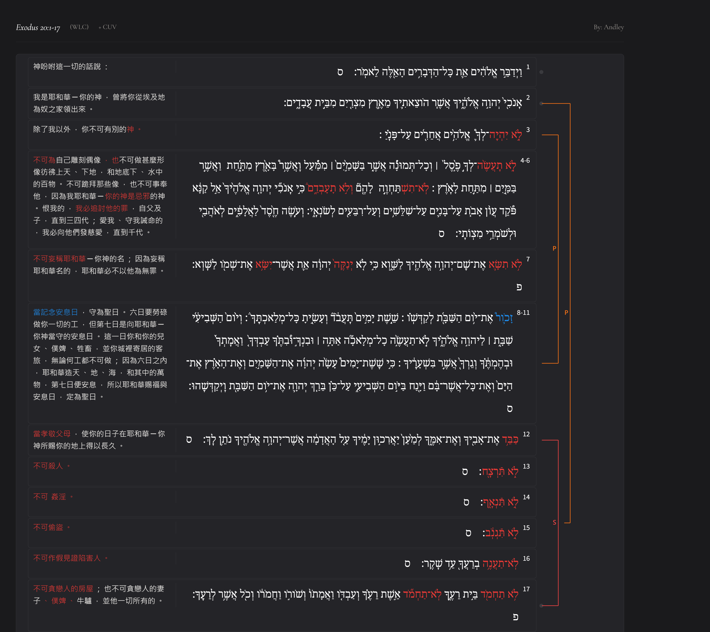

經文：出埃及記 20:1-17   
題目：活出上帝的愛   
日期：2026-08-15   
教會：台中活水浸信會   

## 解經 (Exegesis)
- 1 上帝吩咐這一切的話說： 
	- 2 「我是耶和華-你的上帝，曾將你從埃及地為奴之家領出來。 
	- 3 「除了我以外，你**不可有**別的神。 
	- 4 「**不可為自己雕刻**偶像，也不可做什麼形像彷彿上天、下地，和地底下、水中的百物。 5 **不可跪拜**那些像，也**不可事奉**它，因為我耶和華-你的上帝是忌邪的上帝。恨我的，我必追討他的罪，自父及子，直到三四代； 6 愛我、守我誡命的，我必向他們發慈愛，直到千代。 
	- 7 「**不可妄稱**耶和華-你上帝的名；因為妄稱耶和華名的，耶和華必不以他為無罪。 
	- 8 「*當記念*安息日，守為聖日。 9 六日要勞碌做你一切的工， 10 但第七日是向耶和華-你上帝當守的安息日。這一日你和你的兒女、僕婢、牲畜，並你城裏寄居的客旅，無論何工都不可做； 11 因為六日之內，耶和華造天、地、海，和其中的萬物，第七日便安息，所以耶和華賜福與安息日，定為聖日。 
	- 12 「**當孝敬**父母，使你的日子在耶和華-你上帝所賜你的地上得以長久。
	-  13 「**不可殺人**。 
	- 14 「**不可姦淫**。 
	- 15 「**不可偷盜**。  
	- 16 「**不可作假見證**陷害人。 
	- 17 「**不可貪戀**人的房屋；也**不可貪戀**人的妻子、僕婢、牛驢，並他一切所有的。」 

## 語意圖析 (Semantic Diagram)

## 大綱 (Outline)
- 十誡，應該是：十句話
	- 出34:28 摩西在耶和華那裡四十晝夜，也不吃飯也不喝水。耶和華將這約的話，就是十條誡 (‎עֲשֶׂ֖רֶת הַדְּבָרִֽים 十句話；LXX：τοὺς δέκα λόγους)，寫在兩塊版上。 
	- 申4:13 他將所吩咐你們當守的約指示你們，就是十條誡 (‎עֲשֶׂ֖רֶת הַדְּבָרִ֑ים 十句話；LXX：τὰ δέκα ῥήματα)，並將這誡寫在兩塊石版上。 
	- 申10:4 耶和華將那大會之日、在山上從火中所傳與你們的十條誡 (‎עֲשֶׂ֣רֶת הַדְּבָרִ֔ים 十句話；LXX：τοὺς δέκα λόγους)，照先前所寫的，寫在這版上，將版交給我了。 

- 不是誡命——就算打勾了也不夠
	- 太19:16-22 16 有一個人來見耶穌，說：「夫子1 ，我該**做什麼善事**才能**得永生**？」 17 耶穌對他說：「你為什麼以善事問我呢？只有一位是善的2 。你若要進入永生，就當遵守誡命。」 18 他說：「什麼誡命？」耶穌說：「就是不可殺人；不可姦淫；不可偷盜；不可作假見證； 19 當孝敬父母；又當愛人如己。」 20 那少年人說：「這一切我都遵守了，還缺少什麼呢？」 21 耶穌說：「你若願意作完全人，可去變賣你所有的，分給窮人，就必有財寶在天上；你還要來跟從我。」 22 那少年人聽見這話，就憂憂愁愁地走了，因為他的產業很多。
## 小抄 (memo)

---

以下濃縮為約 500 字：

十誡的順序具有明顯的神學結構。雖然聖經沒有直接替十誡編號，不同猶太及基督教傳統的分法也略有差異，但出埃及記 20:1–17 的原始排列呈現「先神、後人」的基本次序。

首先，十誡以「我是耶和華你的神，曾將你從埃及地為奴之家領出來」（出 20:2）開始，然後才提出誡命。因此，十誡不是「靠遵守誡命而得救」，而是「神先施行救贖，蒙救贖的百姓因此活出盟約生活」。第一至第四誡集中於與神的關係：不可有別的神、不可製造偶像、不可妄稱神的名、當守安息日。其核心是：敬拜誰、如何敬拜，以及如何以時間承認神的主權。

第五誡「當孝敬父母」位於前四誡與後五誡之間，具有轉折作用。它從對神的忠誠轉向人際與社群秩序。第六至第九誡依序保護人的生命、婚姻、財產與真實／名譽：「不可殺人、不可姦淫、不可偷盜、不可作假見證」。

最後，第十誡「不可貪戀」（לֹא תַחְמֹד，出 20:17）從外在行為深入人的內心。前面的誡命主要禁止外在行動，第十誡則直接處理欲望，顯示神所要求的不只是外在守法，而是內在的聖潔。

因此，十誡可以概括為：

**神的救贖 → 忠於神 → 正確對待人 → 聖潔的內心。**

這也成為新約「愛神、愛鄰舍」總結律法的重要背景（太 22:37–40；羅 13:8–10）。

---

十誡（*Aseret ha-Dibrot*；出 20:1–17 [BHS]；申 5:6–21 [BHS]）的順序展現出嚴密的邏輯與神學階層編排。

## 1. 兩大範疇的垂直與水平結構

① **學界共識（Broad consensus）**
十誡從「對神（神聖義務）」延伸至「對人（社會倫理）」。第一至四誡確立人對上帝的垂直關係，奠定律法基礎；第五至十誡轉向人際水平關係。對人的倫理規範，乃建立於對上帝的敬畏之上。

## 2. 前四誡（神聖誡命）的遞進順序

① **學界共識（Broad consensus）**
前四誡按敬拜核心逐步展開：

* **第一誡**：對象（Who）—確立獨一真神（לֹא יִהְיֶה־לְךָ אֱלֹהִים אֲחֵרִים）。
* **第二誡**：方式（How）—禁止以偶像敬拜（לֹא־תַעֲשֶׂה לְךָ פֶסֶל）。
* **第三誡**：言語（Language）—尊崇上帝的名（לֹא תִשָּׂא אֶת־שֵׁם־יְהוָה）。
* **第四誡**：時間（Time）—劃分聖與俗的時間（זָכוֹר אֶת־יוֹם הַשַּׁבָּת）。

## 3. 人際誡命的降序階層與內心延伸

【學界爭議中：主要立場見下方】

* **立場 A：從核心權利降至內心動機（多數學者立場，Majority view）**
1. **第五誡（孝敬父母）**：神聖權威在人間的延伸，社會秩序之樞紐。
2. **第六誡（不可殺人，לֹא תִּרְצָח）**：保護生命權（不可逆的傷害）。
3. **第七誡（不可奸淫）**：保護婚姻與家庭制度。
4. **第八誡（不可偷竊）**：保護個人財產與生存資源。
5. **第九誡（不可作假見證）**：維護法治與社會誠信。
6. **第十誡（不可貪婪，לֹא תַחְמֹד）**：由外在行動深入至罪惡根源——內心慾望。

* **立場 B：古代近東宗主條約對應（少數但有據立場，Minority but documented view）**：前四誡為條約前言與敬拜規範，第五誡為尊崇代理人，第六至十誡為盟約成員民事條款。

*(出處：出 20:1–17；Childs, *Exodus*, 1974, pp. 385–439; Miller, *Deuteronomy*, 1990, pp. 65–98)*

---

# 十誡順序的神學意涵(500字內)

**整體結構**(學界共識):十誡分兩塊法版——第1-4誡規範對神的義務(垂直),第5-10誡規範對人的義務(水平),呼應近東宗主條約形式。序言(出20:2)先宣告救贖恩典,後頒律法,即「恩典先於命令」。太22:37-40將此總結為「愛神」與「愛人如己」。

**編號差異**(宗派傳統不同,非對錯之爭):
- 猶太傳統:出20:2本身即第一誡
- 天主教/路德宗:合「無別神」與「禁偶像」為一,第十誡拆分為二
- 改革宗/東正教:「無別神」「禁偶像」分列一、二誡,貪心合為一

**第五誡歸屬**(【學界爭議中】):
①多數改革宗(如加爾文,《韋斯敏斯德大要理問答》Q.99)歸入第一塊法版,因父母權柄乃神權柄之延伸;
②多數天主教編號歸入第二塊法版。此誡具「過渡」功能,以「權柄」連接兩塊法版。

**六至十誡遞進**(多數學者立場):殺人→姦淫→偷盜→假見證→貪心,呈現「行為外顯→內心動機」遞減軌跡。貪心(חָמַד)作結,標誌律法觸及內心,保羅於羅7:7據此論律法揭罪之功能(學界共識)。

**神學意涵小結**:
1. 救贖恩典優先於律法命令;
2. 愛神為愛人之根基;
3. 外在行為漸入內心意念,預示太5:21-30登山寶訓之深化。

如需進一步分析特定誡命之希伯來文法(如לֹא否定詞用法)或出20章與申5章文本差異(安息日理由:創造 vs. 出埃及),可繼續深入。

---

[講道筆記↵](README.md)

