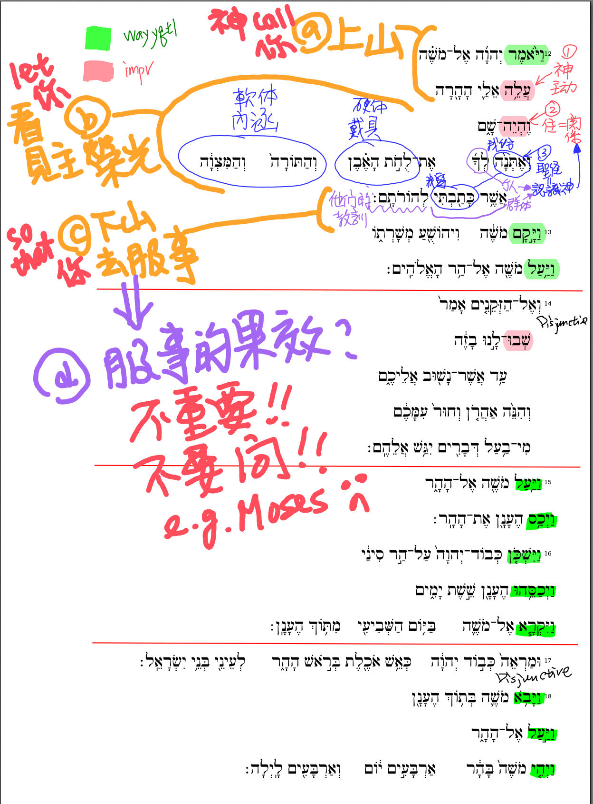

經文：   出埃及記 24:12-18  
題目：   看見主榮光 (一)  
日期：   2023-02-19  
教會：   台北衛理堂  

經課一：出埃及記24:12-18  
啟應文：詩篇2篇  
經課二：彼得後書1:16-21  
福音書：馬太福音17:1-9  

## 圖析 (Syntax Diagram)

## 解經 (Exegesis)

- 經課集，不是要取代聖經，而是為了幫助你讀聖經！
- 上山，才能看見主榮光——但不是要你永遠停留在山上 ⇒ 上山，是為了下山！！
- 上山，看見主榮光 ⇒ 為了下山，讓人看見主榮光
	- Moses : 榮光漸漸褪去
	- Jesus : 永恆的榮光
- Moses 上山兩次，第一次，失敗；第二次，失敗
- Jesus 上山一次，第二次？ 第三次降臨
	- 土耳其地震，救出一人，喊真主偉大——每個宗教都要解釋苦難？哪裡偉大，要漫威電影的超級英雄才偉大😢
	- 基督教，是惟一把應許，白紙黑字寫下來的
	- 是唯一上帝來到人這裡 vs. 人努力去到上帝那裏 (永遠沒有確據——星雲來生要當和尚，不是因為當和尚好，而是因為他知道自己還沒能成佛！靠自己，永遠也做不到！！
	- 但福音，卻是上帝為我們ˊ成就了！！不是靠自己，所以是好消息！！
- #1) 上山——自己看見主榮光
- #2) 下山——讓人看見主榮光
- #3) 永存的榮光
- 台北衛理堂，是在動亂中誕生的教會，是因著主榮光而成立的教會
- ═════════════
- 出 24:12 是整段的總綱：
	- 耶和華對摩西說：「你上山到我這裏來，住在這裏，我要將石版並我所寫的律法和誡命賜給你，使你可以教訓百姓。」
- (1) **神主動的呼召，人甘心的回應**
	- 從創世記就是神主動！
		- 不是亞伯拉罕主動、不是摩西主動、不是彼得主動、不是保羅主動！
		- 不是你、不是我
	- 但摩西可以 say NO 😢 ... 
		- 就像我們一樣，都曾經對上帝的呼召 say NO 😢
		- 太忙、太累、其他人比較重要、其他事比較優先
- (2) **神要讓你看見榮光，好叫你認識神、享受神 (以神為樂)**
	- 聖經上的認識 = 親密的關係，不僅只是理性、知識
	- *神要你上山*：看重關係＞合約
		- 不然，約都已經簽了 (出24:1-8)，慶功宴都已經吃了 (出24:9-11)，接下來就是 NIKE (just do it)，違約就罰——何必還要再上山、住四十天、搞那麼複雜？？
	- *神要你同住*：要你認識神＞遵守規條
		- 與神同住 40 + 6(7) 天，不是只為了像立法院朗讀 613 條！
		- 不是規條不重要，也不是不需要遵守規條，而是不要你：
			- 律法主義：e.g. 浪子比喻裡面的大兒子 ⇐ 規條都守了，但卻不懂父親的心 😢
			- 放縱主義：把「神就是愛」錯解成「愛就是神」、只要我喜歡，有什麼不可以 😢
		- 真認識神、真合神心意的人，就會像大衛那樣，知道：憂傷痛悔的心靈❗
			- 詩 51:17 神所要的祭就是憂傷的靈；神啊，憂傷痛悔的心，你必不輕看。
	- *神要給你聖經*：
		- 神親自寫下 (親口吹氣 = 默示)，白紙黑字
		- 認識神的 BEING：慈愛、聖潔、公義、恩惠、憐憫
		- 認識神的 DOING：創造、拯救、審判、能力
		- 認識神的心意、旨意、計畫
	- *神要你享受祂*：40+6(7) 天，完全沉浸在主榮光中！！
- (3) 

	- 
- ═════════════
- 為三種人禱告：
	- a) 從來沒看過主榮光 (不管是不是基督徒)——但你今天渴望看見、想要得著的人 ⇒
		- 太 5:6 飢渴慕義的人有福了！ 因為他們必得飽足。 
		- 太 7:8 因為凡祈求的，就得着；尋找的，就尋見；叩門的，就給他開門。 
		- 太 21:22 你們禱告，無論求甚麼，只要信，就必得着。」
		- 可 11:24 只要信是得着的，就必得着。
	- b) 看見過主榮光，但被生活的重擔、世上的思慮、眼目的情慾、今生的光鮮亮麗、掌聲 ... 讓神的道被擠住了、沒能結出 30x/60x/100x 果子來的人——你知道上帝在等你回應呼召的基督徒
	- c) 

## 大綱 (Outline)

- 題目：看見主榮光(一)
- 經文：出24:12-18
- (1) 神主動的呼召，人甘心的回應
- (2) 神要讓你看見榮光，好叫你認識神、享受神
	- (2a)  神要你上山：關係＞合約
	- (2b) 神要你同住：關係＞守規條
	- (2c) 神要給你聖經：認識神 ⇒ 關係
	- (2d) 神要你享受祂：40+6(7) 天，完全沉浸在主榮光中！！
- (3) 神要你去服事
- 為三種人禱告！
	- (a) 還沒有上山的人
	- (b) 上了山，卻沒有與神同住的人
	- (c) 還沒有下山的人

## 小抄 (memo)

## 手稿 (Manuscript) 

---

[講道筆記↵](README.md)

