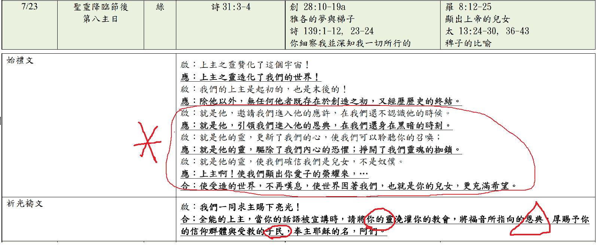

經文：創世記28:10-19a  
題目：榮耀的盼望 (一)   
日期：2023-07-23   
教會：台北衛理堂   

## 句法 (Syntax)

Gen 28:10 <RUBY><ruby><ruby>וַיֵּצֵ֥א<rt>יָצָא</rt></ruby><rt>and went out</rt></ruby><rt>C∙V-Qal-wayyqtl-3ms</rt></RUBY> <RUBY><ruby><ruby>יַעֲקֹ֖ב<rt>יַעֲקֹב</rt></ruby><rt>Jacob</rt></ruby><rt>N-proper-ms</rt></RUBY> <RUBY><ruby><ruby>מִבְּאֵ֣ר<rt>בְּאֵר שֶׁבַע</rt></ruby><rt>from</rt></ruby><rt>Prep</rt></RUBY> <RUBY><ruby><ruby>שָׁ֑בַע<rt>בְּאֵר שֶׁבַע</rt></ruby><rt>Beersheba,</rt></ruby><rt>Prep∙N-proper-fs</rt></RUBY> <RUBY><ruby><ruby>וַיֵּ֖לֶךְ<rt>הָלַךְ</rt></ruby><rt>and went</rt></ruby><rt>C∙V-Qal-wayyqtl-3ms</rt></RUBY> <RUBY><ruby><ruby>חָרָֽנָה׃<rt>חָרָן</rt></ruby><rt>toward Haran.</rt></ruby><rt>N-proper-fs∙3fs</rt></RUBY> 

## 解經 (Exegesis)
💡😀😢❓❌⭕❗🎀🎗️✳️

## 大綱 (Outline)
💡😀😢❓❌⭕❗🎀🎗️✳️

## 小抄 (memo)

---

[講道筆記↵](README.md)

