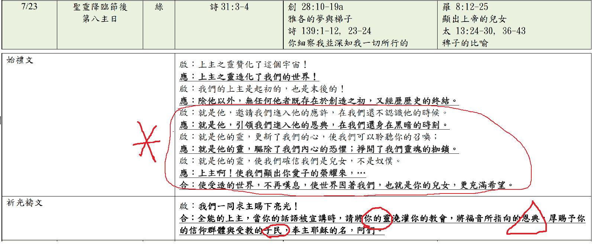
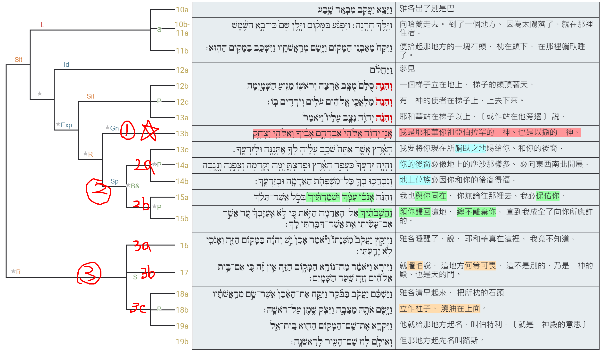
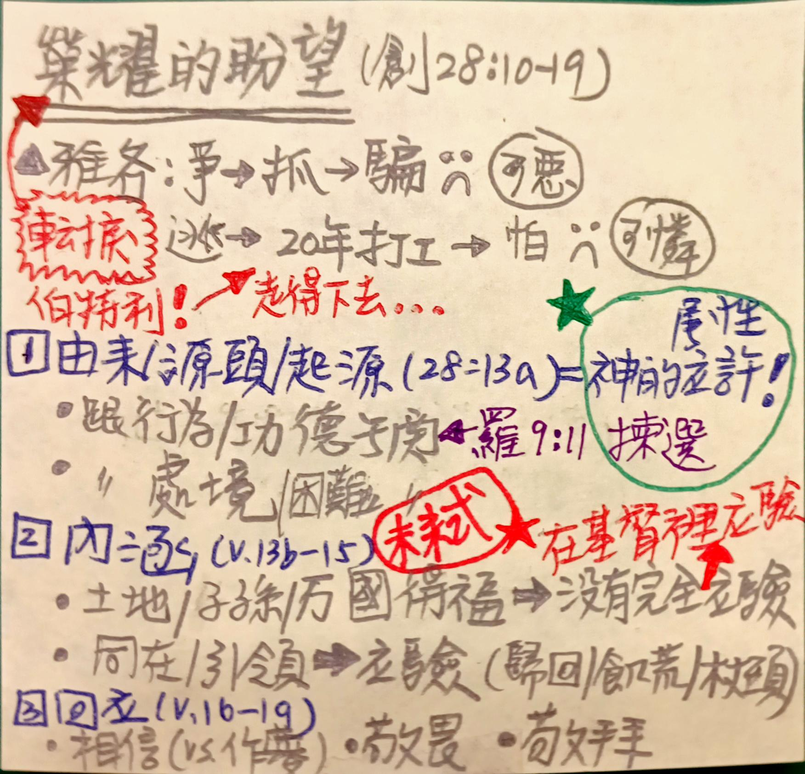

經文：創世記28:10-19a  
題目：榮耀的盼望 (一)   
日期：2023-07-23   
教會：台北衛理堂   

## 語意結構圖析 (Semantic Structure Diagram)

️
## 大綱 (Outline)

- (0) 開場
	- 雅各一生的轉捩點：遇見神！
		- 羅9:11 雙子還沒有生下來，善惡還沒有做出來，只因要顯明神**揀選**人的旨意，不在乎人的行為，乃在乎召人的主。
		- 二少爺 ⇒ *28:10-19 伯特利* ⇒ 二十年的廉價勞工！⇒ *32:22-31 毗努伊勒*
- (1) 榮耀的盼望——來源 SOURCE (28:13a)
	- 單單從神的應許而來 ⇐ 神的屬性 (‎אֲנִ֣י יְהוָ֗ה אֱלֹהֵי֙ אַבְרָהָ֣ם אָבִ֔יךָ וֵאלֹהֵ֖י יִצְחָ֑ק)
	- 不在乎人的行為、功德)\
		- 雅各欺騙 (固然以掃輕看長子名份不對，但顯然雅各垂涎已久、早有預謀)
		- 羅9:11 雙子還沒有生下來，善惡還沒有做出來，只因要顯明神**揀選**人的旨意，不在乎人的行為，乃在乎召人的主。
	- 不在乎人的處境、困難
		- 落荒而逃，前途茫茫 ... (20年廉價勞工 31:38-41)
- (2) 榮耀的盼望——內涵 WHAT (28:13b-15)
	- (2a) 產業：土地 & 後裔 & 萬族得福
	- (2b) 永遠的同在 & 帶領
		- 雅各扶着杖頭敬拜神 (創47:31)
		- 雅各把腳收在床上斷了氣 (創49:33)
	- (2c) 已然 & 未然 (already and note-yet)！
		- 沒應驗在雅各身上 → 沒完全應驗在以色列民族歷史上 ⇒ 全都應驗在耶穌基督身上！
- (3) 榮耀的盼望——回應 HOW (28:16-19a)
	- (3a) 相信：不是以為自己在作夢！
	- (3b) 敬畏：對神的話、對神所在的地方、對神！
	- (3c) 敬拜：實際的行動

## 小抄 (memo)

---

[講道筆記↵](README.md)

