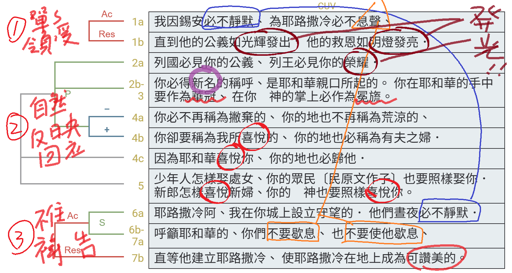

經文：以賽亞書62:1-7   
題目：興起發光 (一)   
日期：2025-01-19   
教會：台北衛理堂   

## 解經 (Exegesis)

- ⋯⋯⋯⋯⋯⋯⋯
- ‎Isaiah 62:1
- לְמַעַן צִיּוֹן לֹא אֶחֱשֶׁה 我因錫安必不靜默
- וּלְמַעַן יְרוּשָׁלִַם לֹא אֶשְׁקוֹט 為耶路撒冷必不息聲
	- עַד־יֵצֵא כַנֹּגַהּ צִדְקָהּ 直到<strong>她的</strong>公義如光輝發出
	- וִישׁוּעָתָהּ כְּלַפִּיד יִבְעָר׃ <strong>她的</strong>的救恩如火炬發亮
- Διὰ Σιων οὐ σιωπήσομαι 我因錫安必不靜默
- καὶ διὰ Ιερουσαλημ οὐκ ἀνήσω, 為耶路撒冷我必不撇棄 (鬆手)
	- ἕως ἂν ἐξέλθῃ ὡς φῶς ἡ δικαιοσύνη <strong>μου</strong>, 直到**我的**公義如光輝發出
	- τὸ δὲ σωτήριόν <strong>μου</strong> ὡς λαμπὰς καυθήσεται. **我的**的救恩如火炬發亮
- ⋯⋯⋯⋯⋯⋯⋯
- Isa 62:2
- וְרָאוּ גוֹיִם צִדְקֵךְ 列國必見你的公義
- וְכָל־מְלָכִים כְּבוֹדֵךְ וְקֹרָא 列王必見你的榮耀
- לָךְ שֵׁם חָדָשׁ 你必得新名的稱呼
	- אֲשֶׁר פִּי יְהוָה יִקֳּבֶנּוּ׃ 是耶和華親口所起的
- καὶ ὄψονται ἔθνη τὴν δικαιοσύνην σου 列國必見你的公義
- καὶ βασιλεῖς τὴν δόξαν σου, 列王必見你的榮耀
- καὶ καλέσει σε τὸ ὄνομά σου τὸ καινόν, 他(們)要稱呼你新名
	- ὃ ὁ κύριος ὀνομάσει αὐτό. 是耶和華所起的
- ⋯⋯⋯⋯⋯⋯⋯

## 語意圖析 (Semantic Diagram)

## 大綱 (Outline)

- (0) 開場：
	- 賽62:1-7 是一整段，分成三小段：
		- (a) 我的熱心 & 決心 (v.1)
		- (b) 你的榮光 & 稱讚 (vv. 2-5)
			- 你 = 錫安、耶路撒冷；列國列王 = 旁觀者、吃瓜群眾
		- (c) 守望者們 (pl.) 呼籲，直到 (b) 成就
	- 是好消息，所以題目：興起發光────但，有兩個問題：
		- (a)『我』是誰？
			- 上文：賽61:10 我因耶和華大大歡喜；我的心靠神快樂。因他以拯救為衣給我穿上，以公義為袍給我披上 ⇒ 可見：『我』≠ 耶和華
			- 下文：賽62:6-7 呼籲耶和華、不要使他歇息 ⇒ 可見：『我』≠ 耶和華
			- 看整段 (賽60-62：未來的救恩)
				- 賽60:1 → 59:20 → 60:2-3 → 61:1-3 (耶穌出道引用) → 62:1-5
			- 📌『我』= 彌賽亞 (救贖主) = 耶穌基督！
		- (b)『錫安』是？
			- 賽59:20 『錫安』=『轉離過犯的人』→ 所以：賽59:21 我加給你的靈、傳給你的話，必不離你的口
			- 📌『錫安』=認罪悔改的人 = 你&我！
		- 🎯興起發光的『<strong>本質</strong>』：
			- 是「救贖主」的光，不是「錫安」的光
			- 是耶和華的光，不是人的光
			- 是耶穌基督的光，不是教會、你我基督徒、認罪悔改、蒙恩罪人的光
				- 詩36:9 在你那裡有「生命的源頭」；在「你的光」中，我們必「得見光」。
			- 是因著耶穌的光來到我們中間、降臨在我們身上，從而反射出來的光！
				- 出34:29 (摩西) 自己的面皮因耶和華和他說話就發了光
- ──────────────
- 🎯興起發光的『<strong>要領</strong>』：
- (1) <mark>單單地領受</mark> (v.1)
	- 放輕鬆，不是你的努力，而是耶穌基督的熱心、決心、旨意、命定！
		- 耶穌大老遠從天降下、道成肉身、受苦受死，絕對不會白來一趟、白忙一場！
		- 耶穌比你比我要更加迫切！
	- 要願意，要敞開，讓耶穌的光照進來！
		- 🚩每天起床，耶穌早安，歡迎你的光進來
		- 🚩每天睡覺，耶穌晚安，歡迎你的光進來，
		- 🚩騎車、考試、開會、電話、股票、吃飯、工作、家務 ... 甚至看韓劇
	- 燈泡，要插電才會亮！
- (2) <mark>自然地反映、回應</mark> (vv.2-5)
	- 「刻意的」信仰不能長久😢... 早晚被揭穿😢
	- 不是自己吆喝別人來看，是別人「必然」看見 ... (v.2a)
	- 是由外而內，名稱 & 身分先改變──新名的稱呼 (v.2b)
		- 亞伯蘭 → 亞伯拉罕；撒萊 → 撒拉；雅各 → 以色列
		- 是神單方面、主動的作為 (2b)──你只要接受、願意在神手中 (v.3)
	- 是由內而外，本質的改變，自然地 顯露
		- 🚩每天宣讀、宣告、領受上帝的話語
		- 🚩每天氣色真好，喜上眉梢──你有男朋友啦？
	- 燈泡，在耶穌手中，插了電就一定會亮！
- (2) <mark>不住地禱告</mark> (vv.6-7)
	- 是耶穌基督的呼召、設立 (v.6a)
	- 所求於管家的，是要他有忠心──不看環境，

	- 
## 小抄 (memo)

😀😢🤔😮❓❌⭕❗🎀🎗️✳

---

[講道筆記↵](README.md)

