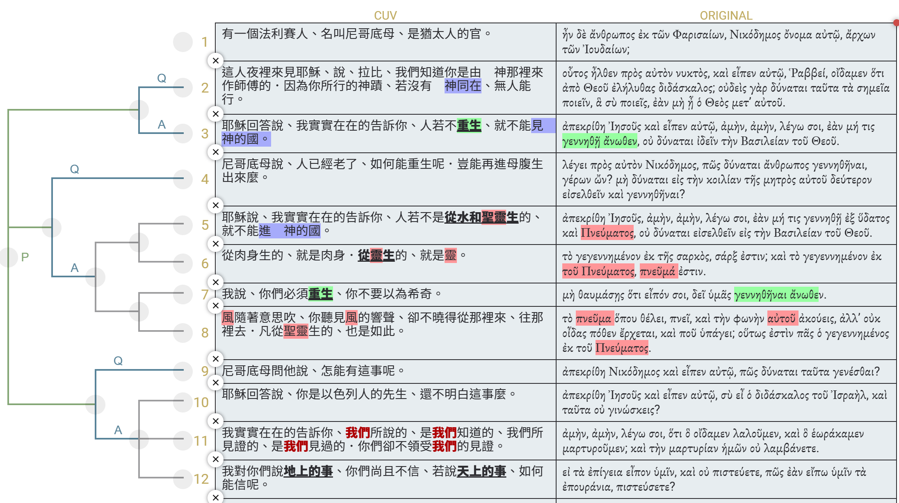

經文：約翰福音3:1-12   
題目：重生？！   
日期：2024-10-27   
教會：傳道會復生教會   

## 句法圖析 (Syntax Diagram)

- 3:1a (<RUBY><ruby><ruby><mark class='verb'>Ἦν<rt>εἰμί</rt></ruby><rt>是/在/有</rt></ruby><rt>V-IAI-3S</rt></RUBY>)P <RUBY><ruby><ruby>δὲ<rt>δέ</rt></ruby><rt>-</rt></ruby><rt>CONJ</rt></RUBY> (<RUBY><ruby><ruby>ἄνθρωπος<rt>ἄνθρωπος</rt></ruby><rt>人</rt></ruby><rt>N-NSM</rt></RUBY>)C (<RUBY><ruby><ruby>ἐκ<rt>ἐκ</rt></ruby><rt>中</rt></ruby><rt>PREP</rt></RUBY> <RUBY><ruby><ruby>τῶν<rt>ὀ</rt></ruby><rt>-</rt></ruby><rt>T-GPM</rt></RUBY> <RUBY><ruby><ruby>Φαρισαίων<rt>Φαρισαῖος</rt></ruby><rt>法利賽</rt></ruby><rt>N-GPM</rt></RUBY>)A <mark class='punctuation'>, 
- 3:1b (<RUBY><ruby><ruby>Νικόδημος<rt>Νικόδημος</rt></ruby><rt>尼哥德慕</rt></ruby><rt>N-NSM</rt></RUBY>)C (<RUBY><ruby><ruby>ὄνομα<rt>ὄνομα</rt></ruby><rt>名叫</rt></ruby><rt>N-NSN</rt></RUBY> <RUBY><ruby><ruby>αὐτῷ<rt>αὐτός</rt></ruby><rt>他</rt></ruby><rt>P-DSM</rt></RUBY>)S <mark class='punctuation'>, 
- 3:1c (<RUBY><ruby><ruby>ἄρχων<rt>ἄρχων</rt></ruby><rt>首領</rt></ruby><rt>N-NSM</rt></RUBY> <RUBY><ruby><ruby>τῶν<rt>ὀ</rt></ruby><rt>-</rt></ruby><rt>T-GPM</rt></RUBY> <RUBY><ruby><ruby>Ἰουδαίων<rt>Ἰουδαῖος</rt></ruby><rt>猶太人</rt></ruby><rt>A-GPM</rt></RUBY>)S <mark class='punctuation'>·
- ═════════════ 問答#1
- 3:2a (<RUBY><ruby><ruby>οὗτος<rt>οὗτος</rt></ruby><rt>他</rt></ruby><rt>D-NSM</rt></RUBY>)S (<RUBY><ruby><ruby><mark class='verb'>ἦλθεν<rt>ἔρχομαι</rt></ruby><rt>來</rt></ruby><rt>V-AAI-3S</rt></RUBY>)P (<RUBY><ruby><ruby>πρὸς<rt>πρός</rt></ruby><rt>見</rt></ruby><rt>PREP</rt></RUBY> <RUBY><ruby><ruby>αὐτὸν<rt>αὐτός</rt></ruby><rt>他那裡</rt></ruby><rt>P-ASM</rt></RUBY>)A (<RUBY><ruby><ruby>νυκτὸς<rt>νύξ</rt></ruby><rt>夜裡</rt></ruby><rt>N-GSF</rt></RUBY>)A
- 3:2b <RUBY><ruby><ruby>καὶ<rt>καί</rt></ruby><rt>-</rt></ruby><rt>CONJ</rt></RUBY> (<RUBY><ruby><ruby><mark class='verb'>εἶπεν<rt>εἶπον</rt></ruby><rt>說</rt></ruby><rt>V-AAI-3S</rt></RUBY>)P (<RUBY><ruby><ruby>αὐτῷ<rt>αὐτός</rt></ruby><rt>對他</rt></ruby><rt>P-DSM</rt></RUBY>)C <mark class='punctuation'>· 
	- 3:2c (<RUBY><ruby><ruby>Ῥαββί<rt>ῥαββί</rt></ruby><rt>拉比</rt></ruby><rt>HEB-T</rt></RUBY>)V (<mark class='punctuation'>, <RUBY><ruby><ruby><mark class='verb'>οἴδαμεν<rt>εἴδω</rt></ruby><rt>知道</rt></ruby><rt>V-RAI-1P</rt></RUBY>)P
		- 3:2d <RUBY><ruby><ruby>ὅτι<rt>ὅτι</rt></ruby><rt>-</rt></ruby><rt>CONJ</rt></RUBY> (<RUBY><ruby><ruby>ἀπὸ<rt>ἀπό</rt></ruby><rt>從</rt></ruby><rt>PREP</rt></RUBY> <RUBY><ruby><ruby>Θεοῦ<rt>θεός</rt></ruby><rt>神</rt></ruby><rt>N-GSM</rt></RUBY>)A (<RUBY><ruby><ruby><mark class='verb'>ἐλήλυθας<rt>ἔρχομαι</rt></ruby><rt>來</rt></ruby><rt>V-RAI-2S</rt></RUBY>)P (<RUBY><ruby><ruby>διδάσκαλος<rt>διδάσκαλος</rt></ruby><rt>教師</rt></ruby><rt>N-NSM</rt></RUBY>)+S <mark class='punctuation'>· 
		- 3:2e (<RUBY><ruby><ruby>οὐδεὶς<rt>οὐδείς</rt></ruby><rt>沒有</rt></ruby><rt>A-NSM</rt></RUBY>)S <RUBY><ruby><ruby>γὰρ<rt>γάρ</rt></ruby><rt>因為</rt></ruby><rt>CONJ</rt></RUBY> (<RUBY><ruby><ruby><mark class='verb'>δύναται<rt>δύναμαι</rt></ruby><rt>能</rt></ruby><rt>V-PMI-3S</rt></RUBY>)P {(<RUBY><ruby><ruby>ταῦτα<rt>οὗτος</rt></ruby><rt>這些</rt></ruby><rt>D-APN</rt></RUBY> <RUBY><ruby><ruby>τὰ<rt>ὀ</rt></ruby><rt>-</rt></ruby><rt>T-APN</rt></RUBY> <RUBY><ruby><ruby>σημεῖα<rt>σημεῖον</rt></ruby><rt>神蹟</rt></ruby><rt>N-APN</rt></RUBY>)c (<RUBY><ruby><ruby><mark class='inf'>ποιεῖν<rt>ποιέω</rt></ruby><rt>行</rt></ruby><rt>V-PAN</rt></RUBY>)p}C 
			- 3:2f (<RUBY><ruby><ruby>ἃ<rt>ὅς</rt></ruby><rt>所...的</rt></ruby><rt>R-APN</rt></RUBY>)C (<RUBY><ruby><ruby>σὺ<rt>σύ</rt></ruby><rt>你</rt></ruby><rt>P-2NS</rt></RUBY>)S (<RUBY><ruby><ruby><mark class='verb'>ποιεῖς<rt>ποιέω</rt></ruby><rt>行</rt></ruby><rt>V-PAI-2S</rt></RUBY>)P <mark class='punctuation'>, 
			- 3:2g <RUBY><ruby><ruby>ἐὰν<rt>ἐάν</rt></ruby><rt>若</rt></ruby><rt>CONJ</rt></RUBY> <RUBY><ruby><ruby>μὴ<rt>μή</rt></ruby><rt>沒有</rt></ruby><rt>PRT-N</rt></RUBY> (<RUBY><ruby><ruby><mark class='verb'>ᾖ<rt>εἰμί</rt></ruby><rt>是/在/有</rt></ruby><rt>V-PAS-3S</rt></RUBY>)P (<RUBY><ruby><ruby>ὁ<rt>ὀ</rt></ruby><rt>-</rt></ruby><rt>T-NSM</rt></RUBY> <RUBY><ruby><ruby>Θεὸς<rt>θεός</rt></ruby><rt>神</rt></ruby><rt>N-NSM</rt></RUBY>)S (<RUBY><ruby><ruby>μετ᾽<rt>μετά</rt></ruby><rt>與...同在</rt></ruby><rt>PREP</rt></RUBY> <RUBY><ruby><ruby>αὐτοῦ<rt>αὐτός</rt></ruby><rt>他</rt></ruby><rt>P-GSM</rt></RUBY>)C <mark class='punctuation'>.
- ———————— 
- 3:3a (<RUBY><ruby><ruby><mark class='verb'>Ἀπεκρίθη<rt>ἀποκρίνω</rt></ruby><rt>回答</rt></ruby><rt>V-AMI-3S</rt></RUBY>)P (<RUBY><ruby><ruby>Ἰησοῦς<rt>Ἰησοῦς</rt></ruby><rt>耶穌</rt></ruby><rt>N-NSM</rt></RUBY>)S
- 3:3b <RUBY><ruby><ruby>καὶ<rt>καί</rt></ruby><rt>-</rt></ruby><rt>CONJ</rt></RUBY> (<RUBY><ruby><ruby><mark class='verb'>εἶπεν<rt>εἶπον</rt></ruby><rt>說</rt></ruby><rt>V-AAI-3S</rt></RUBY>)P (<RUBY><ruby><ruby>αὐτῷ<rt>αὐτός</rt></ruby><rt>他</rt></ruby><rt>P-DSM</rt></RUBY>)C <mark class='punctuation'>· 
	- 3:3c (<RUBY><ruby><ruby>Ἀμὴν<rt>ἀμήν</rt></ruby><rt>實話</rt></ruby><rt>HEB</rt></RUBY> <RUBY><ruby><ruby>ἀμὴν<rt>ἀμήν</rt></ruby><rt>實話</rt></ruby><rt>HEB</rt></RUBY>)A (<RUBY><ruby><ruby><mark class='verb'>λέγω<rt>λέγω</rt></ruby><rt>告訴</rt></ruby><rt>V-PAI-1S</rt></RUBY>)P (<RUBY><ruby><ruby>σοι<rt>σύ</rt></ruby><rt>給你</rt></ruby><rt>P-2DS</rt></RUBY>)C <mark class='punctuation'>, 
		- 3:3d <RUBY><ruby><ruby>ἐὰν<rt>ἐάν</rt></ruby><rt>若...就</rt></ruby><rt>CONJ</rt></RUBY> <RUBY><ruby><ruby>μή<rt>μή</rt></ruby><rt>不</rt></ruby><rt>PRT-N</rt></RUBY> (<RUBY><ruby><ruby>τις<rt>τις</rt></ruby><rt>人</rt></ruby><rt>X-NSM</rt></RUBY>)S (<RUBY><ruby><ruby><mark class='verb'>γεννηθῇ<rt>γεννάω</rt></ruby><rt>是 生(的)</rt></ruby><rt>V-APS-3S</rt></RUBY>)P (<RUBY><ruby><ruby>ἄνωθεν<rt>ἄνωθεν</rt></ruby><rt>從天上</rt></ruby><rt>ADV</rt></RUBY>)A <mark class='punctuation'>, 
	- 3:3d <RUBY><ruby><ruby>οὐ<rt>οὐ</rt></ruby><rt>不</rt></ruby><rt>PRT-N</rt></RUBY> (<RUBY><ruby><ruby><mark class='verb'>δύναται<rt>δύναμαι</rt></ruby><rt>能</rt></ruby><rt>V-PMI-3S</rt></RUBY>)P {(<RUBY><ruby><ruby><mark class='inf'>ἰδεῖν<rt>εἴδω</rt></ruby><rt>看見</rt></ruby><rt>V-AAN</rt></RUBY>)p (<RUBY><ruby><ruby>τὴν<rt>ὀ</rt></ruby><rt>-</rt></ruby><rt>T-ASF</rt></RUBY> <RUBY><ruby><ruby>βασιλείαν<rt>βασιλεία</rt></ruby><rt>國</rt></ruby><rt>N-ASF</rt></RUBY> <RUBY><ruby><ruby>τοῦ<rt>ὀ</rt></ruby><rt>-</rt></ruby><rt>T-GSM</rt></RUBY> <RUBY><ruby><ruby>Θεοῦ<rt>θεός</rt></ruby><rt>神</rt></ruby><rt>N-GSM</rt></RUBY>)c}C <mark class='punctuation'>.
- ═════════════ 問答#2
- 3:4a (<RUBY><ruby><ruby><mark class='verb'>Λέγει<rt>λέγω</rt></ruby><rt>說</rt></ruby><rt>V-PAI-3S</rt></RUBY>)P (<RUBY><ruby><ruby>πρὸς<rt>πρός</rt></ruby><rt>對</rt></ruby><rt>PREP</rt></RUBY> <RUBY><ruby><ruby>αὐτὸν<rt>αὐτός</rt></ruby><rt>他</rt></ruby><rt>P-ASM</rt></RUBY>)A (<RUBY><ruby><ruby>ὁ<rt>ὀ</rt></ruby><rt>-</rt></ruby><rt>T-NSM</rt></RUBY> <RUBY><ruby><ruby>Νικόδημος<rt>Νικόδημος</rt></ruby><rt>尼哥德慕</rt></ruby><rt>N-NSM</rt></RUBY>)S <mark class='punctuation'>· 
	- 3:4b (<RUBY><ruby><ruby>Πῶς<rt>πως</rt></ruby><rt>怎麼</rt></ruby><rt>ADV</rt></RUBY>)A (<RUBY><ruby><ruby><mark class='verb'>δύναται<rt>δύναμαι</rt></ruby><rt>能</rt></ruby><rt>V-PMI-3S</rt></RUBY>)P (<RUBY><ruby><ruby>ἄνθρωπος<rt>ἄνθρωπος</rt></ruby><rt>人</rt></ruby><rt>N-NSM</rt></RUBY>)S (<RUBY><ruby><ruby><mark class='inf'>γεννηθῆναι<rt>γεννάω</rt></ruby><rt>重生</rt></ruby><rt>V-APN</rt></RUBY>)C {(<RUBY><ruby><ruby>γέρων<rt>γέρων</rt></ruby><rt>老</rt></ruby><rt>N-NSM</rt></RUBY>)c (<RUBY><ruby><ruby><mark class='ptc'>ὤν<rt>εἰμί</rt></ruby><rt>是/在/有</rt></ruby><rt>V-PAP-NSM</rt></RUBY>)p}A <mark class='punctuation'>; 
	- 3:4c <RUBY><ruby><ruby>μὴ<rt>μή</rt></ruby><rt>難道</rt></ruby><rt>PRT</rt></RUBY> (<RUBY><ruby><ruby><mark class='verb'>δύναται<rt>δύναμαι</rt></ruby><rt>能</rt></ruby><rt>V-PMI-3S</rt></RUBY>)P {(<RUBY><ruby><ruby>εἰς<rt>εἰς</rt></ruby><rt>-</rt></ruby><rt>PREP</rt></RUBY> <RUBY><ruby><ruby>τὴν<rt>ὀ</rt></ruby><rt>-</rt></ruby><rt>T-ASF</rt></RUBY> <RUBY><ruby><ruby>κοιλίαν<rt>κοιλία</rt></ruby><rt>腹</rt></ruby><rt>N-ASF</rt></RUBY> <RUBY><ruby><ruby>τῆς<rt>ὀ</rt></ruby><rt>-</rt></ruby><rt>T-GSF</rt></RUBY> <RUBY><ruby><ruby>μητρὸς<rt>μήτηρ</rt></ruby><rt>母親的</rt></ruby><rt>N-GSF</rt></RUBY> <RUBY><ruby><ruby>αὐτοῦ<rt>αὐτός</rt></ruby><rt>他</rt></ruby><rt>P-GSM</rt></RUBY>)a (<RUBY><ruby><ruby>δεύτερον<rt>δεύτερος</rt></ruby><rt>再</rt></ruby><rt>A-ASN</rt></RUBY>)a (<RUBY><ruby><ruby><mark class='inf'>εἰσελθεῖν<rt>εἰσέρχομαι</rt></ruby><rt>進</rt></ruby><rt>V-AAN</rt></RUBY>)p <RUBY><ruby><ruby>καὶ<rt>καί</rt></ruby><rt>-</rt></ruby><rt>CONJ</rt></RUBY> (<RUBY><ruby><ruby><mark class='inf'>γεννηθῆναι<rt>γεννάω</rt></ruby><rt>重生</rt></ruby><rt>V-APN</rt></RUBY>)p}C <mark class='punctuation'>;
- ———————— 
- 3:5a  (<RUBY><ruby><ruby><mark class='verb'>Ἀπεκρίθη<rt>ἀποκρίνω</rt></ruby><rt>回答</rt></ruby><rt>V-AMI-3S</rt></RUBY>)P (<RUBY><ruby><ruby>Ἰησοῦς<rt>Ἰησοῦς</rt></ruby><rt>耶穌</rt></ruby><rt>N-NSM</rt></RUBY>)S <mark class='punctuation'>· 
	- 3:5b (<RUBY><ruby><ruby>Ἀμὴν<rt>ἀμήν</rt></ruby><rt>實話</rt></ruby><rt>HEB</rt></RUBY> <RUBY><ruby><ruby>ἀμὴν<rt>ἀμήν</rt></ruby><rt>實話</rt></ruby><rt>HEB</rt></RUBY>)A (<RUBY><ruby><ruby><mark class='verb'>λέγω<rt>λέγω</rt></ruby><rt>告訴</rt></ruby><rt>V-PAI-1S</rt></RUBY>)P (<RUBY><ruby><ruby>σοι<rt>σύ</rt></ruby><rt>給你</rt></ruby><rt>P-2DS</rt></RUBY>)C <mark class='punctuation'>, 
		- 3:5c <RUBY><ruby><ruby>ἐὰν<rt>ἐάν</rt></ruby><rt>若...就</rt></ruby><rt>CONJ</rt></RUBY> <RUBY><ruby><ruby>μή<rt>μή</rt></ruby><rt>不是</rt></ruby><rt>PRT-N</rt></RUBY> (<RUBY><ruby><ruby>τις<rt>τις</rt></ruby><rt>人</rt></ruby><rt>X-NSM</rt></RUBY>)S (<RUBY><ruby><ruby><mark class='verb'>γεννηθῇ<rt>γεννάω</rt></ruby><rt>生</rt></ruby><rt>V-APS-3S</rt></RUBY>)P (<RUBY><ruby><ruby>ἐξ<rt>ἐκ</rt></ruby><rt>從</rt></ruby><rt>PREP</rt></RUBY> <RUBY><ruby><ruby>ὕδατος<rt>ὕδωρ</rt></ruby><rt>水</rt></ruby><rt>N-GSN</rt></RUBY> <RUBY><ruby><ruby>καὶ<rt>καί</rt></ruby><rt>-</rt></ruby><rt>CONJ</rt></RUBY> <RUBY><ruby><ruby>Πνεύματος<rt>πνεῦμα</rt></ruby><rt>聖靈</rt></ruby><rt>N-GSN</rt></RUBY>)A <mark class='punctuation'>, 
	- 3:5d <RUBY><ruby><ruby>οὐ<rt>οὐ</rt></ruby><rt>不</rt></ruby><rt>PRT-N</rt></RUBY> (<RUBY><ruby><ruby><mark class='verb'>δύναται<rt>δύναμαι</rt></ruby><rt>能</rt></ruby><rt>V-PMI-3S</rt></RUBY>)P {(<RUBY><ruby><ruby><mark class='inf'>εἰσελθεῖν<rt>εἰσέρχομαι</rt></ruby><rt>進</rt></ruby><rt>V-AAN</rt></RUBY>)p (<RUBY><ruby><ruby>εἰς<rt>εἰς</rt></ruby><rt>-</rt></ruby><rt>PREP</rt></RUBY> <RUBY><ruby><ruby>τὴν<rt>ὀ</rt></ruby><rt>-</rt></ruby><rt>T-ASF</rt></RUBY> <RUBY><ruby><ruby>βασιλείαν<rt>βασιλεία</rt></ruby><rt>國</rt></ruby><rt>N-ASF</rt></RUBY> <RUBY><ruby><ruby>τοῦ<rt>ὀ</rt></ruby><rt>-</rt></ruby><rt>T-GSM</rt></RUBY> <RUBY><ruby><ruby>Θεοῦ<rt>θεός</rt></ruby><rt>神</rt></ruby><rt>N-GSM</rt></RUBY>)a}C <mark class='punctuation'>.
	- 3:6a {<RUBY><ruby><ruby>τὸ<rt>ὀ</rt></ruby><rt>-</rt></ruby><rt>T-NSN</rt></RUBY> [(<RUBY><ruby><ruby><mark class='ptc'>γεγεννημένον<rt>γεννάω</rt></ruby><rt>生</rt></ruby><rt>V-RPP-NSN</rt></RUBY>)p (<RUBY><ruby><ruby>ἐκ<rt>ἐκ</rt></ruby><rt>從</rt></ruby><rt>PREP</rt></RUBY> <RUBY><ruby><ruby>τῆς<rt>ὀ</rt></ruby><rt>-</rt></ruby><rt>T-GSF</rt></RUBY> <RUBY><ruby><ruby>σαρκὸς<rt>σάρξ</rt></ruby><rt>肉身</rt></ruby><rt>N-GSF</rt></RUBY>)a}S (<RUBY><ruby><ruby>σάρξ<rt>σάρξ</rt></ruby><rt>肉身</rt></ruby><rt>N-NSF</rt></RUBY>)C (<RUBY><ruby><ruby><mark class='verb'>ἐστιν<rt>εἰμί</rt></ruby><rt>是/在/有</rt></ruby><rt>V-PAI-3S</rt></RUBY>)P <mark class='punctuation'>, 
	- 3:6b <RUBY><ruby><ruby>καὶ<rt>καί</rt></ruby><rt>-</rt></ruby><rt>CONJ</rt></RUBY> {<RUBY><ruby><ruby>τὸ<rt>ὀ</rt></ruby><rt>-</rt></ruby><rt>T-NSN</rt></RUBY> [(<RUBY><ruby><ruby><mark class='ptc'>γεγεννημένον<rt>γεννάω</rt></ruby><rt>生</rt></ruby><rt>V-RPP-NSN</rt></RUBY>)p (<RUBY><ruby><ruby>ἐκ<rt>ἐκ</rt></ruby><rt>從</rt></ruby><rt>PREP</rt></RUBY> <RUBY><ruby><ruby>τοῦ<rt>ὀ</rt></ruby><rt>-</rt></ruby><rt>T-GSN</rt></RUBY> <RUBY><ruby><ruby>Πνεύματος<rt>πνεῦμα</rt></ruby><rt>靈</rt></ruby><rt>N-GSN</rt></RUBY>)a}S (<RUBY><ruby><ruby>πνεῦμά<rt>πνεῦμα</rt></ruby><rt>靈</rt></ruby><rt>N-NSN</rt></RUBY>)C (<RUBY><ruby><ruby><mark class='verb'>ἐστιν<rt>εἰμί</rt></ruby><rt>是/在/有</rt></ruby><rt>V-PAI-3S</rt></RUBY>)P <mark class='punctuation'>.
	- ⋯⋯⋯⋯⋯⋯⋯
	- 3:7a <RUBY><ruby><ruby>μὴ<rt>μή</rt></ruby><rt>不</rt></ruby><rt>PRT-N</rt></RUBY> (<RUBY><ruby><ruby><mark class='verb'>θαυμάσῃς<rt>θαυμάζω</rt></ruby><rt>希奇</rt></ruby><rt>V-AAS-2S</rt></RUBY>)P 
		- 3:7b <RUBY><ruby><ruby>ὅτι<rt>ὅτι</rt></ruby><rt>-</rt></ruby><rt>CONJ</rt></RUBY> (<RUBY><ruby><ruby><mark class='verb'>εἶπόν<rt>εἶπον</rt></ruby><rt>說</rt></ruby><rt>V-AAI-1S</rt></RUBY>)P (<RUBY><ruby><ruby>σοι<rt>σύ</rt></ruby><rt>給你</rt></ruby><rt>P-2DS</rt></RUBY>)C <mark class='punctuation'>· 
			- 3:7c <RUBY><ruby><ruby><mark class='verb'>δεῖ<rt>δεῖ</rt></ruby><rt>必須</rt></ruby><rt>V-PAI-3S</rt></RUBY> <RUBY><ruby><ruby>ὑμᾶς<rt>σύ</rt></ruby><rt>你們</rt></ruby><rt>P-2AP</rt></RUBY> <RUBY><ruby><ruby><mark class='inf'>γεννηθῆναι<rt>γεννάω</rt></ruby><rt>是 生的</rt></ruby><rt>V-APN</rt></RUBY> <RUBY><ruby><ruby>ἄνωθεν<rt>ἄνωθεν</rt></ruby><rt>從天上</rt></ruby><rt>ADV</rt></RUBY> <mark class='punctuation'>.
	- ⋯⋯⋯⋯⋯⋯⋯ 
	- 3:8a (<RUBY><ruby><ruby>τὸ<rt>ὀ</rt></ruby><rt>-</rt></ruby><rt>T-NSN</rt></RUBY> <RUBY><ruby><ruby>πνεῦμα<rt>πνεῦμα</rt></ruby><rt>風⁞靈</rt></ruby><rt>N-NSN</rt></RUBY>)S {<RUBY><ruby><ruby>ὅπου<rt>ὅπου</rt></ruby><rt>地方</rt></ruby><rt>CONJ</rt></RUBY> (<RUBY><ruby><ruby><mark class='verb'>θέλει<rt>θέλω</rt></ruby><rt>隨意</rt></ruby><rt>V-PAI-3S</rt></RUBY>)p}A (<RUBY><ruby><ruby><mark class='verb'>πνεῖ<rt>πνέω</rt></ruby><rt>吹</rt></ruby><rt>V-PAI-3S</rt></RUBY>)P 
	- 3:8b <RUBY><ruby><ruby>καὶ<rt>καί</rt></ruby><rt>-</rt></ruby><rt>CONJ</rt></RUBY> (<RUBY><ruby><ruby>τὴν<rt>ὀ</rt></ruby><rt>-</rt></ruby><rt>T-ASF</rt></RUBY> <RUBY><ruby><ruby>φωνὴν<rt>φωνή</rt></ruby><rt>響聲</rt></ruby><rt>N-ASF</rt></RUBY> <RUBY><ruby><ruby>αὐτοῦ<rt>αὐτός</rt></ruby><rt>它</rt></ruby><rt>P-GSN</rt></RUBY>)C (<RUBY><ruby><ruby><mark class='verb'>ἀκούεις<rt>ἀκούω</rt></ruby><rt>聽見</rt></ruby><rt>V-PAI-2S</rt></RUBY>)P <mark class='punctuation'>, 
	- 3:8c <RUBY><ruby><ruby>ἀλλ᾽<rt>ἀλλά</rt></ruby><rt>卻</rt></ruby><rt>CONJ</rt></RUBY> <RUBY><ruby><ruby>οὐκ<rt>οὐ</rt></ruby><rt>不</rt></ruby><rt>PRT-N</rt></RUBY> (<RUBY><ruby><ruby><mark class='verb'>οἶδας<rt>εἴδω</rt></ruby><rt>知道</rt></ruby><rt>V-RAI-2S</rt></RUBY>)P {[(<RUBY><ruby><ruby>πόθεν<rt>πόθεν</rt></ruby><rt>從哪裡</rt></ruby><rt>ADV</rt></RUBY>)a (<RUBY><ruby><ruby><mark class='verb'>ἔρχεται<rt>ἔρχομαι</rt></ruby><rt>來</rt></ruby><rt>V-PMI-3S</rt></RUBY>)p] <RUBY><ruby><ruby>καὶ<rt>καί</rt></ruby><rt>-</rt></ruby><rt>CONJ</rt></RUBY> [(<RUBY><ruby><ruby>ποῦ<rt>ποῦ</rt></ruby><rt>哪裡</rt></ruby><rt>ADV-I</rt></RUBY>)a (<RUBY><ruby><ruby><mark class='verb'>ὑπάγει<rt>ὑπάγω</rt></ruby><rt>去</rt></ruby><rt>V-PAI-3S</rt></RUBY>)p]}C <mark class='punctuation'>· 
	- 3:8d (<RUBY><ruby><ruby>οὕτως<rt>οὕτω, οὕτως</rt></ruby><rt>這樣</rt></ruby><rt>ADV</rt></RUBY>)C (<RUBY><ruby><ruby><mark class='verb'>ἐστὶν<rt>εἰμί</rt></ruby><rt>是/在/有</rt></ruby><rt>V-PAI-3S</rt></RUBY>)P {<RUBY><ruby><ruby>πᾶς<rt>πᾶς</rt></ruby><rt>凡</rt></ruby><rt>A-NSM</rt></RUBY> <RUBY><ruby><ruby>ὁ<rt>ὀ</rt></ruby><rt>-</rt></ruby><rt>T-NSM</rt></RUBY> [(<RUBY><ruby><ruby><mark class='ptc'>γεγεννημένος<rt>γεννάω</rt></ruby><rt>生</rt></ruby><rt>V-RPP-NSM</rt></RUBY>)p (<RUBY><ruby><ruby>ἐκ<rt>ἐκ</rt></ruby><rt>從</rt></ruby><rt>PREP</rt></RUBY> <RUBY><ruby><ruby>τοῦ<rt>ὀ</rt></ruby><rt>-</rt></ruby><rt>T-GSN</rt></RUBY> <RUBY><ruby><ruby>Πνεύματος<rt>πνεῦμα</rt></ruby><rt>風⁞靈</rt></ruby><rt>N-GSN</rt></RUBY>)a]}S <mark class='punctuation'>.
- ═════════════ 問答#3
- 3:9a (<RUBY><ruby><ruby><mark class='verb'>Ἀπεκρίθη<rt>ἀποκρίνω</rt></ruby><rt>回答</rt></ruby><rt>V-AMI-3S</rt></RUBY>)P (<RUBY><ruby><ruby>Νικόδημος<rt>Νικόδημος</rt></ruby><rt>尼哥德慕</rt></ruby><rt>N-NSM</rt></RUBY>)S 
- 3:9b <RUBY><ruby><ruby>καὶ<rt>καί</rt></ruby><rt>-</rt></ruby><rt>CONJ</rt></RUBY> (<RUBY><ruby><ruby><mark class='verb'>εἶπεν<rt>εἶπον</rt></ruby><rt>問</rt></ruby><rt>V-AAI-3S</rt></RUBY>)P (<RUBY><ruby><ruby>αὐτῷ<rt>αὐτός</rt></ruby><rt>他</rt></ruby><rt>P-DSM</rt></RUBY>)C <mark class='punctuation'>· 
	- 3:9c (<RUBY><ruby><ruby>Πῶς<rt>πως</rt></ruby><rt>怎麼</rt></ruby><rt>ADV</rt></RUBY>)A (<RUBY><ruby><ruby><mark class='verb'>δύναται<rt>δύναμαι</rt></ruby><rt>能</rt></ruby><rt>V-PMI-3S</rt></RUBY>)P (<RUBY><ruby><ruby>ταῦτα<rt>οὗτος</rt></ruby><rt>這些</rt></ruby><rt>D-NPN</rt></RUBY> <RUBY><ruby><ruby><mark class='inf'>γενέσθαι<rt>γίνομαι</rt></ruby><rt>有</rt></ruby><rt>V-AMN</rt></RUBY> <mark class='punctuation'>;
- ⋯⋯⋯⋯⋯⋯⋯
- 3:10a <RUBY><ruby><ruby><mark class='verb'>Ἀπεκρίθη<rt>ἀποκρίνω</rt></ruby><rt>回答</rt></ruby><rt>V-AMI-3S</rt></RUBY> <RUBY><ruby><ruby>Ἰησοῦς<rt>Ἰησοῦς</rt></ruby><rt>耶穌</rt></ruby><rt>N-NSM</rt></RUBY> 
- 3:10b <RUBY><ruby><ruby>καὶ<rt>καί</rt></ruby><rt>-</rt></ruby><rt>CONJ</rt></RUBY> (<RUBY><ruby><ruby><mark class='verb'>εἶπεν<rt>εἶπον</rt></ruby><rt>說</rt></ruby><rt>V-AAI-3S</rt></RUBY>)P (<RUBY><ruby><ruby>αὐτῷ<rt>αὐτός</rt></ruby><rt>他</rt></ruby><rt>P-DSM</rt></RUBY>)C <mark class='punctuation'>· 
	- 3:10c (<RUBY><ruby><ruby>Σὺ<rt>σύ</rt></ruby><rt>你</rt></ruby><rt>P-2NS</rt></RUBY>)S (<RUBY><ruby><ruby><mark class='verb'>εἶ<rt>εἰμί</rt></ruby><rt>是/在/有</rt></ruby><rt>V-PAI-2S</rt></RUBY>)P (<RUBY><ruby><ruby>ὁ<rt>ὀ</rt></ruby><rt>-</rt></ruby><rt>T-NSM</rt></RUBY> <RUBY><ruby><ruby>διδάσκαλος<rt>διδάσκαλος</rt></ruby><rt>教師</rt></ruby><rt>N-NSM</rt></RUBY> <RUBY><ruby><ruby>τοῦ<rt>ὀ</rt></ruby><rt>-</rt></ruby><rt>T-GSM</rt></RUBY> <RUBY><ruby><ruby>Ἰσραὴλ<rt>Ἰσραήλ</rt></ruby><rt>以色列人</rt></ruby><rt>N-GSM</rt></RUBY>)C
	- 3:10d <RUBY><ruby><ruby>καὶ<rt>καί</rt></ruby><rt>-</rt></ruby><rt>CONJ</rt></RUBY> (<RUBY><ruby><ruby>ταῦτα<rt>οὗτος</rt></ruby><rt>這些</rt></ruby><rt>D-APN</rt></RUBY>)C <RUBY><ruby><ruby>οὐ<rt>οὐ</rt></ruby><rt>不</rt></ruby><rt>PRT-N</rt></RUBY> (<RUBY><ruby><ruby><mark class='verb'>γινώσκεις<rt>γινώσκω</rt></ruby><rt>明白</rt></ruby><rt>V-PAI-2S</rt></RUBY>)P <mark class='punctuation'>;
	- 3:11a (<RUBY><ruby><ruby>ἀμὴν<rt>ἀμήν</rt></ruby><rt>實在</rt></ruby><rt>HEB</rt></RUBY> <RUBY><ruby><ruby>ἀμὴν<rt>ἀμήν</rt></ruby><rt>實在</rt></ruby><rt>HEB</rt></RUBY>)A (<RUBY><ruby><ruby><mark class='verb'>λέγω<rt>λέγω</rt></ruby><rt>告訴</rt></ruby><rt>V-PAI-1S</rt></RUBY>)P (<RUBY><ruby><ruby>σοι<rt>σύ</rt></ruby><rt>給你</rt></ruby><rt>P-2DS</rt></RUBY>)C
		- 3:11b <RUBY><ruby><ruby>ὅτι<rt>ὅτι</rt></ruby><rt>-</rt></ruby><rt>CONJ</rt></RUBY> {(<RUBY><ruby><ruby>ὃ<rt>ὅς</rt></ruby><rt>所...的</rt></ruby><rt>R-ASN</rt></RUBY>)c (<RUBY><ruby><ruby><mark class='verb'>οἴδαμεν<rt>εἴδω</rt></ruby><rt>知道</rt></ruby><rt>V-RAI-1P</rt></RUBY>)p}C (<RUBY><ruby><ruby><mark class='verb'>λαλοῦμεν<rt>λαλέω</rt></ruby><rt>說</rt></ruby><rt>V-PAI-1P</rt></RUBY>)P
		- 3:11c <RUBY><ruby><ruby>καὶ<rt>καί</rt></ruby><rt>-</rt></ruby><rt>CONJ</rt></RUBY> {(<RUBY><ruby><ruby>ὃ<rt>ὅς</rt></ruby><rt>所...的</rt></ruby><rt>R-ASN</rt></RUBY>)c (<RUBY><ruby><ruby><mark class='verb'>ἑωράκαμεν<rt>ὁράω</rt></ruby><rt>見</rt></ruby><rt>V-RAI-1P</rt></RUBY>)p}C (<RUBY><ruby><ruby><mark class='verb'>μαρτυροῦμεν<rt>μαρτυρέω</rt></ruby><rt>見證</rt></ruby><rt>V-PAI-1P</rt></RUBY>)P <mark class='punctuation'>, 
	- 3:11d <RUBY><ruby><ruby>καὶ<rt>καί</rt></ruby><rt>-</rt></ruby><rt>CONJ</rt></RUBY> (<RUBY><ruby><ruby>τὴν<rt>ὀ</rt></ruby><rt>-</rt></ruby><rt>T-ASF</rt></RUBY> <RUBY><ruby><ruby>μαρτυρίαν<rt>μαρτυρία</rt></ruby><rt>見證</rt></ruby><rt>N-ASF</rt></RUBY> <RUBY><ruby><ruby>ἡμῶν<rt>ἐγώ</rt></ruby><rt>我們的</rt></ruby><rt>P-1GP</rt></RUBY>)C <RUBY><ruby><ruby>οὐ<rt>οὐ</rt></ruby><rt>不</rt></ruby><rt>PRT-N</rt></RUBY> (<RUBY><ruby><ruby><mark class='verb'>λαμβάνετε<rt>λαμβάνω</rt></ruby><rt>領受</rt></ruby><rt>V-PAI-2P</rt></RUBY>)P <mark class='punctuation'>.
	- ⋯⋯⋯⋯⋯⋯⋯
		- 3:12a <RUBY><ruby><ruby>Εἰ<rt>εἰ</rt></ruby><rt>假如</rt></ruby><rt>CONJ</rt></RUBY> (<RUBY><ruby><ruby>τὰ<rt>ὀ</rt></ruby><rt>-</rt></ruby><rt>T-APN</rt></RUBY> <RUBY><ruby><ruby>ἐπίγεια<rt>ἐπίγειος</rt></ruby><rt>地上的</rt></ruby><rt>A-APN</rt></RUBY>)C (<RUBY><ruby><ruby><mark class='verb'>εἶπον<rt>εἶπον</rt></ruby><rt>說</rt></ruby><rt>V-AAI-1S</rt></RUBY>)P (<RUBY><ruby><ruby>ὑμῖν<rt>σύ</rt></ruby><rt>給你們</rt></ruby><rt>P-2DP</rt></RUBY>)C
		- 3:12b <RUBY><ruby><ruby>καὶ<rt>καί</rt></ruby><rt>-</rt></ruby><rt>CONJ</rt></RUBY> <RUBY><ruby><ruby>οὐ<rt>οὐ</rt></ruby><rt>不</rt></ruby><rt>PRT-N</rt></RUBY> (<RUBY><ruby><ruby><mark class='verb'>πιστεύετε<rt>πιστεύω</rt></ruby><rt>信</rt></ruby><rt>V-PAI-2P</rt></RUBY>)P <mark class='punctuation'>, 
	- 3:12c (<RUBY><ruby><ruby>πῶς<rt>πως</rt></ruby><rt>怎麼</rt></ruby><rt>ADV</rt></RUBY>)A {<RUBY><ruby><ruby>ἐὰν<rt>ἐάν</rt></ruby><rt>若</rt></ruby><rt>CONJ</rt></RUBY> (<RUBY><ruby><ruby><mark class='verb'>εἴπω<rt>εἶπον</rt></ruby><rt>說</rt></ruby><rt>V-AAS-1S</rt></RUBY>)p (<RUBY><ruby><ruby>ὑμῖν<rt>σύ</rt></ruby><rt>給你們</rt></ruby><rt>P-2DP</rt></RUBY>)c (<RUBY><ruby><ruby>τὰ<rt>ὀ</rt></ruby><rt>-</rt></ruby><rt>T-APN</rt></RUBY> <RUBY><ruby><ruby>ἐπουράνια<rt>ἐπουράνιος</rt></ruby><rt>天上</rt></ruby><rt>A-APN</rt></RUBY>)c}A (<RUBY><ruby><ruby><mark class='verb'>πιστεύσετε<rt>πιστεύω</rt></ruby><rt>信</rt></ruby><rt>V-FAI-2P</rt></RUBY>)P <mark class='punctuation'>;
- ═════════════
- 3:13a <RUBY><ruby><ruby>καὶ<rt>καί</rt></ruby><rt>-</rt></ruby><rt>CONJ</rt></RUBY> (<RUBY><ruby><ruby>οὐδεὶς<rt>οὐδείς</rt></ruby><rt>沒有</rt></ruby><rt>A-NSM</rt></RUBY>)S (<RUBY><ruby><ruby><mark class='verb'>ἀναβέβηκεν<rt>ἀναβαίνω</rt></ruby><rt>升</rt></ruby><rt>V-RAI-3S</rt></RUBY>)P (<RUBY><ruby><ruby>εἰς<rt>εἰς</rt></ruby><rt>-</rt></ruby><rt>PREP</rt></RUBY> <RUBY><ruby><ruby>τὸν<rt>ὀ</rt></ruby><rt>-</rt></ruby><rt>T-ASM</rt></RUBY> <RUBY><ruby><ruby>οὐρανὸν<rt>οὐρανός</rt></ruby><rt>天</rt></ruby><rt>N-ASM</rt></RUBY>A
	- 3:13b <RUBY><ruby><ruby>εἰ<rt>εἰ</rt></ruby><rt>除了</rt></ruby><rt>CONJ</rt></RUBY> <RUBY><ruby><ruby>μὴ<rt>μή</rt></ruby><rt>-</rt></ruby><rt>PRT-N</rt></RUBY> {<RUBY><ruby><ruby>ὁ<rt>ὀ</rt></ruby><rt>-</rt></ruby><rt>T-NSM</rt></RUBY> [(<RUBY><ruby><ruby>ἐκ<rt>ἐκ</rt></ruby><rt>從</rt></ruby><rt>PREP</rt></RUBY> <RUBY><ruby><ruby>τοῦ<rt>ὀ</rt></ruby><rt>-</rt></ruby><rt>T-GSM</rt></RUBY> <RUBY><ruby><ruby>οὐρανοῦ<rt>οὐρανός</rt></ruby><rt>天</rt></ruby><rt>N-GSM</rt></RUBY>)a (<RUBY><ruby><ruby><mark class='ptc'>καταβάς<rt>καταβαίνω</rt></ruby><rt>降下</rt></ruby><rt>V-AAP-NSM</rt></RUBY>)p}S <mark class='punctuation'>, (<RUBY><ruby><ruby>ὁ<rt>ὀ</rt></ruby><rt>-</rt></ruby><rt>T-NSM</rt></RUBY> <RUBY><ruby><ruby>Υἱὸς<rt>υἱός</rt></ruby><rt>子</rt></ruby><rt>N-NSM</rt></RUBY> <RUBY><ruby><ruby>τοῦ<rt>ὀ</rt></ruby><rt>-</rt></ruby><rt>T-GSM</rt></RUBY> <RUBY><ruby><ruby>ἀνθρώπου<rt>ἄνθρωπος</rt></ruby><rt>人</rt></ruby><rt>N-GSM</rt></RUBY>)=S <mark class='punctuation'>.
- 3:14a <RUBY><ruby><ruby>καὶ<rt>καί</rt></ruby><rt>-</rt></ruby><rt>CONJ</rt></RUBY> 
	- 3:14b <RUBY><ruby><ruby>καθὼς<rt>καθώς</rt></ruby><rt>怎樣</rt></ruby><rt>CONJ</rt></RUBY> (<RUBY><ruby><ruby>Μωϋσῆς<rt>Μωϋσῆς, Μωσῆς</rt></ruby><rt>摩西</rt></ruby><rt>N-NSM</rt></RUBY>)S (<RUBY><ruby><ruby><mark class='verb'>ὕψωσεν<rt>ὑψόω</rt></ruby><rt>舉起</rt></ruby><rt>V-AAI-3S</rt></RUBY>)P (<RUBY><ruby><ruby>τὸν<rt>ὀ</rt></ruby><rt>-</rt></ruby><rt>T-ASM</rt></RUBY> <RUBY><ruby><ruby>ὄφιν<rt>ὄφις</rt></ruby><rt>蛇</rt></ruby><rt>N-ASM</rt></RUBY>)C (<RUBY><ruby><ruby>ἐν<rt>ἐν</rt></ruby><rt>在</rt></ruby><rt>PREP</rt></RUBY> <RUBY><ruby><ruby>τῇ<rt>ὀ</rt></ruby><rt>-</rt></ruby><rt>T-DSF</rt></RUBY> <RUBY><ruby><ruby>ἐρήμῳ<rt>ἔρημος</rt></ruby><rt>曠野</rt></ruby><rt>A-DSF</rt></RUBY>)A <mark class='punctuation'>, 
- 3:14b (<RUBY><ruby><ruby>οὕτως<rt>οὕτω, οὕτως</rt></ruby><rt>照樣</rt></ruby><rt>ADV</rt></RUBY>)A {(<RUBY><ruby><ruby><mark class='inf'>ὑψωθῆναι<rt>ὑψόω</rt></ruby><rt>舉起</rt></ruby><rt>V-APN</rt></RUBY>)p}⦇ (<RUBY><ruby><ruby><mark class='verb'>δεῖ<rt>δεῖ</rt></ruby><rt>必須</rt></ruby><rt>V-PAI-3S</rt></RUBY>)P ⦈{(<RUBY><ruby><ruby>τὸν<rt>ὀ</rt></ruby><rt>-</rt></ruby><rt>T-ASM</rt></RUBY> <RUBY><ruby><ruby>Υἱὸν<rt>υἱός</rt></ruby><rt>子</rt></ruby><rt>N-ASM</rt></RUBY> <RUBY><ruby><ruby>τοῦ<rt>ὀ</rt></ruby><rt>-</rt></ruby><rt>T-GSM</rt></RUBY> <RUBY><ruby><ruby>ἀνθρώπου<rt>ἄνθρωπος</rt></ruby><rt>人</rt></ruby><rt>N-GSM</rt></RUBY>)s}C <mark class='punctuation'>,
	- 3:15 <RUBY><ruby><ruby>ἵνα<rt>ἵνα</rt></ruby><rt>使</rt></ruby><rt>CONJ</rt></RUBY> {<RUBY><ruby><ruby>πᾶς<rt>πᾶς</rt></ruby><rt>所有</rt></ruby><rt>A-NSM</rt></RUBY> <RUBY><ruby><ruby>ὁ<rt>ὀ</rt></ruby><rt>-</rt></ruby><rt>T-NSM</rt></RUBY> [(<RUBY><ruby><ruby><mark class='ptc'>πιστεύων<rt>πιστεύω</rt></ruby><rt>信</rt></ruby><rt>V-PAP-NSM</rt></RUBY>)p (<RUBY><ruby><ruby>ἐν<rt>ἐν</rt></ruby><rt>-</rt></ruby><rt>PREP</rt></RUBY> <RUBY><ruby><ruby>αὐτῷ<rt>αὐτός</rt></ruby><rt>他</rt></ruby><rt>P-DSM</rt></RUBY>)a]}S (<RUBY><ruby><ruby><mark class='verb'>ἔχῃ<rt>ἔχω</rt></ruby><rt>得</rt></ruby><rt>V-PAS-3S</rt></RUBY>)P (<RUBY><ruby><ruby>ζωὴν<rt>ζωή</rt></ruby><rt>生命</rt></ruby><rt>N-ASF</rt></RUBY> <RUBY><ruby><ruby>αἰώνιον<rt>αἰώνιος</rt></ruby><rt>永恆</rt></ruby><rt>A-ASF</rt></RUBY>)C <mark class='punctuation'>.
- ⋯⋯⋯⋯⋯⋯⋯
- 3:16a (<RUBY><ruby><ruby>Οὕτως<rt>οὕτω, οὕτως</rt></ruby><rt>那麼</rt></ruby><rt>ADV</rt></RUBY>)A <RUBY><ruby><ruby>γὰρ<rt>γάρ</rt></ruby><rt>因為</rt></ruby><rt>CONJ</rt></RUBY> (<RUBY><ruby><ruby><mark class='verb'>ἠγάπησεν<rt>ἀγαπάω</rt></ruby><rt>愛</rt></ruby><rt>V-AAI-3S</rt></RUBY>)P (<RUBY><ruby><ruby>ὁ<rt>ὀ</rt></ruby><rt>-</rt></ruby><rt>T-NSM</rt></RUBY> <RUBY><ruby><ruby>Θεὸς<rt>θεός</rt></ruby><rt>神</rt></ruby><rt>N-NSM</rt></RUBY>)S (<RUBY><ruby><ruby>τὸν<rt>ὀ</rt></ruby><rt>-</rt></ruby><rt>T-ASM</rt></RUBY> <RUBY><ruby><ruby>κόσμον<rt>κόσμος</rt></ruby><rt>世人</rt></ruby><rt>N-ASM</rt></RUBY>)C <mark class='punctuation'>, 
	- 3:16b <RUBY><ruby><ruby>ὥστε<rt>ὥστε</rt></ruby><rt>甚至</rt></ruby><rt>CONJ</rt></RUBY> (<RUBY><ruby><ruby>τὸν<rt>ὀ</rt></ruby><rt>-</rt></ruby><rt>T-ASM</rt></RUBY> <RUBY><ruby><ruby>Υἱὸν<rt>υἱός</rt></ruby><rt>兒子</rt></ruby><rt>N-ASM</rt></RUBY> <RUBY><ruby><ruby>τὸν<rt>ὀ</rt></ruby><rt>-</rt></ruby><rt>T-ASM</rt></RUBY> <RUBY><ruby><ruby>μονογενῆ<rt>μονογενής</rt></ruby><rt>唯一</rt></ruby><rt>A-ASM</rt></RUBY>)C (<RUBY><ruby><ruby><mark class='verb'>ἔδωκεν<rt>δίδωμι</rt></ruby><rt>賜給</rt></ruby><rt>V-AAI-3S</rt></RUBY>)P <mark class='punctuation'>, 
		- 3:16c <RUBY><ruby><ruby>ἵνα<rt>ἵνα</rt></ruby><rt>叫</rt></ruby><rt>CONJ</rt></RUBY> {<RUBY><ruby><ruby>πᾶς<rt>πᾶς</rt></ruby><rt>一切</rt></ruby><rt>A-NSM</rt></RUBY> <RUBY><ruby><ruby>ὁ<rt>ὀ</rt></ruby><rt>-</rt></ruby><rt>T-NSM</rt></RUBY> [(<RUBY><ruby><ruby><mark class='ptc'>πιστεύων<rt>πιστεύω</rt></ruby><rt>信</rt></ruby><rt>V-PAP-NSM</rt></RUBY>)p (<RUBY><ruby><ruby>εἰς<rt>εἰς</rt></ruby><rt>-</rt></ruby><rt>PREP</rt></RUBY> <RUBY><ruby><ruby>αὐτὸν<rt>αὐτός</rt></ruby><rt>他</rt></ruby><rt>P-ASM</rt></RUBY>)a]}S <RUBY><ruby><ruby>μὴ<rt>μή</rt></ruby><rt>不致</rt></ruby><rt>PRT-N</rt></RUBY> (<RUBY><ruby><ruby><mark class='verb'>ἀπόληται<rt>ἀπολλύω</rt></ruby><rt>滅亡</rt></ruby><rt>V-AMS-3S</rt></RUBY>)P 
		- 3:16d <RUBY><ruby><ruby>ἀλλ᾽<rt>ἀλλά</rt></ruby><rt>反</rt></ruby><rt>CONJ</rt></RUBY> (<RUBY><ruby><ruby><mark class='verb'>ἔχῃ<rt>ἔχω</rt></ruby><rt>得</rt></ruby><rt>V-PAS-3S</rt></RUBY>)P (<RUBY><ruby><ruby>ζωὴν<rt>ζωή</rt></ruby><rt>生命</rt></ruby><rt>N-ASF</rt></RUBY> <RUBY><ruby><ruby>αἰώνιον<rt>αἰώνιος</rt></ruby><rt>永恆</rt></ruby><rt>A-ASF</rt></RUBY>)C <mark class='punctuation'>.
- ⋯⋯⋯⋯⋯⋯⋯
- 3:17a <RUBY><ruby><ruby>οὐ<rt>οὐ</rt></ruby><rt>不是</rt></ruby><rt>PRT-N</rt></RUBY> <RUBY><ruby><ruby>γὰρ<rt>γάρ</rt></ruby><rt>因為</rt></ruby><rt>CONJ</rt></RUBY> (<RUBY><ruby><ruby><mark class='verb'>ἀπέστειλεν<rt>ἀποστέλλω</rt></ruby><rt>差</rt></ruby><rt>V-AAI-3S</rt></RUBY>)P (<RUBY><ruby><ruby>ὁ<rt>ὀ</rt></ruby><rt>-</rt></ruby><rt>T-NSM</rt></RUBY> <RUBY><ruby><ruby>Θεὸς<rt>θεός</rt></ruby><rt>神</rt></ruby><rt>N-NSM</rt></RUBY>)S (<RUBY><ruby><ruby>τὸν<rt>ὀ</rt></ruby><rt>-</rt></ruby><rt>T-ASM</rt></RUBY> <RUBY><ruby><ruby>Υἱὸν<rt>υἱός</rt></ruby><rt>兒子</rt></ruby><rt>N-ASM</rt></RUBY>)C (<RUBY><ruby><ruby>εἰς<rt>εἰς</rt></ruby><rt>到</rt></ruby><rt>PREP</rt></RUBY> <RUBY><ruby><ruby>τὸν<rt>ὀ</rt></ruby><rt>-</rt></ruby><rt>T-ASM</rt></RUBY> <RUBY><ruby><ruby>κόσμον<rt>κόσμος</rt></ruby><rt>世上</rt></ruby><rt>N-ASM</rt></RUBY>)A 
	- 3:17b <RUBY><ruby><ruby>ἵνα<rt>ἵνα</rt></ruby><rt>為了</rt></ruby><rt>CONJ</rt></RUBY> (<RUBY><ruby><ruby><mark class='verb'>κρίνῃ<rt>κρίνω</rt></ruby><rt>定...罪</rt></ruby><rt>V-PAS⁞AAS-3S</rt></RUBY>)P (<RUBY><ruby><ruby>τὸν<rt>ὀ</rt></ruby><rt>-</rt></ruby><rt>T-ASM</rt></RUBY> <RUBY><ruby><ruby>κόσμον<rt>κόσμος</rt></ruby><rt>世上</rt></ruby><rt>N-ASM</rt></RUBY>)C <mark class='punctuation'>, 
- 3:17c <RUBY><ruby><ruby>ἀλλ᾽<rt>ἀλλά</rt></ruby><rt>而是</rt></ruby><rt>CONJ</rt></RUBY> 
	- 3:17d <RUBY><ruby><ruby>ἵνα<rt>ἵνα</rt></ruby><rt>為了</rt></ruby><rt>CONJ</rt></RUBY> (<RUBY><ruby><ruby><mark class='verb'>σωθῇ<rt>σῴζω</rt></ruby><rt>得救</rt></ruby><rt>V-APS-3S</rt></RUBY>)P (<RUBY><ruby><ruby>ὁ<rt>ὀ</rt></ruby><rt>-</rt></ruby><rt>T-NSM</rt></RUBY> <RUBY><ruby><ruby>κόσμος<rt>κόσμος</rt></ruby><rt>世上</rt></ruby><rt>N-NSM</rt></RUBY>)S (<RUBY><ruby><ruby>δι᾽<rt>διά</rt></ruby><rt>藉著</rt></ruby><rt>PREP</rt></RUBY> <RUBY><ruby><ruby>αὐτοῦ<rt>αὐτός</rt></ruby><rt>他</rt></ruby><rt>P-GSM</rt></RUBY>)A <mark class='punctuation'>.
- ⋯⋯⋯⋯⋯⋯⋯
- 3:18a {<RUBY><ruby><ruby>ὁ<rt>ὀ</rt></ruby><rt>-</rt></ruby><rt>T-NSM</rt></RUBY> [(<RUBY><ruby><ruby><mark class='ptc'>πιστεύων<rt>πιστεύω</rt></ruby><rt>信</rt></ruby><rt>V-PAP-NSM</rt></RUBY>)p (<RUBY><ruby><ruby>εἰς<rt>εἰς</rt></ruby><rt>-</rt></ruby><rt>PREP</rt></RUBY> <RUBY><ruby><ruby>αὐτὸν<rt>αὐτός</rt></ruby><rt>他</rt></ruby><rt>P-ASM</rt></RUBY>)c]}S <RUBY><ruby><ruby>οὐ<rt>οὐ</rt></ruby><rt>不</rt></ruby><rt>PRT-N</rt></RUBY> (<RUBY><ruby><ruby><mark class='verb'>κρίνεται<rt>κρίνω</rt></ruby><rt>定罪</rt></ruby><rt>V-PPI-3S</rt></RUBY>)P <mark class='punctuation'>· 
- 3:18b {<RUBY><ruby><ruby>ὁ<rt>ὀ</rt></ruby><rt>-</rt></ruby><rt>T-NSM</rt></RUBY>}⦇ <RUBY><ruby><ruby>δὲ<rt>δέ</rt></ruby><rt>-</rt></ruby><rt>CONJ</rt></RUBY> ⦈{[<RUBY><ruby><ruby>μὴ<rt>μή</rt></ruby><rt>不</rt></ruby><rt>PRT-N</rt></RUBY> (<RUBY><ruby><ruby><mark class='ptc'>πιστεύων<rt>πιστεύω</rt></ruby><rt>信</rt></ruby><rt>V-PAP-NSM</rt></RUBY>)p]}S (<RUBY><ruby><ruby>ἤδη<rt>ἤδη</rt></ruby><rt>已經</rt></ruby><rt>ADV</rt></RUBY>)A (<RUBY><ruby><ruby><mark class='verb'>κέκριται<rt>κρίνω</rt></ruby><rt>定罪</rt></ruby><rt>V-RPI-3S</rt></RUBY>)P <mark class='punctuation'>, 
	- 3:18c <RUBY><ruby><ruby>ὅτι<rt>ὅτι</rt></ruby><rt>因為</rt></ruby><rt>CONJ</rt></RUBY> <RUBY><ruby><ruby>μὴ<rt>μή</rt></ruby><rt>不</rt></ruby><rt>PRT-N</rt></RUBY> (<RUBY><ruby><ruby><mark class='verb'>πεπίστευκεν<rt>πιστεύω</rt></ruby><rt>信</rt></ruby><rt>V-RAI-3S</rt></RUBY>)P (<RUBY><ruby><ruby>εἰς<rt>εἰς</rt></ruby><rt>-</rt></ruby><rt>PREP</rt></RUBY> <RUBY><ruby><ruby>τὸ<rt>ὀ</rt></ruby><rt>-</rt></ruby><rt>T-ASN</rt></RUBY> <RUBY><ruby><ruby>ὄνομα<rt>ὄνομα</rt></ruby><rt>名</rt></ruby><rt>N-ASN</rt></RUBY> <RUBY><ruby><ruby>τοῦ<rt>ὀ</rt></ruby><rt>-</rt></ruby><rt>T-GSM</rt></RUBY> <RUBY><ruby><ruby>μονογενοῦς<rt>μονογενής</rt></ruby><rt>唯一</rt></ruby><rt>A-GSM</rt></RUBY> <RUBY><ruby><ruby>Υἱοῦ<rt>υἱός</rt></ruby><rt>兒子</rt></ruby><rt>N-GSM</rt></RUBY> <RUBY><ruby><ruby>τοῦ<rt>ὀ</rt></ruby><rt>-</rt></ruby><rt>T-GSM</rt></RUBY> <RUBY><ruby><ruby>Θεοῦ<rt>θεός</rt></ruby><rt>神</rt></ruby><rt>N-GSM</rt></RUBY>)A <mark class='punctuation'>.
- ⋯⋯⋯⋯⋯⋯⋯
- 3:19a (<RUBY><ruby><ruby>Αὕτη<rt>οὗτος</rt></ruby><rt>這</rt></ruby><rt>D-NSF</rt></RUBY>)S <RUBY><ruby><ruby>δέ<rt>δέ</rt></ruby><rt>-</rt></ruby><rt>CONJ</rt></RUBY> (<RUBY><ruby><ruby><mark class='verb'>ἐστιν<rt>εἰμί</rt></ruby><rt>是/在/有</rt></ruby><rt>V-PAI-3S</rt></RUBY>)P (<RUBY><ruby><ruby>ἡ<rt>ὀ</rt></ruby><rt>-</rt></ruby><rt>T-NSF</rt></RUBY> <RUBY><ruby><ruby>κρίσις<rt>κρίσις</rt></ruby><rt>定...罪</rt></ruby><rt>N-NSF</rt></RUBY>)C
	- 3:19b <RUBY><ruby><ruby>ὅτι<rt>ὅτι</rt></ruby><rt>-</rt></ruby><rt>CONJ</rt></RUBY> (<RUBY><ruby><ruby>τὸ<rt>ὀ</rt></ruby><rt>-</rt></ruby><rt>T-NSN</rt></RUBY> <RUBY><ruby><ruby>φῶς<rt>φῶς</rt></ruby><rt>光</rt></ruby><rt>N-NSN</rt></RUBY>)S (<RUBY><ruby><ruby><mark class='verb'>ἐλήλυθεν<rt>ἔρχομαι</rt></ruby><rt>來到</rt></ruby><rt>V-RAI-3S</rt></RUBY>)P (<RUBY><ruby><ruby>εἰς<rt>εἰς</rt></ruby><rt>-</rt></ruby><rt>PREP</rt></RUBY> <RUBY><ruby><ruby>τὸν<rt>ὀ</rt></ruby><rt>-</rt></ruby><rt>T-ASM</rt></RUBY> <RUBY><ruby><ruby>κόσμον<rt>κόσμος</rt></ruby><rt>世上</rt></ruby><rt>N-ASM</rt></RUBY>)A
	- 3:19c <RUBY><ruby><ruby>καὶ<rt>καί</rt></ruby><rt>-</rt></ruby><rt>CONJ</rt></RUBY> (<RUBY><ruby><ruby><mark class='verb'>ἠγάπησαν<rt>ἀγαπάω</rt></ruby><rt>愛</rt></ruby><rt>V-AAI-3P</rt></RUBY>)P (<RUBY><ruby><ruby>οἱ<rt>ὀ</rt></ruby><rt>-</rt></ruby><rt>T-NPM</rt></RUBY> <RUBY><ruby><ruby>ἄνθρωποι<rt>ἄνθρωπος</rt></ruby><rt>世人</rt></ruby><rt>N-NPM</rt></RUBY>)S (<RUBY><ruby><ruby>μᾶλλον<rt>μᾶλλον</rt></ruby><rt>過</rt></ruby><rt>ADV</rt></RUBY>)A (<RUBY><ruby><ruby>τὸ<rt>ὀ</rt></ruby><rt>-</rt></ruby><rt>T-ASN</rt></RUBY> <RUBY><ruby><ruby>σκότος<rt>σκότος</rt></ruby><rt>黑暗</rt></ruby><rt>N-ASN</rt></RUBY>)C 
	- 3:19d <RUBY><ruby><ruby>ἢ<rt>ἤ</rt></ruby><rt>於</rt></ruby><rt>CONJ</rt></RUBY> (<RUBY><ruby><ruby>τὸ<rt>ὀ</rt></ruby><rt>-</rt></ruby><rt>T-ASN</rt></RUBY> <RUBY><ruby><ruby>φῶς<rt>φῶς</rt></ruby><rt>光</rt></ruby><rt>N-ASN</rt></RUBY>)C <mark class='punctuation'>· 
	- 3:19e (<RUBY><ruby><ruby><mark class='verb'>ἦν<rt>εἰμί</rt></ruby><rt>是/在/有</rt></ruby><rt>V-IAI-3S</rt></RUBY>)P <RUBY><ruby><ruby>γὰρ<rt>γάρ</rt></ruby><rt>因為</rt></ruby><rt>CONJ</rt></RUBY> (<RUBY><ruby><ruby>αὐτῶν<rt>αὐτός</rt></ruby><rt>自己</rt></ruby><rt>P-GPM</rt></RUBY>)⦇ (<RUBY><ruby><ruby>πονηρὰ<rt>πονηρός</rt></ruby><rt>邪惡</rt></ruby><rt>A-NPN</rt></RUBY>)C ⦈(<RUBY><ruby><ruby>τὰ<rt>ὀ</rt></ruby><rt>-</rt></ruby><rt>T-NPN</rt></RUBY> <RUBY><ruby><ruby>ἔργα<rt>ἔργον</rt></ruby><rt>行為</rt></ruby><rt>N-NPN</rt></RUBY>)S <mark class='punctuation'>.
- ⋯⋯⋯⋯⋯⋯⋯
- 3:20a {<RUBY><ruby><ruby>πᾶς<rt>πᾶς</rt></ruby><rt>凡</rt></ruby><rt>A-NSM</rt></RUBY>}⦇ <RUBY><ruby><ruby>γὰρ<rt>γάρ</rt></ruby><rt>事實上</rt></ruby><rt>CONJ</rt></RUBY> ⦈{<RUBY><ruby><ruby>ὁ<rt>ὀ</rt></ruby><rt>-</rt></ruby><rt>T-NSM</rt></RUBY> [(<RUBY><ruby><ruby>φαῦλα<rt>φαῦλος</rt></ruby><rt>壞事</rt></ruby><rt>A-APN</rt></RUBY>)c (<RUBY><ruby><ruby><mark class='ptc'>πράσσων<rt>πράσσω</rt></ruby><rt>作</rt></ruby><rt>V-PAP-NSM</rt></RUBY>)p]}S (<RUBY><ruby><ruby><mark class='verb'>μισεῖ<rt>μισέω</rt></ruby><rt>恨</rt></ruby><rt>V-PAI-3S</rt></RUBY>)P (<RUBY><ruby><ruby>τὸ<rt>ὀ</rt></ruby><rt>-</rt></ruby><rt>T-ASN</rt></RUBY> <RUBY><ruby><ruby>φῶς<rt>φῶς</rt></ruby><rt>光</rt></ruby><rt>N-ASN</rt></RUBY>)C
- 3:20b <RUBY><ruby><ruby>καὶ<rt>καί</rt></ruby><rt>-</rt></ruby><rt>CONJ</rt></RUBY> <RUBY><ruby><ruby>οὐκ<rt>οὐ</rt></ruby><rt>不</rt></ruby><rt>PRT-N</rt></RUBY> (<RUBY><ruby><ruby><mark class='verb'>ἔρχεται<rt>ἔρχομαι</rt></ruby><rt>來</rt></ruby><rt>V-PMI-3S</rt></RUBY>)P (<RUBY><ruby><ruby>πρὸς<rt>πρός</rt></ruby><rt>到</rt></ruby><rt>PREP</rt></RUBY> <RUBY><ruby><ruby>τὸ<rt>ὀ</rt></ruby><rt>-</rt></ruby><rt>T-ASN</rt></RUBY> <RUBY><ruby><ruby>φῶς<rt>φῶς</rt></ruby><rt>光</rt></ruby><rt>N-ASN</rt></RUBY>)A <mark class='punctuation'>, 
	- 3:20b <RUBY><ruby><ruby>ἵνα<rt>ἵνα</rt></ruby><rt>免得</rt></ruby><rt>CONJ</rt></RUBY> <RUBY><ruby><ruby>μὴ<rt>μή</rt></ruby><rt>-</rt></ruby><rt>PRT-N</rt></RUBY> (<RUBY><ruby><ruby><mark class='verb'>ἐλεγχθῇ<rt>ἐλέγχω</rt></ruby><rt>暴露</rt></ruby><rt>V-APS-3S</rt></RUBY>)P (<RUBY><ruby><ruby>τὰ<rt>ὀ</rt></ruby><rt>-</rt></ruby><rt>T-NPN</rt></RUBY> <RUBY><ruby><ruby>ἔργα<rt>ἔργον</rt></ruby><rt>行為</rt></ruby><rt>N-NPN</rt></RUBY> <RUBY><ruby><ruby>αὐτοῦ<rt>αὐτός</rt></ruby><rt>他</rt></ruby><rt>P-GSM</rt></RUBY>)S <mark class='punctuation'>·
- 3:21a {<RUBY><ruby><ruby>ὁ<rt>ὀ</rt></ruby><rt>-</rt></ruby><rt>T-NSM</rt></RUBY>}⦇ <RUBY><ruby><ruby>δὲ<rt>δέ</rt></ruby><rt>-</rt></ruby><rt>CONJ</rt></RUBY> ⦈{[(<RUBY><ruby><ruby><mark class='ptc'>ποιῶν<rt>ποιέω</rt></ruby><rt>行</rt></ruby><rt>V-PAP-NSM</rt></RUBY>)p (<RUBY><ruby><ruby>τὴν<rt>ὀ</rt></ruby><rt>-</rt></ruby><rt>T-ASF</rt></RUBY> <RUBY><ruby><ruby>ἀλήθειαν<rt>ἀλήθεια</rt></ruby><rt>真理</rt></ruby><rt>N-ASF</rt></RUBY>)c]}S (<RUBY><ruby><ruby><mark class='verb'>ἔρχεται<rt>ἔρχομαι</rt></ruby><rt>來</rt></ruby><rt>V-PMI-3S</rt></RUBY>)P (<RUBY><ruby><ruby>πρὸς<rt>πρός</rt></ruby><rt>到</rt></ruby><rt>PREP</rt></RUBY> <RUBY><ruby><ruby>τὸ<rt>ὀ</rt></ruby><rt>-</rt></ruby><rt>T-ASN</rt></RUBY> <RUBY><ruby><ruby>φῶς<rt>φῶς</rt></ruby><rt>光</rt></ruby><rt>N-ASN</rt></RUBY>)A <mark class='punctuation'>, 
	- 3:21b <RUBY><ruby><ruby>ἵνα<rt>ἵνα</rt></ruby><rt>使</rt></ruby><rt>CONJ</rt></RUBY> (<RUBY><ruby><ruby><mark class='verb'>φανερωθῇ<rt>φανερόω</rt></ruby><rt>顯明</rt></ruby><rt>V-APS-3S</rt></RUBY>)P (<RUBY><ruby><ruby>αὐτοῦ<rt>αὐτός</rt></ruby><rt>他</rt></ruby><rt>P-GSM</rt></RUBY> <RUBY><ruby><ruby>τὰ<rt>ὀ</rt></ruby><rt>-</rt></ruby><rt>T-NPN</rt></RUBY> <RUBY><ruby><ruby>ἔργα<rt>ἔργον</rt></ruby><rt>行為</rt></ruby><rt>N-NPN</rt></RUBY>)S 
	- 3:21c <RUBY><ruby><ruby>ὅτι<rt>ὅτι</rt></ruby><rt>-</rt></ruby><rt>CONJ</rt></RUBY> (<RUBY><ruby><ruby>ἐν<rt>ἐν</rt></ruby><rt>在...裡面</rt></ruby><rt>PREP</rt></RUBY> <RUBY><ruby><ruby>Θεῷ<rt>θεός</rt></ruby><rt>神</rt></ruby><rt>N-DSM</rt></RUBY>)A (<RUBY><ruby><ruby><mark class='verb'>ἐστιν<rt>εἰμί</rt></ruby><rt>是/在/有</rt></ruby><rt>V-PAI-3S</rt></RUBY> <RUBY><ruby><ruby><mark class='ptc'>εἰργασμένα<rt>ἐργάζομαι</rt></ruby><rt>行</rt></ruby><rt>V-RPP-NPN</rt></RUBY>)P <mark class='punctuation'>. 

## 解經 (Exegesis)

- 開場：
	- 教會：復生 revival = 復興、復活、重生？
	- 背景：
		- 約3:1 有一個法利賽人，名叫尼哥底母，是猶太人的官。
		- 約19:38 這些事以後，有亞利馬太人約瑟，是耶穌的門徒，只因怕猶太人，就暗暗的作門徒。他來求彼拉多，要把耶穌的身體領去。彼拉多允准，他就把耶穌的身體領去了。
		- 太27:57 到了晚上，有一個財主，名叫約瑟，是亞利馬太來的，他也是耶穌的門徒。
		- 可15:43 有亞利馬太的約瑟前來，他是尊貴的議士，也是等候神國的。他放膽進去見彼拉多，求耶穌的身體；
		- 約19:39 又有尼哥底母，就是先前夜裡去見耶穌的，帶著沒藥和沉香約有一百斤 (約 34 Kg) 前來。
			- 約12:3 馬利亞就拿著一斤極貴的真哪噠香膏，抹耶穌的腳，又用自己頭髮去擦，屋裡就滿了膏的香氣。⇐ 大約 300 denarii ≒ 一年工資！
		- 約20:31 但記這些事要叫你們信耶穌是基督，是神的兒子，並且叫你們信了他，就可以因他的名得生命。
	- 尼哥德慕：
		- 法利賽人 (≒ 保羅)、以色列人的先生、老師 (約3:10) ⇒ 熟悉舊約聖經
		- 猶太人的官 = 耶路撒冷公會 71 長老之一 ⇒ 位高權重
		- 約19:39 沒藥和沉香約有一百斤 (約 34 Kg) ⇒大概很有錢
		- 夜裡來見耶穌 ⇒ 跟亞利馬太人約瑟一樣，害怕猶太人
- (1)  (約3:2-3)
	- 神蹟的目的，是為了讓人來找神！
		- e.g. 建文牧師[腳底按摩和尚信主](https://cdn-news.org/News.aspx?EntityID=News&PK=00000000113095ef33d814f463917b4385f0aa9197025283)
			- 張建文回答，「很多人渴望來到我這邊（做腳底指壓），因為我都講到他們心坎裡的事情。」
		- e.g. 食物銀行、
	- 神蹟 = 很少看見的自然；自然 = 天天看見的神蹟
- (2)  (約3:4-8)
	- 重生：
		- 不是『再一次進入母腹生出來』(約3:4)
			- 從『血肉之軀』生的，還是『屬乎血肉之軀的、、具有肉身屬性的』 (約3:6a))
		- 而是『從上面 (ἄνωθεν) 生出來』
			- 從『聖靈』生的，是『屬乎聖靈的、具有聖靈屬性的』 (約3:6b))
			- 約3:6b (τὸ γεγεννημένον ἐκ τοῦ πνεύματος)S (*πνεῦμά*)C (ἐστιν)P.
			- 約1:1c καὶ (*θεὸς*)C (ἦν)P (ὁ λόγος)S.
			- 相同句法：不帶冠詞的名詞表示屬性
		- 重生 = 從上頭生的= 從水和聖靈生的 = 從聖靈生的 = 從神生 (約1:13)
	- 水 & 聖靈：
		- 約1:33-34 我先前不認識他，只是那差我來用水施洗的、對我說：『你看見聖靈降下來，住在誰的身上，誰就是用聖靈施洗的。』我看見了，就證明**這是神的兒子**。」
		- 約1:13 這等人不是從血氣生的，不是從情慾生的，也不是從人意生的，乃是從神生的。
	- 約3:8 風 (τὸ πνεῦμα) = 聖靈
		- 「聖靈」隨著意思吹、你聽見「聖靈」的響聲、卻不曉得「聖靈」從那裡來、「聖靈」往那裡去．凡從「聖靈」生的、也是如此。
	- 約20:31 但記這些事要叫你們信耶穌是基督，是神的兒子，並且叫你們信了他，就可以因他的名得生命。
- (3)  (約3:9-12) 
	- 以色列人的先生——熟悉舊約！
		- 賽44:3 因為我要將水澆灌口渴的人，將河澆灌乾旱之地。我要將我的靈澆灌你的後裔，將我的福澆灌你的子孫。
		- 結36:25-27 我必用清水灑在你們身上，你們就潔淨了。我要潔淨你們，使你們脫離一切的污穢，棄掉一切的偶像。我也要賜給你們一個新心，將新靈放在你們裡面，又從你們的肉體中除掉石心，賜給你們肉心。我必將我的靈放在你們裡面，使你們順從我的律例，謹守遵行我的典章。
		- 結37:9-10 主對我說：人子啊，你要發預言，向風發預言，說主耶和華如此說：氣息啊 (‎רוּחוֹת) = 靈，要從四方（原文是風）而來，吹在這些被殺的人身上，使他們活了。於是我遵命說預言，氣息就進入骸骨，骸骨便活了，並且站起來，成為極大的軍隊。
	- 我們的見證
		- 約8:18 我是為自己作見證，還有差我來的父也是為我作見證。
		- 約8:29 那差我來的是與我同在；他沒有撇下我獨自在這裡，因為我常做他所喜悅的事。
		- 約16:32 其實我不是獨自一人，因為有父與我同在。

## 語意圖析 (Semantic Diagram)

## 大綱 (Outline)
😀😢🤔😮❓❌⭕❗🎀🎗️✳️

## 小抄 (memo)

---

[講道筆記↵](README.md)

