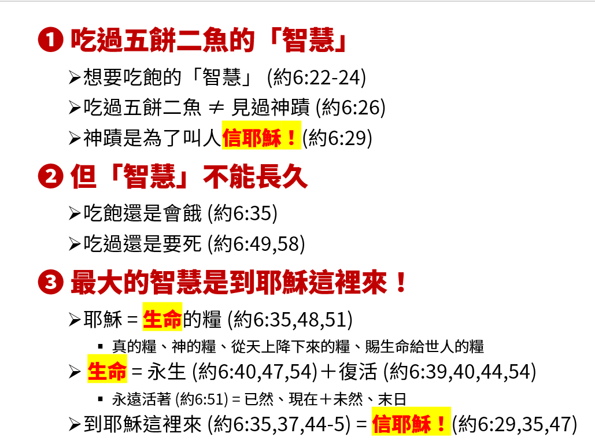

福音書：約翰福音6:51-58(新約135頁)  
題目：最大的智慧 (二)  
日期：2024-08-18  
教會：台北衛理堂  
時間：30~35 min  

## 大綱 (Outline)

- 脈絡
	- 約6:51-58 屬於約翰福音第六章整個大段落，都在講「生命的糧」，都在呼籲聽眾「到耶穌這裡來」
	- 而 約6:22-59 整個大段落則是延續「五餅二魚」(約6:1-15) 以及「水面行走」(約6:16-21) 兩個神蹟
	- 換句話說，耶穌講論的對象，正是經歷過「五餅二魚」的眾人(約6:22, 24, 59)，以及看過耶穌「水面行走」的門徒(約6:16, 60)。
	- 約6:60-71 則是後續門徒的回應。
- ==(1) 吃過五餅二魚的「智慧」==
	- (1a) 想要吃飽的「智慧」 (約6:22-24)
		- 😮吃飽也要智慧？！
		- 6:22-23 知道 ... 知道 ... 然而 ⇒ 情報蒐集、市場調查、邏輯推理、研判分析
		- 6:24 採取行動
		- 例：醫治特會、先知特會
	- (1b) 吃過五餅二魚 ≠ 見過神蹟 (約6:26)
		- 🤔五餅二魚，不就是神蹟嗎？兩個不是在講同一回事嗎？
		- 下文 6:27 給了線索：
			- 必壞的食物 = 五餅二魚 = 吃飽
			- 存到永生的食物 = 神蹟
		- 💡耶穌的意思：不要只看到那看得見的，卻沒有看到那看不見的；不要只看到問題被解決，卻沒有看到那解決問的耶穌！
	- (1c) 神蹟是為了叫人**信耶穌！**(約6:29)
		- 遇到問題來找耶穌，很好；禱告、特會求神蹟，很好——
		- 但，問題解決了之後呢？
		- 更進一步問，問題如果沒有解決的話呢？
- ==(2) 但「智慧」不能長久==
	- 眾人的「智慧」，跟所羅門的「智慧」一樣——都是功能性的，都是為了解決問題的，都是只看到今生的「智慧」😢⇐ 所以要加上「」
	- (2a) 吃飽還是會餓 (約6:35)
	- (2b) 吃過還是要死 (約6:49, 58)
	- 如果你一輩子都在尋尋覓覓，參加這個課程、那個特會，尋求這個先知、那個使徒 ... ——耶穌說，不要為必壞的食物勞力，因為吃了還會再餓，喝了還會再渴，好了還是會死！
- ==(3) 最大的智慧是到耶穌這裡來！==
	- 約翰喜歡用不同的說法，來講相同的概念 ... 乍看之下感覺像在繞圈圈 😀
	- (3a) 耶穌 = 生命的糧 (約6:35, 48, 51) 
		- 真的糧、神的糧、從天上降下來的糧、賜生命給世人的糧
	- (3b) 生命 = 永生＋復活 (約6:40, 47, 54)
		- 很多人誤以為：永生就是復活，但其實是兩件事，雖然彼此緊密相關！
		- 6:40 和 6:54 就說得很清楚：復活，是『在末日』——但，信耶穌，是現在！吃喝耶穌，是現在！
		- 緊密相關——因為如果你現在不信，如果你現在不開始每天吃喝耶穌 ⇒ 在末日，你就不可能復活
			- 這裡講的不是復活受審判，而是復活永遠活，是進入新天新地！
		- 永遠活著 (約6:51) = 已然、現在＋未然、末日
	- (3c) 到耶穌這裡來 (約6:35, 37, 44-45) = **信耶穌！**(約6:29, 35, 47)
		- 就像吃喝食物一樣，讓食物的養分，一點一滴滋潤我們的身體
		- 同樣地，吃喝耶穌，就是讓耶穌的生命，一點一滴地改變我們的生命 ⇒ 以至於我們**越來越像耶穌！**
			- 弗5:15-20 你們要謹慎行事，不要像愚昧人，當像智慧人。要愛惜光陰，因為現今的世代邪惡。不要作糊塗人，要明白主的旨意如何。不要醉酒，酒能使人放蕩；乃要被聖靈充滿。當用詩章、頌詞、靈歌、彼此對說，口唱心和的讚美主。凡事要奉我們主耶穌基督的名常常感謝父神。

## 投影片 (Slide)
️

---

[講道筆記↵](README.md)