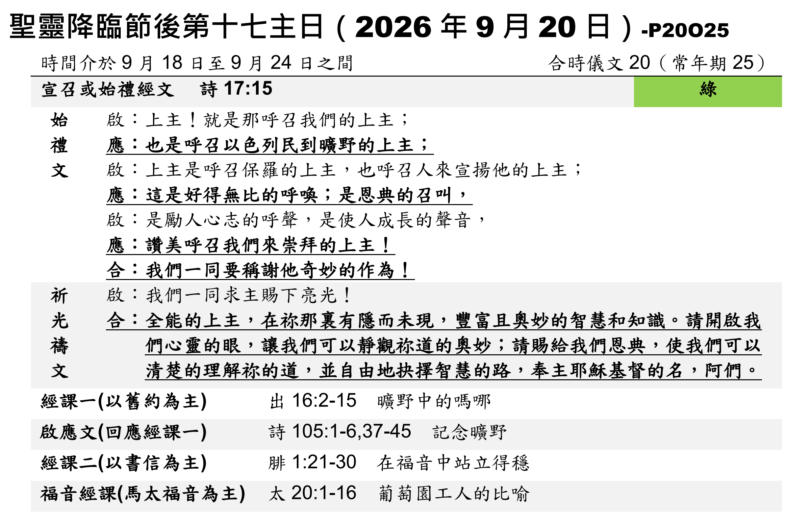

經文：出埃及記16:2-16  
題目：一切都是恩惠  
日期：2026-09-20(第一堂)  
教會：台北衛理堂  

## 大綱 (Outline)

- ==(0) 忘記神的恩惠 ⇒ 抱怨！==
	- 16:2以色列全會眾在曠野向摩西、亞倫發怨言， 16:3說：巴不得我們早死在埃及地、耶和華的手下；那時我們坐在肉鍋旁邊，吃得飽足。你們將我們領出來，到這曠野，是要叫這全會眾都餓死阿！ 
	- **善變是人類的天性，忘恩是人類的本能——選擇性失憶**
		- 在埃及做奴隸的苦——都忘了 😢
			- 出2:23-24 過了多年，埃及王死了。以色列人因做苦工，就歎息哀求，他們的哀聲達於　神。 神聽見他們的哀聲，就紀念他與亞伯拉罕、以撒、雅各所立的約。 
			- 住在埃及430年，其中 300+ 年當奴隸
		- 十災、過紅海的神蹟——都忘了 😢
		- 摩西和米利暗詩歌——都忘了 😢
- ==(1) 恩惠的試驗==
	- 16:4 我好試驗他們遵不遵我的**法度 (Torah)**
		- 出16:16耶和華所吩咐的是這樣：你們要按著各人的飯量，為帳棚裡的人，按著人數收起來，各拿一俄梅珥。 
		- 出16:5到第六天，他們要把所收進來的預備好了，比每天所收的多一倍。 
		- **法度 (Torah)：兼顧、平衡 (表面張力)**
			- (a) *個體的差異*：按著各人的飯量
			- (b) *群體的互補*：帳棚裡的人 = 家戶單位 (小家庭 4-8 人；大多數 8-15 人)
		- **原則：均平 (夠用＋互補)**
			- 出16:18 多收的也沒有餘，少收的也沒有缺
			- 林後8:13我原不是要別人輕省，你們受累， 8:14乃要均平，就是要你們的富餘，現在可以補他們的不足，使他們的富餘，將來也可以補你們的不足，這就均平了。 8:15如經上所記：多收的也沒有餘；少收的也沒有缺。 ⇒ 教會就是永生神的家！
- ==(2) 試驗的恩惠==
	- **試驗的本質：聽不聽神的話！**
		- 出16:4我好試驗他們遵不遵我的法度。
		- 出16:20然而他們不聽摩西的話，內中有留到早晨的，就生蟲變臭了；
		- 出16:24他們就照摩西的吩咐留到早晨，也不臭，裡頭也沒有蟲子。 
		- 出16:27第七天，百姓中有人出去收，甚麼也找不著。 16:28耶和華對摩西說：你們不肯守我的誡命和律法，要到幾時呢？ 
	- **試驗的目的：認識自己、認識神！**
		- 人的罪性：貪婪、悖逆、自己想要做上帝
		- 世界的法則：功德(貢獻、有用=價值)、交換、多勞多得(論功行賞)、KPI、爭搶奪、勝利者全拿(贏家通吃) ⇒ M 型社會、K型經濟😢
		- 上帝的法則：恩典、憐憫、公義、和平、忍耐、慈愛
- ==(3) 最大的恩惠，最大的試驗==
	- **最大的恩惠——天上來的糧【預表】耶穌基督！**
		- 約6:35耶穌說：我就是生命的糧。到我這裡來的，必定不餓；信我的，永遠不渴。
		- 約6:49你們的祖宗在曠野吃過嗎哪，還是死了。 6:50這是從天上降下來的糧，叫人吃了就不死。 
	- **最大的試驗——十字架！**
		- 林前1:21世人憑自己的智慧，既不認識神，神就樂意用人所當作愚拙的道理，拯救那些信的人；這就是神的智慧了。 *1:22猶太人是要神蹟，希臘人是求智慧， 1:23我們卻是傳釘十字架的基督，在猶太人為絆腳石，在外邦人為愚拙*； 1:24但在那蒙召的，無論是猶太人、希臘人，基督總為神的能力，神的智慧。 1:25因神的愚拙總比人智慧，神的軟弱總比人強壯。 
- ==**【大哉問】你到底信不信得過耶穌？！**==

## 小抄 (memo)

---

[講道筆記↵](README.md)

