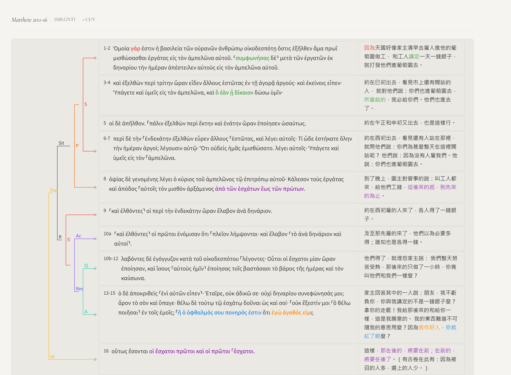

經文：太20:1-16  
題目：一切都是恩惠  
日期：2026-09-20(第二堂)  
教會：台北衛理堂  

- 太20:1-16
	- 20:1因為天國好像家主清早去雇人進他的葡萄園做工， 20:2和工人講定一天一錢銀子，就打發他們進葡萄園去。 20:3約在巳初出去，看見市上還有閒站的人， 20:4就對他們說：你們也進葡萄園去，所當給的，我必給你們。他們也進去了。 20:5約在午正和申初又出去，也是這樣行。 20:6約在酉初出去，看見還有人站在那裡，就問他們說：你們為甚麼整天在這裡閒站呢？ 20:7他們說：因為沒有人雇我們。他說：你們也進葡萄園去。 20:8到了晚上，園主對管事的說：叫工人都來，給他們工錢，從後來的起，到先來的為止。 20:9約在酉初雇的人來了，各人得了一錢銀子。 20:10及至那先雇的來了，他們以為必要多得；誰知也是各得一錢。 20:11他們得了，就埋怨家主說： 20:12我們整天勞苦受熱，那後來的只做了一小時，你竟叫他們和我們一樣麼？ 20:13家主回答其中的一人說：朋友，我不虧負你，你與我講定的不是一錢銀子麼？ 20:14拿你的走罷！我給那後來的和給你一樣，這是我願意的。 20:15我的東西難道不可隨我的意思用麼？因為我作好人，你就紅了眼麼？ 20:16這樣，那在後的，將要在前；在前的，將要在後了。（有古卷在此有：因為被召的人多，選上的人少。） 

## 解經 (Exegesis)

- 太20:1-16 被 Snodgrass 列為新約中最難處理的三個比喻之一，原因是經文本身未給出明確的解經鑰匙(unlike 撒種比喻 太13:18-23)——「另兩個是不義的管家、馬太記載的筵席比喻」。
- 比喻的主要解釋進路
	- (1) 學界共識：「恩典 vs. 功勞」比喻(Grace-versus-Merit)
		- 核心論點：比喻被馬太刻意安排在 19:30 與 20:16(近乎逐字重複)之間，構成 inclusio(首尾呼應框架)。比喻的敘事功能，是為「在前的將要在後，在後的將要在前」這句諺語提供具體圖像，對付彼得在19:27「我們已經撇下所有的跟從你，將來我們要得什麼呢？」所流露之功勞心態。
		- 經文根據：太19:27-30；20:16；v.15「我的東西難道不可隨我的意思用嗎？因為我作好人(ἀγαθός εἰμι)，你就紅了眼(ὁ ὀφθαλμός σου πονηρός ἐστιν)嗎？」(「眼睛邪惡」為閃族習語，指嫉妒、吝嗇，參七十士譯本申15:9；箴23:6；太6:23)
	- (2) 救恩歷史寓意解經
		 「時辰」象徵救贖歷史各階段(亞當→挪亞→亞伯拉罕→摩西→基督)
		- Origen、Gregory the Great 之亞歷山太學派寓意進路；Chrysostom(安提阿學派)則提出反對過度寓意化之呼籲。
	- (3) 猶太人／外邦人寓意解經
		- 先僱者=猶太人，後僱者=外邦人；同得救恩
		- 代表：Matthew Henry。
	- (4) 社會經濟/正義解讀
		- 聚焦第一世紀日僱工的真實經濟處境，一錢銀子為維持家庭基本生存之最低工資。
- 太19:30／20:8／20:16***「在前、在後」是：時間先後、地位高低、賞賜大小？***
	- 結果都領一錢銀子 ⇒ 可見不是「賞賜大小」
	- 賞賜已達頂點，不可能還有加碼 ⇒ 可見不是「地位高低」
		- 太19:28耶穌說：我實在告訴你們，你們這跟從我的人，到復興的時候，人子坐在他榮耀的寶座上，你們也要坐在十二個寶座上，審判以色列十二個支派。 19:29凡為我的名撇下房屋，或是弟兄、姊妹、父親、母親、（有古卷在此有：妻子）兒女、田地的，必要得著百倍，並且承受永生。 
	- 20:8 的「後/前」是把「受僱的先後次序」轉換成「賞賜的先後次序」⇒ **重點是「時間先後**」
		- 主人刻意製造張力：先僱者親眼見後僱者先領到一錢銀子，因而產生「應得更多」的期待，落空後引發抱怨(20:11-12)

## 語意圖析 (Semantic Diagram)

## 大綱 (Outline)

- ==(0) 比喻是為了門徒訓練==
	- 20:1「因為」⇒ 承接上文 19:30 ⇒ 補充解釋 19:16-29 的結論！
	- 富有的少年官 ⇒ *骨子裡是『交換』*
		- 太19:16夫子，我該做甚麼善事纔能得永生？
		- **律法主義的本質 = 交換，靠行為稱義**
	- 耶穌回答 ⇒ *不是『交換』，而是「關係」*
		- 好行為 (十誡＝遵守律法)還不夠
		- 要除去攔阻 (錢財)，跟隨耶穌——**耶穌就是永生！耶穌就是賞賜！**
	- 彼得 ⇒ *表面上看似「有關係」，但骨子裡還是『想交換』*
		- 太19:27看哪，我們已經撇下所有的跟從你，將來我們要得甚麼呢？
		- 把焦點放在「得什麼」的人，即便跟隨耶穌，那也只不過是「手段」、「交換」
	- e.g. 豪宅 😀
		- 做什麼才能得到豪宅？
		- 要跟富家千金戀愛結婚
		- 我已經拋下一切跟富家千金戀愛結婚了——除了豪宅之外，還有什麼？跑車呢？私人飛機呢？珠寶首飾呢？
	- 耶穌回答：
		- a) 有賞賜，而且是超乎你所期待的賞賜 (寶座尊榮、審判權柄、百倍產業)
		- b) 但更關鍵的是：你要知道——一切都是恩惠！
- ==(1) 恩惠的試驗 (20:1-8)==
	- 五批工人 (6AM、9AM、12AM、3PM、5PM)——一切都是恩惠！
		- 6AM 約定一錢銀子 (當時普通人一天的工資)
		- 9AM、12AM、3PM：所當給的
		- 5PM：沒人雇我們 😢
	- 主人刻意的試驗 (20:8)——故意
- ==(2) 試驗的恩惠 (20:9-15)==
	- 人的罪性：貪婪、忌妒、比較、自己想要做上帝
	- 世界的法則——人以為的『公平』：功德(貢獻、有用=價值)、交換、多勞多得、論功行賞、先到先拿
		- e.g. 特權人生、特權賽跑 ⇐ 什麼叫「公平」
			- 爸媽沒有離婚
			- 父母大學以上
			- 上過私立學校
			- 請過家教
			- 不需要打工貼補家用
			- 不擔心下一頓飯要花多少錢
	- 第一堂(出16:2-16)
- ==(3) 最大的恩惠，最大的試驗==
	- **最大的恩惠——耶穌基督！**
	- 
- ==**【大哉問】你到底信不信耶穌？！**==
## 小抄 (memo)

---

[講道筆記↵](README.md)

