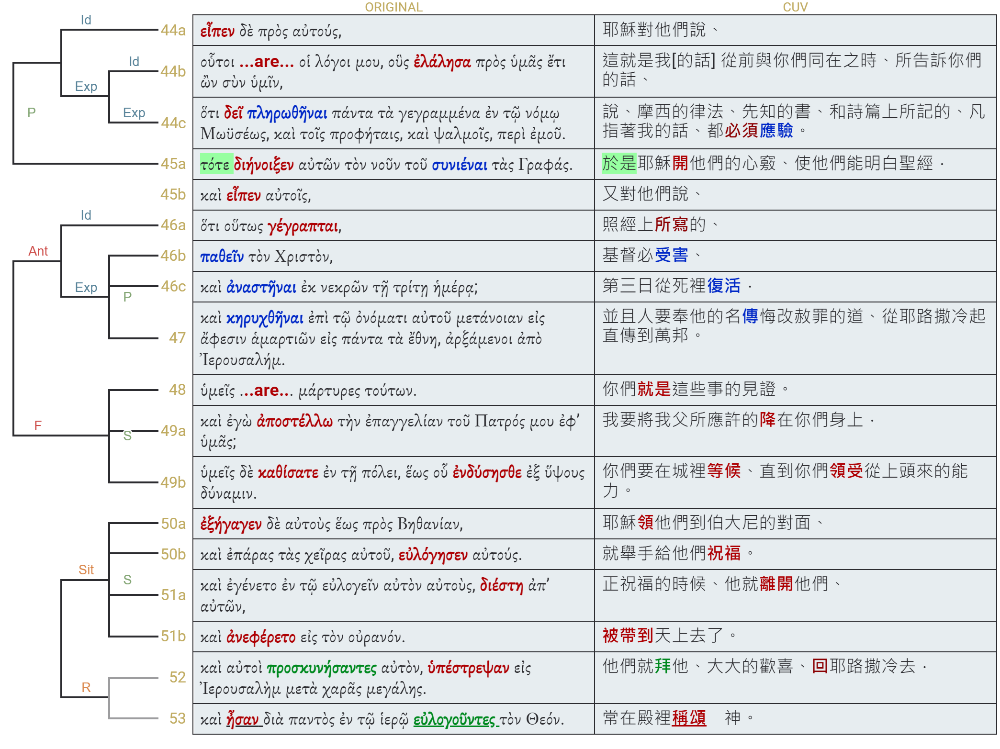

經文：路加福音 24:44-53    
題目：   
日期：2024-06-02   
教會：丰恩教會   

## 句法圖析 (Syntax Diagram)

- 24:44a (<RUBY><ruby><ruby><strong><strong>Εἶπεν</strong></strong><rt>εἶπον</rt></ruby><rt>He said</rt></ruby><rt>V-AAI-3S</rt></RUBY>)P <RUBY><ruby><ruby>δὲ<rt>δέ</rt></ruby><rt>now</rt></ruby><rt>CONJ</rt></RUBY> <RUBY><ruby><ruby>πρὸς<rt>πρός</rt></ruby><rt>unto</rt></ruby><rt>PREP</rt></RUBY> <RUBY><ruby><ruby>αὐτούς<rt>αὐτός</rt></ruby><rt>to them</rt></ruby><rt>P-APM</rt></RUBY> <mark class="pm">·</mark> 
	- 24:44b (<RUBY><ruby><ruby>Οὗτοι<rt>οὗτος</rt></ruby><rt>These [are]</rt></ruby><rt>D-NPM</rt></RUBY>)S (<RUBY><ruby><ruby>οἱ<rt>ὁ</rt></ruby><rt>the</rt></ruby><rt>T-NPM</rt></RUBY> <RUBY><ruby><ruby>λόγοι<rt>λόγος</rt></ruby><rt>words</rt></ruby><rt>N-NPM</rt></RUBY> <RUBY><ruby><ruby>μου<rt>ἐγώ</rt></ruby><rt>of me</rt></ruby><rt>P-1GS</rt></RUBY>)C 
		- 24:44c (<RUBY><ruby><ruby>οὓς<rt>ὅς</rt></ruby><rt>which</rt></ruby><rt>R-APM</rt></RUBY>)C (<RUBY><ruby><ruby><strong><strong>ἐλάλησα</strong></strong><rt>λαλέω</rt></ruby><rt>I spoke</rt></ruby><rt>V-AAI-1S</rt></RUBY>)P (<RUBY><ruby><ruby>πρὸς<rt>πρός</rt></ruby><rt>to</rt></ruby><rt>PREP</rt></RUBY> <RUBY><ruby><ruby>ὑμᾶς<rt>σύ</rt></ruby><rt>you</rt></ruby><rt>P-2AP</rt></RUBY>)A {(<RUBY><ruby><ruby>ἔτι<rt>ἔτι</rt></ruby><rt>still</rt></ruby><rt>ADV</rt></RUBY>)a (<RUBY><ruby><ruby><em><em>ὢν</em></em><rt>εἰμί</rt></ruby><rt>being</rt></ruby><rt>V-PAP-NSM</rt></RUBY>)p (<RUBY><ruby><ruby>σὺν<rt>σύν</rt></ruby><rt>with</rt></ruby><rt>PREP</rt></RUBY> <RUBY><ruby><ruby>ὑμῖν<rt>σύ</rt></ruby><rt>you</rt></ruby><rt>P-2DP</rt></RUBY>)a}A <mark class="pm">,</mark>
	- 24:44d <RUBY><ruby><ruby>ὅτι<rt>ὅτι</rt></ruby><rt>that</rt></ruby><rt>CONJ</rt></RUBY> (<RUBY><ruby><ruby><strong><strong>δεῖ</strong></strong><rt>δεῖ</rt></ruby><rt>it behooves</rt></ruby><rt>V-PAI-3S</rt></RUBY>)P {[<RUBY><ruby><ruby><em>πληρωθῆναι</em><rt>πληρόω</rt></ruby><rt>to be fulfilled</rt></ruby><rt>V-APN</rt></RUBY>]p [<RUBY><ruby><ruby>πάντα<rt>πᾶς</rt></ruby><rt>all things</rt></ruby><rt>A-APN</rt></RUBY> <RUBY><ruby><ruby>τὰ<rt>ὁ</rt></ruby><rt>-</rt></ruby><rt>T-APN</rt></RUBY> (<RUBY><ruby><ruby><em><em>γεγραμμένα</em></em><rt>γράφω</rt></ruby><rt>having been written</rt></ruby><rt>V-RPP-APN</rt></RUBY>)p (<RUBY><ruby><ruby>ἐν<rt>ἐν</rt></ruby><rt>in</rt></ruby><rt>PREP</rt></RUBY> ⸉...⸊)a (<RUBY><ruby><ruby>περὶ<rt>περί</rt></ruby><rt>concerning</rt></ruby><rt>PREP</rt></RUBY> <RUBY><ruby><ruby>ἐμοῦ<rt>ἐγώ</rt></ruby><rt>Me</rt></ruby><rt>P-1GS</rt></RUBY>)a]s}S <mark class="pm">.</mark> 
		- ⸉<RUBY><ruby><ruby>τῷ<rt>ὁ</rt></ruby><rt>the</rt></ruby><rt>T-DSM</rt></RUBY> <RUBY><ruby><ruby>νόμῳ<rt>νόμος</rt></ruby><rt>law</rt></ruby><rt>N-DSM</rt></RUBY> <RUBY><ruby><ruby>Μωϋσέως<rt>Μωϋσῆς, Μωσῆς</rt></ruby><rt>of Moses</rt></ruby><rt>N-GSM</rt></RUBY>
		- <RUBY><ruby><ruby>καὶ<rt>καί</rt></ruby><rt>and</rt></ruby><rt>CONJ</rt></RUBY> <RUBY><ruby><ruby>τοῖς<rt>ὁ</rt></ruby><rt>the</rt></ruby><rt>T-DPM</rt></RUBY> <RUBY><ruby><ruby>προφήταις<rt>προφήτης</rt></ruby><rt>Prophets</rt></ruby><rt>N-DPM</rt></RUBY> <RUBY><ruby><ruby>καὶ<rt>καί</rt></ruby><rt>and</rt></ruby><rt>CONJ</rt></RUBY> <RUBY><ruby><ruby>ψαλμοῖς<rt>ψαλμός</rt></ruby><rt>[the] Psalms</rt></ruby><rt>N-DPM</rt></RUBY>⸊
- 24:45 (<RUBY><ruby><ruby>τότε<rt>τότε</rt></ruby><rt>Then</rt></ruby><rt>ADV</rt></RUBY>)A (<RUBY><ruby><ruby><strong><strong>διήνοιξεν</strong></strong><rt>διανοίγω</rt></ruby><rt>He opened</rt></ruby><rt>V-AAI-3S</rt></RUBY>)P (<RUBY><ruby><ruby>αὐτῶν<rt>αὐτός</rt></ruby><rt>their</rt></ruby><rt>P-GPM</rt></RUBY> <RUBY><ruby><ruby>τὸν<rt>ὁ</rt></ruby><rt>-</rt></ruby><rt>T-ASM</rt></RUBY> <RUBY><ruby><ruby>νοῦν<rt>νοῦς</rt></ruby><rt>mind</rt></ruby><rt>N-ASM</rt></RUBY>)C {<RUBY><ruby><ruby>τοῦ<rt>ὁ</rt></ruby><rt>-</rt></ruby><rt>T-GSN</rt></RUBY> (<RUBY><ruby><ruby><em>συνιέναι</em><rt>συνίημι</rt></ruby><rt>to understand</rt></ruby><rt>V-PAN</rt></RUBY>)p (<RUBY><ruby><ruby>τὰς<rt>ὁ</rt></ruby><rt>the</rt></ruby><rt>T-APF</rt></RUBY> <RUBY><ruby><ruby>γραφάς<rt>γραφή</rt></ruby><rt>Scriptures</rt></ruby><rt>N-APF</rt></RUBY>)c}A <mark class="pm">·</mark> 
- ————————
- 24:46a <RUBY><ruby><ruby>Καὶ<rt>καί</rt></ruby><rt>And</rt></ruby><rt>CONJ</rt></RUBY> (<RUBY><ruby><ruby><strong><strong>εἶπεν</strong></strong><rt>εἶπον</rt></ruby><rt>He said</rt></ruby><rt>V-AAI-3S</rt></RUBY>)P <RUBY><ruby><ruby>αὐτοῖς<rt>αὐτός</rt></ruby><rt>to them</rt></ruby><rt>P-DPM</rt></RUBY>
	- 24:46b <RUBY><ruby><ruby>ὅτι<rt>ὅτι</rt></ruby><rt>-</rt></ruby><rt>CONJ</rt></RUBY> (<RUBY><ruby><ruby><mark>Οὕτως</mark><rt>οὕτω, οὕτως</rt></ruby><rt>Thus</rt></ruby><rt>ADV</rt></RUBY>)A (<RUBY><ruby><ruby><strong><strong>γέγραπται</strong></strong><rt>γράφω</rt></ruby><rt>it has been written</rt></ruby><rt>V-RPI-3S</rt></RUBY>)P 
		- 24:46c (<RUBY><ruby><ruby><em>παθεῖν</em><rt>πάσχω</rt></ruby><rt>Was to suffer</rt></ruby><rt>V-AAN</rt></RUBY>)p (<RUBY><ruby><ruby>τὸν<rt>ὁ</rt></ruby><rt>the</rt></ruby><rt>T-ASM</rt></RUBY> <RUBY><ruby><ruby>Χριστὸν<rt>Χριστός</rt></ruby><rt>Christ</rt></ruby><rt>N-ASM</rt></RUBY>)s
		- 25:46d <RUBY><ruby><ruby>καὶ<rt>καί</rt></ruby><rt>and</rt></ruby><rt>CONJ</rt></RUBY> (<RUBY><ruby><ruby><em>ἀναστῆναι</em><rt>ἀνίστημι</rt></ruby><rt>to rise</rt></ruby><rt>V-AAN</rt></RUBY>)p (<RUBY><ruby><ruby>ἐκ<rt>ἐκ</rt></ruby><rt>out from</rt></ruby><rt>PREP</rt></RUBY> <RUBY><ruby><ruby>νεκρῶν<rt>νεκρός</rt></ruby><rt>[the] dead</rt></ruby><rt>A-GPM</rt></RUBY>)a (<RUBY><ruby><ruby>τῇ<rt>ὁ</rt></ruby><rt>the</rt></ruby><rt>T-DSF</rt></RUBY> <RUBY><ruby><ruby>τρίτῃ<rt>τρίτος</rt></ruby><rt>third</rt></ruby><rt>A-DSF</rt></RUBY> <RUBY><ruby><ruby>ἡμέρᾳ<rt>ἡμέρα</rt></ruby><rt>day</rt></ruby><rt>N-DSF</rt></RUBY>)a <mark class="pm">,</mark> 
		- 24:47a <RUBY><ruby><ruby>καὶ<rt>καί</rt></ruby><rt>and</rt></ruby><rt>CONJ</rt></RUBY> (<RUBY><ruby><ruby><em>κηρυχθῆναι</em><rt>κηρύσσω</rt></ruby><rt>to be proclaimed</rt></ruby><rt>V-APN</rt></RUBY>)p (<RUBY><ruby><ruby>ἐπὶ<rt>ἐπί</rt></ruby><rt>in</rt></ruby><rt>PREP</rt></RUBY> <RUBY><ruby><ruby>τῷ<rt>ὁ</rt></ruby><rt>the</rt></ruby><rt>T-DSN</rt></RUBY> <RUBY><ruby><ruby>ὀνόματι<rt>ὄνομα</rt></ruby><rt>name</rt></ruby><rt>N-DSN</rt></RUBY> <RUBY><ruby><ruby>αὐτοῦ<rt>αὐτός</rt></ruby><rt>of Him</rt></ruby><rt>P-GSM</rt></RUBY>)a (<RUBY><ruby><ruby>μετάνοιαν<rt>μετάνοια</rt></ruby><rt>repentance</rt></ruby><rt>N-ASF</rt></RUBY>)s 
			- (<RUBY><ruby><ruby>εἰς<rt>εἰς</rt></ruby><rt>and</rt></ruby><rt>PREP</rt></RUBY> <RUBY><ruby><ruby>ἄφεσιν<rt>ἄφεσις</rt></ruby><rt>forgiveness</rt></ruby><rt>N-ASF</rt></RUBY> <RUBY><ruby><ruby>ἁμαρτιῶν<rt>ἁμαρτία</rt></ruby><rt>of sins</rt></ruby><rt>N-GPF</rt></RUBY>›)a⮥
			- (<RUBY><ruby><ruby>εἰς<rt>εἰς</rt></ruby><rt>to</rt></ruby><rt>PREP</rt></RUBY> <RUBY><ruby><ruby>πάντα<rt>πᾶς</rt></ruby><rt>all</rt></ruby><rt>A-APN</rt></RUBY> <RUBY><ruby><ruby>τὰ<rt>ὁ</rt></ruby><rt>-</rt></ruby><rt>T-APN</rt></RUBY> <RUBY><ruby><ruby>ἔθνη<rt>ἔθνος</rt></ruby><rt>nations</rt></ruby><rt>N-APN</rt></RUBY>)a⮥ <mark class="pm">.</mark> 
		- ⋯⋯⋯⋯⋯⋯⋯
			- 24:47b {(<RUBY><ruby><ruby><em><em>ἀρξάμενοι</em></em><rt>ἄρχω</rt></ruby><rt>having begun</rt></ruby><rt>V-AMP-NPM</rt></RUBY>)p (<RUBY><ruby><ruby>ἀπὸ<rt>ἀπό</rt></ruby><rt>from</rt></ruby><rt>PREP</rt></RUBY> <RUBY><ruby><ruby>Ἰερουσαλήμ<rt>Ἱερουσαλήμ</rt></ruby><rt>Jerusalem</rt></ruby><rt>N-GSF</rt></RUBY>)a}⮧ 
		- 24:48 (<RUBY><ruby><ruby>ὑμεῖς<rt>σύ</rt></ruby><rt>You [are]</rt></ruby><rt>P-2NP</rt></RUBY>)S (<RUBY><ruby><ruby>μάρτυρες<rt>μάρτυς</rt></ruby><rt>witnesses</rt></ruby><rt>N-NPM</rt></RUBY> <RUBY><ruby><ruby>τούτων<rt>οὗτος</rt></ruby><rt>of these things</rt></ruby><rt>D-GPN</rt></RUBY>)C <mark class="pm">.</mark> 
		- ⋯⋯⋯⋯⋯⋯⋯
		- 24:49a <RUBY><ruby><ruby>Καὶ<rt>καί</rt></ruby><rt>And</rt></ruby><rt>CONJ</rt></RUBY> <RUBY><ruby><ruby>ἰδοὺ<rt>ἰδού</rt></ruby><rt>behold</rt></ruby><rt>INJ</rt></RUBY> (<RUBY><ruby><ruby>ἐγὼ<rt>ἐγώ</rt></ruby><rt>I</rt></ruby><rt>P-1NS</rt></RUBY>)S (<RUBY><ruby><ruby><strong><strong>ἀποστέλλω</strong></strong><rt>ἀποστέλλω</rt></ruby><rt>am sending</rt></ruby><rt>V-PAI-1S</rt></RUBY>)P (<RUBY><ruby><ruby>τὴν<rt>ὁ</rt></ruby><rt>the</rt></ruby><rt>T-ASF</rt></RUBY> <RUBY><ruby><ruby>ἐπαγγελίαν<rt>ἐπαγγελία</rt></ruby><rt>promise</rt></ruby><rt>N-ASF</rt></RUBY> <RUBY><ruby><ruby>τοῦ<rt>ὁ</rt></ruby><rt>of the</rt></ruby><rt>T-GSM</rt></RUBY> <RUBY><ruby><ruby>Πατρός<rt>πατήρ</rt></ruby><rt>Father</rt></ruby><rt>N-GSM</rt></RUBY> <RUBY><ruby><ruby>μου<rt>ἐγώ</rt></ruby><rt>of Me</rt></ruby><rt>P-1GS</rt></RUBY>)C (<RUBY><ruby><ruby>ἐφ᾽<rt>ἐπί</rt></ruby><rt>upon</rt></ruby><rt>PREP</rt></RUBY> <RUBY><ruby><ruby>ὑμᾶς<rt>σύ</rt></ruby><rt>you</rt></ruby><rt>P-2AP</rt></RUBY>)A <mark class="pm">·</mark> 
		- 24:49b (<RUBY><ruby><ruby>ὑμεῖς<rt>σύ</rt></ruby><rt>you</rt></ruby><rt>P-2NP</rt></RUBY>)S <RUBY><ruby><ruby>δὲ<rt>δέ</rt></ruby><rt>however</rt></ruby><rt>CONJ</rt></RUBY> (<RUBY><ruby><ruby><strong><strong>καθίσατε</strong></strong><rt>καθίζω</rt></ruby><rt>remain</rt></ruby><rt>V-AAM-2P</rt></RUBY>)P (<RUBY><ruby><ruby>ἐν<rt>ἐν</rt></ruby><rt>in</rt></ruby><rt>PREP</rt></RUBY> <RUBY><ruby><ruby>τῇ<rt>ὁ</rt></ruby><rt>the</rt></ruby><rt>T-DSF</rt></RUBY> <RUBY><ruby><ruby>πόλει<rt>πόλις</rt></ruby><rt>city</rt></ruby><rt>N-DSF</rt></RUBY>)A 
			- 24:49b (<RUBY><ruby><ruby>ἕως<rt>ἕως</rt></ruby><rt>until</rt></ruby><rt>PREP</rt></RUBY> <RUBY><ruby><ruby>οὗ<rt>ὅς</rt></ruby><rt>that</rt></ruby><rt>R-GSM</rt></RUBY>)A (<RUBY><ruby><ruby><strong><strong>ἐνδύσησθε</strong></strong><rt>ἐνδύω</rt></ruby><rt>you should be clothed with</rt></ruby><rt>V-AMS-2P</rt></RUBY>)P (<RUBY><ruby><ruby>ἐξ<rt>ἐκ</rt></ruby><rt>from</rt></ruby><rt>PREP</rt></RUBY> <RUBY><ruby><ruby>ὕψους<rt>ὕψος</rt></ruby><rt>on high</rt></ruby><rt>N-GSN</rt></RUBY>)A (<RUBY><ruby><ruby>δύναμιν<rt>δύναμις</rt></ruby><rt>power</rt></ruby><rt>N-ASF</rt></RUBY>)C <mark class="pm">.</mark>
- ═════════════
- 24:50a (<RUBY><ruby><ruby><strong><strong>Ἐξήγαγεν</strong></strong><rt>ἐξάγω</rt></ruby><rt>He led</rt></ruby><rt>V-AAI-3S</rt></RUBY>)P <RUBY><ruby><ruby>δὲ<rt>δέ</rt></ruby><rt>now</rt></ruby><rt>CONJ</rt></RUBY> (<RUBY><ruby><ruby>αὐτοὺς<rt>αὐτός</rt></ruby><rt>them</rt></ruby><rt>P-APM</rt></RUBY>)C (<RUBY><ruby><ruby>ἔξω<rt>ἔξω</rt></ruby><rt>out</rt></ruby><rt>ADV</rt></RUBY>)A (<RUBY><ruby><ruby>ἕως<rt>ἕως</rt></ruby><rt>as far as</rt></ruby><rt>PREP</rt></RUBY> <RUBY><ruby><ruby>πρὸς<rt>πρός</rt></ruby><rt>to</rt></ruby><rt>PREP</rt></RUBY> <RUBY><ruby><ruby>Βηθανίαν<rt>Βηθανία</rt></ruby><rt>Bethany</rt></ruby><rt>N-ASF</rt></RUBY>)A <mark class="pm">,</mark>
- 24:50b <RUBY><ruby><ruby>καὶ<rt>καί</rt></ruby><rt>and</rt></ruby><rt>CONJ</rt></RUBY> {(<RUBY><ruby><ruby><em><em>ἐπάρας</em></em><rt>ἐπαίρω</rt></ruby><rt>having lifted up</rt></ruby><rt>V-AAP-NSM</rt></RUBY>)p (<RUBY><ruby><ruby>τὰς<rt>ὁ</rt></ruby><rt>the</rt></ruby><rt>T-APF</rt></RUBY> <RUBY><ruby><ruby>χεῖρας<rt>χείρ</rt></ruby><rt>hands</rt></ruby><rt>N-APF</rt></RUBY> <RUBY><ruby><ruby>αὐτοῦ<rt>αὐτός</rt></ruby><rt>of Him</rt></ruby><rt>P-GSM</rt></RUBY>)a}A (<RUBY><ruby><ruby><strong><strong>εὐλόγησεν</strong></strong><rt>εὐλογέω</rt></ruby><rt>He blessed</rt></ruby><rt>V-AAI-3S</rt></RUBY>)P (<RUBY><ruby><ruby>αὐτούς<rt>αὐτός</rt></ruby><rt>them</rt></ruby><rt>P-APM</rt></RUBY>)C <mark class="pm">.</mark> 
- 24:51a <RUBY><ruby><ruby>καὶ<rt>καί</rt></ruby><rt>And</rt></ruby><rt>CONJ</rt></RUBY> (<RUBY><ruby><ruby><strong><strong>ἐγένετο</strong></strong><rt>γίνομαι</rt></ruby><rt>it came to pass</rt></ruby><rt>V-AMI-3S</rt></RUBY>)P {<RUBY><ruby><ruby>ἐν<rt>ἐν</rt></ruby><rt>in</rt></ruby><rt>PREP</rt></RUBY> <RUBY><ruby><ruby>τῷ<rt>ὁ</rt></ruby><rt>the</rt></ruby><rt>T-DSN</rt></RUBY> (<RUBY><ruby><ruby><em>εὐλογεῖν</em><rt>εὐλογέω</rt></ruby><rt>blessing</rt></ruby><rt>V-PAN</rt></RUBY>)p (<RUBY><ruby><ruby>αὐτὸν<rt>αὐτός</rt></ruby><rt>of Him</rt></ruby><rt>P-ASM</rt></RUBY>)s (<RUBY><ruby><ruby>αὐτοὺς<rt>αὐτός</rt></ruby><rt>them</rt></ruby><rt>P-APM</rt></RUBY>)c}A 
- 24:51b (<RUBY><ruby><ruby><strong><strong>διέστη</strong></strong><rt>διΐστημι</rt></ruby><rt>He was separated</rt></ruby><rt>V-AAI-3S</rt></RUBY>)P (<RUBY><ruby><ruby>ἀπ᾽<rt>ἀπό</rt></ruby><rt>from</rt></ruby><rt>PREP</rt></RUBY> <RUBY><ruby><ruby>αὐτῶν<rt>αὐτός</rt></ruby><rt>them</rt></ruby><rt>P-GPM</rt></RUBY>)A
- 24:51c <RUBY><ruby><ruby>καὶ<rt>καί</rt></ruby><rt>and</rt></ruby><rt>CONJ</rt></RUBY> (<RUBY><ruby><ruby><strong><strong>ἀνεφέρετο</strong></strong><rt>ἀναφέρω</rt></ruby><rt>was carried up</rt></ruby><rt>V-IPI-3S</rt></RUBY>)P (<RUBY><ruby><ruby>εἰς<rt>εἰς</rt></ruby><rt>into</rt></ruby><rt>PREP</rt></RUBY> <RUBY><ruby><ruby>τὸν<rt>ὁ</rt></ruby><rt>-</rt></ruby><rt>T-ASM</rt></RUBY> <RUBY><ruby><ruby>οὐρανόν<rt>οὐρανός</rt></ruby><rt>heaven</rt></ruby><rt>N-ASM</rt></RUBY>)A <mark class="pm">.</mark>
- ————————
- 24:52 <RUBY><ruby><ruby>καὶ<rt>καί</rt></ruby><rt>And</rt></ruby><rt>CONJ</rt></RUBY> (<RUBY><ruby><ruby>αὐτοὶ<rt>αὐτός</rt></ruby><rt>they</rt></ruby><rt>P-NPM</rt></RUBY>)S {(<RUBY><ruby><ruby><em><em>προσκυνήσαντες</em></em><rt>προσκυνέω</rt></ruby><rt>having worshiped</rt></ruby><rt>V-AAP-NPM</rt></RUBY>)p (<RUBY><ruby><ruby>αὐτὸν<rt>αὐτός</rt></ruby><rt>Him</rt></ruby><rt>P-ASM</rt></RUBY>)c}A (<RUBY><ruby><ruby><strong><strong>ὑπέστρεψαν</strong></strong><rt>ὑποστρέφω</rt></ruby><rt>returned</rt></ruby><rt>V-AAI-3P</rt></RUBY>)P (<RUBY><ruby><ruby>εἰς<rt>εἰς</rt></ruby><rt>to</rt></ruby><rt>PREP</rt></RUBY> <RUBY><ruby><ruby>Ἰερουσαλὴμ<rt>Ἱερουσαλήμ</rt></ruby><rt>Jerusalem</rt></ruby><rt>N-ASF</rt></RUBY>)A (<RUBY><ruby><ruby>μετὰ<rt>μετά</rt></ruby><rt>with</rt></ruby><rt>PREP</rt></RUBY> <RUBY><ruby><ruby>χαρᾶς<rt>χαρά</rt></ruby><rt>joy</rt></ruby><rt>N-GSF</rt></RUBY> <RUBY><ruby><ruby>μεγάλης<rt>μέγας</rt></ruby><rt>great</rt></ruby><rt>A-GSF</rt></RUBY>)A 
- 24:53 <RUBY><ruby><ruby>καὶ<rt>καί</rt></ruby><rt>and</rt></ruby><rt>CONJ</rt></RUBY> (<RUBY><ruby><ruby><strong><strong>ἦσαν</strong></strong><rt>εἰμί</rt></ruby><rt>were</rt></ruby><rt>V-IAI-3P</rt></RUBY>)P (<RUBY><ruby><ruby>διὰ<rt>διά</rt></ruby><rt>continually</rt></ruby><rt>PREP</rt></RUBY> <RUBY><ruby><ruby>παντὸς<rt>πᾶς</rt></ruby><rt>all</rt></ruby><rt>A-GSM</rt></RUBY>)A (<RUBY><ruby><ruby>ἐν<rt>ἐν</rt></ruby><rt>in</rt></ruby><rt>PREP</rt></RUBY> <RUBY><ruby><ruby>τῷ<rt>ὁ</rt></ruby><rt>the</rt></ruby><rt>T-DSN</rt></RUBY> <RUBY><ruby><ruby>ἱερῷ<rt>ἱερός</rt></ruby><rt>temple</rt></ruby><rt>N-DSN</rt></RUBY>)A {(<RUBY><ruby><ruby><em><em>εὐλογοῦντες</em></em><rt>εὐλογέω</rt></ruby><rt>blessing</rt></ruby><rt>V-PAP-NPM</rt></RUBY>)p (<RUBY><ruby><ruby>τὸν<rt>ὁ</rt></ruby><rt>-</rt></ruby><rt>T-ASM</rt></RUBY> <RUBY><ruby><ruby>Θεόν<rt>θεός</rt></ruby><rt>God</rt></ruby><rt>N-ASM</rt></RUBY>)c}A <mark class="pm">.</mark> 

## 語意圖析 (Semantic Diagram)

## 大綱 (Outline)
- (0) 前言：
	- 耶穌的臨別贈言，教會存在的目的，信仰的核心，基督徒人生的意義與使命——非常重要！
	- 上帝的啟示：一般啟示、特殊啟示
		- 特殊啟示：行動的啟示(Deed Revelation)、話語的啟示(Word Revelation)，兩者互相發明
		- 用神蹟奇事證明所傳的道！
	- 復活三部曲：
		- 24:1-12：復活(行動的啟示)
		- 24:13-35：復活(行動的啟示)＋聖經(話語的啟示)
		- 24:36-49：復活(行動的啟示)＋聖經(話語的啟示) = 宣教(Missio Dei 上帝的差傳、上帝的使命)
		- 24:50-53：銜接使徒行傳 = 宣教的預備
- (1) <mark>復活 (24:36-43)——行動的啟示</mark>
	- 肉身！——vs. 靈魂不朽 (New Age/Old Age) = 鬼魂 (24:37)
		- 手腳、吃燒魚、看得見、摸得到
		- 林前15:42-44：不朽壞的、榮耀的、強壯的、靈性的身體——是*能被帶到天上的*(24:51)身體！
			- 死人復活也是這樣：所種的是必朽壞的，復活的是*不朽壞的*； 所種的是羞辱的，復活的是*榮耀的*；所種的是軟弱的，復活的是*強壯的*； 所種的是血氣的身體，復活的是*靈性的身體*。若有血氣的身體，也必有靈性的身體。 
- (2) <mark>聖經 (24:44-47)——話語的啟示</mark>
	- 聖經的特質——預言＋應驗 (24:44-45)
		- 從前...告訴過你們 ⇒ 有聽沒有懂 😢
		- 開他們心竅 ... 明白聖經 ⇒ 讀經需要禱告😀
		- **必須**應驗！——因為聖經是這位**全能上帝永恆主宰**所說的話
			- 創3:15 女人的後裔要傷蛇的頭
			- 彌4:1 末後的日子，耶和華殿的山必堅立，超乎諸山，高舉過於萬嶺；萬民都要流歸這山。
			- 賽40:1-3 神說：你們要安慰，安慰我的百姓...有人聲喊著說：在曠野預備耶和華的路，在沙漠地修平我們神的道。 
		- 不是 B 計畫！
			- 賽55:10-11 雨雪從天而降，並不返回...我口所出的話也必如此，決不徒然返回，卻要成就我所喜悅的，在我發他去成就（發他去成就：或譯所命定）的事上必然亨通。 
	- 聖經的焦點——經上這麼寫的 οὕτως γέγραπται——三項 (三個不定詞)！
		- (a) **受害 παθεῖν (包括受死)** ⇐ 已經應驗！
			- 賽53:3 他被藐視，被人厭棄；多受痛苦，常經憂患
			- 賽53:4 他誠然擔當我們的憂患，背負我們的痛苦
			- 賽53:5 他為我們的過犯受害，為我們的罪孽壓傷。因他受的刑罰，我們得平安；因他受的鞭傷，我們得醫治
			- 賽53:7 他像羊羔被牽到宰殺之地
			- 賽53:10 耶和華卻定意將他壓傷，使他受痛苦。耶和華以他為贖罪祭
			- 賽53:12 他將命傾倒，以致於死；他也被列在罪犯之中。他卻擔當多人的罪，又為罪犯代求。
		- (b) **復活 ἀναστῆναι (包括升天)** ⇐ 已經應驗！
			- 詩16:10 你必不將我的靈魂撇在陰間，也不叫你的聖者見朽壞
			- 詩110:1 耶和華對我主說：你坐在我的右邊，等我使你仇敵作你的腳凳。 
		- (c) **被傳揚 κηρυχθῆναι** ——*奉耶穌的名*，「**悔改以至於赦罪的道**」要被傳揚到萬邦！
			- 創12:3 地上的萬族都要因你得福
			- 賽49:6 我還要使你作外邦人的光，叫你施行我的救恩，直到地極。 
			- 太28:18-20 所以，你們要去，使萬民作我的門徒，奉父、子、聖靈的名給他們施洗。凡我所吩咐你們的，都教訓他們遵守，我就常與你們同在，直到世界的末了。
			- 路加版的大使命——接下來(24:48-49) 要開始應驗！
- (3) <mark>宣教 (24:48-49)——上帝的差遣</mark>
	- 宣教的任務 = 見證這些事 (24:45-47)——不是創新😢
	- 宣教的焦點 = 聖經的焦點 = 福音的核心 = 好消息！！
		- vs. 人的成功 (猶太人求神蹟)、人的理性 (希臘人求智慧)、人的尊嚴 (華人求面子)
	- 宣教的動力 = 穿上、披戴上頭來的能力！——不是靠自己、勢力、才能、高言大智 �
	- 既是預言，也是必須應驗的行動；既是命令，也是邀請！
		- 命令&邀請我們走進上帝的心意，參與上帝的宣教大業！
		- Acts 29！我們正在寫歷史、我們也*活在*聖經的預言裡，我們也*參與在*聖經的應驗裡！！

## 小抄 (memo)

---

[講道筆記↵](README.md)

