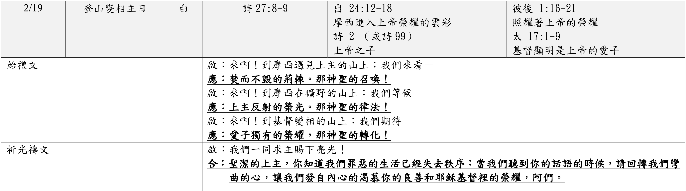

經文： 馬太福音17:1-9  
題目： 看見主榮光 (二)  
日期： 2023-02-19  
教會： 台北衛理堂  

經課一：出埃及記24:12-18  
啟應文：詩篇2篇   
經課二：彼得後書1:16-21  
福音書：馬太福音17:1-9  

## 圖析 (Syntax Diagram)

### 馬太福音17:1-9
- <rt>17:1</rt> <RUBY><ruby><ruby>Καὶ<rt>καί</rt></ruby><rt>And</rt></ruby><rt>CONJ</rt></RUBY> (<RUBY><ruby><ruby>μεθ᾽<rt>μετά</rt></ruby><rt>after</rt></ruby><rt>PREP</rt></RUBY> <RUBY><ruby><ruby>ἡμέρας<rt>ἡμέρα</rt></ruby><rt>days</rt></ruby><rt>N-APF</rt></RUBY> <RUBY><ruby><ruby>ἓξ<rt>ἕξ</rt></ruby><rt>six</rt></ruby><rt>A-APF-NUI</rt></RUBY>)A (<RUBY><ruby><ruby><strong>παραλαμβάνει</strong><rt>παραλαμβάνω</rt></ruby><rt>takes with [Him]</rt></ruby><rt>V-PAI-3S</rt></RUBY>)P (<RUBY><ruby><ruby>ὁ<rt>ὁ</rt></ruby><rt>-</rt></ruby><rt>T-NSM</rt></RUBY> <RUBY><ruby><ruby>Ἰησοῦς<rt>Ἰησοῦς</rt></ruby><rt>Jesus</rt></ruby><rt>N-NSM-P</rt></RUBY>)S (<RUBY><ruby><ruby>τὸν<rt>ὁ</rt></ruby><rt>-</rt></ruby><rt>T-ASM</rt></RUBY> <RUBY><ruby><ruby>Πέτρον<rt>Πέτρος</rt></ruby><rt>Peter</rt></ruby><rt>N-ASM-P</rt></RUBY> <RUBY><ruby><ruby>καὶ<rt>καί</rt></ruby><rt>and</rt></ruby><rt>CONJ</rt></RUBY> <RUBY><ruby><ruby>Ἰάκωβον<rt>Ἰάκωβος</rt></ruby><rt>James</rt></ruby><rt>N-ASM-P</rt></RUBY> <RUBY><ruby><ruby>καὶ<rt>καί</rt></ruby><rt>and</rt></ruby><rt>CONJ</rt></RUBY> <RUBY><ruby><ruby>Ἰωάννην<rt>Ἰωάννης</rt></ruby><rt>John</rt></ruby><rt>N-ASM-P</rt></RUBY> <RUBY><ruby><ruby>τὸν<rt>ὁ</rt></ruby><rt>the</rt></ruby><rt>T-ASM</rt></RUBY> <RUBY><ruby><ruby>ἀδελφὸν<rt>ἀδελφός</rt></ruby><rt>brother</rt></ruby><rt>N-ASM</rt></RUBY> <RUBY><ruby><ruby>αὐτοῦ<rt>αὐτός</rt></ruby><rt>of him</rt></ruby><rt>P-GSM</rt></RUBY>)C
- <RUBY><ruby><ruby>καὶ<rt>καί</rt></ruby><rt>and</rt></ruby><rt>CONJ</rt></RUBY> (<RUBY><ruby><ruby><strong>ἀναφέρει</strong><rt>ἀναφέρω</rt></ruby><rt>brings up</rt></ruby><rt>V-PAI-3S</rt></RUBY>)P (<RUBY><ruby><ruby>αὐτοὺς<rt>αὐτός</rt></ruby><rt>them</rt></ruby><rt>P-APM</rt></RUBY>)C (<RUBY><ruby><ruby>εἰς<rt>εἰς</rt></ruby><rt>into</rt></ruby><rt>PREP</rt></RUBY> <RUBY><ruby><ruby>ὄρος<rt>ὄρος</rt></ruby><rt>a mountain</rt></ruby><rt>N-ASN</rt></RUBY> <RUBY><ruby><ruby>ὑψηλὸν<rt>ὑψηλός</rt></ruby><rt>high</rt></ruby><rt>A-ASN</rt></RUBY>) (<RUBY><ruby><ruby>κατ᾽<rt>κατά</rt></ruby><rt>by</rt></ruby><rt>PREP</rt></RUBY> <RUBY><ruby><ruby>ἰδίαν.<rt>ἴδιος</rt></ruby><rt>themselves</rt></ruby><rt>A-ASF</rt></RUBY> )A
- <rt>17:2</rt> <RUBY><ruby><ruby>καὶ<rt>καί</rt></ruby><rt>And</rt></ruby><rt>CONJ</rt></RUBY> (<RUBY><ruby><ruby><strong>μετεμορφώθη</strong><rt>μεταμορφόω</rt></ruby><rt>He was transfigured</rt></ruby><rt>V-API-3S</rt></RUBY>)P (<RUBY><ruby><ruby>ἔμπροσθεν<rt>ἔμπροσθεν</rt></ruby><rt>before</rt></ruby><rt>PREP</rt></RUBY> <RUBY><ruby><ruby>αὐτῶν,<rt>αὐτός</rt></ruby><rt>them</rt></ruby><rt>P-GPM</rt></RUBY>)A
- <RUBY><ruby><ruby>καὶ<rt>καί</rt></ruby><rt>and</rt></ruby><rt>CONJ</rt></RUBY> (<RUBY><ruby><ruby><strong>ἔλαμψεν</strong><rt>λάμπω</rt></ruby><rt>shone</rt></ruby><rt>V-AAI-3S</rt></RUBY>)P (<RUBY><ruby><ruby>τὸ<rt>ὁ</rt></ruby><rt>the</rt></ruby><rt>T-NSN</rt></RUBY> <RUBY><ruby><ruby>πρόσωπον<rt>πρόσωπον</rt></ruby><rt>face</rt></ruby><rt>N-NSN</rt></RUBY> <RUBY><ruby><ruby>αὐτοῦ<rt>αὐτός</rt></ruby><rt>of Him</rt></ruby><rt>P-GSM</rt></RUBY>)S (<RUBY><ruby><ruby>ὡς<rt>ὡς</rt></ruby><rt>like</rt></ruby><rt>CONJ</rt></RUBY> <RUBY><ruby><ruby>ὁ<rt>ὁ</rt></ruby><rt>the</rt></ruby><rt>T-NSM</rt></RUBY> <RUBY><ruby><ruby>ἥλιος,<rt>ἥλιος</rt></ruby><rt>sun</rt></ruby><rt>N-NSM</rt></RUBY>)A 
- (<RUBY><ruby><ruby>τὰ<rt>ὁ</rt></ruby><rt>-</rt></ruby><rt>T-NPN</rt></RUBY>)⦇ <RUBY><ruby><ruby>δὲ<rt>δέ</rt></ruby><rt>and</rt></ruby><rt>CONJ</rt></RUBY> ⦈(<RUBY><ruby><ruby>ἱμάτια<rt>ἱμάτιον</rt></ruby><rt>the clothes</rt></ruby><rt>N-NPN</rt></RUBY> <RUBY><ruby><ruby>αὐτοῦ<rt>αὐτός</rt></ruby><rt>of Him</rt></ruby><rt>P-GSM</rt></RUBY>)S (<RUBY><ruby><ruby><strong>ἐγένετο</strong><rt>γίνομαι</rt></ruby><rt>became</rt></ruby><rt>V-ADI-3S</rt></RUBY>)P (<RUBY><ruby><ruby>λευκὰ<rt>λευκός</rt></ruby><rt>white</rt></ruby><rt>A-NPN</rt></RUBY>)C (<RUBY><ruby><ruby>ὡς<rt>ὡς</rt></ruby><rt>as</rt></ruby><rt>CONJ</rt></RUBY> <RUBY><ruby><ruby>τὸ<rt>ὁ</rt></ruby><rt>the</rt></ruby><rt>T-NSN</rt></RUBY> <RUBY><ruby><ruby>φῶς.<rt>φῶς</rt></ruby><rt>light</rt></ruby><rt>N-NSN</rt></RUBY>)A
- <rt>17:3</rt> <RUBY><ruby><ruby>Καὶ<rt>καί</rt></ruby><rt>And</rt></ruby><rt>CONJ</rt></RUBY> <RUBY><ruby><ruby>ἰδοὺ<rt>ἰδού</rt></ruby><rt>behold</rt></ruby><rt>INJ</rt></RUBY> (<mark><RUBY><ruby><ruby><strong>ὤφθη°¹</strong><rt>ὁράω</rt></ruby><rt>appeared</rt></ruby><rt>V-API-3S</rt></RUBY></mark>)P (<RUBY><ruby><ruby>αὐτοῖς<rt>αὐτός</rt></ruby><rt>to them</rt></ruby><rt>P-DPM</rt></RUBY>)A (<RUBY><ruby><ruby>Μωϋσῆς<rt>Μωϋσῆς, Μωσῆς</rt></ruby><rt>Moses</rt></ruby><rt>N-NSM-P</rt></RUBY> <RUBY><ruby><ruby>καὶ<rt>καί</rt></ruby><rt>and</rt></ruby><rt>CONJ</rt></RUBY> <RUBY><ruby><ruby>Ἠλίας<rt>Ἡλίας</rt></ruby><rt>Elijah</rt></ruby><rt>N-NSM-P</rt></RUBY>)S 
	- { (<RUBY><ruby><ruby><em>συλλαλοῦντες</em><rt>συλλαλέω</rt></ruby><rt>talking</rt></ruby><rt>V-PAP-NPM</rt></RUBY>)p (<RUBY><ruby><ruby>μετ᾽<rt>μετά</rt></ruby><rt>with</rt></ruby><rt>PREP</rt></RUBY> <RUBY><ruby><ruby>αὐτοῦ.<rt>αὐτός</rt></ruby><rt>Him</rt></ruby><rt>P-GSM</rt></RUBY>)a }A°¹⮥
- ————————
- <rt>17:4</rt> { (<RUBY><ruby><ruby><em>ἀποκριθεὶς</em><rt>ἀποκρίνω</rt></ruby><rt>Answering</rt></ruby><rt>V-AOP-NSM</rt></RUBY>)p }A <RUBY><ruby><ruby>δὲ<rt>δέ</rt></ruby><rt>now</rt></ruby><rt>CONJ</rt></RUBY> (<RUBY><ruby><ruby>ὁ<rt>ὁ</rt></ruby><rt>-</rt></ruby><rt>T-NSM</rt></RUBY> <RUBY><ruby><ruby>Πέτρος<rt>Πέτρος</rt></ruby><rt>Peter</rt></ruby><rt>N-NSM-P</rt></RUBY>)S (<RUBY><ruby><ruby><strong>εἶπεν</strong><rt>εἶπον</rt></ruby><rt>said</rt></ruby><rt>V-AAI-3S</rt></RUBY>)P (<RUBY><ruby><ruby>τῷ<rt>ὁ</rt></ruby><rt>-</rt></ruby><rt>T-DSM</rt></RUBY> <RUBY><ruby><ruby>Ἰησοῦ·<rt>Ἰησοῦς</rt></ruby><rt>to Jesus</rt></ruby><rt>N-DSM-P</rt></RUBY>)C 
	- <RUBY><ruby><ruby>Κύριε,<rt>κύριος</rt></ruby><rt>Lord</rt></ruby><rt>N-VSM</rt></RUBY> (<RUBY><ruby><ruby>καλόν<rt>καλός</rt></ruby><rt>good</rt></ruby><rt>A-NSN</rt></RUBY>)C (<RUBY><ruby><ruby><strong>ἐστιν</strong><rt>εἰμί</rt></ruby><rt>it is</rt></ruby><rt>V-PAI-3S</rt></RUBY>)P { (<RUBY><ruby><ruby>ἡμᾶς<rt>ἐγώ</rt></ruby><rt>for us</rt></ruby><rt>P-1AP</rt></RUBY>)s (<RUBY><ruby><ruby>ὧδε<rt>ὧδε</rt></ruby><rt>here</rt></ruby><rt>ADV</rt></RUBY>)a (<RUBY><ruby><ruby><em>εἶναι·</em><rt>εἰμί</rt></ruby><rt>to be</rt></ruby><rt>V-PAN</rt></RUBY>)p }S
		- <RUBY><ruby><ruby>εἰ<rt>εἰ</rt></ruby><rt>If</rt></ruby><rt>CONJ</rt></RUBY> (<RUBY><ruby><ruby><strong>θέλεις,</strong><rt>θέλω</rt></ruby><rt>You wish</rt></ruby><rt>V-PAI-2S</rt></RUBY>)P 
	- (<RUBY><ruby><ruby><strong>ποιήσω</strong><rt>ποιέω</rt></ruby><rt>I will make</rt></ruby><rt>V-FAI-1S</rt></RUBY>)P (<RUBY><ruby><ruby>ὧδε<rt>ὧδε</rt></ruby><rt>here</rt></ruby><rt>ADV</rt></RUBY>)A (<RUBY><ruby><ruby>τρεῖς<rt>τρεῖς, τρία</rt></ruby><rt>three</rt></ruby><rt>A-APF</rt></RUBY> <RUBY><ruby><ruby>σκηνάς,<rt>σκηνή</rt></ruby><rt>tabernacles</rt></ruby><rt>N-APF</rt></RUBY>)C 
		- <RUBY><ruby><ruby>σοὶ<rt>σύ</rt></ruby><rt>for You</rt></ruby><rt>P-2DS</rt></RUBY> <RUBY><ruby><ruby>μίαν<rt>εἷς</rt></ruby><rt>one</rt></ruby><rt>A-ASF</rt></RUBY> <RUBY><ruby><ruby>καὶ<rt>καί</rt></ruby><rt>and</rt></ruby><rt>CONJ</rt></RUBY> <RUBY><ruby><ruby>Μωϋσεῖ<rt>Μωϋσῆς, Μωσῆς</rt></ruby><rt>for Moses</rt></ruby><rt>N-DSM-P</rt></RUBY> <RUBY><ruby><ruby>μίαν<rt>εἷς</rt></ruby><rt>one</rt></ruby><rt>A-ASF</rt></RUBY> <RUBY><ruby><ruby>καὶ<rt>καί</rt></ruby><rt>and</rt></ruby><rt>CONJ</rt></RUBY> <RUBY><ruby><ruby>Ἠλίᾳ<rt>Ἡλίας</rt></ruby><rt>for Elijah</rt></ruby><rt>N-DSM-P</rt></RUBY> <RUBY><ruby><ruby>μίαν.<rt>εἷς</rt></ruby><rt>one</rt></ruby><rt>A-ASF</rt></RUBY> 
- ————————
	- <rt>17:5</rt> { <RUBY><ruby><ruby>Ἔτι<rt>ἔτι</rt></ruby><rt>While yet</rt></ruby><rt>ADV</rt></RUBY> (<RUBY><ruby><ruby>αὐτοῦ<rt>αὐτός</rt></ruby><rt>he</rt></ruby><rt>P-GSM</rt></RUBY>)s (<RUBY><ruby><ruby><em>λαλοῦντος</em><rt>λαλέω</rt></ruby><rt>was speaking</rt></ruby><rt>V-PAP-GSM</rt></RUBY>)p }A⮧
- <RUBY><ruby><ruby>ἰδοὺ<rt>ἰδού</rt></ruby><rt>behold</rt></ruby><rt>INJ</rt></RUBY> (<RUBY><ruby><ruby>νεφέλη<rt>νεφέλη</rt></ruby><rt>a cloud</rt></ruby><rt>N-NSF</rt></RUBY> <RUBY><ruby><ruby>φωτεινὴ<rt>φωτεινός</rt></ruby><rt>bright</rt></ruby><rt>A-NSF</rt></RUBY>)S (<RUBY><ruby><ruby><strong>ἐπεσκίασεν</strong><rt>ἐπισκιάζω</rt></ruby><rt>overshadowed</rt></ruby><rt>V-AAI-3S</rt></RUBY>)P (<RUBY><ruby><ruby>αὐτούς,<rt>αὐτός</rt></ruby><rt>them</rt></ruby><rt>P-APM</rt></RUBY>)C
- <RUBY><ruby><ruby>καὶ<rt>καί</rt></ruby><rt>and</rt></ruby><rt>CONJ</rt></RUBY> <RUBY><ruby><ruby>ἰδοὺ<rt>ἰδού</rt></ruby><rt>behold</rt></ruby><rt>INJ</rt></RUBY> (<RUBY><ruby><ruby>φωνὴ<rt>φωνή</rt></ruby><rt>a voice</rt></ruby><rt>N-NSF</rt></RUBY>)S (<RUBY><ruby><ruby>ἐκ<rt>ἐκ</rt></ruby><rt>out of</rt></ruby><rt>PREP</rt></RUBY> <RUBY><ruby><ruby>τῆς<rt>ὁ</rt></ruby><rt>the</rt></ruby><rt>T-GSF</rt></RUBY> <RUBY><ruby><ruby>νεφέλης<rt>νεφέλη</rt></ruby><rt>cloud</rt></ruby><rt>N-GSF</rt></RUBY>)A { (<RUBY><ruby><ruby><em>λέγουσα·</em><rt>λέγω</rt></ruby><rt>saying</rt></ruby><rt>V-PAP-NSF</rt></RUBY>)p }A 
	- (<RUBY><ruby><ruby>Οὗτός<rt>οὗτος</rt></ruby><rt>This</rt></ruby><rt>D-NSM</rt></RUBY>)S (<RUBY><ruby><ruby><strong>ἐστιν</strong><rt>εἰμί</rt></ruby><rt>is</rt></ruby><rt>V-PAI-3S</rt></RUBY>)P (<RUBY><ruby><ruby>ὁ<rt>ὁ</rt></ruby><rt>the</rt></ruby><rt>T-NSM</rt></RUBY> <RUBY><ruby><ruby>Υἱός<rt>υἱός</rt></ruby><rt>Son</rt></ruby><rt>N-NSM</rt></RUBY> <RUBY><ruby><ruby>μου<rt>ἐγώ</rt></ruby><rt>of Me</rt></ruby><rt>P-1GS</rt></RUBY> <RUBY><ruby><ruby>ὁ<rt>ὁ</rt></ruby><rt>the</rt></ruby><rt>T-NSM</rt></RUBY> <RUBY><ruby><ruby>ἀγαπητός,<rt>ἀγαπητός</rt></ruby><rt>beloved</rt></ruby><rt>A-NSM</rt></RUBY>)C 
		- (<RUBY><ruby><ruby>ἐν<rt>ἐν</rt></ruby><rt>in</rt></ruby><rt>PREP</rt></RUBY> <RUBY><ruby><ruby>ᾧ<rt>ὅς</rt></ruby><rt>whom</rt></ruby><rt>R-DSM</rt></RUBY>)A (<RUBY><ruby><ruby><strong>εὐδόκησα·</strong><rt>εὐδοκέω</rt></ruby><rt>I am well pleased</rt></ruby><rt>V-AAI-1S</rt></RUBY>)P 
		- (<RUBY><ruby><ruby><strong>ἀκούετε</strong><rt>ἀκούω</rt></ruby><rt>Listen</rt></ruby><rt>V-PAM-2P</rt></RUBY>)P (<RUBY><ruby><ruby>αὐτοῦ.<rt>αὐτός</rt></ruby><rt>to Him!</rt></ruby><rt>P-GSM</rt></RUBY>)C
- <rt>17:6</rt> <RUBY><ruby><ruby>καὶ<rt>καί</rt></ruby><rt>And</rt></ruby><rt>CONJ</rt></RUBY> { (<RUBY><ruby><ruby><em>ἀκούσαντες</em><rt>ἀκούω</rt></ruby><rt>having heard [it]</rt></ruby><rt>V-AAP-NPM</rt></RUBY>)p }A (<RUBY><ruby><ruby>οἱ<rt>ὁ</rt></ruby><rt>the</rt></ruby><rt>T-NPM</rt></RUBY> <RUBY><ruby><ruby>μαθηταὶ<rt>μαθητής</rt></ruby><rt>disciples</rt></ruby><rt>N-NPM</rt></RUBY>)S (<RUBY><ruby><ruby><strong>ἔπεσαν</strong><rt>πίπτω</rt></ruby><rt>fell</rt></ruby><rt>V-AAI-3P</rt></RUBY>)P (<RUBY><ruby><ruby>ἐπὶ<rt>ἐπί</rt></ruby><rt>upon</rt></ruby><rt>PREP</rt></RUBY> <RUBY><ruby><ruby>πρόσωπον<rt>πρόσωπον</rt></ruby><rt>face</rt></ruby><rt>N-ASN</rt></RUBY> <RUBY><ruby><ruby>αὐτῶν<rt>αὐτός</rt></ruby><rt>of them</rt></ruby><rt>P-GPM</rt></RUBY>)A
- <RUBY><ruby><ruby>καὶ<rt>καί</rt></ruby><rt>and</rt></ruby><rt>CONJ</rt></RUBY> (<RUBY><ruby><ruby><strong>ἐφοβήθησαν</strong><rt>φοβέω</rt></ruby><rt>were terrified</rt></ruby><rt>V-AOI-3P</rt></RUBY>)P (<RUBY><ruby><ruby>σφόδρα.<rt>σφόδρα</rt></ruby><rt>greatly</rt></ruby><rt>ADV</rt></RUBY>)A
- ————————
- <rt>17:7</rt> <RUBY><ruby><ruby>Καὶ<rt>καί</rt></ruby><rt>And</rt></ruby><rt>CONJ</rt></RUBY> (<RUBY><ruby><ruby><strong>προσῆλθεν</strong><rt>προσέρχομαι</rt></ruby><rt>having come to [them]</rt></ruby><rt>V-AAI-3S</rt></RUBY>)P (<RUBY><ruby><ruby>ὁ<rt>ὁ</rt></ruby><rt>-</rt></ruby><rt>T-NSM</rt></RUBY> <RUBY><ruby><ruby>Ἰησοῦς<rt>Ἰησοῦς</rt></ruby><rt>Jesus</rt></ruby><rt>N-NSM-P</rt></RUBY>)S
- <RUBY><ruby><ruby>καὶ<rt>καί</rt></ruby><rt>and</rt></ruby><rt>CONJ</rt></RUBY> { (<RUBY><ruby><ruby><em>ἁψάμενος</em><rt>ἅπτω</rt></ruby><rt>having touched</rt></ruby><rt>V-AMP-NSM</rt></RUBY>)p (<RUBY><ruby><ruby>αὐτῶν<rt>αὐτός</rt></ruby><rt>them</rt></ruby><rt>P-GPM</rt></RUBY>)c }A (<RUBY><ruby><ruby><strong>εἶπεν·</strong><rt>εἶπον</rt></ruby><rt>He said</rt></ruby><rt>V-AAI-3S</rt></RUBY>)P 
	- (<RUBY><ruby><ruby><strong>Ἐγέρθητε</strong><rt>ἐγείρω</rt></ruby><rt>Rise up</rt></ruby><rt>V-APM-2P</rt></RUBY>)P
	- <RUBY><ruby><ruby>καὶ<rt>καί</rt></ruby><rt>and</rt></ruby><rt>CONJ</rt></RUBY> <RUBY><ruby><ruby>μὴ<rt>μή</rt></ruby><rt>not</rt></ruby><rt>PRT-N</rt></RUBY> (<RUBY><ruby><ruby><strong>φοβεῖσθε.</strong><rt>φοβέω</rt></ruby><rt>be afraid</rt></ruby><rt>V-PNM-2P</rt></RUBY>)P
- ⋯⋯⋯⋯⋯⋯⋯
- <rt>17:8</rt> { (<RUBY><ruby><ruby><em>ἐπάραντες</em><rt>ἐπαίρω</rt></ruby><rt>Having lifted up</rt></ruby><rt>V-AAP-NPM</rt></RUBY>)p }⦇ <RUBY><ruby><ruby>δὲ<rt>δέ</rt></ruby><rt>and</rt></ruby><rt>CONJ</rt></RUBY> ⦈{ (<RUBY><ruby><ruby>τοὺς<rt>ὁ</rt></ruby><rt>the</rt></ruby><rt>T-APM</rt></RUBY> <RUBY><ruby><ruby>ὀφθαλμοὺς<rt>ὀφθαλμός</rt></ruby><rt>eyes</rt></ruby><rt>N-APM</rt></RUBY> <RUBY><ruby><ruby>αὐτῶν<rt>αὐτός</rt></ruby><rt>of them</rt></ruby><rt>P-GPM</rt></RUBY>)c }A (<RUBY><ruby><ruby>οὐδένα<rt>οὐδείς</rt></ruby><rt>no one</rt></ruby><rt>A-ASM</rt></RUBY>)C (<RUBY><ruby><ruby><strong>εἶδον</strong><rt>εἴδω</rt></ruby><rt>they saw</rt></ruby><rt>V-AAI-3P</rt></RUBY>)P
	- <RUBY><ruby><ruby>εἰ<rt>εἰ</rt></ruby><rt>if</rt></ruby><rt>CONJ</rt></RUBY> <RUBY><ruby><ruby>μὴ<rt>μή</rt></ruby><rt>not</rt></ruby><rt>PRT-N</rt></RUBY> (<RUBY><ruby><ruby>αὐτὸν<rt>αὐτός</rt></ruby><rt>Himself</rt></ruby><rt>P-ASM</rt></RUBY> <RUBY><ruby><ruby>Ἰησοῦν<rt>Ἰησοῦς</rt></ruby><rt>Jesus</rt></ruby><rt>N-ASM-P</rt></RUBY> <RUBY><ruby><ruby>μόνον.¶<rt>μόνος</rt></ruby><rt>alone</rt></ruby><rt>A-ASM</rt></RUBY>)C
- ————————
- <rt>17:9</rt> <RUBY><ruby><ruby>Καὶ<rt>καί</rt></ruby><rt>And</rt></ruby><rt>CONJ</rt></RUBY> { (<RUBY><ruby><ruby><em>καταβαινόντων</em><rt>καταβαίνω</rt></ruby><rt>[as] were descending</rt></ruby><rt>V-PAP-GPM</rt></RUBY>)p (<RUBY><ruby><ruby>αὐτῶν<rt>αὐτός</rt></ruby><rt>they</rt></ruby><rt>P-GPM</rt></RUBY>)s (<RUBY><ruby><ruby>ἐκ<rt>ἐκ</rt></ruby><rt>from</rt></ruby><rt>PREP</rt></RUBY> <RUBY><ruby><ruby>τοῦ<rt>ὁ</rt></ruby><rt>the</rt></ruby><rt>T-GSN</rt></RUBY> <RUBY><ruby><ruby>ὄρους<rt>ὄρος</rt></ruby><rt>mountain</rt></ruby><rt>N-GSN</rt></RUBY>)a }A (<RUBY><ruby><ruby><strong>ἐνετείλατο</strong><rt>ἐντέλλω</rt></ruby><rt>instructed</rt></ruby><rt>V-ADI-3S</rt></RUBY>)P (<RUBY><ruby><ruby>αὐτοῖς<rt>αὐτός</rt></ruby><rt>them</rt></ruby><rt>P-DPM</rt></RUBY>)C (<RUBY><ruby><ruby>ὁ<rt>ὁ</rt></ruby><rt>-</rt></ruby><rt>T-NSM</rt></RUBY> <RUBY><ruby><ruby>Ἰησοῦς<rt>Ἰησοῦς</rt></ruby><rt>Jesus</rt></ruby><rt>N-NSM-P</rt></RUBY>)S { (<RUBY><ruby><ruby><em>λέγων·</em><rt>λέγω</rt></ruby><rt>saying</rt></ruby><rt>V-PAP-NSM</rt></RUBY>)p }A 
	- (<RUBY><ruby><ruby>Μηδενὶ<rt>μηδείς</rt></ruby><rt>To no one</rt></ruby><rt>A-DSM</rt></RUBY>)C (<RUBY><ruby><ruby><strong>εἴπητε</strong><rt>εἶπον</rt></ruby><rt>tell</rt></ruby><rt>V-AAS-2P</rt></RUBY>)P (<RUBY><ruby><ruby>τὸ<rt>ὁ</rt></ruby><rt>the</rt></ruby><rt>T-ASN</rt></RUBY> <RUBY><ruby><ruby>ὅραμα<rt>ὅραμα</rt></ruby><rt>vision</rt></ruby><rt>N-ASN</rt></RUBY>)C 
		- (<RUBY><ruby><ruby>ἕως<rt>ἕως</rt></ruby><rt>until</rt></ruby><rt>PREP</rt></RUBY> <RUBY><ruby><ruby>οὗ<rt>ὅς</rt></ruby><rt>that</rt></ruby><rt>R-GSM</rt></RUBY>)A (<RUBY><ruby><ruby>ὁ<rt>ὁ</rt></ruby><rt>the</rt></ruby><rt>T-NSM</rt></RUBY> <RUBY><ruby><ruby>Υἱὸς<rt>υἱός</rt></ruby><rt>Son</rt></ruby><rt>N-NSM</rt></RUBY> <RUBY><ruby><ruby>τοῦ<rt>ὁ</rt></ruby><rt>-</rt></ruby><rt>T-GSM</rt></RUBY> <RUBY><ruby><ruby>ἀνθρώπου<rt>ἄνθρωπος</rt></ruby><rt>of Man</rt></ruby><rt>N-GSM</rt></RUBY>)S (<RUBY><ruby><ruby>ἐκ<rt>ἐκ</rt></ruby><rt>out from</rt></ruby><rt>PREP</rt></RUBY> <RUBY><ruby><ruby>νεκρῶν<rt>νεκρός</rt></ruby><rt>[the] dead</rt></ruby><rt>A-GPM</rt></RUBY>)A (<RUBY><ruby><ruby><strong>ἐγερθῇ.</strong><rt>ἐγείρω</rt></ruby><rt>is risen</rt></ruby><rt>V-APS-3S</rt></RUBY>)P
### 彼得後書 1:16-21
- <rt>1:16</rt> ⸉<RUBY><ruby><ruby>γὰρ<rt>γάρ</rt></ruby><rt>for</rt></ruby><rt>CONJ</rt></RUBY>⸊
	- <RUBY><ruby><ruby>Οὐ<rt>οὐ</rt></ruby><rt>Not</rt></ruby><rt>PRT-N</rt></RUBY> ⸉⸊ { (<RUBY><ruby><ruby><em>σεσοφισμένοις</em><rt>σοφίζω</rt></ruby><rt>cleverly devised</rt></ruby><rt>V-RPP-DPM</rt></RUBY> <RUBY><ruby><ruby>μύθοις<rt>μῦθος</rt></ruby><rt>fables</rt></ruby><rt>N-DPM</rt></RUBY>)c (<RUBY><ruby><ruby><em>ἐξακολουθήσαντες</em><rt>ἐξακολουθέω</rt></ruby><rt>having followed out</rt></ruby><rt>V-AAP-NPM</rt></RUBY>)p }A°¹⮧
- (<mark><RUBY><ruby><ruby><strong>ἐγνωρίσαμεν°¹</strong><rt>γνωρίζω</rt></ruby><rt>we have made known</rt></ruby><rt>V-AAI-1P</rt></RUBY></mark>)P (<RUBY><ruby><ruby>ὑμῖν<rt>σύ</rt></ruby><rt>to you</rt></ruby><rt>P-2DP</rt></RUBY>)C (<RUBY><ruby><ruby>τὴν<rt>ὁ</rt></ruby><rt>the</rt></ruby><rt>T-ASF</rt></RUBY> ‹<RUBY><ruby><ruby>τοῦ<rt>ὁ</rt></ruby><rt>of the</rt></ruby><rt>T-GSM</rt></RUBY> <RUBY><ruby><ruby>Κυρίου<rt>κύριος</rt></ruby><rt>Lord</rt></ruby><rt>N-GSM</rt></RUBY> <RUBY><ruby><ruby>ἡμῶν<rt>ἐγώ</rt></ruby><rt>of us</rt></ruby><rt>P-1GP</rt></RUBY> <RUBY><ruby><ruby>Ἰησοῦ<rt>Ἰησοῦς</rt></ruby><rt>Jesus</rt></ruby><rt>N-GSM-P</rt></RUBY> <RUBY><ruby><ruby>Χριστοῦ<rt>Χριστός</rt></ruby><rt>Christ</rt></ruby><rt>N-GSM-T</rt></RUBY> › <RUBY><ruby><ruby>δύναμιν<rt>δύναμις</rt></ruby><rt>power</rt></ruby><rt>N-ASF</rt></RUBY> <RUBY><ruby><ruby>καὶ<rt>καί</rt></ruby><rt>and</rt></ruby><rt>CONJ</rt></RUBY> <RUBY><ruby><ruby>παρουσίαν<rt>παρουσία</rt></ruby><rt>coming</rt></ruby><rt>N-ASF</rt></RUBY>)C
	- <RUBY><ruby><ruby>ἀλλ᾽<rt>ἀλλά</rt></ruby><rt>but</rt></ruby><rt>CONJ</rt></RUBY> { (<RUBY><ruby><ruby>ἐπόπται<rt>ἐπόπτης</rt></ruby><rt>eyewitnesses</rt></ruby><rt>N-NPM</rt></RUBY>)⦇ (<RUBY><ruby><ruby><em>γενηθέντες</em><rt>γίνομαι</rt></ruby><rt>having been</rt></ruby><rt>V-AOP-NPM</rt></RUBY>)p ⦈(<RUBY><ruby><ruby>τῆς<rt>ὁ</rt></ruby><rt>-</rt></ruby><rt>T-GSF</rt></RUBY> <RUBY><ruby><ruby>ἐκείνου<rt>ἐκεῖνος</rt></ruby><rt>of His</rt></ruby><rt>D-GSM</rt></RUBY> <RUBY><ruby><ruby>μεγαλειότητος.<rt>μεγαλειότης</rt></ruby><rt>majesty</rt></ruby><rt>N-GSF</rt></RUBY>)c }A°¹⮥
- ⋯⋯⋯⋯⋯⋯⋯
- <rt>1:17</rt> ⸉<RUBY><ruby><ruby>γὰρ<rt>γάρ</rt></ruby><rt>for</rt></ruby><rt>CONJ</rt></RUBY>⸊
- { (<mark><RUBY><ruby><ruby><em>λαβὼν@°²</em><rt>λαμβάνω</rt></ruby><rt>Having received</rt></ruby><rt>V-AAP-NSM</rt></RUBY></mark>)p ⸉⸊ (<RUBY><ruby><ruby>παρὰ<rt>παρά</rt></ruby><rt>from</rt></ruby><rt>PREP</rt></RUBY> <RUBY><ruby><ruby>Θεοῦ<rt>θεός</rt></ruby><rt>God</rt></ruby><rt>N-GSM</rt></RUBY> <RUBY><ruby><ruby>Πατρὸς<rt>πατήρ</rt></ruby><rt>[the] Father</rt></ruby><rt>N-GSM</rt></RUBY>)a (<RUBY><ruby><ruby>τιμὴν<rt>τιμή</rt></ruby><rt>honor</rt></ruby><rt>N-ASF</rt></RUBY> <RUBY><ruby><ruby>καὶ<rt>καί</rt></ruby><rt>and</rt></ruby><rt>CONJ</rt></RUBY> <RUBY><ruby><ruby>δόξαν<rt>δόξα</rt></ruby><rt>glory</rt></ruby><rt>N-ASF</rt></RUBY>)c }A
	- { (<RUBY><ruby><ruby>φωνῆς<rt>φωνή</rt></ruby><rt>a voice</rt></ruby><rt>N-GSF</rt></RUBY>)⦇ (<RUBY><ruby><ruby><em>ἐνεχθείσης</em><rt>φέρω</rt></ruby><rt>was brought</rt></ruby><rt>V-APP-GSF</rt></RUBY>)p (<RUBY><ruby><ruby>αὐτῷ<rt>αὐτός</rt></ruby><rt>to Him</rt></ruby><rt>P-DSM</rt></RUBY>)c ⦈(<RUBY><ruby><ruby>τοιᾶσδε<rt>τοιόσδε</rt></ruby><rt>such as follows</rt></ruby><rt>D-GSF</rt></RUBY>)s (<RUBY><ruby><ruby>ὑπὸ<rt>ὑπό</rt></ruby><rt>by</rt></ruby><rt>PREP</rt></RUBY> <RUBY><ruby><ruby>τῆς<rt>ὁ</rt></ruby><rt>the</rt></ruby><rt>T-GSF</rt></RUBY> <RUBY><ruby><ruby>μεγαλοπρεποῦς<rt>μεγαλοπρεπής</rt></ruby><rt>Majestic</rt></ruby><rt>A-GSF</rt></RUBY> <RUBY><ruby><ruby>δόξης·<rt>δόξα</rt></ruby><rt>Glory</rt></ruby><rt>N-GSF</rt></RUBY>)a }°²⮥
		- (<mark><RUBY><ruby><ruby>Ὁ<rt>ὁ</rt></ruby><rt>The</rt></ruby><rt>T-NSM</rt></RUBY> <RUBY><ruby><ruby>Υἱός<rt>υἱός</rt></ruby><rt>Son</rt></ruby><rt>N-NSM</rt></RUBY> <RUBY><ruby><ruby>μου<rt>ἐγώ</rt></ruby><rt>of Me</rt></ruby><rt>P-1GS</rt></RUBY> <RUBY><ruby><ruby>ὁ<rt>ὁ</rt></ruby><rt>-</rt></ruby><rt>T-NSM</rt></RUBY> <RUBY><ruby><ruby>ἀγαπητός<rt>ἀγαπητός</rt></ruby><rt>beloved</rt></ruby><rt>A-NSM</rt></RUBY> <RUBY><ruby><ruby>μου<rt>ἐγώ</rt></ruby><rt>of Me</rt></ruby><rt>P-1GS</rt></RUBY>°³</mark>)C (<RUBY><ruby><ruby>οὗτός<rt>οὗτος</rt></ruby><rt>this</rt></ruby><rt>D-NSM</rt></RUBY>)S (<RUBY><ruby><ruby><strong>ἐστιν</strong><rt>εἰμί</rt></ruby><rt>is</rt></ruby><rt>V-PAI-3S</rt></RUBY>)P 
			- (<RUBY><ruby><ruby>εἰς<rt>εἰς</rt></ruby><rt>in</rt></ruby><rt>PREP</rt></RUBY> <RUBY><ruby><ruby>ὃν°³⮥<rt>ὅς</rt></ruby><rt>whom</rt></ruby><rt>R-ASM</rt></RUBY>)A (<RUBY><ruby><ruby>ἐγὼ<rt>ἐγώ</rt></ruby><rt>I</rt></ruby><rt>P-1NS</rt></RUBY>)S (<RUBY><ruby><ruby><strong>εὐδόκησα</strong><rt>εὐδοκέω</rt></ruby><rt>have found delight</rt></ruby><rt>V-AAI-1S</rt></RUBY>)P
- <rt>1:18</rt> <RUBY><ruby><ruby>καὶ<rt>καί</rt></ruby><rt>And</rt></ruby><rt>CONJ</rt></RUBY> { (<RUBY><ruby><ruby>ταύτην<rt>οὗτος</rt></ruby><rt>this</rt></ruby><rt>D-ASF</rt></RUBY> <RUBY><ruby><ruby>τὴν<rt>ὁ</rt></ruby><rt>-</rt></ruby><rt>T-ASF</rt></RUBY> <RUBY><ruby><ruby>φωνὴν<rt>φωνή</rt></ruby><rt>voice</rt></ruby><rt>N-ASF</rt></RUBY>)s }⦇ (<RUBY><ruby><ruby>ἡμεῖς<rt>ἐγώ</rt></ruby><rt>we</rt></ruby><rt>P-1NP</rt></RUBY>)S (<mark><RUBY><ruby><ruby><strong>ἠκούσαμεν</strong><rt>ἀκούω</rt></ruby><rt>heard</rt></ruby><rt>V-AAI-1P</rt></RUBY>°⁴</mark>)P (<RUBY><ruby><ruby>ἐξ<rt>ἐκ</rt></ruby><rt>from</rt></ruby><rt>PREP</rt></RUBY> <RUBY><ruby><ruby>οὐρανοῦ<rt>οὐρανός</rt></ruby><rt>heaven</rt></ruby><rt>N-GSM</rt></RUBY>)A ⦈{ (<RUBY><ruby><ruby><em>ἐνεχθεῖσαν</em><rt>φέρω</rt></ruby><rt>having been brought</rt></ruby><rt>V-APP-ASF</rt></RUBY>)p (<RUBY><ruby><ruby>σὺν<rt>σύν</rt></ruby><rt>with</rt></ruby><rt>PREP</rt></RUBY> <RUBY><ruby><ruby>αὐτῷ<rt>αὐτός</rt></ruby><rt>Him</rt></ruby><rt>P-DSM</rt></RUBY>)a }C
	- { (<RUBY><ruby><ruby><em>ὄντες</em><rt>εἰμί</rt></ruby><rt>being</rt></ruby><rt>V-PAP-NPM</rt></RUBY>)p (<RUBY><ruby><ruby>ἐν<rt>ἐν</rt></ruby><rt>in</rt></ruby><rt>PREP</rt></RUBY> <RUBY><ruby><ruby>τῷ<rt>ὁ</rt></ruby><rt>the</rt></ruby><rt>T-DSN</rt></RUBY> <RUBY><ruby><ruby>ἁγίῳ<rt>ἅγιος</rt></ruby><rt>holy</rt></ruby><rt>A-DSN</rt></RUBY> <RUBY><ruby><ruby>ὄρει.<rt>ὄρος</rt></ruby><rt>mountain</rt></ruby><rt>N-DSN</rt></RUBY>)a }A°⁴⮥
- ————————
- <rt>1:19</rt> <RUBY><ruby><ruby>Καὶ<rt>καί</rt></ruby><rt>And</rt></ruby><rt>CONJ</rt></RUBY> (<RUBY><ruby><ruby><strong>ἔχομεν</strong><rt>ἔχω</rt></ruby><rt>we have</rt></ruby><rt>V-PAI-1P</rt></RUBY>)P +(<RUBY><ruby><ruby>βεβαιότερον<rt>βέβαιος</rt></ruby><rt>more certain</rt></ruby><rt>A-ASM-C</rt></RUBY>)C (<RUBY><ruby><ruby>τὸν<rt>ὁ</rt></ruby><rt>the</rt></ruby><rt>T-ASM</rt></RUBY> <RUBY><ruby><ruby>προφητικὸν<rt>προφητικός</rt></ruby><rt>prophetic</rt></ruby><rt>A-ASM</rt></RUBY> <RUBY><ruby><ruby>λόγον<rt>λόγος</rt></ruby><rt>word</rt></ruby><rt>N-ASM</rt></RUBY>)C 
	- { (<RUBY><ruby><ruby>ᾧ<rt>ὅς</rt></ruby><rt>to which</rt></ruby><rt>R-DSM</rt></RUBY>)c }⦇ (<RUBY><ruby><ruby>καλῶς<rt>καλῶς</rt></ruby><rt>well</rt></ruby><rt>ADV</rt></RUBY>)A (<RUBY><ruby><ruby><strong>ποιεῖτε</strong><rt>ποιέω</rt></ruby><rt>you do</rt></ruby><rt>V-PAI-2P</rt></RUBY>)P ⦈{ (<RUBY><ruby><ruby><em>προσέχοντες</em><rt>προσέχω</rt></ruby><rt>taking heed</rt></ruby><rt>V-PAP-NPM</rt></RUBY>)p }A⮥
		- <RUBY><ruby><ruby>ὡς<rt>ὡς</rt></ruby><rt>as</rt></ruby><rt>CONJ</rt></RUBY> (<RUBY><ruby><ruby>λύχνῳ<rt>λύχνος</rt></ruby><rt>to a lamp</rt></ruby><rt>N-DSM</rt></RUBY> ‹ <RUBY><ruby><ruby><em>φαίνοντι</em><rt>φαίνω</rt></ruby><rt>shining</rt></ruby><rt>V-PAP-DSM</rt></RUBY><RUBY><ruby><ruby>ἐν<rt>ἐν</rt></ruby><rt>in</rt></ruby><rt>PREP</rt></RUBY> <RUBY><ruby><ruby>αὐχμηρῷ<rt>αὐχμηρός</rt></ruby><rt>[a] dark</rt></ruby><rt>A-DSM</rt></RUBY> <RUBY><ruby><ruby>τόπῳ,<rt>τόπος</rt></ruby><rt>place</rt></ruby><rt>N-DSM</rt></RUBY> ›)c ...<em>προσέχοντες</em>...
			- (<RUBY><ruby><ruby>ἕως<rt>ἕως</rt></ruby><rt>until</rt></ruby><rt>PREP</rt></RUBY> <RUBY><ruby><ruby>οὗ<rt>ὅς</rt></ruby><rt>this</rt></ruby><rt>R-GSM</rt></RUBY>)A (<RUBY><ruby><ruby>ἡμέρα<rt>ἡμέρα</rt></ruby><rt>day</rt></ruby><rt>N-NSF</rt></RUBY>)S (<RUBY><ruby><ruby><strong>διαυγάσῃ</strong><rt>διαυγάζω</rt></ruby><rt>shall have dawned</rt></ruby><rt>V-AAS-3S</rt></RUBY>)P
			- <RUBY><ruby><ruby>καὶ<rt>καί</rt></ruby><rt>and</rt></ruby><rt>CONJ</rt></RUBY> (<RUBY><ruby><ruby>φωσφόρος<rt>φωσφόρος</rt></ruby><rt>[the] morning star</rt></ruby><rt>A-NSM</rt></RUBY>)S (<RUBY><ruby><ruby><strong>ἀνατείλῃ</strong><rt>ἀνατέλλω</rt></ruby><rt>shall have arisen</rt></ruby><rt>V-AAS-3S</rt></RUBY>)P (<RUBY><ruby><ruby>ἐν<rt>ἐν</rt></ruby><rt>in</rt></ruby><rt>PREP</rt></RUBY> <RUBY><ruby><ruby>ταῖς<rt>ὁ</rt></ruby><rt>the</rt></ruby><rt>T-DPF</rt></RUBY> <RUBY><ruby><ruby>καρδίαις<rt>καρδία</rt></ruby><rt>hearts</rt></ruby><rt>N-DPF</rt></RUBY> <RUBY><ruby><ruby>ὑμῶν,<rt>σύ</rt></ruby><rt>of you</rt></ruby><rt>P-2GP</rt></RUBY>)A
	- <rt>1:20</rt> { (<RUBY><ruby><ruby>τοῦτο<rt>οὗτος</rt></ruby><rt>this</rt></ruby><rt>D-ASN</rt></RUBY>)c (<RUBY><ruby><ruby>πρῶτον<rt>πρῶτος</rt></ruby><rt>first</rt></ruby><rt>A-ASN</rt></RUBY>)a (<RUBY><ruby><ruby><em>γινώσκοντες</em><rt>γινώσκω</rt></ruby><rt>knowing</rt></ruby><rt>V-PAP-NPM</rt></RUBY>)p }A⮥
		- <RUBY><ruby><ruby>ὅτι<rt>ὅτι</rt></ruby><rt>that</rt></ruby><rt>CONJ</rt></RUBY> (<RUBY><ruby><ruby>πᾶσα<rt>πᾶς</rt></ruby><rt>any</rt></ruby><rt>A-NSF</rt></RUBY> <RUBY><ruby><ruby>προφητεία<rt>προφητεία</rt></ruby><rt>prophecy</rt></ruby><rt>N-NSF</rt></RUBY> <RUBY><ruby><ruby>γραφῆς<rt>γραφή</rt></ruby><rt>of Scripture</rt></ruby><rt>N-GSF</rt></RUBY>)S (<RUBY><ruby><ruby>ἰδίας<rt>ἴδιος</rt></ruby><rt>of its own</rt></ruby><rt>A-GSF</rt></RUBY> <RUBY><ruby><ruby>ἐπιλύσεως<rt>ἐπίλυσις</rt></ruby><rt>interpretation</rt></ruby><rt>N-GSF</rt></RUBY>)A <RUBY><ruby><ruby>οὐ<rt>οὐ</rt></ruby><rt>not</rt></ruby><rt>PRT-N</rt></RUBY> (<RUBY><ruby><ruby><strong>γίνεται·</strong><rt>γίνομαι</rt></ruby><rt>is</rt></ruby><rt>V-PNI-3S</rt></RUBY>)P
		- <rt>1:21</rt> <RUBY><ruby><ruby>οὐ<rt>οὐ</rt></ruby><rt>Not</rt></ruby><rt>PRT-N</rt></RUBY> <RUBY><ruby><ruby>γὰρ<rt>γάρ</rt></ruby><rt>for</rt></ruby><rt>CONJ</rt></RUBY> (<RUBY><ruby><ruby>θελήματι<rt>θέλημα</rt></ruby><rt>by [the] will</rt></ruby><rt>N-DSN</rt></RUBY> <RUBY><ruby><ruby>ἀνθρώπου<rt>ἄνθρωπος</rt></ruby><rt>of man</rt></ruby><rt>N-GSM</rt></RUBY>)A (<RUBY><ruby><ruby><strong>ἠνέχθη</strong><rt>φέρω</rt></ruby><rt>was brought</rt></ruby><rt>V-API-3S</rt></RUBY>)P (<RUBY><ruby><ruby>προφητεία<rt>προφητεία</rt></ruby><rt>prophecy</rt></ruby><rt>N-NSF</rt></RUBY>)S (<RUBY><ruby><ruby>ποτέ,<rt>ποτέ</rt></ruby><rt>at any time</rt></ruby><rt>PRT</rt></RUBY>)A
		- <RUBY><ruby><ruby>ἀλλὰ<rt>ἀλλά</rt></ruby><rt>but</rt></ruby><rt>CONJ</rt></RUBY> { (<RUBY><ruby><ruby>ὑπὸ<rt>ὑπό</rt></ruby><rt>by</rt></ruby><rt>PREP</rt></RUBY> <RUBY><ruby><ruby>Πνεύματος<rt>πνεῦμα</rt></ruby><rt>[the] Spirit</rt></ruby><rt>N-GSN</rt></RUBY> <RUBY><ruby><ruby>Ἁγίου<rt>ἅγιος</rt></ruby><rt>Holy</rt></ruby><rt>A-GSN</rt></RUBY>)a (<RUBY><ruby><ruby><em>φερόμενοι</em><rt>φέρω</rt></ruby><rt>being carried</rt></ruby><rt>V-PPP-NPM</rt></RUBY>)p }A (<RUBY><ruby><ruby><strong>ἐλάλησαν</strong><rt>λαλέω</rt></ruby><rt>spoke</rt></ruby><rt>V-AAI-3P</rt></RUBY>)P (<RUBY><ruby><ruby>ἀπὸ<rt>ἀπό</rt></ruby><rt>from</rt></ruby><rt>PREP</rt></RUBY> <RUBY><ruby><ruby>Θεοῦ<rt>θεός</rt></ruby><rt>God</rt></ruby><rt>N-GSM</rt></RUBY>)A (<RUBY><ruby><ruby>ἄνθρωποι.<rt>ἄνθρωπος</rt></ruby><rt>men</rt></ruby><rt>N-NPM</rt></RUBY>)S

## 解經 (Exegesis)

## 大綱 (Outline)

## 小抄 (memo)

## 手稿 (Manuscript) 

---

[講道筆記↵](README.md)

