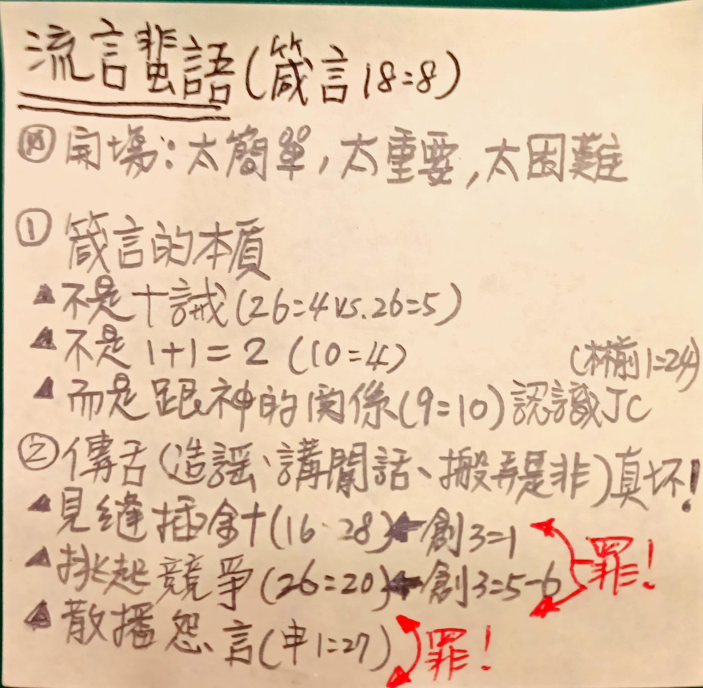

經文：   箴言 18:8 傳舌人的言語如同美食， 深入人的心腹。   
題目：   流言蜚語  
日期：   2023-04-30  
教會：   信義會光復教會  

## 解經 (Exegesis)

- (0) 短短一節，太簡單，太重要，太困難！
	- 太簡單：八卦，小學生都懂 😀——打開報紙、網路、電視、手機就明白 😀
	- 太重要：全人類失敗的起點！
	- 太困難：大家都不想成為八卦，但大家都喜歡聽八卦
		- 演藝圈、政治圈都一樣，不怕壞消息，就怕沒消息 😢 媒體、觀眾、網路共生結構 ...
		- 大家都不喜歡狗仔隊，但大家都喜歡看狗仔隊拍的影片！
		- 聖經跟心靈雞湯、公民道德、菜根譚有什麼差別？
- (1) 首先必須明白箴言這卷書的特別之處——是神的話，但：
	- 不是誡命 (e.g. 十誡) 要你一條一條去遵行的
		- Pro 26:4 不要照愚昧人的愚妄話回答他，恐怕你與他一樣。 
		- Pro 26:5 要照愚昧人的愚妄話回答他，免得他自以為有智慧。 
		- 怎麼辦？——答案是：看情況 😀
	- 也不是放諸四海皆準的科學定律 or 絕對真理
		- Pro 10:4 手懶的，要受貧窮；手勤的，卻要富足。 
		- 這句話沒錯——在大多數的情況下；但真實人生總有例外，有懶惰的富二代，也有勤勤懇懇的的資源回收業者
	- 而是讓我們得「智慧」的 一卷書！
		- 不是地上的、人間的智慧聰明；而是天上的、上帝的智慧和聰明
		- 關鍵經文：
			- Pro 9:10 敬畏耶和華是智慧的開端；認識至聖者便是聰明。 
				- 真正的「智慧」，是敬畏神、認識神 ⇒ 「智慧」不僅只是 IQ (智商)、EQ (情商)，*更重要的是 SQ (靈商)，是你對神的態度 & 你與神的關係！*
			- 1Co 1:24 但在那蒙召的，無論是猶太人、希臘人，基督總為上帝的能力，上帝的智慧。 
				- *耶穌基督就是神的智慧！*
		- 關鍵：**真正的「智慧」就是認識耶穌！**
- (2) 然後才能看懂今天的經文：Pro 18:8 = 26:22 傳舌人的言語如同美食， 深入人的心腹。
	- 傳舌人 = 造謠的人 (和修本) = 講閒話的人 (現代中文譯本) = 搬弄是非的人 (新譯本) ——三種結果：
		- Pro 16:28 乖僻人播散紛爭； 傳舌的，*離間密友*。 ⇒ (2a) 見縫插針
		- Pro 26:20 火缺了柴就必熄滅； 無人傳舌，*爭競便止息*。 ⇒ (2b) 挑起競爭
		- Deu 1:27 在帳棚內*發怨言*說：『耶和華因為恨我們，所以將我們從埃及地領出來，要交在亞摩利人手中，除滅我們。  ⇒ (2c) 抱怨環境 = 抱怨上帝，扭曲真相！
			- Ps 106:25 在自己帳棚內*發怨言* ， 不聽耶和華的聲音。
			- Isa 29:24 心中迷糊的必得明白； *發怨言的*必受訓誨。 
	- (2a) 見縫插針 ⇒ 創3 撒旦就在做這件事！
		- Gen 3:1 蛇對女人說：「上帝豈是真說不許你們吃園中所有樹上的果子嗎？」 
	- (2b) 挑起競爭 ⇒ 創3 果然奏效！
		- Gen 3:5 因為上帝知道，你們吃的日子眼睛就明亮了，你們便如上帝能知道善惡。」
		- Gen 3:6  於是女人見那棵樹的果子好作食物，也悅人的眼目，且是可喜愛的，能使人有智慧，就摘下果子來吃了，又給她丈夫，她丈夫也吃了。 
	- (2c) 抱怨上帝 ⇒ 以色列人的下場 😢 繞行38.5 年，死光光
	- **WHY 傳舌？** 
		- 為了抬高自己，為了打壓別人，為了破壞人與人、人與神的關係 ⇒ **都是因為罪的緣故！**
	- 結論：傳舌人 = 撒旦的同路人❗😢
- (3) 傳舌頭的人很壞——但，聽的人呢，「如同美食， 深入人的心腹」——也半斤八兩！
	- 因為我們都是罪人，因為我們都自救無力 😢
		- 遇到美食，就深入心腹了；聽到八卦，耳朵就豎起來了！
	- 關鍵：不是不知道，而是做不到 😢
	- 除非：我們認識耶穌 = 真正的智慧 ⇒ 除非，我們說：主，我願像你！ (回應詩歌)
		- 你想要不說八卦嗎？你想要不聽八卦嗎？你想要不當撒旦的同路人 & 爪牙嗎？
		- 我們一起來認識那真正的「智慧」   
		  ⇒ 我們一起來認識耶穌！   
		  ⇒ 我們一起禱告：主，我願像你！

## 大綱 (Outline)

- (0) 開場：
	- 短短一節，太簡單，太重要，太困難！
- (1) 先搞懂箴言的本質：
	- 不是十誡 (箴26:4 vs. 箴26:5)
	- 不是 1+1 = 2 (箴10:4)
	- 而是跟神的關係 (箴9:10)，是認識耶穌 (林前 1:24)
- (2) 傳舌 (造謠、講閒話、搬弄是非) 的人真壞！
	- (2a) 見縫插針 (箴16:28) ⇐ 人類失敗的開端 (創3:1) ⇐ 因為罪性！
	- (2b) 挑起競爭 (箴26:20) ⇐ 人類失敗的根源 (創3:5-6) ⇐ 因為罪性！
	- (2c) 散播怨言 (申1:27) ⇐ 以色列失敗的起點 ⇐ 因為罪性！
- (3) 聽八卦的人也壞！
	- 關鍵：不是不知道，而是做不到 😢
- (4) 除非：認識耶穌，唱：主，我願像你！

## 小抄 (memo)

---

[講道筆記↵](README.md)

