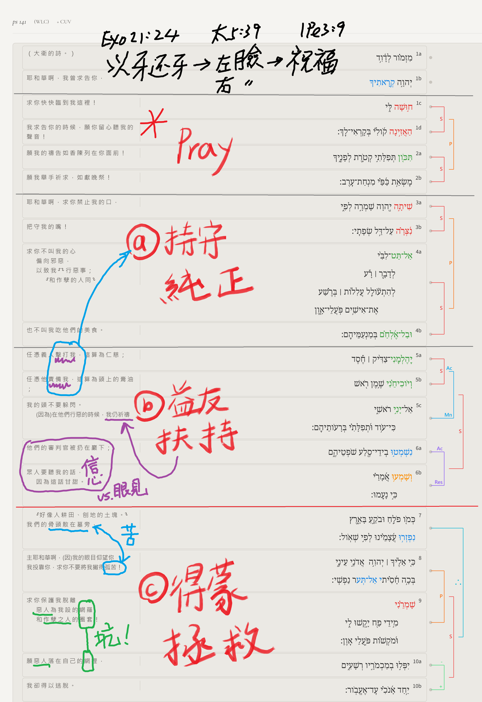

經文：詩篇141   
題目：愛的糾正   
日期：2026-08-16   
教會：台中活水浸信會   

## 解經 (Exegesis)
- 分段：
	- 1（大衛的詩。）耶和華啊，我曾求告你，
	- 求你快快臨到我這裡！我求告你的時候，願你留心聽我的聲音！ 2願我的禱告如香陳列在你面前！願我舉手祈求，如獻晚祭！ 
	- 3耶和華啊，求你禁止我的口，把守我的嘴！ 4求你不叫我的心偏向邪惡，以致我和作孽的人同行惡事；也不叫我吃他們的美食。 
	- 5任憑義人擊打我，這算為仁慈；任憑他責備我，這算為頭上的膏油；我的頭不要躲閃。正在他們行惡的時候，我仍要祈禱。 6他們的審判官被扔在巖下；眾人要聽我的話，因為這話甘甜。 
	- 7我們的骨頭散在墓旁，好像人耕田、刨地的土塊。 8主─耶和華啊，我的眼目仰望你；我投靠你，求你不要將我撇得孤苦！ 9求你保護我脫離惡人為我設的網羅和作孽之人的圈套！ 10願惡人落在自己的網裡，我卻得以逃脫。

## 語意圖析 (Semantic Diagram)

## 大綱 (Outline)
- 基督徒讀舊約 vs. 猶太人讀舊約
	- 以牙還牙
		- Exo 21:24 以眼還眼，以牙還牙，以手還手，以腳還腳， 
		- 10 月 28 日晚，以色列總理內塔尼亞胡向全國發表演說。他為加薩戰爭辯護，將哈馬斯比喻為聖經中的亞瑪力人。內塔尼亞胡引用了 《申命記》25:17 ：“你要記念亞瑪力人向你所做的事。”然而， 《申命記》25:19 繼續說：「你們要從天下塗抹亞瑪力人的名號，永不忘記！」希伯來聖經後來在 《撒母耳記上》 中呼籲殺光整個亞瑪力民族——這個民族極其反猶太——以及他們的牲畜。
		- Deu 25:17-19  你要紀念你們出埃及的時候，亞瑪力人在路上怎樣待你。 他們在路上遇見你，趁你疲乏困倦擊殺你儘後邊軟弱的人，並不敬畏　神。 所以耶和華─你　神使你不被四圍一切的仇敵擾亂，在耶和華─你　神賜你為業的地上得享平安。那時，你要將亞瑪力的名號從天下塗抹了，不可忘記。 
	- 左臉右臉
		- Mat 5:38-40 你們聽見有話說：以眼還眼，以牙還牙。 只是我告訴你們，不要與惡人作對。有人打你的右臉，連左臉也轉過來由他打； 有人想要告你，要拿你的裡衣，連外衣也由他拿去； 
	- 倒要祝福、追求良善
		- 羅12:17 不要以惡報惡；眾人以為美的事要留心去做。 
		- 帖前5:15 你們要謹慎，無論是誰都不可以惡報惡；或是彼此相待，或是待眾人，常要追求良善。 
		- 彼前3:9 不以惡報惡，以辱罵還辱罵，倒要祝福；因你們是為此蒙召，好叫你們承受福氣。 
- 無能的大能、軟弱的剛強

## 小抄 (memo)

![[images/詩1.jpeg]]

![[images/詩2.jpeg]]

![[images/詩3.jpeg]]

---

[講道筆記↵](README.md)

