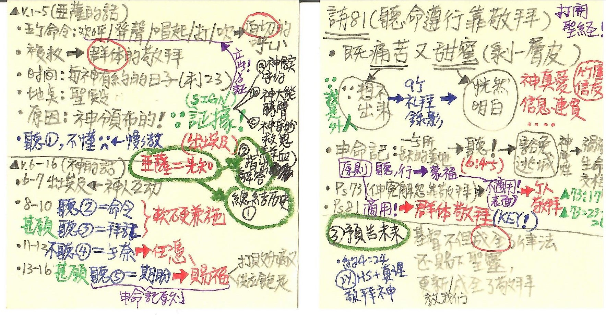

經文：詩篇 81  
題目：聽命遵行靠敬拜  
日期：2021-12-15  
教會：竹圍信友堂  
tags： #證道  #解經  

## 句法圖析 (Syntax Diagram)

## 解經 (Exegesis) & 大綱 (Outline)
####  先講結論 
- 神學院教的都用上了，不知道要講什麼 ⇒ 焦慮一天，恍然明白：我不夠格來講，因為我是外人，我不認識你們 ... ⇒ 把過去兩個多月的講道都聽一遍，不斷求問：主啊，你要對竹圍信友堂的弟兄姊妹說什麼？
- 上個禮拜——多倫牧師 (伸冤解怨靠敬拜)：亞薩親身體會：義人受苦、惡人享福 ⇒ 表面上的張力：申命記的原則<mark>不適用！</mark>
	- 轉捩點：**個人敬拜！**
		- Ps 73:17 等我進了神的聖所，思想他們的結局。 
	- 眼光：**從孤單→ 有神同在；從徬徨→蒙神引導；從地上→ 天上；從今生→ 永生；從屈辱→榮耀！**
		- Ps 73:24–26 你要以你的訓言引導我，以後必接我到榮耀裡。 除你以外，在天上我有誰呢？除你以外，在地上我也沒有所愛慕的。 我的肉體和我的心腸衰殘；但　神是我心裡的力量，又是我的福份，直到永遠。 
- 這個禮拜——申命記的原則<mark>適用！</mark>⇒ 關鍵在：<strong>群體的敬拜！！</strong>

####  再看經文
- ═══════ 1) Ps 81:1–5 亞薩說的話 ══════════════════════
- 歡呼 (‎הַרְנִינוּ )、吶喊 (‎הָרִיעוּ )、揚起 (‎שְׂאוּ ) 旋律、打起 (‎וּתְנוּ )鈴鼓+美琴+瑟、吹響 (‎תִּקְעוּ ) 號角 ⇒ 連續五個命令語氣 = *現在、熱切的呼籲！！*，複數 = *群體！！* 
	- 敬拜的人：全體以色列人，不只是利未人！
	- 敬拜的時間：月朔、月望、節期 = 神所定的日子 = 所有與神有約的日子！
	- 敬拜的地點：聖殿 ( ∵ 群體聚集)
	- 原因：
		- 律例 (‎חֹק ) = 接收端：以色列的責任，執行神所頒布的命令 
		- 典章 (‎מִשְׁפָּט ) = 發送端：上帝的主權，神主動頒布了命令
		- 見證 (‎עֵדוּת ) ⇒ 神在以色列家中立下的記號 (sign)，證明：
			- a) 神信實守約 (亞伯拉罕之約)
			- b) 神大能膀臂 (勝過埃及諸神)
			- c) 神奇妙救恩 (逾越節羔羊流血)
- Ps 81:5c 我在那裡<mark>**聽見°¹**</mark>我所不明白的言語：
	- 我 = 亞薩，代表以色列人 ...
	- 有**聽見°¹**，但聽不懂
- ═══════ 2) Ps 81:6–16 神說的話  ══════════════════════
- <strong>Ps 81:6 是 #1 ⇒ #3 人稱</strong>
	- 我從他肩上挪去重擔；他的手從筐子抽開
- <strong>Ps 81:7 是 #1 ⇒ #2 人稱</strong>
	- 在急難中你呼求，我就搭救你；我在雷的隱密處應允你，在米利巴水那裡試驗你。 
		- 出 2:23–25 ... 以色列人因做苦工，就歎息哀求，他們的哀聲達於　神。 神聽見他們的哀聲，就紀念他與亞伯拉罕、以撒、雅各所立的約。 ...
		- 出 3:7 耶和華說：我的百姓在埃及所受的困苦，我實在看見了；他們因受督工的轄制所發的哀聲，我也聽見了。我原知道他們的痛苦， 
		- 出 19:16–19 到了第三天早晨，在山上有雷轟、閃電，和密雲，並且角聲甚大，營中的百姓盡都發顫。 摩西率領百姓出營迎接　神，都站在山下。... 摩西就說話，　神有聲音答應他。 
		- 出 17:7 他給那地方起名叫瑪撒（就是試探的意思），又叫米利巴（就是爭鬧的意思）；因以色列人爭鬧，又因他們試探 (‎נַסֹּתָם ) 耶和華，說：耶和華是在我們中間不是？
	- Exo 17:2, 7 試探 (‎נַסֹּתָם ) ⇒ 人試驗神 // 神試驗人 (創 22:1; 出 16:4)，都是同一個字；Ps 81:7 試驗 (‎אֶבְחָנְךָ ) =金屬熬煉的過程
		- 目的：看人肯不肯聽耶和華的話！ 看人信不信得過神！！
- ················ 細拉 (‎סֶֽלָה )：音樂符號 = 音調升高 or 休止符 or 改換聲調 ················
- <strong>Ps 81:8–10 是 #1 ⇒ #2 人稱</strong>
	- 我的民哪，**你當聽°²**，我要勸戒你；以色列啊，甚願**你肯聽從°³**我。 在你當中，不可有別的神；外邦的神，你也不可下拜。 <mark>我是耶和華─你的　神，曾把你從埃及地領上來</mark>；你要大大張口，我就給你充滿。 
	- **你當聽°²**= 命令、來硬的 ＋ 甚願**你肯聽°³**= 期盼、來軟的 ⇐ 軟硬兼施的上帝
		- 申 6:4–5 <mark>以色列阿，你要聽！耶和華─我們　神是獨一的主。 你要盡心、盡性、盡力愛耶和華─你的　神。 </mark>
		- 出 20:2 我是耶和華─你的　神，曾將你從埃及地為奴之家領出來。 
		- 申 5:6 我是耶和華─你的　神，曾將你從埃及地為奴之家領出來。 
- <strong>Ps 81:11–16 是 #1 ⇒ #3 人稱</strong>
	- Ps 81:11–12 無奈，我的民**不聽°⁴**我的聲音；以色列全不理我。 我便任憑他們心裡剛硬，隨自己的計謀而行。 
	- Ps 81:13–14 甚願**我的民肯聽從°⁵**我，以色列肯行我的道， 我便速速治服他們的仇敵，反手攻擊他們的敵人。 
	- Ps 81:15 恨耶和華的人必在他 (以色列) or 祂 (耶和華) 面前恐懼畏縮 cringe in fear (‎יְכַחֲשׁוּ־לוֹ )；他們 (恨耶和華的人) 恐懼畏縮的日子必到永遠
		- Holladay & HALOT 都把 (‎יְכַחֲשׁוּ־לוֹ ) 解讀成：假意歸順 (新譯本; NASB; HCSB)；LXX 也翻譯成 ἐψεύσαντο (欺騙) ⇐ 語意不通 
		- NIV/ESV/NET 翻譯成「畏縮 cringe」⇐ 比較好
	-  Ps 81:16 祂 (耶和華) 也必拿上好的麥子給他們 (以色列) 吃；祂 (耶和華) 又拿從磐石出的蜂蜜叫他們  (以色列) 飽足。 ⇐ 比較好
		-  LXX Ps. 80:17: καὶ ἐψώμισεν *αὐτοὺς* ἐκ στέατος πυροῦ καὶ ἐκ πέτρας μέλι ἐχόρτασεν *αὐτούς*.
			-  有可能：Ps 81:16 他 (以色列) 也必拿上好的麥子給他們 (恨耶和華的人) 吃；他 (以色列) 又拿從磐石出的蜂蜜叫他們 (恨耶和華的人) 飽足。
		-  申 32:13–14 耶和華使他乘駕地的高處，得吃田間的土產；又使他從磐石中咂蜜，從堅石中吸油； 也吃牛的奶油，羊的奶，羊羔的脂油，巴珊所出的公綿羊和山羊，與上好的麥子，也喝葡萄汁釀的酒。 
- <mark><strong>五個聽：聽見°¹ (不懂) → 聽°² (命令) → 聽°³ (拜託) →不聽°⁴ (無奈) → 聽°⁵ (期盼)</strong></mark>

####  整合出信息！
- 這個禮拜——申命記的原則<mark>適用！</mark>  ⇒ 關鍵在：<strong>群體的敬拜！！</strong>
	- 亞薩的身分 = 敬拜團 + 詩人 + **先見 (先知) **
		- 代上 25:1 大衛和眾首領分派亞薩、希幔，並耶杜頓的子孫彈琴、鼓瑟、敲鈸、*唱歌(原文作說預言*；本章同)。他們供職的人數記在下面： 
		- 代下 29:30 希西家王與眾首領又吩咐利未人用大衛和*先見亞薩*的詩詞頌讚耶和華；他們就歡歡喜喜地頌讚耶和華，低頭敬拜。 
- 亞薩先知的角色：① 總結歷史 ...
	- 出埃及 @ 1450 BC～亞薩 @1000 BC 寫詩 ≒ 400 年的回顧與總結！
		- 王上 6:1 以色列人出埃及地後四百八十年，所羅門作以色列王第四年 (≒ 967 BC) 西弗月，就是二月，開工建造耶和華的殿。 ⇒ 967 + 480 ≒ 1450 BC
- 亞薩先知的角色：②指出解答 ...
	- <mark><strong>五個聽：聽見°¹ (不懂) → 聽°² (命令) → 聽°³ (拜託) →不聽°⁴ (無奈) → 聽°⁵ (期盼)</strong></mark> 
	- 聽了就蒙福，為什麼不聽？問題出在哪裡？？如何解決？？ ——Ps 81 前後兩半合在一起，亞薩給了我們答案 ⇒ 問題出在：<strong>群體的敬拜！！</strong>
- 亞薩先知的角色：③ 預告未來 ...
	- 耶穌來不但成全了律法，還賜下聖靈，更新了我們的敬拜！！
	-  約 4:24 神是靈，敬拜他的必須靠著**聖靈**按著**真理**敬拜他。(新譯本)

---
- ═════════════════════════════
- Torah 的總綱  ⇒ 必須等候等候耶穌親自<mark>成全</mark>，也賜下聖靈的能力來幫助我們成全！
	- 以色列聽了嗎？ ············································· 如果聽了，就不會亡國了 😭
		- 亞薩之前：大衛；亞薩之後：所羅門？希西家？約西亞？
		- 五百年出四個 😲 ⇐ 比鐵樹開花還困難 😭
	- 申 6:4–5 以色列阿，<mark>**你要聽！** </mark>耶和華─我們　神是獨一的主。 你要盡心、盡性、盡力愛耶和華─你的　神。 
	- 太 5:17 莫想我來要廢掉律法和先知。我來不是要廢掉，乃是要成全。 
	- 約 14:24–26 不愛我的人就不遵守我的道。**你們所聽見的道**不是我的，乃是差我來之父的道。 我還與你們同住的時候，已將這些話對你們說了。 但**保惠師**，就是父因我的名所要差來的聖靈，*他要將一切的事指教你們，並且要叫你們想起我對你們所說的一切話。 *
	- 腓 3:3 因為真受割禮的，乃是我們這以**神的靈**敬拜、在基督耶穌裡誇口、不靠著肉體的。 

## 小抄 (memo)

---
[講道筆記↵](README.md)
