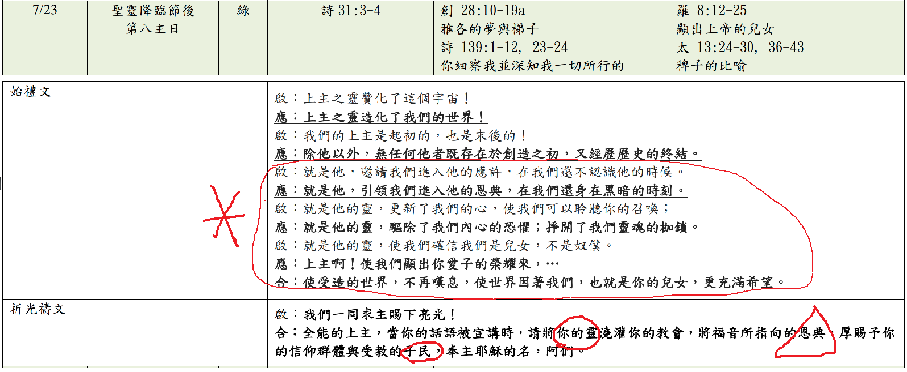

經文：羅馬書8:12-25  
題目：榮耀的盼望 (二)   
日期：2023-07-23   
教會：台北衛理堂   

## 句法 (Syntax)

- 8:12a <RUBY><ruby><ruby>Ἄρα<rt>ἄρα</rt></ruby><rt>So</rt></ruby><rt>PRT</rt></RUBY> <RUBY><ruby><ruby>οὖν,<rt>οὖν</rt></ruby><rt>then</rt></ruby><rt>CONJ</rt></RUBY> <RUBY><ruby><ruby>ἀδελφοί,<rt>ἀδελφός</rt></ruby><rt>brothers</rt></ruby><rt>N-VPM</rt></RUBY> 
- ═════════════
- 8:12b (<RUBY><ruby><ruby>ὀφειλέται<rt>ὀφειλέτης</rt></ruby><rt>debtors</rt></ruby><rt>N-NPM</rt></RUBY>)C (<RUBY><ruby><ruby><strong><strong>ἐσμέν</strong></strong><rt>εἰμί</rt></ruby><rt>we are</rt></ruby><rt>V-PAI-1P</rt></RUBY>)P (<RUBY><ruby><ruby>οὐ<rt>οὐ</rt></ruby><rt>not</rt></ruby><rt>PRT-N</rt></RUBY> ‹<RUBY><ruby><ruby>τῇ<rt>ὁ</rt></ruby><rt>to the</rt></ruby><rt>T-DSF</rt></RUBY> <RUBY><ruby><ruby>σαρκὶ<rt>σάρξ</rt></ruby><rt>flesh</rt></ruby><rt>N-DSF</rt></RUBY>›)A{ <RUBY><ruby><ruby>τοῦ<rt>ὁ</rt></ruby><rt>-</rt></ruby><rt>T-GSN</rt></RUBY> [(<RUBY><ruby><ruby>κατὰ<rt>κατά</rt></ruby><rt>according to</rt></ruby><rt>PREP</rt></RUBY> <RUBY><ruby><ruby>σάρκα<rt>σάρξ</rt></ruby><rt>flesh</rt></ruby><rt>N-ASF</rt></RUBY>)a (<RUBY><ruby><ruby><em>ζῆν,</em><rt>ζάω</rt></ruby><rt>to live</rt></ruby><rt>V-PAN</rt></RUBY>)p] }A
	- 8:13a <RUBY><ruby><ruby>εἰ<rt>εἰ</rt></ruby><rt>If</rt></ruby><rt>CONJ</rt></RUBY> <RUBY><ruby><ruby>γὰρ<rt>γάρ</rt></ruby><rt>for</rt></ruby><rt>CONJ</rt></RUBY> (<RUBY><ruby><ruby>κατὰ<rt>κατά</rt></ruby><rt>according to</rt></ruby><rt>PREP</rt></RUBY> <RUBY><ruby><ruby>σάρκα<rt>σάρξ</rt></ruby><rt>flesh</rt></ruby><rt>N-ASF</rt></RUBY>)A (<RUBY><ruby><ruby><strong><strong>ζῆτε,</strong></strong><rt>ζάω</rt></ruby><rt>you live</rt></ruby><rt>V-PAI-2P</rt></RUBY>)P
- 8:13b (<RUBY><ruby><ruby><strong><strong>μέλλετε</strong></strong><rt>μέλλω</rt></ruby><rt>you are about</rt></ruby><rt>V-PAI-2P</rt></RUBY>)P (<RUBY><ruby><ruby><em>ἀποθνήσκειν·</em><rt>ἀποθνήσκω</rt></ruby><rt>to die</rt></ruby><rt>V-PAN</rt></RUBY>)C
	- 8:13c <RUBY><ruby><ruby>εἰ<rt>εἰ</rt></ruby><rt>if</rt></ruby><rt>CONJ</rt></RUBY> <RUBY><ruby><ruby>δὲ<rt>δέ</rt></ruby><rt>however</rt></ruby><rt>CONJ</rt></RUBY> (<RUBY><ruby><ruby>πνεύματι<rt>πνεῦμα</rt></ruby><rt>by [the] Spirit</rt></ruby><rt>N-DSN</rt></RUBY>)A (<RUBY><ruby><ruby>τὰς<rt>ὁ</rt></ruby><rt>the</rt></ruby><rt>T-APF</rt></RUBY> <RUBY><ruby><ruby>πράξεις<rt>πρᾶξις</rt></ruby><rt>deeds</rt></ruby><rt>N-APF</rt></RUBY> <RUBY><ruby><ruby>τοῦ<rt>ὁ</rt></ruby><rt>of the</rt></ruby><rt>T-GSN</rt></RUBY> <RUBY><ruby><ruby>σώματος<rt>σῶμα</rt></ruby><rt>body</rt></ruby><rt>N-GSN</rt></RUBY>)C (<RUBY><ruby><ruby><strong><strong>θανατοῦτε,</strong></strong><rt>θανατόω</rt></ruby><rt>you put to death</rt></ruby><rt>V-PAI-2P</rt></RUBY>)P 
- 8:13d (<RUBY><ruby><ruby><strong><strong>ζήσεσθε.</strong></strong><rt>ζάω</rt></ruby><rt>you will live</rt></ruby><rt>V-FDI-2P</rt></RUBY>)P 
- ———————————
	- 8:14a (<RUBY><ruby><ruby>ὅσοι<rt>ὅσος</rt></ruby><rt>As many as</rt></ruby><rt>K-NPM</rt></RUBY>)S <RUBY><ruby><ruby>γὰρ<rt>γάρ</rt></ruby><rt>for</rt></ruby><rt>CONJ</rt></RUBY> (<RUBY><ruby><ruby>Πνεύματι<rt>πνεῦμα</rt></ruby><rt>by [the] Spirit</rt></ruby><rt>N-DSN</rt></RUBY> <RUBY><ruby><ruby>Θεοῦ<rt>θεός</rt></ruby><rt>of God</rt></ruby><rt>N-GSM</rt></RUBY>)A (<RUBY><ruby><ruby><strong><strong>ἄγονται,</strong></strong><rt>ἄγω</rt></ruby><rt>are led</rt></ruby><rt>V-PPI-3P</rt></RUBY>)P 
- 8:14b (<RUBY><ruby><ruby>οὗτοι<rt>οὗτος</rt></ruby><rt>these</rt></ruby><rt>D-NPM</rt></RUBY>)S (<RUBY><ruby><ruby>υἱοί<rt>υἱός</rt></ruby><rt>sons</rt></ruby><rt>N-NPM</rt></RUBY> <RUBY><ruby><ruby>Θεοῦ<rt>θεός</rt></ruby><rt>of God</rt></ruby><rt>N-GSM</rt></RUBY>)C (<RUBY><ruby><ruby><strong><strong>εἰσιν.</strong></strong><rt>εἰμί</rt></ruby><rt>are</rt></ruby><rt>V-PAI-3P</rt></RUBY>)P 
- ⋯⋯⋯⋯⋯⋯⋯
- 8:15a <RUBY><ruby><ruby>Οὐ<rt>οὐ</rt></ruby><rt>Not</rt></ruby><rt>PRT-N</rt></RUBY> <RUBY><ruby><ruby>γὰρ<rt>γάρ</rt></ruby><rt>for</rt></ruby><rt>CONJ</rt></RUBY> (<RUBY><ruby><ruby><strong><strong>ἐλάβετε</strong></strong><rt>λαμβάνω</rt></ruby><rt>you have received</rt></ruby><rt>V-AAI-2P</rt></RUBY>)P (<RUBY><ruby><ruby>πνεῦμα<rt>πνεῦμα</rt></ruby><rt>a spirit</rt></ruby><rt>N-ASN</rt></RUBY> <RUBY><ruby><ruby>δουλείας<rt>δουλεία</rt></ruby><rt>of bondage</rt></ruby><rt>N-GSF</rt></RUBY>)C (<RUBY><ruby><ruby>πάλιν<rt>πάλιν</rt></ruby><rt>again</rt></ruby><rt>ADV</rt></RUBY>)A (<RUBY><ruby><ruby>εἰς<rt>εἰς</rt></ruby><rt>to</rt></ruby><rt>PREP</rt></RUBY> <RUBY><ruby><ruby>φόβον<rt>φόβος</rt></ruby><rt>fear</rt></ruby><rt>N-ASM</rt></RUBY>)A
- 8:15b <RUBY><ruby><ruby>ἀλλὰ<rt>ἀλλά</rt></ruby><rt>but</rt></ruby><rt>CONJ</rt></RUBY> (<RUBY><ruby><ruby><strong><strong>ἐλάβετε</strong></strong><rt>λαμβάνω</rt></ruby><rt>you have received</rt></ruby><rt>V-AAI-2P</rt></RUBY>)P (<mark><RUBY><ruby><ruby>πνεῦμα<rt>πνεῦμα</rt></ruby><rt>[the] Spirit</rt></ruby><rt>N-ASN</rt></RUBY> <RUBY><ruby><ruby>υἱοθεσίας<rt>υἱοθεσία</rt></ruby><rt>of divine adoption as sons</rt></ruby><rt>N-GSF</rt></RUBY>°¹</mark>)C
	- 8:15c (<RUBY><ruby><ruby>ἐν<rt>ἐν</rt></ruby><rt>by</rt></ruby><rt>PREP</rt></RUBY> <RUBY><ruby><ruby>ᾧ°¹⮥<rt>ὅς</rt></ruby><rt>whom</rt></ruby><rt>R-DSN</rt></RUBY>)A (<RUBY><ruby><ruby><strong><strong>κράζομεν·</strong></strong><rt>κράζω</rt></ruby><rt>we cry</rt></ruby><rt>V-PAI-1P</rt></RUBY>)P (<RUBY><ruby><ruby>Ἀββᾶ<rt>ἀββά</rt></ruby><rt>Abba!</rt></ruby><rt>N-VSM</rt></RUBY> <RUBY><ruby><ruby>ὁ<rt>ὁ</rt></ruby><rt>-</rt></ruby><rt>T-VSM</rt></RUBY> <RUBY><ruby><ruby>Πατήρ.<rt>πατήρ</rt></ruby><rt>Father!</rt></ruby><rt>N-VSM</rt></RUBY>)C
- 8:16a (<RUBY><ruby><ruby>αὐτὸ<rt>αὐτός</rt></ruby><rt>Himself</rt></ruby><rt>P-NSN</rt></RUBY> <RUBY><ruby><ruby>τὸ<rt>ὁ</rt></ruby><rt>the</rt></ruby><rt>T-NSN</rt></RUBY> <RUBY><ruby><ruby>Πνεῦμα<rt>πνεῦμα</rt></ruby><rt>Spirit</rt></ruby><rt>N-NSN</rt></RUBY>)S (<RUBY><ruby><ruby><strong><strong>συμμαρτυρεῖ</strong></strong><rt>συμμαρτυρέω</rt></ruby><rt>bears witness with</rt></ruby><rt>V-PAI-3S</rt></RUBY>)P (<RUBY><ruby><ruby>τῷ<rt>ὁ</rt></ruby><rt>the</rt></ruby><rt>T-DSN</rt></RUBY> <RUBY><ruby><ruby>πνεύματι<rt>πνεῦμα</rt></ruby><rt>spirit</rt></ruby><rt>N-DSN</rt></RUBY> <RUBY><ruby><ruby>ἡμῶν<rt>ἐγώ</rt></ruby><rt>of us</rt></ruby><rt>P-1GP</rt></RUBY>)C
	- 8:16b <RUBY><ruby><ruby>ὅτι<rt>ὅτι</rt></ruby><rt>that</rt></ruby><rt>CONJ</rt></RUBY> (<RUBY><ruby><ruby><strong><strong>ἐσμὲν</strong></strong><rt>εἰμί</rt></ruby><rt>we are</rt></ruby><rt>V-PAI-1P</rt></RUBY>)P (<RUBY><ruby><ruby>τέκνα<rt>τέκνον</rt></ruby><rt>children</rt></ruby><rt>N-NPN</rt></RUBY> <RUBY><ruby><ruby>Θεοῦ.<rt>θεός</rt></ruby><rt>of God</rt></ruby><rt>N-GSM</rt></RUBY>)C
- ———————————
	- 8:17a <RUBY><ruby><ruby>εἰ<rt>εἰ</rt></ruby><rt>If</rt></ruby><rt>CONJ</rt></RUBY> <RUBY><ruby><ruby>δὲ<rt>δέ</rt></ruby><rt>now</rt></ruby><rt>CONJ</rt></RUBY> (<RUBY><ruby><ruby>τέκνα,<rt>τέκνον</rt></ruby><rt>children</rt></ruby><rt>N-NPN</rt></RUBY>)C
- 8:17b (<RUBY><ruby><ruby>καὶ<rt>καί</rt></ruby><rt>also</rt></ruby><rt>CONJ</rt></RUBY>)A (<RUBY><ruby><ruby>κληρονόμοι·<rt>κληρονόμος</rt></ruby><rt>heirs</rt></ruby><rt>N-NPM</rt></RUBY>)C 
- 8:17c (<RUBY><ruby><ruby>κληρονόμοι<rt>κληρονόμος</rt></ruby><rt>heirs</rt></ruby><rt>N-NPM</rt></RUBY>)⦇ <RUBY><ruby><ruby>μὲν<rt>μέν</rt></ruby><rt>indeed</rt></ruby><rt>PRT</rt></RUBY> ⦈(<RUBY><ruby><ruby>Θεοῦ,<rt>θεός</rt></ruby><rt>of God</rt></ruby><rt>N-GSM</rt></RUBY>)C 
- 8:17d (<RUBY><ruby><ruby>συνκληρονόμοι<rt>συγκληρονόμος</rt></ruby><rt>joint-heirs</rt></ruby><rt>A-NPM</rt></RUBY>)⦇ <RUBY><ruby><ruby>δὲ<rt>δέ</rt></ruby><rt>now</rt></ruby><rt>CONJ</rt></RUBY> (<RUBY><ruby><ruby>Χριστοῦ,<rt>Χριστός</rt></ruby><rt>of Christ</rt></ruby><rt>N-GSM-T</rt></RUBY>)C ...<mark>**ἐσμέν°²**</mark> ...
	- 8:17e { <RUBY><ruby><ruby>εἴπερ<rt>εἴπερ</rt></ruby><rt>if indeed</rt></ruby><rt>CONJ</rt></RUBY> (<RUBY><ruby><ruby><strong>συμπάσχομεν</strong><rt>συμπάσχω</rt></ruby><rt>we suffer with [Him]</rt></ruby><rt>V-PAI-1P</rt></RUBY>)P }A°²⮥
	- 8:17f {<RUBY><ruby><ruby>ἵνα<rt>ἵνα</rt></ruby><rt>so that</rt></ruby><rt>CONJ</rt></RUBY> (<RUBY><ruby><ruby>καὶ<rt>καί</rt></ruby><rt>also</rt></ruby><rt>CONJ</rt></RUBY>)A (<RUBY><ruby><ruby><strong><strong>συνδοξασθῶμεν.¶</strong></strong><rt>συνδοξάζω</rt></ruby><rt>we may be glorified together</rt></ruby><rt>V-APS-1P</rt></RUBY>)P }A°²⮥
- ═════════════
- 8:18a (<RUBY><ruby><ruby><strong><strong>Λογίζομαι</strong></strong><rt>λογίζομαι</rt></ruby><rt>I reckon</rt></ruby><rt>V-PNI-1S</rt></RUBY>)P <RUBY><ruby><ruby>γὰρ<rt>γάρ</rt></ruby><rt>for</rt></ruby><rt>CONJ</rt></RUBY>
	- 8:18b <RUBY><ruby><ruby>ὅτι<rt>ὅτι</rt></ruby><rt>that</rt></ruby><rt>CONJ</rt></RUBY> <RUBY><ruby><ruby>οὐκ<rt>οὐ</rt></ruby><rt>not</rt></ruby><rt>PRT-N</rt></RUBY> (<RUBY><ruby><ruby>ἄξια<rt>ἄξιος</rt></ruby><rt>comparable</rt></ruby><rt>A-NPN</rt></RUBY>)C (<RUBY><ruby><ruby>τὰ<rt>ὁ</rt></ruby><rt>the</rt></ruby><rt>T-NPN</rt></RUBY> <RUBY><ruby><ruby>παθήματα<rt>πάθημα</rt></ruby><rt>sufferings</rt></ruby><rt>N-NPN</rt></RUBY> ‹<RUBY><ruby><ruby>τοῦ<rt>ὁ</rt></ruby><rt>of the</rt></ruby><rt>T-GSM</rt></RUBY> <RUBY><ruby><ruby>νῦν<rt>νῦν</rt></ruby><rt>present</rt></ruby><rt>ADV</rt></RUBY> <RUBY><ruby><ruby>καιροῦ<rt>καιρός</rt></ruby><rt>time [are]</rt></ruby><rt>N-GSM</rt></RUBY>›)S {<RUBY><ruby><ruby>πρὸς<rt>πρός</rt></ruby><rt>to</rt></ruby><rt>PREP</rt></RUBY> <RUBY><ruby><ruby>τὴν<rt>ὁ</rt></ruby><rt>the</rt></ruby><rt>T-ASF</rt></RUBY> <RUBY><ruby><ruby><em><em>μέλλουσαν</em></em><rt>μέλλω</rt></ruby><rt>coming</rt></ruby><rt>V-PAP-ASF</rt></RUBY> <RUBY><ruby><ruby>δόξαν<rt>δόξα</rt></ruby><rt>glory</rt></ruby><rt>N-ASF</rt></RUBY> (<RUBY><ruby><ruby><em>ἀποκαλυφθῆναι</em><rt>ἀποκαλύπτω</rt></ruby><rt>to be revealed</rt></ruby><rt>V-APN</rt></RUBY> <RUBY><ruby><ruby>εἰς<rt>εἰς</rt></ruby><rt>to</rt></ruby><rt>PREP</rt></RUBY> <RUBY><ruby><ruby>ἡμᾶς.<rt>ἐγώ</rt></ruby><rt>us</rt></ruby><rt>P-1AP</rt></RUBY>) }A
- 8:19 (<RUBY><ruby><ruby>ἡ<rt>ὁ</rt></ruby><rt>The</rt></ruby><rt>T-NSF</rt></RUBY>)⦇ <RUBY><ruby><ruby>γὰρ<rt>γάρ</rt></ruby><rt>for</rt></ruby><rt>CONJ</rt></RUBY> ⦈(<RUBY><ruby><ruby>ἀποκαραδοκία<rt>ἀποκαραδοκία</rt></ruby><rt>earnest expectation</rt></ruby><rt>N-NSF</rt></RUBY> <RUBY><ruby><ruby>τῆς<rt>ὁ</rt></ruby><rt>of the</rt></ruby><rt>T-GSF</rt></RUBY> <RUBY><ruby><ruby>κτίσεως<rt>κτίσις</rt></ruby><rt>creation</rt></ruby><rt>N-GSF</rt></RUBY>)S (<RUBY><ruby><ruby>τὴν<rt>ὁ</rt></ruby><rt>the</rt></ruby><rt>T-ASF</rt></RUBY> <RUBY><ruby><ruby>ἀποκάλυψιν<rt>ἀποκάλυψις</rt></ruby><rt>revelation</rt></ruby><rt>N-ASF</rt></RUBY> <RUBY><ruby><ruby>τῶν<rt>ὁ</rt></ruby><rt>of the</rt></ruby><rt>T-GPM</rt></RUBY> <RUBY><ruby><ruby>υἱῶν<rt>υἱός</rt></ruby><rt>sons</rt></ruby><rt>N-GPM</rt></RUBY> <RUBY><ruby><ruby>τοῦ<rt>ὁ</rt></ruby><rt>-</rt></ruby><rt>T-GSM</rt></RUBY> <RUBY><ruby><ruby>Θεοῦ<rt>θεός</rt></ruby><rt>of God</rt></ruby><rt>N-GSM</rt></RUBY>)C (<RUBY><ruby><ruby><strong><strong>ἀπεκδέχεται.</strong></strong><rt>ἀπεκδέχομαι</rt></ruby><rt>awaits</rt></ruby><rt>V-PNI-3S</rt></RUBY>)P 
- 8:20 (<RUBY><ruby><ruby>τῇ<rt>ὁ</rt></ruby><rt>To the</rt></ruby><rt>T-DSF</rt></RUBY>)⦇ <RUBY><ruby><ruby>γὰρ<rt>γάρ</rt></ruby><rt>for</rt></ruby><rt>CONJ</rt></RUBY> ⦈(<RUBY><ruby><ruby>ματαιότητι<rt>ματαιότης</rt></ruby><rt>futility</rt></ruby><rt>N-DSF</rt></RUBY>)C (<RUBY><ruby><ruby>ἡ<rt>ὁ</rt></ruby><rt>the</rt></ruby><rt>T-NSF</rt></RUBY> <RUBY><ruby><ruby>κτίσις<rt>κτίσις</rt></ruby><rt>creation</rt></ruby><rt>N-NSF</rt></RUBY>)S (<mark><RUBY><ruby><ruby><strong><strong>ὑπετάγη,</strong></strong><rt>ὑποτάσσω</rt></ruby><rt>was subjected</rt></ruby><rt>V-API-3S</rt></RUBY>°²</mark>)P 
	- —— <RUBY><ruby><ruby>οὐχ<rt>οὐ</rt></ruby><rt>not</rt></ruby><rt>PRT-N</rt></RUBY> (<RUBY><ruby><ruby>ἑκοῦσα<rt>ἑκών</rt></ruby><rt>willingly</rt></ruby><rt>A-NSF</rt></RUBY>)A°²⮥
	- <RUBY><ruby><ruby>ἀλλὰ<rt>ἀλλά</rt></ruby><rt>but</rt></ruby><rt>CONJ</rt></RUBY> (<RUBY><ruby><ruby>διὰ<rt>διά</rt></ruby><rt>because of</rt></ruby><rt>PREP</rt></RUBY> <RUBY><ruby><ruby>τὸν<rt>ὁ</rt></ruby><rt>the [One]</rt></ruby><rt>T-ASM</rt></RUBY> <RUBY><ruby><ruby><em>ὑποτάξαντα,</em><rt>ὑποτάσσω</rt></ruby><rt>having subjected [it]</rt></ruby><rt>V-AAP-ASM</rt></RUBY>)A°²⮥ ———
	- (<RUBY><ruby><ruby>ἐφ᾽<rt>ἐπί</rt></ruby><rt>in</rt></ruby><rt>PREP</rt></RUBY> <RUBY><ruby><ruby>ἑλπίδι<rt>ἐλπίς</rt></ruby><rt>hope</rt></ruby><rt>N-DSF</rt></RUBY>)A°²⮥
	- 8:21a <RUBY><ruby><ruby>ὅτι<rt>ὅτι</rt></ruby><rt>that</rt></ruby><rt>CONJ</rt></RUBY> (<RUBY><ruby><ruby>καὶ<rt>καί</rt></ruby><rt>also</rt></ruby><rt>CONJ</rt></RUBY>)A (<RUBY><ruby><ruby>αὐτὴ<rt>αὐτός</rt></ruby><rt>itself</rt></ruby><rt>P-NSF</rt></RUBY> <RUBY><ruby><ruby>ἡ<rt>ὁ</rt></ruby><rt>the</rt></ruby><rt>T-NSF</rt></RUBY> <RUBY><ruby><ruby>κτίσις<rt>κτίσις</rt></ruby><rt>creation</rt></ruby><rt>N-NSF</rt></RUBY>)S (<RUBY><ruby><ruby><strong><strong>ἐλευθερωθήσεται</strong></strong><rt>ἐλευθερόω</rt></ruby><rt>will be set free</rt></ruby><rt>V-FPI-3S</rt></RUBY>)P 
		- (<RUBY><ruby><ruby>ἀπὸ<rt>ἀπό</rt></ruby><rt>from</rt></ruby><rt>PREP</rt></RUBY> <RUBY><ruby><ruby>τῆς<rt>ὁ</rt></ruby><rt>the</rt></ruby><rt>T-GSF</rt></RUBY> <RUBY><ruby><ruby>δουλείας<rt>δουλεία</rt></ruby><rt>bondage</rt></ruby><rt>N-GSF</rt></RUBY> <RUBY><ruby><ruby>τῆς<rt>ὁ</rt></ruby><rt>-</rt></ruby><rt>T-GSF</rt></RUBY> <RUBY><ruby><ruby>φθορᾶς<rt>φθορά</rt></ruby><rt>of decay</rt></ruby><rt>N-GSF</rt></RUBY>)A 
		- (<RUBY><ruby><ruby>εἰς<rt>εἰς</rt></ruby><rt>into</rt></ruby><rt>PREP</rt></RUBY> <RUBY><ruby><ruby>τὴν<rt>ὁ</rt></ruby><rt>the</rt></ruby><rt>T-ASF</rt></RUBY> <RUBY><ruby><ruby>ἐλευθερίαν<rt>ἐλευθερία</rt></ruby><rt>freedom</rt></ruby><rt>N-ASF</rt></RUBY> <RUBY><ruby><ruby>τῆς<rt>ὁ</rt></ruby><rt>of the</rt></ruby><rt>T-GSF</rt></RUBY> <RUBY><ruby><ruby>δόξης<rt>δόξα</rt></ruby><rt>glory</rt></ruby><rt>N-GSF</rt></RUBY> <RUBY><ruby><ruby>τῶν<rt>ὁ</rt></ruby><rt>of the</rt></ruby><rt>T-GPN</rt></RUBY> <RUBY><ruby><ruby>τέκνων<rt>τέκνον</rt></ruby><rt>children</rt></ruby><rt>N-GPN</rt></RUBY> <RUBY><ruby><ruby>τοῦ<rt>ὁ</rt></ruby><rt>-</rt></ruby><rt>T-GSM</rt></RUBY> <RUBY><ruby><ruby>Θεοῦ.<rt>θεός</rt></ruby><rt>of God</rt></ruby><rt>N-GSM</rt></RUBY>)A
- ═════════════
- 8:22a (<RUBY><ruby><ruby><strong><strong>Οἴδαμεν</strong></strong><rt>εἴδω</rt></ruby><rt>We know</rt></ruby><rt>V-RAI-1P</rt></RUBY>)P <RUBY><ruby><ruby>γὰρ<rt>γάρ</rt></ruby><rt>for</rt></ruby><rt>CONJ</rt></RUBY>
	- 8:22b <RUBY><ruby><ruby>ὅτι<rt>ὅτι</rt></ruby><rt>that</rt></ruby><rt>CONJ</rt></RUBY> (<RUBY><ruby><ruby>πᾶσα<rt>πᾶς</rt></ruby><rt>all</rt></ruby><rt>A-NSF</rt></RUBY> <RUBY><ruby><ruby>ἡ<rt>ὁ</rt></ruby><rt>the</rt></ruby><rt>T-NSF</rt></RUBY> <RUBY><ruby><ruby>κτίσις<rt>κτίσις</rt></ruby><rt>creation</rt></ruby><rt>N-NSF</rt></RUBY>)S (<RUBY><ruby><ruby><strong><strong>συστενάζει</strong></strong><rt>συστενάζω</rt></ruby><rt>groans together</rt></ruby><rt>V-PAI-3S</rt></RUBY>)P
	- 8:22c <RUBY><ruby><ruby>καὶ<rt>καί</rt></ruby><rt>and</rt></ruby><rt>CONJ</rt></RUBY> (<RUBY><ruby><ruby><strong><strong>συνωδίνει</strong></strong><rt>συνωδίνω</rt></ruby><rt>travails together</rt></ruby><rt>V-PAI-3S</rt></RUBY>)P (<RUBY><ruby><ruby>ἄχρι<rt>ἄχρι</rt></ruby><rt>until</rt></ruby><rt>PREP</rt></RUBY> <RUBY><ruby><ruby>τοῦ<rt>ὁ</rt></ruby><rt>-</rt></ruby><rt>T-GSM</rt></RUBY> <RUBY><ruby><ruby>νῦν·<rt>νῦν</rt></ruby><rt>now</rt></ruby><rt>ADV</rt></RUBY>)A
- 8:23a <RUBY><ruby><ruby>οὐ<rt>οὐ</rt></ruby><rt>Not</rt></ruby><rt>PRT-N</rt></RUBY> <RUBY><ruby><ruby>μόνον<rt>μόνος</rt></ruby><rt>only [so]</rt></ruby><rt>A-ASN</rt></RUBY> <RUBY><ruby><ruby>δέ,<rt>δέ</rt></ruby><rt>now</rt></ruby><rt>CONJ</rt></RUBY>
- 8:23b <RUBY><ruby><ruby>ἀλλὰ<rt>ἀλλά</rt></ruby><rt>but</rt></ruby><rt>CONJ</rt></RUBY> (<RUBY><ruby><ruby>καὶ<rt>καί</rt></ruby><rt>even</rt></ruby><rt>CONJ</rt></RUBY>)A {<RUBY><ruby><ruby>αὐτοὶ<rt>αὐτός</rt></ruby><rt>ourselves</rt></ruby><rt>P-NPM</rt></RUBY> [(<RUBY><ruby><ruby>τὴν<rt>ὁ</rt></ruby><rt>the</rt></ruby><rt>T-ASF</rt></RUBY> <RUBY><ruby><ruby>ἀπαρχὴν<rt>ἀπαρχή</rt></ruby><rt>firstfruit</rt></ruby><rt>N-ASF</rt></RUBY> <RUBY><ruby><ruby>τοῦ<rt>ὁ</rt></ruby><rt>of the</rt></ruby><rt>T-GSN</rt></RUBY> <RUBY><ruby><ruby>Πνεύματος<rt>πνεῦμα</rt></ruby><rt>Spirit</rt></ruby><rt>N-GSN</rt></RUBY>)c (<RUBY><ruby><ruby><em><em>ἔχοντες,</em></em><rt>ἔχω</rt></ruby><rt>having</rt></ruby><rt>V-PAP-NPM</rt></RUBY>)p] <RUBY><ruby><ruby>ἡμεῖς<rt>ἐγώ</rt></ruby><rt>we</rt></ruby><rt>P-1NP</rt></RUBY>}S
- 8:23c (<RUBY><ruby><ruby>καὶ<rt>καί</rt></ruby><rt>also</rt></ruby><rt>CONJ</rt></RUBY>)A (<RUBY><ruby><ruby>αὐτοὶ<rt>αὐτός</rt></ruby><rt>ourselves</rt></ruby><rt>P-NPM</rt></RUBY>)S (<RUBY><ruby><ruby>ἐν<rt>ἐν</rt></ruby><rt>in</rt></ruby><rt>PREP</rt></RUBY> <RUBY><ruby><ruby>ἑαυτοῖς<rt>ἑαυτοῦ</rt></ruby><rt>ourselves</rt></ruby><rt>F-1DPM</rt></RUBY>)A (<RUBY><ruby><ruby><strong><strong>στενάζομεν</strong></strong><rt>στενάζω</rt></ruby><rt>groan</rt></ruby><rt>V-PAI-1P</rt></RUBY>)P 
	- [ (<RUBY><ruby><ruby>υἱοθεσίαν<rt>υἱοθεσία</rt></ruby><rt>divine adoption as sons</rt></ruby><rt>N-ASF</rt></RUBY>)c (<RUBY><ruby><ruby><em><em>ἀπεκδεχόμενοι,</em></em><rt>ἀπεκδέχομαι</rt></ruby><rt>awaiting</rt></ruby><rt>V-PNP-NPM</rt></RUBY>)p =(<RUBY><ruby><ruby>τὴν<rt>ὁ</rt></ruby><rt>the</rt></ruby><rt>T-ASF</rt></RUBY> <RUBY><ruby><ruby>ἀπολύτρωσιν<rt>ἀπολύτρωσις</rt></ruby><rt>redemption</rt></ruby><rt>N-ASF</rt></RUBY> <RUBY><ruby><ruby>τοῦ<rt>ὁ</rt></ruby><rt>of the</rt></ruby><rt>T-GSN</rt></RUBY> <RUBY><ruby><ruby>σώματος<rt>σῶμα</rt></ruby><rt>body</rt></ruby><rt>N-GSN</rt></RUBY> <RUBY><ruby><ruby>ἡμῶν.<rt>ἐγώ</rt></ruby><rt>of us</rt></ruby><rt>P-1GP</rt></RUBY>)c]A
- 8:24 (<RUBY><ruby><ruby>τῇ<rt>ὁ</rt></ruby><rt>In this</rt></ruby><rt>T-DSF</rt></RUBY>)⦇ <RUBY><ruby><ruby>γὰρ<rt>γάρ</rt></ruby><rt>for</rt></ruby><rt>CONJ</rt></RUBY> ⦈(<RUBY><ruby><ruby>ἐλπίδι<rt>ἐλπίς</rt></ruby><rt>hope</rt></ruby><rt>N-DSF</rt></RUBY>)A (<RUBY><ruby><ruby><strong><strong>ἐσώθημεν·</strong></strong><rt>σῴζω</rt></ruby><rt>we were saved</rt></ruby><rt>V-API-1P</rt></RUBY>)P 
- 8:24b (<RUBY><ruby><ruby>ἐλπὶς<rt>ἐλπίς</rt></ruby><rt>hope</rt></ruby><rt>N-NSF</rt></RUBY>)⦇ <RUBY><ruby><ruby>δὲ<rt>δέ</rt></ruby><rt>however</rt></ruby><rt>CONJ</rt></RUBY> ⦈(<RUBY><ruby><ruby><em><em>βλεπομένη</em></em><rt>βλέπω</rt></ruby><rt>being seen</rt></ruby><rt>V-PPP-NSF</rt></RUBY>)S <RUBY><ruby><ruby>οὐκ<rt>οὐ</rt></ruby><rt>not</rt></ruby><rt>PRT-N</rt></RUBY> (<RUBY><ruby><ruby><strong><strong>ἔστιν</strong></strong><rt>εἰμί</rt></ruby><rt>is</rt></ruby><rt>V-PAI-3S</rt></RUBY>)P (<RUBY><ruby><ruby>ἐλπίς·<rt>ἐλπίς</rt></ruby><rt>hope</rt></ruby><rt>N-NSF</rt></RUBY>)C 
- 8:24c { (<RUBY><ruby><ruby>ὃ<rt>ὅς</rt></ruby><rt>what</rt></ruby><rt>R-ASN</rt></RUBY>)S }⦇ <RUBY><ruby><ruby>γὰρ<rt>γάρ</rt></ruby><rt>for</rt></ruby><rt>CONJ</rt></RUBY> ⦈{ (<RUBY><ruby><ruby><strong><strong>βλέπει</strong></strong><rt>βλέπω</rt></ruby><rt>sees</rt></ruby><rt>V-PAI-3S</rt></RUBY>)P }C (<RUBY><ruby><ruby>τις<rt>τίς</rt></ruby><rt>any</rt></ruby><rt>I-NSM</rt></RUBY>)S (<RUBY><ruby><ruby><strong>ἐλπίζει;</strong><rt>ἐλπίζω</rt></ruby><rt>does he hope for?</rt></ruby><rt>V-PAI-3S</rt></RUBY>
	- 8:25a <RUBY><ruby><ruby>εἰ<rt>εἰ</rt></ruby><rt>If</rt></ruby><rt>CONJ</rt></RUBY> <RUBY><ruby><ruby>δὲ<rt>δέ</rt></ruby><rt>however</rt></ruby><rt>CONJ</rt></RUBY> {(<RUBY><ruby><ruby>ὃ<rt>ὅς</rt></ruby><rt>what</rt></ruby><rt>R-ASN</rt></RUBY>)S <RUBY><ruby><ruby>οὐ<rt>οὐ</rt></ruby><rt>not</rt></ruby><rt>PRT-N</rt></RUBY> (<RUBY><ruby><ruby><strong><strong>βλέπομεν</strong></strong><rt>βλέπω</rt></ruby><rt>we see</rt></ruby><rt>V-PAI-1P</rt></RUBY>)P}C (<RUBY><ruby><ruby><strong><strong>ἐλπίζομεν,</strong></strong><rt>ἐλπίζω</rt></ruby><rt>we hope for</rt></ruby><rt>V-PAI-1P</rt></RUBY>)P 
- 8:25b (<RUBY><ruby><ruby>δι᾽<rt>διά</rt></ruby><rt>in</rt></ruby><rt>PREP</rt></RUBY> <RUBY><ruby><ruby>ὑπομονῆς<rt>ὑπομονή</rt></ruby><rt>patience</rt></ruby><rt>N-GSF</rt></RUBY>)A (<RUBY><ruby><ruby><strong><strong>ἀπεκδεχόμεθα.</strong></strong><rt>ἀπεκδέχομαι</rt></ruby><rt>we await</rt></ruby><rt>V-PNI-1P</rt></RUBY>)P 

## 解經 (Exegesis)

- 8:12a
	- Ἄρα οὖν：如此說來；在此 Ἄρα 表示推論，οὖν 則是轉接 (BAGD)
	- οὖν 承接上文 (8:1-11) 隨從肉體 vs. 隨從聖靈 (8:1-8) 的對比
		- 接著陳述信徒的實況：「既然 (新譯本、標準譯本) 神的靈住在你們裡面」(8:9)、「基督在你們心裡」(8:10)、「叫耶穌死裡復活者的靈住在你們心裡」(8:22)
		- 帶出必然的結論：「那叫基督耶穌 (**聖子**) 從死裏復活的 (**聖父**)，也必藉着住在你們心裏的**聖靈**，使你們必死的身體*又活過來*」(8:11) 
	- Ἄρα 推論出下文，闡明『*又活過來*』的三方面涵義：
		- 活著 (8:12-13)！
		- 做神兒女 (8:14-16)！
		- 與基督一同得榮 (8:17)！
- 8:12b-13
	- 「活」有兩種方式，都是滾雪球：
		- 順著肉體，越來越死 😢
			- 肉體 = 不是吃喝拉撒睡，而是與神為仇、不服從神的律 (8:7)，不討神喜悅 (8:8)
			- 死 = 不是肉體死亡，而是靈性死亡，與神隔絕
		- 順著聖靈，越來越活 😀
			- 治死身體 ≠ 自殘
			- 活 = 不是身體健康，而是靈性活潑，與神越來越親密，越來越體貼神心意
			- 不是完全靠自己努力 (律法主義)；也不是完全放手等上帝行神蹟 (放縱主義)
			- 而是既有神的工作 (要倚靠聖靈)，又有人的責任 (8:13)
- 8:14-16 γὰρ 說明上文**ζήσεσθε** (越來越活) 的意思：
	- 越來越活 ⇒ 身分轉變：是神的兒女 (υἱοί Θεοῦ)！
		- 不是奴僕 (πνεῦμα δουλείας) ⇒ 害怕被主人責打 😢
		- 而是 (πνεῦμα υἱοθεσίας) = 羅馬法律上「被收養的兒子」(BAGD)
		- 不必害怕，即便達不到父親期待，也可以大聲呼喊『Ἀββᾶ ὁ Πατήρ』！
			- 💡<mark>孩子一聲『爸爸！』勝過千言萬語！！是理智＋情感＋經歷！</mark>
				- 高興的時候、難過的時候、羞愧的時候、憤怒的時候、沒事的時候 ... 任何時候！
		- 是神的兒女，所以再也沒有定罪 (8:1) 了！完全自由了！
			- 沒有人能敵擋我們 (8:31)、控告我們 (8:32)、定罪我們 (8:34)、隔絕我們 (8:35)
	- 何以知道自己身分轉變？⇐ 聖靈掛保證 (8:16)
	- 對比 8:23 (等候得着兒子的名分) —— already and not-yet
- 8:17
	- 越來越活 ⇒ 身分轉變 ⇒ 領受產業 (κληρονόμοι 繼承者) ⇒ 與基督一同承受產業 (συνκληρονόμοι)
		- 前提是：與基督一同受苦 **συμπάσχομεν**
		- 結局是：與基督一同得榮耀！
			- 萬有全是你們的 (1Co 3:21)
- ═════════════
- 8:18
	- 現在的苦楚 vs. 將來要顯於我們的榮耀
		- 我們這至暫至輕的苦楚，要為我們成就極重無比、永遠的榮耀。 (2Co 4:17) 

## 語意結構圖析 (Semantic Structure Diagram)

## 大綱 (Outline)
💡😀😢❓❌⭕❗🎀🎗️✳️

- (0) 開場
- (1) 榮耀的盼望——內涵 WHAT (8:12-17)
	- (1a) 活著 (8:12-13)！
		- 不是完全靠自己努力 (律法主義)；也不是完全放手等上帝行神蹟 (放縱主義)
		- 而是既有神的工作 (要倚靠聖靈)，又有人的責任 (8:13)
	- (1b) 做神兒女 (8:14-16)！
		- 被聖靈引導 (8:14)
	- (1c) 與基督一同得榮 (8:17)！
		- 前提是：與基督一同受苦 (8:17)
- (2) 樞紐：將來的榮耀 vs. 現在的苦楚 (8:18)
- (3) 榮耀的盼望——回應 HOW (8:19-25)
	- (2a) 你不孤單——受造之物都在等 (8:19-22)！
	- (2b) 忍耐等候——因為必定成功 (8:23-25)！
		- 聖靈代禱 (8:26-27) ＋ 聖子代禱 (8:34) = 基督的愛掛保證 (8:31-39)

## 小抄 (memo)

---

[講道筆記↵](README.md)

