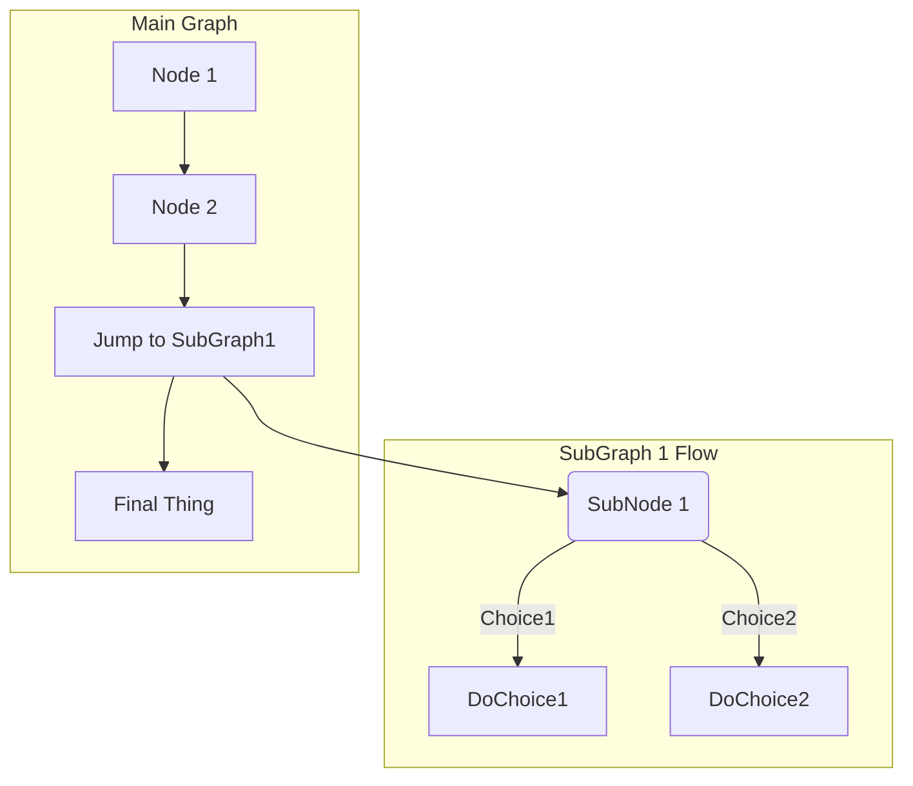
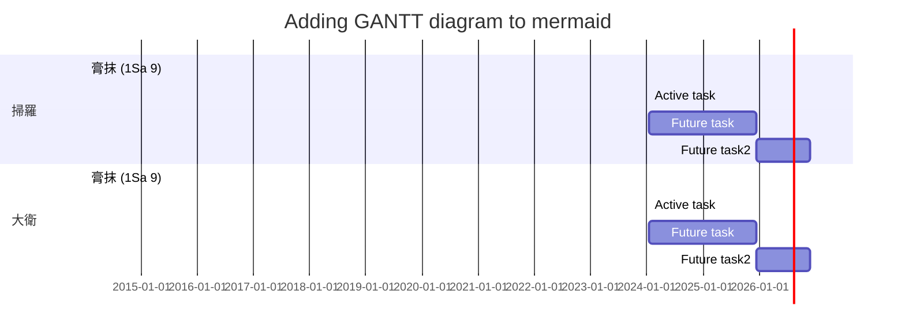

# 標題 Level 1
## 標題 level 2
### 標題 level 3
#### 標題 level 4
內文不換行

內文最後加兩個 space = 換行  

**粗體**  
*斜體*  
__*斜粗體*__  
~呼~  
You can even [link to Google!](http://google.com)  

`code`

Sometimes you want numbered lists:

1. One
2. Two
3. Three

Sometimes you want bullet points:

* Start a line with a star
* Profit!

Alternatively,

- Dashes work just as well
- And if you have sub points, put two spaces before the dash or star:
  - Like this
  - And this


Last Text
\
\
\
\
\
<tab>
New Text
	
	
> Coffee. The finest organic suspension ever devised... I beat the Borg with it.  
> - Captain Janeway
	

```
if (isAwesome){
  return true
}
```
	
```javascript
if (isAwesome){
  return true
}
```
	

But I have to admit, tasks lists are my favorite:

- [ ] This is a complete item
- [ ] This is an incomplete item

	
	I think you should use an `<addr>` element here instead.
	
### Ruby

<RUBY><ruby><ruby>ἀλλὰ<rt>Nevertheless</rt></ruby><rt>ἀλλά</rt></ruby><rt>CONJ</rt></RUBY> <RUBY><ruby><ruby>ἐβασίλευσεν<rt>reigned</rt></ruby><rt>βασιλεύω</rt></ruby><rt>V-AAI-3S</rt></RUBY> <RUBY><ruby><ruby>ὁ<rt>‑</rt></ruby><rt>ὁ</rt></ruby><rt>T-NSM</rt></RUBY> <RUBY><ruby><ruby>θάνατος<rt>death</rt></ruby><rt>θάνατος</rt></ruby><rt>N-NSM</rt></RUBY> 

### 特殊符號

First Header | Second Header
------------ | -------------
Content from cell 1 | Content from cell 2
Content in the first column | Content in the second column

| Unicode | result | UniCode | result |
| ------- | ------ | ------- | ------ |
| U00AB   | «      | U00BB   | »      |
| U25C2   | ◂      | U25B8   | ▸      |
| U2190   | ←      | U2192   | →      |
| U21D2   | ⇒     | U21D0    | ⇐     |
| U2235   | ∵      | U2234   | ∴      |
| U00A7   | §      | U2015   | ―      |
| U21B5   | ↵      |

### 引用

> 文字下標<sub>a</sub>
>> 雙重引用上標<sup>b</sup>

---
## 註腳

本文帶註腳<sup id="a1">[1](#%5Ea344fd)</sup>

## 連結
[[
[其他文章連結](IGNT-01)：IGNT/01.md

[其他文章內的段落](IGNT-01#11-%E4%B8%89%E5%80%8B%E5%8B%95%E8%A9%9E%E8%A7%80%E9%BB%9E-The-Three-Verbal-Aspects)：1.1 三個動詞觀點 (The Three Verbal Aspects)

[本文內的段落](#bottom)：bottom
[qq](#%5E88f4c1)


## 表格
| Markdown Engine              | Align Center | Align right |
| :--------------------------- | :----------: | ----------: |
| *Still*                      |  `renders`   |  **nicely** |
| 1                            |      2       |           3 |
| <li>item1</li><li>item2</li> |      5       |           6 |


## 清單
1. 大點自動編號 (同一段落內)
	1. 小點
		1. 小小點
		 	 1. ssd
				  1. sddd
						  1. sdcsc
					  1. sdcsc
						  1. sdcsc
							  1. sdcsdc
								  1. csdcs
									  1. csdcdscsc
										  1. scsdcds
											  1. sdcsdc
      1. 小小點
   2. 小點
1. 大點自動編號 (同一段落內)

- 大點
  - 小點
    - 小小點
    - 小小點
  - 小點
- 大點
  
----

## 可折疊區塊
<details>
   
  <summary>進階資訊</summary>
  
  ### Heading
  
  1. A numbered
  2. list
     * With some
     * Sub bullets
     
</details>

------
## 註腳

<sup id="f1">1</sup> 註腳內容 [↵](#a1) 05793f ^a344fd


- [HOME](README.md)
- [回目錄](README.md)
-------
# GitLab Extension


A footnote reference tag looks like this: [^1]

This reference tag is a mix of letters and numbers. [^footnote-42]

## mermaid diagrams






[^1]: This is the text inside a footnote.

[^footnote-42]: This is another footnote.


## bottom

^88f4c1
